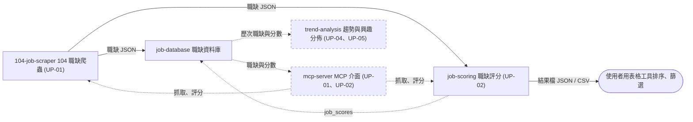

# 專案總覽 — 求職雷達

本文件記錄專案要達成的目標，以及各功能目前做到哪裡。

所有文件都描述系統的現況，需求或實作改變時就直接更新：

- 本文件：產品目標與成功指標、使用者問題、使用者旅程、功能清單與現況、名詞定義
- [architecture.md](architecture.md)：跨功能的技術總覽，包括模組依賴、資料存放與技術選型
- [features/](features/)：單一功能的需求、設計與驗收標準，一個功能一份
- [conventions/documentation.md](conventions/documentation.md)：文件撰寫慣例
- [conventions/development.md](conventions/development.md)：開發慣例
- [decisions/](decisions/)：決策紀錄，記錄有替代方案的取捨，以及不採用的原因

實作某功能時，只需讀本文件加上該功能的文件。

## 產品目標

- 過濾出符合自我發展方向的職缺，避免花大量精力在海量求職平台中人工篩選。
- 了解不同產業、公司現在的發展方向。

### 成功指標

- 以下指標對應第一個目標，都靠使用者自己手動觀察。
- 第二個目標的指標等 trend-analysis 規劃時再定。

指標：

- 精準度：每批評分總分前 10 名中，自己看過後想細看的筆數
  - 目標：至少 7 筆
- 誤殺：抽查被淘汰的職缺，其中自己會想投的筆數
  - 目標：0 筆
- 篩選時間：一批約 100 筆職缺，從抓取到挑出要細看的清單所花的時間
  - 目標：不超過 30 分鐘

## 目標使用者

- 求職者本人（專案擁有者）：想快速掌握符合自己方向的職缺，並得到可信的評分與評語。

## 使用者問題

寫法：

- 採用 JTBD 的 job story 格式：「當（情境），我想要（動機），以便（預期成果）。」
- 「我想要」只寫動機，不寫解法。

問題：

- UP-01：當我想知道市場上有哪些符合自己方向的職缺，我想要不必一頁頁翻求職平台，就能掌握所有相關職缺，以便把時間花在判斷，而不是蒐集。
- UP-02：當搜尋結果有上百筆職缺，我想要快速知道哪些值得細看、為什麼，以便只把心力放在少數真正符合的職缺上。
- UP-04：當我在規劃接下來的學習與職涯方向，我想要知道各產業、公司正往哪裡發展，以便調整自己的學習重點。
- UP-05：當我已經看過一段時間的職缺，我想要看清自己實際被哪些職缺或產業吸引，以便確認自己真正想要的方向。

## 非目標

- 不做多使用者服務、帳號系統或對外公開的網站。
- 不自動投遞履歷。
- 不對求職平台做大量、高頻的抓取（頻率限制見各爬蟲的功能文件）。
- 目前不規劃排程定期抓取與評分：需要時手動執行 CLI，或透過 agent 操作。
- 目前不規劃擷取公司資訊與外界評價：與公司有關的判斷只用職缺上的產業類別與公司名稱。

## 使用者旅程

功能之間的資料流：

- 實線：已完成的功能
- 虛線：規劃中或待規劃的功能與資料流
- 欄位與格式見各功能文件的「輸入與輸出」

## 功能清單

- 功能是系統中一個獨立且可交付的大型功能模組，一個功能一份功能文件。
- 功能 ID 用英文簡短描述（kebab-case），也是檔名：`features/<功能 ID>.md`。
- 功能不再分組，理由見 [決策紀錄 0003](decisions/0003-flat-feature-list.md)。
- 狀態值：`待規劃` → `待實作` → `實作中` → `✅ 已完成`。
- 還沒有功能文件的功能，狀態為 `待規劃`，文件寫「尚無」。

功能：

- 104-job-scraper（104 職缺爬蟲）：從 104 擷取職缺，轉換成結構化資料，供 AI 分析。
  - 解決的使用者問題：UP-01
  - 狀態：✅ 已完成
  - 文件：[104-job-scraper.md](features/104-job-scraper.md)
- job-database（職缺資料庫）：把每次抓到的職缺累積到同一個資料庫，跨次去重並記錄出現時間。
  - 解決的使用者問題：UP-01
  - 狀態：✅ 已完成
  - 文件：[job-database.md](features/job-database.md)
- job-scoring（職缺評分）：依評分方法與提示詞，自動給職缺打分並附上簡短評語，讓使用者依總分快速判斷哪些值得細看。
  - 解決的使用者問題：UP-02
  - 狀態：待規劃
  - 文件：[job-scoring.md](features/job-scoring.md)
- trend-analysis（趨勢與興趣分佈分析）：從全台、全球角度分析職缺趨勢，並發現自己對職缺或產業的興趣分佈。
  - 解決的使用者問題：UP-04、UP-05
  - 狀態：待規劃
  - 文件：尚無
- mcp-server（MCP 介面）：讓 agent 以 tool 的形式操作抓取、評分與查詢。
  - 解決的使用者問題：UP-01、UP-02
  - 狀態：待規劃
  - 文件：[mcp-server.md](features/mcp-server.md)

### 現況

每個功能目前讓使用者做得到的事：

- 104-job-scraper：可依關鍵字、縣市與職缺性質抓取 104 職缺（含完整工作內容），輸出 CSV 與 JSON。
- job-database：
  - 每次抓取的結果會自動累積到 `data/jobs.db`，跨次去重。
  - 記錄每筆職缺第一次與最後一次被抓到的時間，以及每次抓取的條件。
  - 過去抓好的 JSON 也能匯入。
- job-scoring：
  - 可對單筆或整批職缺評分，依職涯方向、技能、產業公司、薪資四個維度給出 0–100 總分與評語。
  - 薪資低於底線、公司或職稱在排除清單中的職缺直接淘汰。
  - 整批評分時單筆失敗不中斷，結果寫成 JSON 與 CSV，可用表格工具排序、篩選。
- trend-analysis：尚無。
- mcp-server：尚無。

## 撰寫與使用流程

1. 新增功能或修改既有功能：
   - 新增功能：使用者能完成一件原本做不到的事時，才新增功能。
     - 在 `features/` 複製 [feature_template.md](features/feature_template.md)，依命名規則取檔名。
     - 在功能清單登記，狀態設為 `待規劃`。
   - 修改既有功能：下列情況都屬於修改，直接修改原本的功能文件。
     - 同一件事換個入口，例如 CLI 改成網頁
     - 擴大處理量，例如單筆改成批次
     - 只是規則或結果改變
   - 修改時，新增或修改的使用者故事標上〔規劃中〕（標記層級見 [documentation.md](conventions/documentation.md#功能文件的結構)），狀態退回 `待規劃`。
     - 此時只有〔規劃中〕的使用者故事尚未實作，該功能的「現況」維持不變。
2. 範圍外的去處：功能文件「範圍外」的每一項都要有去處。
   - 確定要做的新用法：登記到上方功能清單。
   - 小改善或技術債：記到 [TODO.md](../TODO.md)。
   - 決定不做的：寫進「非目標」。
3. 定稿：「待決問題」清空後，狀態改為 `待實作`。還有待決問題的功能，不要開始實作。
4. 實作：狀態改為 `實作中`。
   - 依該使用者故事的「需求」實作，不做「範圍外」列出的事。
   - 實作時調整了設計，就同步更新該使用者故事的「設計」小節。
5. 驗收：逐條執行該使用者故事「驗收」小節的驗證方式，回報每條結果（✅ / ❌ 與實際輸出）。全部通過後：
   - 移除該使用者故事與共用章節中相關的〔規劃中〕標記。
   - 狀態改為 `✅ 已完成`。
   - 更新上方該功能的「現況」。

## 名詞定義

文件、程式與討論中都用下列的名稱，不用同義詞。

- 使用者問題（UP）：使用者遇到的問題，用 job story 格式描述，不含解法，見 [使用者問題](#使用者問題)
- 功能：系統中一個獨立且可交付的大型功能模組，一個功能一份功能文件，見 [功能清單](#功能清單)
- 使用者故事：功能文件的一章，是一個可以單獨交付的價值切片，見 [documentation.md](conventions/documentation.md#功能文件的結構)
- 〔規劃中〕：標在尚未實作的使用者故事或被改到的那一行，見 [documentation.md](conventions/documentation.md#功能文件的結構)
- 現況：某個功能目前讓使用者做得到的事，見 [現況](#現況)
- 決策紀錄（ADR）：有替代方案的取捨，寫出不採用的原因，見 [documentation.md](conventions/documentation.md#決策紀錄)
- 職缺代碼：104 的職缺識別碼（`jobNo`），見 [104-job-scraper 欄位字典](features/104-job-scraper.md#821-欄位字典)
  - 用於去重，也是資料庫的主鍵
- 淘汰：職缺符合硬性淘汰條件（公司、職稱關鍵字、薪資低於底線），見 [job-scoring §5.2.1](features/job-scoring.md#521-硬性淘汰規則)
  - 被淘汰的職缺不呼叫 AI、沒有總分
- AI 維度：由 AI 判斷的三個評分維度（職涯方向契合度、技能匹配度、產業公司吸引力），見 [job-scoring §4.2.4](features/job-scoring.md#424-評分維度)
- 總分：四個維度加權後換算成的 0–100 分，見 [job-scoring §4.2.7](features/job-scoring.md#427-總分)
  - 未知的維度以 3 分代入
- 快取鍵：由送給 AI 的內容算出的雜湊值，相同時沿用上次的 AI 評分，見 [job-scoring §8.2.1](features/job-scoring.md#821-快取鍵)
