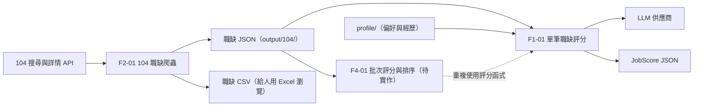

# 系統架構總覽

本文描述各功能之間的資料流與輸入契約。其他資訊見：

- 產品目標：[專案總覽](README.md)
- 檔案結構：[README.md](../README.md#專案結構)
- 各功能內部的流程：各自的功能文件

## 資料流

## 輸入契約

- **職缺 JSON**：F2-01 輸出的職缺陣列，使用中文鍵名（`職缺代碼`、`職缺名稱`、`工作內容`…），欄位定義見 [F2-01 §5.5](features/F2-01-104-job-scraper.md#55-欄位字典)。F1-01、F4-01 以此結構為輸入契約，並要容忍其中的 `null`（詳情 API 失敗時的真實表現）。
- **評分結果**：F1-01 的 `JobScore`，欄位見 [F1-01 §5.7](features/F1-01-job-scoring.md#57-輸出jobscore)。F4-01 批次評分時沿用這個結構。
- **LLM 供應商**：只透過 F1-01 的 `LLMClient` 介面使用，見 [F1-01 §5.8.4](features/F1-01-job-scoring.md#584-llm-供應商抽象層)。
