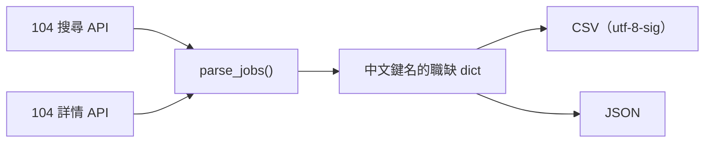
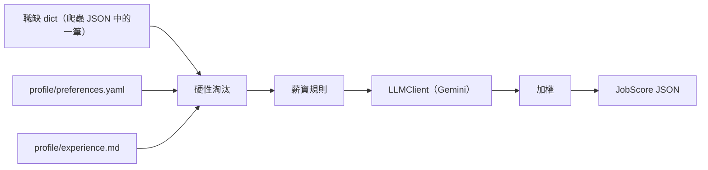

# 系統架構總覽

本文描述系統各模組之間的資料流與輸入契約；產品目標見 [專案總覽](README.md)，檔案結構見 [README.md](../README.md#專案結構)。

目前有兩個模組：104 爬蟲（單檔自足腳本 `src/fetch_104_jobs.py`），以及工作評分（package `src/job_scoring/`，CLI 進入點為 `src/score_job.py`）。

## 資料流：爬蟲

職缺 dict 使用**中文鍵名**（`職缺代碼`、`職缺名稱`、`工作內容`…），欄位定義見 [F2-01 §5.5](features/F2-01-104-job-scraper.md#55-欄位字典)。未來的 AI 分析層應以此結構為輸入契約，並容忍其中的 `null`（詳情 API 失敗時的真實表現）。

## 資料流：工作評分

工作評分（F1-01）以一筆職缺為單位；F4 的批次工作流之後會 import 同一個 package 重複使用。

維度、規則、提示詞與輸出欄位見 [F1-01 §5](features/F1-01-job-scoring.md#5-設計)。
