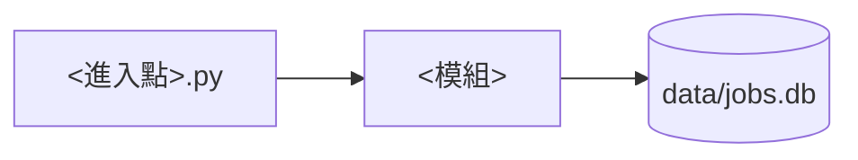

# <功能名稱>：技術設計

<!-- 本範本複製到 tech/tech-design/<功能 ID>.md 後使用，文中相對連結可以直接沿用，功能文件的連結改指該功能。
     - 讀者是工程師。
     - 所有文件共用的通則見 conventions/documentation.md。
     技術設計只做兩件事：
     - 讓工程師不讀程式碼，也能在短時間內掌握這個功能的系統輪廓。
     - 記錄讀程式碼推不出來的事：設計理由與必須維持的限制、元件之間的約定、外部系統的限制與坑、資料表設計的理由。
     一段內容兩者都不是就刪，例如函式清單、參數怎麼傳、逐行翻譯程式碼、測試 fixture 的細節。
     實作方式比需求變動得頻繁，技術設計越精簡越不會過時。

     跨章的規則：
     - 依元件分章，不依使用者故事。每章列出它實現的 FR ID，需求才追得到設計。
     - 只描述已實作的現況，不標〔規劃中〕：實作前的技術方案寫在實作計畫或 commit 說明，故事完成後再更新。
     - 底層功能的技術設計不描述上層疊加的欄位與查詢，只寫「其他功能疊加的欄位見各功能的技術設計」。
     - 技術設計是單一功能內的全貌，跨功能的全貌寫在 tech/architecture.md。
     以下章節沒有內容時整章省略，元件較多時可以依元件再分章。 -->

- 功能文件：[<功能 ID>.md](../../conventions/templates/feature.md)
- 程式碼：進入點與模組路徑

## 1. 總覽

- 元件圖或資料流圖（mermaid）
- 每個模組一句話的職責
- 依賴方向，以及必須維持的限制與理由（例如某個模組不 import 專案內的其他模組）

範例：



- `<模組>`：一句話的職責

## 2. 流程

- 主要流程在元件之間怎麼走，寫到模組層級。
- 函式名稱只在元件之間的約定需要時才寫，例如抓取頁的 API 呼叫抓取模組的 `scrape`，以停止旗標與進度回呼溝通。
- 業務規則寫在功能文件，這裡用連結引用，不重寫。

## 3. 資料與儲存

- 資料表、檔案的 schema，以及設計理由。
- 誰寫、誰讀、transaction 範圍。

## 4. 外部系統整合

- 外部 API、SDK 的技術限制與坑，附上官方文件連結。
- 例如：SDK 的特殊參數、錯誤類別沒有公開匯出、傳輸層對 stdout 的限制。

## 5. 錯誤處理與結束碼

- 哪些錯誤算單筆失敗、哪些讓程式中止。
- 結束碼、stdout／stderr 的分工。

## 6. 驗收對照

- 依使用者故事分組，順序同功能文件，當作核對故事是否完成的清單。
- 每條 AC 一項，寫驗證指令。已實作故事的每條 AC 都要有一項，反之亦然。〔規劃中〕的故事完成時再補上。
- 功能文件的驗收不寫測試手法，這裡寫出各 AC 以固定回應代替外部服務，還是連到真的外部服務驗證。
- 型別檢查這類不屬於任何 AC 的檢查，也寫在這裡。只驗與外部服務串接、不對應任何 AC 的檢查也一樣。
- 需要網路的條目標註〔需網路〕，測試放在 `tests/e2e/` 並加上 `@pytest.mark.network`（見 [development.md](../../conventions/development.md#測試)）。
- 共用的測試資料只簡述用途，細節看測試程式。

一次跑完所有離線驗收：

```bash
uv run pytest tests/test_<模組>*.py
```

### <故事 slug>

- [AC-<slug>-<重點>](../../conventions/templates/feature.md#ac-slug-重點標題)：`uv run pytest tests/test_<模組>.py -k <函式名>`
- [AC-<slug>-<重點>](../../conventions/templates/feature.md#ac-slug-重點標題)〔需網路〕：`uv run pytest -m network tests/e2e/test_<模組>.py -k <函式名>`
