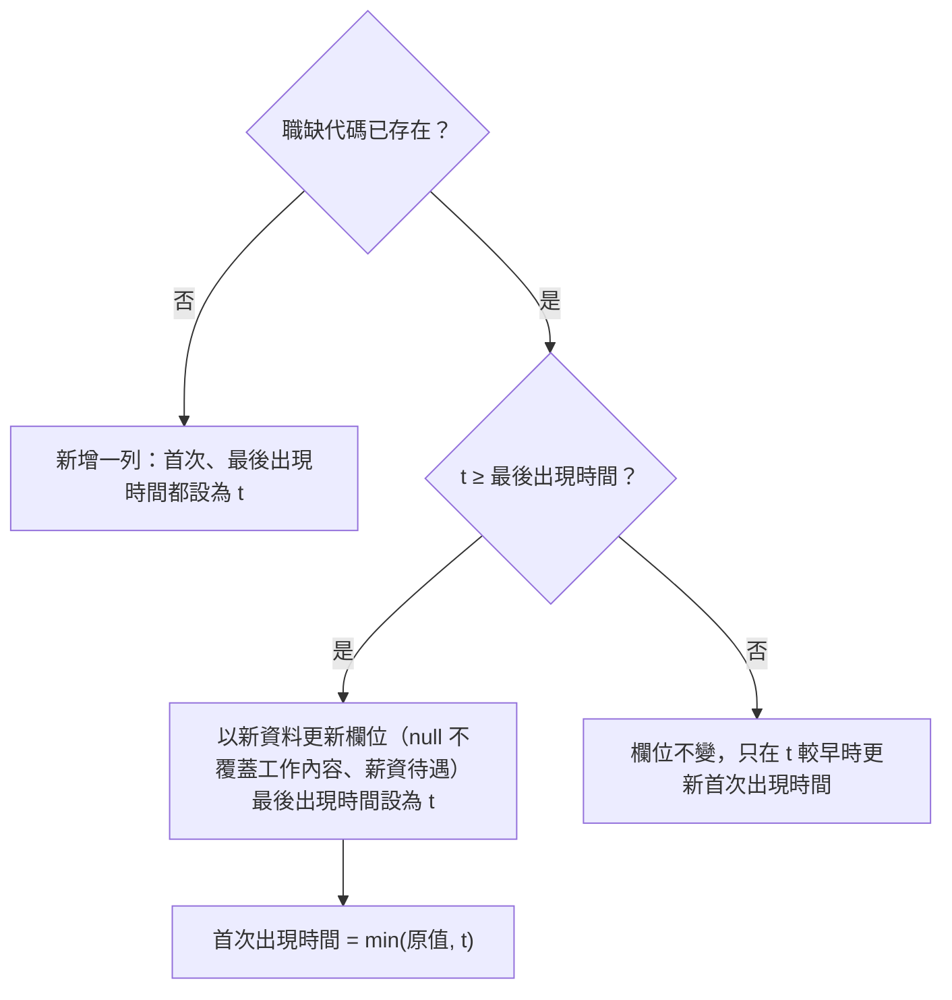

# F2-02 職缺資料庫

| 欄位 | 內容 |
| :--- | :--- |
| ID | F2-02 |
| 核心技術 | 2 — 從求職平台獲取職缺資訊（見 [專案總覽](../README.md#核心技術)） |
| 狀態 | ✅ 已完成 |
| 依賴 | F2-01（沿用其[欄位字典](F2-01-104-job-scraper.md#55-欄位字典)作為資料契約） |
| 程式碼 | [src/job_db/](../../src/job_db/)、[src/import_jobs.py](../../src/import_jobs.py)、[src/fetch_104_jobs.py](../../src/fetch_104_jobs.py) |

## 1. 背景與目標

F2-01 每次執行都會在 `output/104/` 產生一份新的 CSV 與 JSON，各次結果之間沒有關聯：

- 同一筆職缺在不同次執行中重複出現，只能人工比對。
- 看不出哪些職缺是這次新出現的，也看不出一筆職缺開了多久。
- 零散的檔案無法累積成歷史資料，後續的趨勢分析（F4）沒有資料來源。

本功能把每次抓到的職缺寫進同一個 SQLite 資料庫，以職缺代碼跨次去重，並記錄每筆職缺第一次與最後一次被抓到的時間，以及每次抓取的條件。

## 2. 使用情境

- 身為求職者，我想要爬完的職缺自動累積到同一個地方，以便不必自己管理一堆輸出檔。
- 身為求職者，我想要把過去已經抓好的 JSON 也匯進來，以便歷史資料不會斷掉。
- 身為求職者，我想要知道哪些職缺是最近才出現的，以便優先查看新職缺。
- 身為後續的分析流程（F1、F4），我需要一份以職缺代碼為主鍵、欄位固定的資料表，以便直接用 pandas 或 SQL 查詢。

## 3. 範圍

**範圍內**

- 建立 SQLite 資料庫與 schema
- F2-01 爬蟲每次執行後，把結果寫入資料庫
- 匯入指令：把既有的爬蟲 JSON 匯入資料庫
- 記錄每次抓取或匯入的條件，以及當次抓到哪些職缺

**範圍外**（實作時不要做）

- 排程定期執行（屬 F2-03）
- 評分結果存入資料庫、評分結果快取（屬 [F1-01 §5.10](F1-01-job-scoring.md#510-評分結果入庫)；本功能只提供資料庫與 schema）
- F1-01 改從資料庫讀取職缺（見 [TODO.md](../../TODO.md#職缺評分範圍外)）
- 判斷職缺是否已下架：只記錄最後一次被抓到的時間，不推論是否下架（見 [§5.2](#52-資料表)）
- 其他求職平台的資料（另開 F2-xx）
- 查詢或瀏覽介面：目前直接用 pandas 或 SQLite 工具讀取，agent 查詢屬 [F5-01](F5-01-mcp-server.md)
- 保留職缺內容的歷史版本：資料表只保留最新一版

## 4. 功能需求

- **FR-1**：資料庫預設為專案根目錄的 `data/jobs.db`（以腳本位置推算，不受工作目錄影響）。檔案或目錄不存在時自動建立並初始化 schema。`data/` 列入 `.gitignore`，資料庫不進版控。
- **FR-2**：以 `職缺代碼` 為主鍵寫入 `jobs` 表，依 [§5.3](#53-寫入規則) 設定首次出現時間、最後出現時間，以及更新欄位的時機。
- **FR-3**：新資料的 `工作內容` 或 `薪資待遇` 為 `null`，而資料庫中已有非 null 的值時，保留舊值。
- **FR-4**：每次抓取或匯入都在 `scrape_runs` 記一筆紀錄，並在 `run_jobs` 記下這次出現的每筆職缺。
- **FR-5**：`fetch_104_jobs.py` 寫出 CSV／JSON 後，預設把結果寫進資料庫。`--db` 可指定資料庫路徑，`--no-db` 可略過寫入。
- **FR-6**：提供 `src/import_jobs.py`，可一次匯入一或多個爬蟲 JSON。同一個檔案重複匯入時略過，資料庫內容不變。
- **FR-7**：每次寫入後，在 stderr 印出新增筆數、更新筆數與資料庫路徑。
- **FR-8**：一次抓取或一個匯入檔的寫入包在同一個 transaction 中，中途失敗就整批 rollback，不留下只寫一半的資料。

## 5. 設計

- **輸入與輸出**
  - 輸入：F2-01 產出的職缺清單，可以是爬蟲執行中的記憶體資料，或 `output/104/` 的 JSON。欄位依 [F2-01 §5.5](F2-01-104-job-scraper.md#55-欄位字典)。
  - 輸出：`data/jobs.db`，供 F1、F4 讀取。
- **缺值處理**：欄位缺值時存成 SQL `NULL`，不回填。FR-3 是唯一的例外，理由如下：
  - 詳情 API 常因暫時性錯誤失敗，失敗時這兩欄為 `null`。
  - 資料庫中的舊值來自同一個 API 的同一個欄位，不是用搜尋摘要之類的其他來源回填。
  - 如果讓 `null` 覆蓋舊值，一次失敗就會讓下游的評分少了完整的工作內容。

### 5.1 模組佈局

```
src/
├── job_db/
│   ├── __init__.py
│   ├── schema.py      # 建表語法、開啟連線並初始化
│   └── store.py       # 寫入一次抓取的結果、匯入 JSON
├── import_jobs.py     # 匯入 CLI
└── fetch_104_jobs.py  # 新增 --db、--no-db，寫完檔案後呼叫 job_db
```

- 使用標準函式庫 `sqlite3`，不新增依賴。
- `job_db` 另外定義一份 `jobs` 的欄名與型態，不 import 爬蟲的 `CSV_FIELDNAMES`：爬蟲會 import `job_db`，反向 import 會形成循環。兩份欄名是否一致由測試檢查。
- `fetch_104_jobs.py` 原本是單檔自足腳本，加入本功能後會依賴 `src/job_db/`。以 `uv run src/fetch_104_jobs.py` 執行時，`src/` 在 import 路徑上，不需要額外設定。

### 5.2 資料表

所有時間都是本地時間，格式為 ISO 8601，精確到秒，例如 `2026-09-17T10:15:00`。

**`jobs`**：每筆職缺一列。

| 欄位 | 型態 | 說明 |
| :--- | :--- | :--- |
| F2-01 欄位字典的全部欄位 | 依字典：str → `TEXT`，int → `INTEGER` | 欄名、順序與字典相同，`職缺代碼` 是主鍵 |
| `首次出現時間` | TEXT | 這筆職缺第一次被抓到的時間 |
| `最後出現時間` | TEXT | 這筆職缺最後一次被抓到的時間 |

- 欄名沿用中文，讓 `pandas.read_sql` 讀出來的欄位與 CSV／JSON 一致，F1-01 不需要做欄名對照。
- 「最後出現時間」較早，不代表職缺已經下架，可能只是之後的搜尋條件沒有涵蓋它，所以不另外記錄下架狀態。

**`scrape_runs`**：每次抓取或匯入一列。

| 欄位 | 型態 | 說明 |
| :--- | :--- | :--- |
| `執行編號` | INTEGER | 主鍵，自動遞增 |
| `執行時間` | TEXT | 爬蟲寫出 CSV／JSON 時的時間，與檔名中的時間戳相同。匯入時取自檔名（見 [§5.4](#54-匯入既有-json)） |
| `來源` | TEXT | `爬蟲` 或 `匯入` |
| `關鍵字` | TEXT \| null | 去重後的關鍵字，以 `, ` 合併。匯入時為 `null`，因為檔名中的關鍵字已經過清理與截斷 |
| `地區` | TEXT \| null | 縣市名稱，全台灣時為 `全台灣`。匯入時為 `null` |
| `職缺性質` | INTEGER \| null | `0`／`1`／`2`，意義同 [F2-01 §5.6](F2-01-104-job-scraper.md#56-cli)。匯入時為 `null` |
| `頁數` | INTEGER \| null | 每個關鍵字抓幾頁。匯入時為 `null` |
| `來源檔` | TEXT \| null | 匯入的 JSON 檔名（不含目錄），具唯一性。爬蟲寫入時為 `null` |
| `職缺數` | INTEGER | 這次寫入的職缺筆數 |

**`run_jobs`**：一次執行與其中出現的職缺，主鍵是（`執行編號`, `職缺代碼`），兩欄分別以外鍵指向 `scrape_runs` 與 `jobs`。同一批中重複的職缺代碼只記一列，`scrape_runs.職缺數` 也只算一次。

### 5.3 寫入規則

以一次執行的時間 `t` 寫入一批職缺，對每筆職缺：



- 新增一列算「新增」，其餘情況都算「更新」。
- 只有 `t` 不早於資料庫中的最後出現時間時，才用新資料覆蓋欄位。這樣一來，匯入舊檔案的先後順序不會影響結果，資料表永遠保留最新一版的內容。
- 每筆職缺都會寫進 `run_jobs`，不管是新增還是更新。

### 5.4 匯入既有 JSON

- 每個檔案依序檢查：檔名時間 → 是否已匯入 → 檔案內容。已匯入的檔案不會再讀取內容。
- `t` 取自檔名結尾的 `_<YYYYMMDD_HHMMSS>.json`（F2-01 的命名規則，見 [F2-01 §5.4](F2-01-104-job-scraper.md#54-輸出)）。
- 以下情況印出 `[!]` 後略過該檔，繼續處理下一個檔案：
  - 檔名解析不出時間
  - 檔案不是合法的職缺 JSON：讀不到、不是 JSON、不是非空的陣列、有元素不是物件，或 `職缺代碼` 不是非空字串
  - 寫入資料庫時發生 SQLite 錯誤（該檔整批 rollback）
- `scrape_runs` 中已有相同 `來源檔` 時，印出 `[i]` 並略過，所以重複匯入不會改變資料庫。
- 爬蟲本身寫入資料庫時，`來源檔` 為 `null`。之後再匯入同一個 JSON，會被當成另一次執行，`scrape_runs` 多一列。因為兩者的 `t` 相同、職缺內容也相同，依 §5.3 的規則，`jobs` 的內容不變。

### 5.5 CLI

爬蟲新增的參數（其餘參數見 [F2-01 §5.6](F2-01-104-job-scraper.md#56-cli)）：

| 參數 | 說明 |
| :--- | :--- |
| `--db` | 資料庫路徑，預設為專案根目錄的 `data/jobs.db` |
| `--no-db` | 只輸出 CSV／JSON，不寫入資料庫 |

- 互動模式一律寫入預設的資料庫。
- 寫入資料庫失敗時，在 stderr 印出 `[-]`，不中斷程式，因為 CSV／JSON 已經寫出。

匯入指令：

```bash
uv run src/import_jobs.py output/104/*.json [--db data/jobs.db]
```

- 進入點是 `main(argv: list[str] | None = None) -> int`。
- 結束碼：
  - `0`：至少一個檔案匯入成功，或全部都因為已匯入而略過
  - `1`：沒有指定檔案，或所有檔案都因為錯誤而被略過

每次寫入後在 stderr 印出摘要，例如：

```
[+] 已寫入資料庫：新增 42 筆、更新 18 筆（data/jobs.db）
```

## 6. 驗收標準

都是離線測試，放在 `tests/test_job_db.py`（`import_jobs` 的 CLI 放在 `tests/test_import_jobs.py`），資料庫與 JSON 都建在 `tmp_path`，職缺資料寫在測試碼裡。

### AC-0：型別檢查（涵蓋全部）

- **驗證方式**：`uv run mypy src/`
- **通過條件**：沒有錯誤。

### AC-1：自動建立資料庫（涵蓋 FR-1）

- **Given**：指定的資料庫路徑與上層目錄都不存在
- **When**：開啟資料庫
- **Then**：目錄與檔案被建立，`jobs`、`scrape_runs`、`run_jobs` 三個表存在，`jobs` 的欄位依序是 F2-01 欄位字典的欄位，接著是 `首次出現時間`、`最後出現時間`；`data/` 被 `.gitignore` 排除
- **驗證方式**：`uv run pytest tests/test_job_db.py -k open_db`，以及 `git check-ignore data/jobs.db`
- **通過條件**：pytest 全部 passed，`git check-ignore` 印出路徑。

### AC-2：跨次去重與出現時間（涵蓋 FR-2、FR-7）

- **Given**：兩批職缺有部分重疊，分別以時間 t1 < t2 寫入；另一組測試以 t2、t1 的順序寫入
- **When**：寫入兩批
- **Then**：每個職缺代碼只有一列；重疊的職缺首次出現時間為 t1、最後出現時間為 t2，欄位內容為 t2 那批的值；兩種寫入順序的 `jobs` 內容相同；回傳並印出的新增、更新筆數正確
- **驗證方式**：`uv run pytest tests/test_job_db.py -k save_run`
- **通過條件**：全部 passed。

### AC-3：null 不覆蓋既有內容（涵蓋 FR-3）

| 資料庫中的值 | 新資料的值 | 寫入後 |
| :--- | :--- | :--- |
| 非 null | `null` | 保留舊值 |
| 非 null | 非 null | 新值 |
| `null` | 非 null | 新值 |

- **Given**：`工作內容` 與 `薪資待遇` 分別依上表設定
- **When**：以較晚的時間寫入新資料
- **Then**：結果如上表；其他欄位的 `null` 照常覆蓋
- **驗證方式**：`uv run pytest tests/test_job_db.py -k keeps_detail`
- **通過條件**：全部 passed。

### AC-4：執行紀錄與 transaction（涵蓋 FR-4、FR-8）

- **Given**：一批職缺與抓取條件；另一批職缺中有一筆在寫入時會拋出例外
- **When**：分別寫入
- **Then**：第一批在 `scrape_runs` 多一列，條件與職缺數正確，`run_jobs` 有每筆職缺；第二批寫入失敗後，三個表都沒有任何改變
- **驗證方式**：`uv run pytest tests/test_job_db.py -k "save_run and (records or rollback)"`
- **通過條件**：全部 passed。

### AC-5：爬蟲寫入資料庫（涵蓋 FR-5）

- **Given**：以假函式取代 `requests.get` 與 `time.sleep`
- **When**：分別以 `--db <tmp>`、`--db <tmp> --no-db` 呼叫爬蟲的 `main`
- **Then**：前者的資料庫中有這次抓到的職缺，並有一筆 `來源` 為 `爬蟲` 的紀錄；後者不建立資料庫檔；兩者都照常產生 CSV／JSON
- **驗證方式**：`uv run pytest tests/test_fetch_104_jobs.py -k db`
- **通過條件**：全部 passed。

### AC-6：匯入既有 JSON（涵蓋 FR-6、FR-7）

- **Given**：`tmp_path` 中有兩個檔名符合命名規則的 JSON、一個檔名沒有時間的 JSON，以及一個內容格式錯誤的 JSON
- **When**：以 `main` 匯入全部檔案，再匯入一次
- **Then**：
  - 第一次：兩個合法檔案寫入，首次與最後出現時間取自檔名；另兩個檔案印出 `[!]` 並略過；結束碼為 0
  - 第二次：兩個合法檔案印出 `[i]` 並略過，另兩個檔案仍印出 `[!]`；資料庫內容與第一次相同；結束碼為 0
  - 只指定錯誤的檔案或沒有指定檔案時，結束碼為 1
- **驗證方式**：`uv run pytest tests/test_import_jobs.py`
- **通過條件**：全部 passed。

## 7. 待決問題

無。
