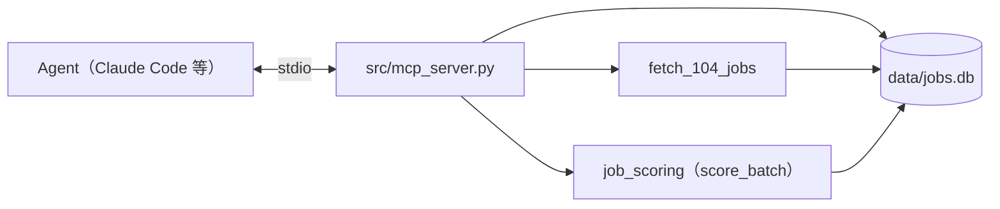

# F5-01 MCP 介面

| 欄位 | 內容 |
| :--- | :--- |
| ID | F5-01 |
| 核心技術 | 5 — Agent 操作介面（見 [專案總覽](../README.md#核心技術)） |
| 狀態 | 待實作 |
| 依賴 | F2-01（抓取）、F2-02（職缺資料庫）、F1-01（評分，含[依分數查詢職缺](F1-01-job-scoring.md#7-依分數查詢職缺store)與[重跑時不重複付 AI 費用](F1-01-job-scoring.md#8-重跑時不重複付-ai-費用cache)） |
| 程式碼 | 尚未實作 |

## 1. 背景與目標

目前抓取、評分都要在終端機下指令，結果散在 `output/` 的檔案與 `data/jobs.db`，想問「這週新出現、分數高的職缺有哪些」時，得自己寫 SQL 或開 notebook。

本功能提供一個本機的 MCP server，讓 Claude Code 這類 agent 以 tool 的形式抓取、評分與查詢職缺：

- 不必設計 UI，用對話就能完成 UP-01、UP-02 的操作。
- agent 可以把查詢結果交給自己的其他工具接著處理。

固定的「每天抓取、評分」流程不經過本功能，由 F2-03 以排程直接執行 CLI，避免每次都多付一層 agent 的 LLM 費用。

## 2. 使用情境

- 身為求職者，我想要叫 agent 用幾個關鍵字抓一次職缺，以便不必記爬蟲的參數（UP-01）。
- 身為求職者，我想要叫 agent 對剛抓到的職缺評分，並列出分數最高的幾筆與理由，以便只細看少數職缺（UP-02）。
- 身為求職者，我想要問「最近一週新出現、70 分以上的職缺」，以便不必自己寫 SQL（UP-02）。
- 身為求職者，我想要看到某筆職缺的完整內容與各維度的評分理由，以便決定要不要細看（UP-02）。

## 3. 範圍

**範圍內**

- 以 stdio 傳輸的 MCP server，以及專案根目錄的 `.mcp.json` 註冊設定
- 四個 tool：抓取、評分、查詢職缺、查看單筆職缺

**範圍外**（實作時不要做）

- 排程定期抓取與評分（屬 F2-03）
- HTTP 等遠端傳輸：專案不做對外服務（見 [非目標](../README.md#非目標)）
- 公司資訊與評價的 tool（屬 F3）
- 評分結果入庫與快取的設計（屬 [F1-01 §7](F1-01-job-scoring.md#7-依分數查詢職缺store)、[§8](F1-01-job-scoring.md#8-重跑時不重複付-ai-費用cache)）；本功能只呼叫它
- 修改個人資料檔（`profile/`）的 tool：偏好與經歷由使用者自己編輯
- 讓 agent 選擇 LLM 供應商或模型：一律使用 F1-01 的預設值
- 查看抓取紀錄的 tool：不做。`score_jobs` 需要的執行編號由 `search_104_jobs` 回傳，其他情況用不太到

## 4. 功能需求

- **FR-1**：`uv run src/mcp_server.py` 以 stdio 啟動 MCP server。
  - `--db` 可指定資料庫路徑，預設為 `data/jobs.db`（同 [F2-02 FR-1](F2-02-job-database.md#4-功能需求)）。
- **FR-2**：tool 執行期間，stdout 只輸出 MCP 協定內容，進度與訊息一律寫到 stderr（見 [§5.3](#53-stdout-只留給協定)）。
- **FR-3**：`search_104_jobs` 依 [§5.4](#54-tool-清單) 抓取 104 職缺。
  - 結果寫入 CSV、JSON 與資料庫。
  - 回傳這次執行的摘要。
- **FR-4**：`score_jobs` 依 F1-01 的流程評分指定的職缺。
  - 結果寫入資料庫。
  - 回傳每筆的精簡結果與摘要。
  - 單筆失敗不中斷。
- **FR-5**：`query_jobs` 依分數、首次出現時間、關鍵字篩選職缺。
  - 依 [§5.4](#54-tool-清單) 的規則排序。
  - 回傳精簡欄位。
- **FR-6**：`get_job_detail` 回傳單筆職缺的全部欄位，以及資料庫中評分結果的各維度分數與理由。
- **FR-7**：參數錯誤、找不到職缺、個人資料檔有誤、缺少 API key 等情況，以 tool error 回傳訊息，server 繼續執行。
- **FR-8**：會回傳多筆資料的 tool 都有 `limit` 參數與上限，避免塞滿 agent 的 context。

## 5. 設計

- **輸入與輸出**
  - 讀寫 `data/jobs.db`，資料表契約見 [F2-02 §5.2](F2-02-job-database.md#52-資料表)。評分結果的 `job_scores` 表見 [F1-01 §7.2.1](F1-01-job-scoring.md#721-資料表)，每筆職缺只有最新一列。
  - 抓取沿用 F2-01，輸出檔與頻率限制見 [F2-01 §5.2](F2-01-104-job-scraper.md#52-104-api-的限制)、[§5.4](F2-01-104-job-scraper.md#54-輸出)。
  - 評分沿用 F1-01，流程見 [F1-01 §4.2.3](F1-01-job-scoring.md#423-評分流程)、[§6](F1-01-job-scoring.md#6-一次評完整批並拿到結果檔batch)；個人資料檔讀取 `profile/`，API key 讀取 `.env`。
  - tool 回傳 JSON，鍵名使用中文，與爬蟲、評分的輸出一致。
- **缺值處理**：職缺欄位與評分欄位缺值時回傳 `null`；尚未評分的職缺，評分相關欄位都是 `null`。

### 5.1 架構



- 每個 tool 只做參數檢查與格式轉換，邏輯都呼叫既有模組，CLI 與 MCP 的行為才會一致。之後若加上 Web 介面，也呼叫同一組函式。
- 評分由專案內的 scorer 執行，不讓 agent 自己打分：
  - 分數依同一套偏好檔、提示詞與模型產生，不同 agent 或不同次對話的結果可以比較。
  - 才能用上 F1-01 的評分快取（見 [F1-01 §8.2.1](F1-01-job-scoring.md#821-快取鍵)）。
- tool 函式可以不經過 MCP 直接呼叫，離線測試直接呼叫函式。
- 使用官方的 `mcp` Python SDK。

### 5.2 註冊

專案根目錄的 `.mcp.json` 讓 Claude Code 在這個專案中自動載入 server：

```json
{
  "mcpServers": {
    "job-radar": {
      "command": "uv",
      "args": ["run", "src/mcp_server.py"]
    }
  }
}
```

### 5.3 stdout 只留給協定

stdio 傳輸以 stdout 傳送協定訊息，任何其他輸出都會讓 client 解析失敗。F2-01 的 `execute_scraping` 會把進度與預覽表格 `print` 到 stdout，所以 tool 執行期間把 stdout 導向 stderr（`contextlib.redirect_stdout`）。這樣不必修改爬蟲 CLI 的輸出。

### 5.4 tool 清單

**`search_104_jobs`**：抓取並寫入資料庫。

| 參數 | 型態 | 說明 |
| :--- | :--- | :--- |
| `keywords` | list[str] | 必填，1–5 個關鍵字 |
| `area` | str \| null | 縣市名稱，規則同 F2-01 CLI 的 `-a`；`null` 代表全台灣 |
| `pages` | int | 每個關鍵字抓幾頁，1–5，預設 1 |
| `job_type` | int | `0`／`1`／`2`，意義同 [F2-01 §5.6](F2-01-104-job-scraper.md#56-cli)，預設 `0` |

- 回傳：`執行編號`、`職缺數`、`新增`、`更新`、`JSON 檔`。
- 沒有抓到任何職缺時，回傳 `職缺數` 為 0，`執行編號` 為 `null`，不算錯誤。
- `keywords` 與 `pages` 的上限，是為了避免 agent 一次發出大量請求，違反 [非目標](../README.md#非目標) 的頻率限制。

**`score_jobs`**：評分並寫入資料庫。

| 參數 | 型態 | 說明 |
| :--- | :--- | :--- |
| `run_id` | int \| null | 評這次執行抓到的職缺 |
| `job_nos` | list[str] \| null | 評指定的職缺代碼 |
| `limit` | int | 最多評幾筆，1–50，預設 20 |

- `run_id` 與 `job_nos` 必須剛好給一個，否則回傳 tool error。
- `run_id` 取自 `search_104_jobs` 的回傳。
- 職缺內容從 `jobs` 表讀取，交給 F1-01 的整批評分函式，並傳入同一個資料庫連線，由它查快取、寫入 `job_scores`。`job_nos` 中有代碼不在 `jobs` 表時，回傳 tool error，不評任何一筆。
- 職缺依 `run_jobs` 或 `job_nos` 的順序處理，超過 `limit` 的部分不評分，回傳中的 `未處理` 列出這些職缺代碼，agent 可以再呼叫一次。
- 回傳：摘要（`成功`、`沿用`、`淘汰`、`失敗`、`未處理`；`沿用` 是沿用上次 AI 評分的筆數，見 [F1-01 §8.2.2](F1-01-job-scoring.md#822-沿用時的行為)，算在 `成功` 裡），以及每筆的 `職缺代碼`、`職缺名稱`、`總分`、`淘汰`、`評語`、`失敗原因`。各維度理由不放在這裡，要看時用 `get_job_detail`。
- 整批評分可能跑好幾分鐘，超過 client 的 tool 逾時。所以用 `limit` 控制每次的筆數，並在每筆開始時送出 MCP progress 通知（client 有提供 progress token 時）。
- client 建立失敗（缺少 API key、不支援的供應商）時回傳 tool error，同 [F1-01 §6.2.1](F1-01-job-scoring.md#621-流程)。

**`query_jobs`**：查詢職缺。

| 參數 | 型態 | 說明 |
| :--- | :--- | :--- |
| `min_score` | int \| null | 只回傳 `總分` ≥ 此值的職缺，會排除未評分的職缺 |
| `since` | str \| null | 只回傳 `首次出現時間` ≥ 此日期（`YYYY-MM-DD`）的職缺 |
| `keyword` | str \| null | `職缺名稱` 或 `公司名稱` 包含此字串，不分大小寫 |
| `include_eliminated` | bool | 是否包含被淘汰的職缺，預設 `false` |
| `limit` | int | 1–100，預設 20 |

- 排序：`總分` 由高到低，未評分的排在最後；同分時 `首次出現時間` 較新的在前。
- 回傳：`職缺代碼`、`職缺名稱`、`公司名稱`、`薪資待遇`、`總分`、`評語`、`首次出現時間`、`職缺連結`，以及 `符合筆數`（套用 `limit` 前的總數）。
- 以 `jobs` LEFT JOIN `job_scores`（`職缺代碼`）取分數，沒有對應列的職缺視為未評分，照常出現在結果中。
- `include_eliminated` 為 `false` 時，排除 `job_scores.淘汰` 為 1 的職缺；未評分職缺的 `淘汰` 是 NULL，條件要寫成 `IFNULL(淘汰, 0) = 0`，才不會連未評分的職缺一起排除。

**`get_job_detail`**：查看單筆職缺。

- 參數：`job_no`（str，必填）。
- 回傳：`jobs` 表的全部欄位，加上 `評分`。`評分` 是 `job_scores.評分結果` 解析後的物件，格式同 [F1-01 §11.2.2](F1-01-job-scoring.md#1122-jobscore-輸出格式) 的 JobScore，尚未評分時為 `null`。
- 找不到職缺時回傳 tool error。

## 6. 驗收標準

驗證方式中的測試檔，會隨實作一起撰寫。

### AC-0：型別檢查（涵蓋全部）

- **驗證方式**：`uv run mypy src/`
- **通過條件**：沒有錯誤。

### AC-1：啟動、tool 清單與錯誤不中斷（涵蓋 FR-1、FR-2、FR-7）

- **Given**：`tmp_path` 中的空資料庫
- **When**：以子行程啟動 `src/mcp_server.py --db <tmp>`，用 MCP client 列出 tools，依序呼叫 `get_job_detail`（不存在的代碼）、`query_jobs`
- **Then**：
  - 列出的 tool 剛好是 §5.4 的四個
  - `get_job_detail` 回傳 tool error，之後的 `query_jobs` 仍正常回傳空清單
  - client 沒有出現協定解析錯誤
- **驗證方式**：`uv run pytest tests/test_mcp_server.py -k server_stdio`
- **通過條件**：全部 passed。

### AC-2：抓取（涵蓋 FR-2、FR-3、FR-8）

- **Given**：`requests.get` 換成回傳固定資料的假函式，`time.sleep` 用 `no_sleep` 取代，輸出目錄改到 `tmp_path`
- **When**：呼叫 `search_104_jobs`
- **Then**：
  - 回傳的 `新增`、`更新` 與資料庫內容一致，`scrape_runs` 多一列
  - 呼叫期間 stdout 沒有任何輸出
  - `keywords` 為空或超過 5 個、`pages` 不在 1–5 時，回傳 tool error，且沒有發出請求
- **驗證方式**：`uv run pytest tests/test_mcp_server.py -k search_104_jobs`
- **通過條件**：全部 passed。

### AC-3：評分（涵蓋 FR-4、FR-7、FR-8）

- **Given**：資料庫中有一次執行，含會被淘汰、會評分成功、會評分失敗的職缺各一筆；LLM client 換成假 client；個人資料檔寫到 `tmp_path`
- **When**：以 `run_id` 呼叫 `score_jobs`，再分別以錯誤的參數組合、`limit=1` 呼叫
- **Then**：
  - 摘要為成功 1、淘汰 1、失敗 1；`job_scores` 有成功與淘汰兩列，失敗的那筆沒有列
  - 以同一個 `run_id` 再呼叫一次時，假 client 只對失敗那筆被呼叫，摘要的 `沿用` 為 1（`成功` 仍為 1）
  - `job_nos` 含不存在的代碼時，回傳 tool error，假 client 沒有被呼叫
  - `run_id` 與 `job_nos` 同時給或都不給時，回傳 tool error
  - `limit=1` 時只評一筆，其餘列在 `未處理`
  - 個人資料檔缺少、缺少 API key 時回傳 tool error
- **驗證方式**：`uv run pytest tests/test_mcp_server.py -k score_jobs`
- **通過條件**：全部 passed。

### AC-4：查詢（涵蓋 FR-5、FR-8）

- **Given**：資料庫中有以下職缺

  | 職缺 | 總分 | 淘汰 | 首次出現時間 | 職缺名稱 |
  | :--- | :--- | :--- | :--- | :--- |
  | a | 85 | 否 | 2026-09-10 | Python 工程師 |
  | b | 60 | 否 | 2026-09-16 | 資料工程師 |
  | c | null（淘汰） | 是 | 2026-09-16 | 業務專員 |
  | d | 未評分 | — | 2026-09-17 | python 後端 |

- **When** → **Then**：

  | 參數 | 回傳的職缺（依序） |
  | :--- | :--- |
  | 無 | a、b、d |
  | `min_score=70` | a |
  | `since="2026-09-16"` | b、d |
  | `keyword="python"` | a、d |
  | `include_eliminated=true` | a、b、d、c（c、d 都沒有總分，d 較新所以在前） |
  | `limit=1` | a，`符合筆數` 為 3 |
  | `limit=101` | tool error |

- **驗證方式**：`uv run pytest tests/test_mcp_server.py -k query_jobs`
- **通過條件**：全部 passed。

### AC-5：單筆職缺（涵蓋 FR-6）

- **Given**：同 AC-4 的資料庫
- **When**：呼叫 `get_job_detail("a")`、`get_job_detail("d")`
- **Then**：
  - `a` 的 `評分` 含四個維度的分數與理由
  - `d` 的 `評分` 為 `null`
- **驗證方式**：`uv run pytest tests/test_mcp_server.py -k get_job_detail`
- **通過條件**：全部 passed。

### AC-6：在 Claude Code 中實際使用 〔需網路〕（涵蓋 FR-1、FR-3～FR-6）

- **Given**：`profile/` 已填入真實資料，`.env` 有 API key
- **When**：在專案目錄開啟 Claude Code，確認 `job-radar` server 已載入，請 agent 依序做這幾件事：
  1. 抓取一個關鍵字、1 頁
  2. 評分其中 5 筆
  3. 列出分數最高的 3 筆，並說明第一名的理由
- **Then**：
  - agent 依序呼叫 `search_104_jobs`、`score_jobs`、`query_jobs`、`get_job_detail`，都沒有出現 tool error
  - 回答中的分數與理由，與資料庫中的內容一致
- **驗證方式**：使用者手動操作。另外 `uv run pytest -m network tests/e2e/test_mcp_server.py` 實際呼叫 `search_104_jobs`（1 個關鍵字、1 頁）
- **通過條件**：pytest 全部 passed；使用者確認 agent 的回答與資料庫內容一致。

## 7. 待決問題

無。
