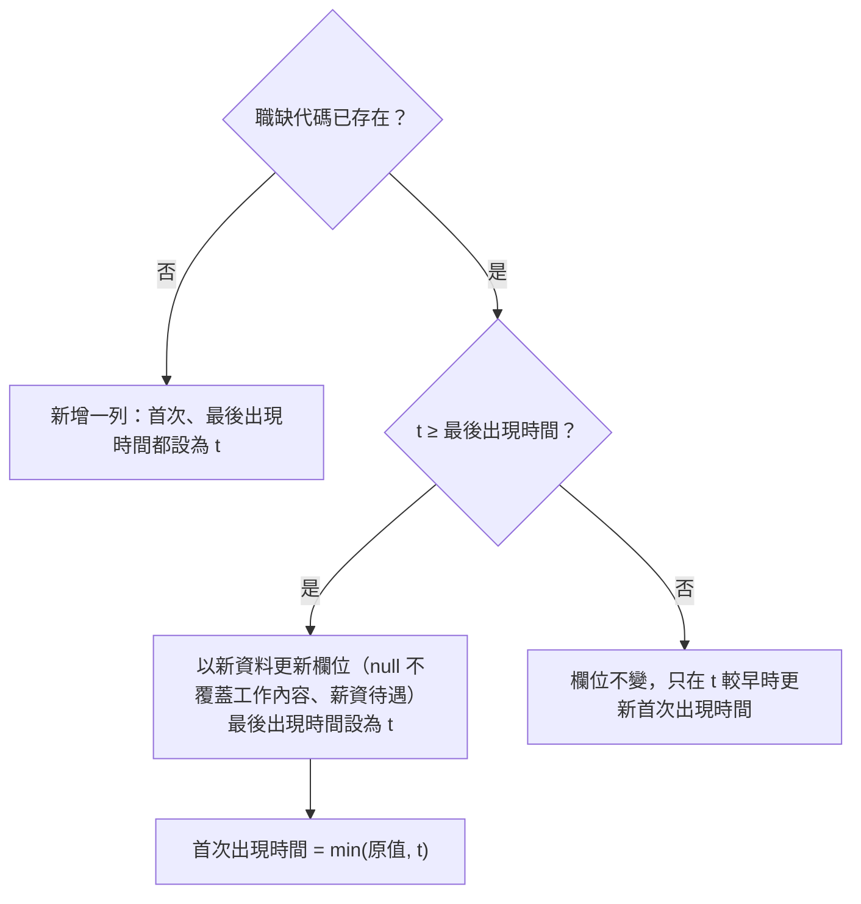

# 職缺資料庫

- ID：job-database
- 狀態：✅ 已完成
- 依賴：104-job-scraper（沿用其[欄位字典](104-job-scraper.md#821-欄位字典)作為資料契約）
- 程式碼：[src/job_db/](../../src/job_db/)、[src/import_jobs.py](../../src/import_jobs.py)、[src/fetch_104_jobs.py](../../src/fetch_104_jobs.py)

## 1. 背景與目標

104-job-scraper 每次執行都會在 `output/104/` 產生一份新的 CSV 與 JSON，各次結果之間沒有關聯：

- 同一筆職缺在不同次執行中重複出現，只能人工比對。
- 看不出哪些職缺是這次新出現的，也看不出一筆職缺開了多久。
- 零散的檔案無法累積成歷史資料，後續的趨勢分析（trend-analysis）沒有資料來源。

本功能把每次抓到的職缺寫進同一個 SQLite 資料庫，以職缺代碼跨次去重，並記錄每筆職缺第一次與最後一次被抓到的時間，以及每次抓取的條件（UP-01）。

## 2. 範圍

範圍內：見 [§3 設計總覽](#3-設計總覽)的使用者故事清單，以及 [§6 非功能需求](#6-非功能需求)、[§7 共用設計](#7-共用設計)。

範圍外（實作時不要做）：

- 評分結果存入資料庫、評分結果快取（屬 [job-scoring §7](job-scoring.md#7-依分數查詢職缺store)、[§8](job-scoring.md#8-重跑時不重複付-ai-費用cache)；本功能只提供資料庫與 schema）
- job-scoring 改從資料庫讀取職缺（見 [TODO.md](../../TODO.md#職缺評分範圍外)）
- 判斷職缺是否已下架：只記錄最後一次被抓到的時間，不推論是否下架（見 [§7.2.2](#722-資料表)）
- 其他求職平台的資料（另開一個功能）
- 查詢或瀏覽介面：目前直接用 pandas 或 SQLite 工具讀取，agent 查詢屬 [mcp-server](mcp-server.md)
- 保留職缺內容的歷史版本：資料表只保留最新一版

## 3. 設計總覽

輸入與輸出：

- 輸入：104-job-scraper 產出的職缺清單，可以是爬蟲執行中的記憶體資料，或 `output/104/` 的 JSON。欄位依 [104-job-scraper 的欄位字典](104-job-scraper.md#821-欄位字典)。
- 輸出：`data/jobs.db`，資料表見 [§7.2.2](#722-資料表)。
  - job-scoring、trend-analysis、mcp-server 需要一份以職缺代碼為主鍵、欄位固定的資料表，以便直接用 pandas 或 SQL 查詢。
  - job-scoring 的評分結果也寫進同一個資料庫（`job_scores`，見 [job-scoring §7.2.1](job-scoring.md#721-資料表)）。

使用者故事清單：

本功能範圍內的使用者故事，細節見各章的「需求」。

- [累積每次抓到的職缺，看出哪些是新的](#4-累積每次抓到的職缺看出哪些是新的save)（`save`）：✅
- [把過去抓好的 JSON 匯進來](#5-把過去抓好的-json-匯進來import)（`import`）：✅

[§6 非功能需求](#6-非功能需求)與 [§7 共用設計](#7-共用設計)不是使用者故事。§7 放跨越各章的基礎設施：資料庫路徑、模組佈局與資料表。

## 4. 累積每次抓到的職缺，看出哪些是新的（save）

身為求職者，我想要爬完的職缺自動累積到同一個地方，並知道哪些職缺是最近才出現的，以便不必自己管理一堆輸出檔，也能優先查看新職缺。

### 4.1 需求

- FR-save-dedup：以 `職缺代碼` 為主鍵寫入 `jobs` 表。
  - 首次出現時間、最後出現時間，以及更新欄位的時機依 [§4.2.1](#421-寫入規則)。
- FR-save-keep-detail：新資料的 `工作內容` 或 `薪資待遇` 為 `null`，而資料庫中已有非 null 的值時，保留舊值。
- FR-save-run：每次抓取或匯入都在 `scrape_runs` 記一筆紀錄。
  - 同一次執行中出現的每筆職缺記到 `run_jobs`。
- FR-save-auto：`fetch_104_jobs.py` 寫出 CSV／JSON 後，預設把結果寫進資料庫。
  - `--db` 指定資料庫路徑。
  - `--no-db` 略過寫入。
- FR-save-summary：每次寫入後，在 stderr 印出新增筆數、更新筆數與資料庫路徑。
- FR-save-transaction：一次抓取或一個匯入檔的寫入包在同一個 transaction 中，中途失敗就整批 rollback，不留下只寫一半的資料。

### 4.2 設計

#### 4.2.1 寫入規則

以一次執行的時間 `t` 寫入一批職缺，對每筆職缺：



- 新增一列算「新增」，其餘情況都算「更新」。
- 只有 `t` 不早於資料庫中的最後出現時間時，才用新資料覆蓋欄位。這樣一來，匯入舊檔案的先後順序不會影響結果，資料表永遠保留最新一版的內容。
- 每筆職缺都會寫進 `run_jobs`，不管是新增還是更新。

#### 4.2.2 詳情欄位不被 null 覆蓋

`工作內容`、`薪資待遇` 保留舊值，是缺值不回填（見 [§6](#6-非功能需求)）唯一的例外，理由如下：

- 詳情 API 常因暫時性錯誤失敗，失敗時這兩欄為 `null`。
- 資料庫中的舊值來自同一個 API 的同一個欄位，不是用搜尋摘要之類的其他來源回填。
- 如果讓 `null` 覆蓋舊值，一次失敗就會讓下游的評分少了完整的工作內容。

#### 4.2.3 爬蟲的寫入參數

爬蟲新增的參數（其餘參數見 [104-job-scraper 的 CLI](104-job-scraper.md#822-cli)）：

- `--db`：資料庫路徑，預設為專案根目錄的 `data/jobs.db`
- `--no-db`：只輸出 CSV／JSON，不寫入資料庫

- 互動模式一律寫入預設的資料庫。
- 寫入資料庫失敗時，在 stderr 印出 `[-]`，不中斷程式，因為 CSV／JSON 已經寫出。

每次寫入後（爬蟲與匯入都一樣）在 stderr 印出摘要，例如：

```
[+] 已寫入資料庫：新增 42 筆、更新 18 筆（data/jobs.db）
```

### 4.3 驗收

本功能都是離線測試，放在 `tests/test_job_db.py`（`import_jobs` 的 CLI 放在 `tests/test_import_jobs.py`），資料庫與 JSON 都建在 `tmp_path`，職缺資料寫在測試碼裡。

#### AC-save-dedup：跨次去重與出現時間

- Given：兩批職缺有部分重疊，分別以時間 t1 < t2 寫入；另一組測試以 t2、t1 的順序寫入
- When：寫入兩批
- Then：每個職缺代碼只有一列；重疊的職缺首次出現時間為 t1、最後出現時間為 t2，欄位內容為 t2 那批的值；兩種寫入順序的 `jobs` 內容相同；回傳並印出的新增、更新筆數正確
- 驗證方式：`uv run pytest tests/test_job_db.py -k save_run`
- 通過條件：全部 passed。

#### AC-save-keep-detail：null 不覆蓋既有內容

- Given：`工作內容` 與 `薪資待遇` 依下列情況設定資料庫中的值與新資料的值
- When：以較晚的時間寫入新資料
- Then：
  - 資料庫中非 null、新資料為 `null` → 保留舊值
  - 資料庫中非 null、新資料非 null → 寫入新值
  - 資料庫中為 `null`、新資料非 null → 寫入新值
  - 其他欄位的 `null` 照常覆蓋
- 驗證方式：`uv run pytest tests/test_job_db.py -k keeps_detail`
- 通過條件：全部 passed。

#### AC-save-run：執行紀錄與 transaction

- Given：一批職缺與抓取條件；另一批職缺中有一筆在寫入時會拋出例外
- When：分別寫入
- Then：第一批在 `scrape_runs` 多一列，條件與職缺數正確，`run_jobs` 有每筆職缺；第二批寫入失敗後，三個表都沒有任何改變
- 驗證方式：`uv run pytest tests/test_job_db.py -k "save_run and (records or rollback)"`
- 通過條件：全部 passed。

#### AC-save-auto：爬蟲寫入資料庫

- Given：以假函式取代 `requests.get` 與 `time.sleep`
- When：分別以 `--db <tmp>`、`--db <tmp> --no-db` 呼叫爬蟲的 `main`
- Then：前者的資料庫中有這次抓到的職缺，並有一筆 `來源` 為 `爬蟲` 的紀錄；後者不建立資料庫檔；兩者都照常產生 CSV／JSON
- 驗證方式：`uv run pytest tests/test_fetch_104_jobs.py -k db`
- 通過條件：全部 passed。

## 5. 把過去抓好的 JSON 匯進來（import）

身為求職者，我想要把過去已經抓好的 JSON 也匯進來，以便歷史資料不會斷掉。

### 5.1 需求

- FR-import：提供 `src/import_jobs.py`，可一次匯入一或多個爬蟲 JSON。
  - 同一個檔案重複匯入時略過，資料庫內容不變。

### 5.2 設計

匯入沿用 [§4.2.1](#421-寫入規則) 的寫入規則，每個檔案是一次執行，各自一個 transaction，寫入後印出的摘要同 [§4.2.3](#423-爬蟲的寫入參數)。

#### 5.2.1 匯入既有 JSON

- 每個檔案依序檢查：檔名時間 → 是否已匯入 → 檔案內容。已匯入的檔案不會再讀取內容。
- `t` 取自檔名結尾的 `_<YYYYMMDD_HHMMSS>.json`（104-job-scraper 的命名規則，見 [104-job-scraper 的輸出檔](104-job-scraper.md#621-輸出檔)）。
- 以下情況印出 `[!]` 後略過該檔，繼續處理下一個檔案：
  - 檔名解析不出時間
  - 檔案不是合法的職缺 JSON：讀不到、不是 JSON、不是非空的陣列、有元素不是物件，或 `職缺代碼` 不是非空字串
  - 寫入資料庫時發生 SQLite 錯誤（該檔整批 rollback）
- `scrape_runs` 中已有相同 `來源檔` 時，印出 `[i]` 並略過，所以重複匯入不會改變資料庫。
- 爬蟲本身寫入資料庫時，`來源檔` 為 `null`。之後再匯入同一個 JSON，會被當成另一次執行，`scrape_runs` 多一列。因為兩者的 `t` 相同、職缺內容也相同，依 [§4.2.1](#421-寫入規則) 的規則，`jobs` 的內容不變。

#### 5.2.2 匯入 CLI

```bash
uv run src/import_jobs.py output/104/*.json [--db data/jobs.db]
```

- 進入點是 `main(argv: list[str] | None = None) -> int`。
- 結束碼：
  - `0`：至少一個檔案匯入成功，或全部都因為已匯入而略過
  - `1`：沒有指定檔案，或所有檔案都因為錯誤而被略過

### 5.3 驗收

#### AC-import：匯入既有 JSON

- Given：`tmp_path` 中有兩個檔名符合命名規則的 JSON、一個檔名沒有時間的 JSON，以及一個內容格式錯誤的 JSON
- When：以 `main` 匯入全部檔案，再匯入一次
- Then：
  - 第一次：兩個合法檔案寫入，首次與最後出現時間取自檔名；另兩個檔案印出 `[!]` 並略過；結束碼為 0
  - 第二次：兩個合法檔案印出 `[i]` 並略過，另兩個檔案仍印出 `[!]`；資料庫內容與第一次相同；結束碼為 0
  - 只指定錯誤的檔案或沒有指定檔案時，結束碼為 1
- 驗證方式：`uv run pytest tests/test_import_jobs.py`
- 通過條件：全部 passed。

## 6. 非功能需求

### 6.1 需求

- NFR-local：資料庫只存在本機，`data/` 列入 `.gitignore`，不進版控。
- NFR-null：欄位缺值時存成 SQL `NULL`，不回填（依 [development.md](../conventions/development.md#防禦性設計)）。
  - 唯一的例外是 `工作內容`、`薪資待遇` 不被 `null` 覆蓋，理由見 [§4.2.2](#422-詳情欄位不被-null-覆蓋)。

### 6.2 設計

見 [§4.2.2](#422-詳情欄位不被-null-覆蓋)。

### 6.3 驗收

本章的需求由各章既有的驗收涵蓋，不另外寫測試：

- NFR-local：[AC-db](#ac-db自動建立資料庫)（`git check-ignore data/jobs.db`）
- NFR-null：[AC-save-keep-detail](#ac-save-keep-detailnull-不覆蓋既有內容)（其他欄位的 `null` 照常覆蓋）

## 7. 共用設計

跨越各章的基礎設施：資料庫路徑、模組佈局與資料表。

### 7.1 需求

- FR-db：資料庫預設為專案根目錄的 `data/jobs.db`（以腳本位置推算，不受工作目錄影響）。
  - 檔案或目錄不存在時自動建立並初始化 schema。

### 7.2 設計

#### 7.2.1 模組佈局

```
src/
├── job_db/
│   ├── __init__.py
│   ├── schema.py      # 建表語法、開啟連線並初始化
│   └── store.py       # 寫入一次抓取的結果、匯入 JSON
├── import_jobs.py     # 匯入 CLI
└── fetch_104_jobs.py  # 新增 --db、--no-db，寫完檔案後呼叫 job_db
```

- 使用標準函式庫 `sqlite3`，不新增依賴。
- `job_db` 另外定義一份 `jobs` 的欄名與型態，不 import 爬蟲的 `CSV_FIELDNAMES`：爬蟲會 import `job_db`，反向 import 會形成循環。兩份欄名是否一致由測試檢查。
- `fetch_104_jobs.py` 原本是單檔自足腳本，加入本功能後會依賴 `src/job_db/`。以 `uv run src/fetch_104_jobs.py` 執行時，`src/` 在 import 路徑上，不需要額外設定。

#### 7.2.2 資料表

所有時間都是本地時間，格式為 ISO 8601，精確到秒，例如 `2026-09-17T10:15:00`。

`jobs`：每筆職缺一列。

- 104-job-scraper 欄位字典的全部欄位：欄名、順序與字典相同，`職缺代碼` 是主鍵。型態依字典轉換，str → `TEXT`，int → `INTEGER`
- `首次出現時間`（TEXT）：這筆職缺第一次被抓到的時間
- `最後出現時間`（TEXT）：這筆職缺最後一次被抓到的時間

- 欄名沿用中文，讓 `pandas.read_sql` 讀出來的欄位與 CSV／JSON 一致，job-scoring 不需要做欄名對照。
- 「最後出現時間」較早，不代表職缺已經下架，可能只是之後的搜尋條件沒有涵蓋它，所以不另外記錄下架狀態。

`scrape_runs`：每次抓取或匯入一列。

- `執行編號`（INTEGER）：主鍵，自動遞增
- `執行時間`（TEXT）：爬蟲寫出 CSV／JSON 時的時間，與檔名中的時間戳相同。匯入時取自檔名（見 [§5.2.1](#521-匯入既有-json)）
- `來源`（TEXT）：`爬蟲` 或 `匯入`
- `關鍵字`（TEXT | null）：去重後的關鍵字，以 `, ` 合併。匯入時為 `null`，因為檔名中的關鍵字已經過清理與截斷
- `地區`（TEXT | null）：縣市名稱，全台灣時為 `全台灣`。匯入時為 `null`
- `職缺性質`（INTEGER | null）：`0`／`1`／`2`，意義同 [104-job-scraper 的 CLI](104-job-scraper.md#822-cli)。匯入時為 `null`
- `頁數`（INTEGER | null）：每個關鍵字抓幾頁。匯入時為 `null`
- `來源檔`（TEXT | null）：匯入的 JSON 檔名（不含目錄），具唯一性。爬蟲寫入時為 `null`
- `職缺數`（INTEGER）：這次寫入的職缺筆數

`run_jobs`：一次執行與其中出現的職缺，主鍵是（`執行編號`, `職缺代碼`），兩欄分別以外鍵指向 `scrape_runs` 與 `jobs`。同一批中重複的職缺代碼只記一列，`scrape_runs.職缺數` 也只算一次。

### 7.3 驗收

#### AC-mypy：型別檢查

- 驗證方式：`uv run mypy src/`
- 通過條件：沒有錯誤。

#### AC-db：自動建立資料庫

- Given：指定的資料庫路徑與上層目錄都不存在
- When：開啟資料庫
- Then：目錄與檔案被建立，`jobs`、`scrape_runs`、`run_jobs` 三個表存在，`jobs` 的欄位依序是 104-job-scraper 欄位字典的欄位，接著是 `首次出現時間`、`最後出現時間`；`data/` 被 `.gitignore` 排除
- 驗證方式：`uv run pytest tests/test_job_db.py -k open_db`，以及 `git check-ignore data/jobs.db`
- 通過條件：pytest 全部 passed，`git check-ignore` 印出路徑。

## 8. 待決問題

無。
