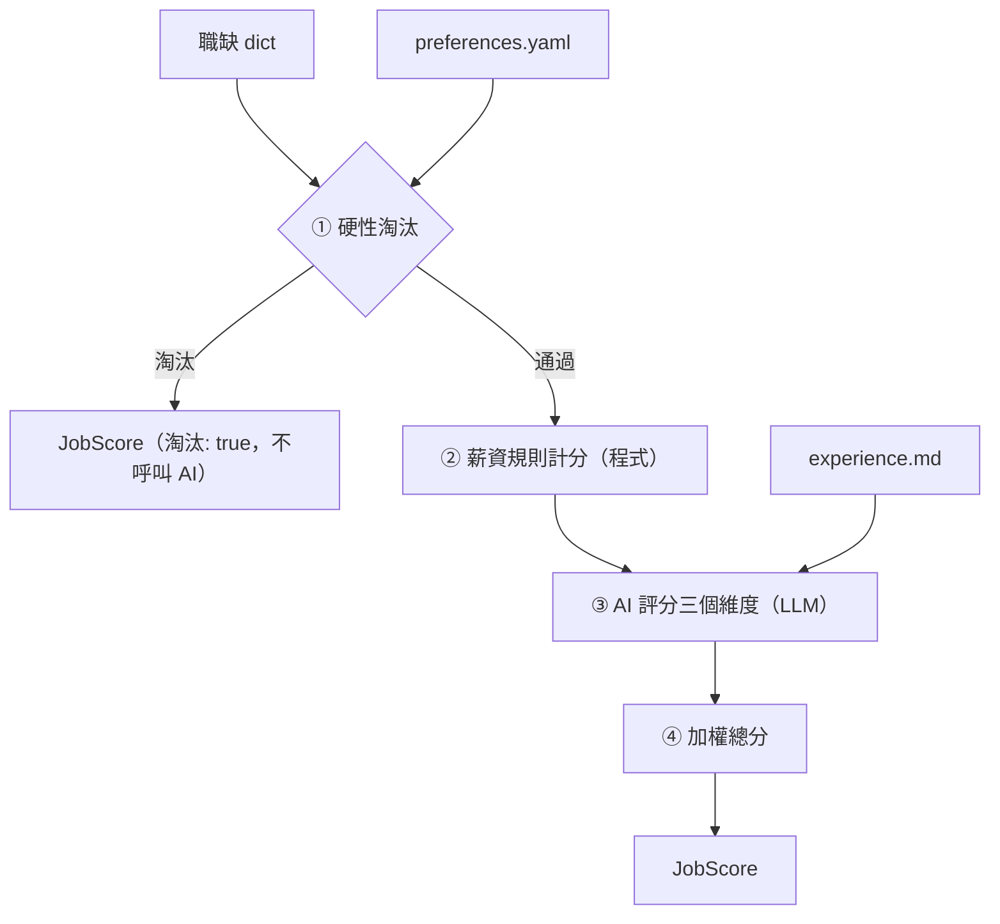
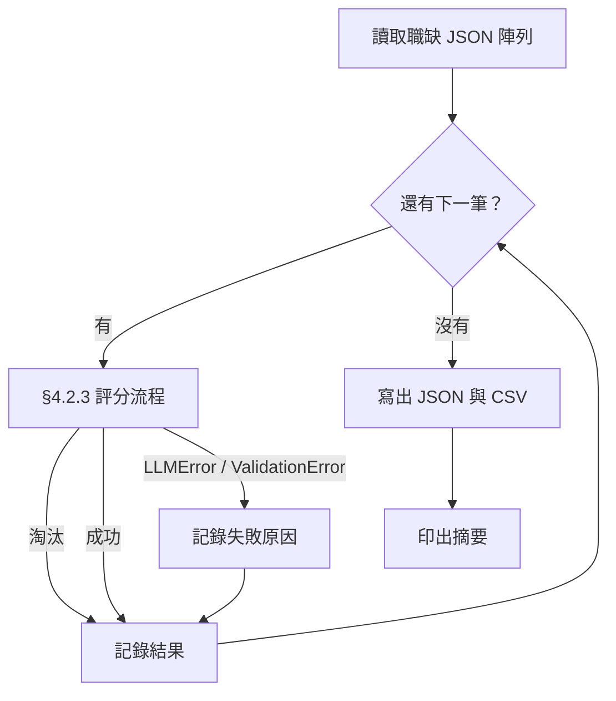
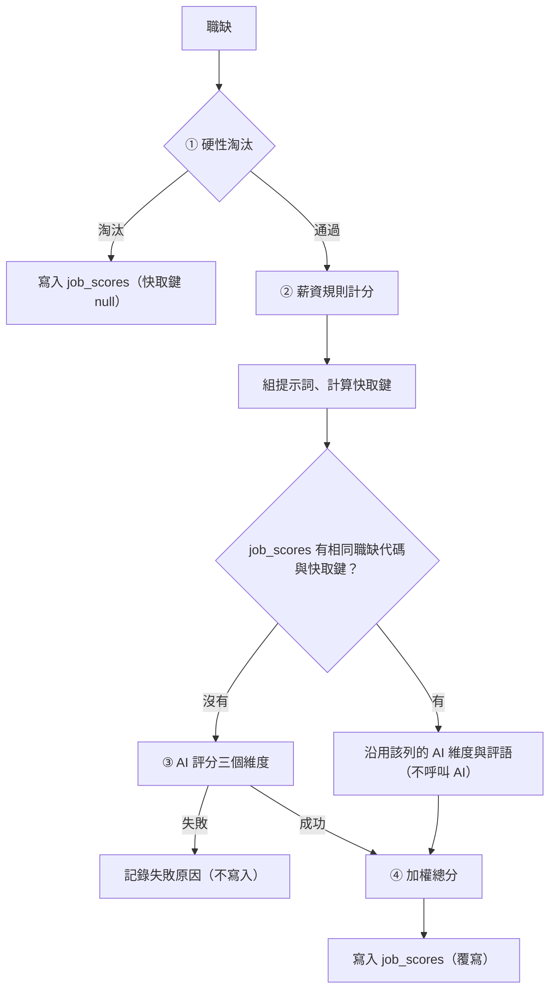

# 職缺評分

- ID：job-scoring
- 狀態：待規劃
- 依賴：104-job-scraper（使用其輸出的職缺 JSON 作為輸入）、job-database（評分結果寫入其資料庫）〔規劃中〕
- 程式碼：[src/score_job.py](../../src/score_job.py)（CLI）、[src/job_scoring/](../../src/job_scoring/)

## 1. 背景與目標

爬蟲一次會抓到上百筆職缺，逐筆閱讀並判斷是否適合自己，要花很多時間。
本功能根據使用者提供的**工作偏好**與**工作經歷**，對一整批職缺逐筆做多維度評分，產出總分與簡短評語，寫成結果檔，讓使用者快速判斷哪些職缺值得細看、原因是什麼（UP-02）。

目前的入口是 CLI，只是為了快速開發；之後會整合進 app。

〔規劃中〕評分結果目前只寫成檔案，每次執行都會把整批職缺重新交給 AI 評分，重跑同一批就要重付一次費用；其他介面（[mcp-server](mcp-server.md)）也無法查詢分數。因此評分結果改為同時寫入職缺資料庫，送給 AI 的內容沒有改變的職缺直接沿用上次的 AI 評分。

## 2. 範圍

**範圍內**：見 [§3 設計總覽](#3-設計總覽)的使用者故事清單，以及 [§10 非功能需求](#10-非功能需求)、[§11 共用設計](#11-共用設計)。

**範圍外**（實作時不要做）

- 結果的排序、篩選與互動式瀏覽介面（只產出檔案，排序與篩選交給讀取結果檔的工具，例如 pandas）
- 公司評分（等 company-info 完成後再擴充，見 [TODO.md](../../TODO.md#職缺評分範圍外)）
- OpenAI 或其他供應商的實作（只保留介面）
- 通勤便利度、資歷門檻、工作型態與福利、競爭程度／新鮮度等維度（候選做法見 [TODO.md](../../TODO.md)）
- 公司評價資訊（屬 company-info；本功能的產業公司吸引力只看產業類別與公司名稱）
- 修改爬蟲或擴充爬蟲欄位（見 [TODO.md](../../TODO.md#爬蟲)）
- 失敗重試（見 [TODO.md](../../TODO.md#職缺評分範圍外)）
- 〔規劃中〕保留評分歷史、從資料庫讀取職缺、強制重新評分的參數（見 [TODO.md](../../TODO.md#職缺評分範圍外)）
- 平行呼叫 AI（整批維持循序執行）

## 3. 設計總覽

**輸入與輸出**

- 輸入的職缺：104-job-scraper 輸出的 JSON（以 `--jobs` 指定），欄位依 [104-job-scraper §8.2.1](104-job-scraper.md#821-欄位字典)，各維度實際看哪些欄位見 [§4.2.4](#424-評分維度)。
- 輸入的個人資料：`profile/preferences.yaml` 與 `profile/experience.md`，格式見 [§4.2.1](#421-個人資料檔)。由使用者自己維護，不來自其他功能。
- 〔規劃中〕輸入的上次評分：job-database 資料庫中 `job_scores` 的 AI 維度與評語，用於沿用（見 [§8.2.1](#821-快取鍵)）。
- 單筆輸出：`JobScore` 的 JSON 印到 stdout，欄位見 [§11.2.2](#1122-jobscore-輸出格式)。
- 整批輸出：`output/scores/` 下同名的 JSON 與 CSV，欄位見 [§6.2.2](#622-結果檔)。給使用者用 pandas 或 Excel 排序、篩選，本功能不提供瀏覽介面。
- 〔規劃中〕整批與單筆的結果都寫入 job-database 資料庫的 `job_scores` 表（見 [§7.2.1](#721-資料表)），供 [mcp-server](mcp-server.md) 查詢。

**使用者故事清單**

本功能範圍內的使用者故事，細節見各章的「需求」。

- [評單筆職缺並看懂每個分數](#4-評單筆職缺並看懂每個分數score)（`score`）：✅
- [明顯不合的職缺直接淘汰](#5-明顯不合的職缺直接淘汰filter)（`filter`）：✅
- [一次評完整批並拿到結果檔](#6-一次評完整批並拿到結果檔batch)（`batch`）：✅
- [依分數查詢職缺](#7-依分數查詢職缺store)（`store`）：〔規劃中〕
- [重跑時不重複付 AI 費用](#8-重跑時不重複付-ai-費用cache)（`cache`）：〔規劃中〕
- [換設定試跑而不影響正式分數](#9-換設定試跑而不影響正式分數dry-run)（`dry-run`）：〔規劃中〕

[§10 非功能需求](#10-非功能需求)與 [§11 共用設計](#11-共用設計)不是使用者故事。§11 放跨越各章的基礎設施：模組佈局、`JobScore` 格式、LLM 供應商抽象層與 Gemini 實作、CLI 的單筆與整批入口、共用測試資料。

## 4. 評單筆職缺並看懂每個分數（score）

身為求職者，我想要依照寫成檔案的偏好與經歷替職缺評分，並看到每個維度的分數與理由，以便每次都用同一套標準，並知道總分是怎麼來的、判斷要不要相信它。

調整提示詞的開發者也用單筆評分（`--job-no`，見 [§11.2.4](#1124-cli)）反覆修改。

### 4.1 需求

- **FR-score-profile**：從指定目錄讀取 `preferences.yaml` 與 `experience.md`。
  - `preferences.yaml` 依 [§4.2.2](#422-preferencesyaml-欄位字典) 驗證，缺少欄位、型別錯誤或權重的鍵不符時報錯，不補預設值。
- **FR-score-salary**：依 [§4.2.6](#426-薪資換算與計分) 換算月薪並計算薪資分數。
  - 面議、時薪、日薪、論件計酬與缺值都視為未知（`null`）。
  - 薪資未知不會因此被淘汰。
- **FR-score-ai**：由 AI 依 [§4.2.5](#425-ai-維度的錨點描述) 的錨點，為三個 AI 維度各給 1–5 分或 `null`。
  - 每個維度都附上理由，另外提供總評。
  - AI 回應必須通過 schema 驗證，否則視為失敗。
- **FR-score-total**：依 [§4.2.7](#427-總分) 計算 0–100 的加權總分。
  - 分數為 `null` 的維度以 3 分代入，讓所有沒被淘汰的職缺都有可以互相比較的總分。

### 4.2 設計

#### 4.2.1 個人資料檔

兩個檔案都放在 `profile/`，並加入 `.gitignore`；版控中只保留 `.example` 範本（見 [§10.1](#101-需求)）。

- `profile/preferences.yaml`：程式讀取的偏好、門檻與權重。YAML，鍵名用中文。
- `profile/experience.md`：工作經歷與技能，原文放進提示詞。自由格式的 Markdown。

#### 4.2.2 preferences.yaml 欄位字典

所有欄位都是**必填**。缺少欄位或型別錯誤時，印出 `[-]` 訊息並結束，不補預設值。

- `目標方向`（list[str]）：想做的工作內容、想累積的能力，給 AI 判斷「職涯方向契合度」
- `產業偏好.喜歡`（list[str]）：偏好的產業或公司類型，可以是空清單
- `產業偏好.不喜歡`（list[str]）：不偏好的產業（降低分數，但不淘汰），可以是空清單
- `薪資.期望月薪`（int）：期望月薪（元）
- `薪資.底線月薪`（int）：可接受的最低月薪（元），必須 ≤ `期望月薪`
- `薪資.年薪換算月數`（int）：年薪換算月薪時的除數（例如 14）
- `淘汰條件.公司`（list[str]）：直接淘汰的公司名稱（完全比對 `公司名稱`），可以是空清單
- `淘汰條件.職稱關鍵字`（list[str]）：`職缺名稱` 含其中任一字串就淘汰（不分大小寫），可以是空清單，但不可含空字串（空字串會命中所有職稱）
- `權重`（dict[str, float]）：鍵必須剛好是 [§4.2.4](#424-評分維度) 的四個維度名稱，值 ≥ 0，且總和 > 0。不要求總和為 1

範例：

```yaml
目標方向:
  - 以 Python 開發後端服務與資料管線
  - 參與 LLM 應用的設計與落地
產業偏好:
  喜歡: [軟體及網路相關業, 金融科技]
  不喜歡: [博弈]
薪資:
  期望月薪: 70000
  底線月薪: 55000
  年薪換算月數: 14
淘汰條件:
  公司: []
  職稱關鍵字: [業務, 客服]
權重:
  職涯方向契合度: 0.4
  技能匹配度: 0.25
  產業公司吸引力: 0.15
  薪資水準: 0.2
```

#### 4.2.3 評分流程



- 圖中的「職缺 dict」是輸入 JSON 中的一筆。
- ① 的規則見 [§5.2.1](#521-硬性淘汰規則)。被淘汰的職缺在 ① 就停止，**不呼叫 AI**，以節省費用，也不需要 API key。
- ② 和 ③ 各自獨立，任何一個維度都可能是 `null`（未知），由 ④ 統一處理。

#### 4.2.4 評分維度

每個維度的分數都是 1–5 的整數，或 `null`（資訊不足）。

- `職涯方向契合度`
  - 判斷者：AI
  - 使用的職缺欄位：職缺名稱、工作內容
  - 比對的個人資料：`preferences.yaml` 的 `目標方向`
- `技能匹配度`
  - 判斷者：AI
  - 使用的職缺欄位：職缺名稱、工作內容、電腦專長、科系要求
  - 比對的個人資料：`experience.md` 全文
- `產業公司吸引力`
  - 判斷者：AI
  - 使用的職缺欄位：公司名稱、產業類別
  - 比對的個人資料：`preferences.yaml` 的 `產業偏好`
- `薪資水準`
  - 判斷者：程式
  - 使用的職缺欄位：薪資待遇、薪資下限、薪資上限
  - 比對的個人資料：`preferences.yaml` 的 `薪資`

#### 4.2.5 AI 維度的錨點描述

這些描述要原文放進提示詞，讓分數有一致的標準。

**職涯方向契合度**（包含這份工作能否累積目標方向需要的能力）

- 5：主要工作內容就是目標方向之一，做了能直接累積目標能力
- 4：大部分工作內容符合目標方向，少部分無關
- 3：部分相關，或是可以作為轉往目標方向的跳板
- 2：只有少量沾邊，主要工作內容與目標無關
- 1：與目標方向無關或背道而馳
- null：`工作內容` 為 null，且無法只憑職缺名稱判斷

**技能匹配度**（依工作經歷評估現在能否勝任）

- 5：要求的核心技能都具備，而且有實際經歷佐證
- 4：具備大部分核心技能，缺口可以在短期內補上
- 3：具備約一半的核心技能，有明顯但可以跨越的缺口
- 2：只具備少數要求的技能，需要大量補強
- 1：核心技能幾乎都不具備
- null：根據現有欄位（職缺名稱、工作內容、電腦專長、科系要求）仍無法判斷職缺要求哪些技能

`理由` 必須列出主要的技能缺口（沒有缺口就寫「無明顯缺口」）。

資料是否足以評分由 AI 判斷，程式不設固定條件。例如 `工作內容` 為 null，但職缺名稱已經能看出核心技能（如「資深 iOS 工程師」）時，仍然可以給分，但 `理由` 要說明是依據哪些欄位判斷的。

**產業公司吸引力**（company-info 完成前只根據產業類別與公司名稱判斷）

- 5：屬於 `產業偏好.喜歡` 中的產業
- 4：與喜歡的產業高度相關
- 3：中性，既不在喜歡、也不在不喜歡的清單中
- 2：與不喜歡的產業相關
- 1：屬於 `產業偏好.不喜歡` 中的產業
- null：`產業類別` 為空

#### 4.2.6 薪資換算與計分

**換算成月薪**——依 `薪資待遇` 的開頭字串判斷薪資類型（以 104 實際資料為準）：

- `月薪`：直接使用。例如 `月薪55,000~65,000元`，下限 55000、上限 65000。
- `年薪`：下限、上限都除以 `年薪換算月數`，四捨五入到整數（見 [§4.2.7](#427-總分) 的進位規則）。例如 `年薪700,000~1,000,000元`，下限 700000、上限 1000000。
- `待遇面議`、`時薪`、`日薪`、`論件計酬`、其他：無法換算，薪資未知。例如 `待遇面議`，下限、上限都是 0。
- `薪資待遇` 為 null：無法判斷類型，薪資未知。

其他規則：

- `薪資下限` 為 null 或 0 → 薪資未知。
- `薪資上限` ≥ 9999999 代表「以上」、沒有上限，換算後的上限記為「無」（實際資料中的值是 `9999999`）。
- `薪資上限` 為 null → 上限記為「無」。

**計分**——設換算後的月薪下限為 `low`，上限為 `high`（可能是「無」），依序判斷，第一個符合的條件決定分數：

1. 薪資未知：`null`
2. `low` ≥ `期望月薪`：5
3. `high` 不是「無」且 `high` ≥ `期望月薪`：4
4. 其他：2

「`high` < `底線月薪`」的情況已經在 [§5.2.1](#521-硬性淘汰規則) 被淘汰，不會進到計分。

`薪資水準` 的 `理由` 由程式產生，例如 `月薪 55,000–65,000，期望 70,000，未達期望`。

#### 4.2.7 總分

1. 分數為 `null` 的維度以 **3 分**（中性）代入。所有職缺都用相同的四個維度與權重計算，總分才能互相比較；若只用已知維度計算，等於假設缺少的維度與其他維度表現相同，缺資料的職缺反而可能排在前面。
2. 計算四個維度的加權平均 `avg = Σ(wᵢ·sᵢ) / Σwᵢ`。
3. 換算成 0–100 分：`總分 = (avg − 1) / 4 × 100`，四捨五入到整數。沒被淘汰的職缺一定有總分。
   - .5 一律進位（62.5 → 63），不用 Python `round()` 的五成雙（62.5 → 62）。
   - 以分數精確計算，避免浮點誤差把 57.5 算成 57.4999… 而被捨去。年薪換算月薪也用同一規則。
4. 分數為 `null` 的維度名稱依 [§4.2.4](#424-評分維度) 的順序列入 `未知維度`，讓使用者知道哪些分數是代入的；`維度` 中的分數仍保留 `null`，`評語` 維持 AI 的原文，不另外加註。

#### 4.2.8 提示詞設計

- 模板放在 `prompts/scoring.md`，和程式碼分開，方便反覆調整。
- **system**：評分者角色、[§4.2.5](#425-ai-維度的錨點描述) 的錨點描述，以及以下規則：
  - 只根據提供的資料判斷
  - 資訊不足時給 `null` 並在理由中說明，不准猜分數
  - 理由要具體引用職缺內容
  - 使用繁體中文
- **user**：`目標方向`、`產業偏好`、experience.md 全文，以及職缺欄位（職缺名稱、公司名稱、產業類別、工作內容、電腦專長、科系要求）。欄位為 null 或空字串時，明確寫出「（無資料）」。
- **不把薪資與淘汰條件交給 AI**，避免重複判斷，也避免 AI 的判斷和規則衝突。
- 不設定溫度等取樣參數：Gemini 3.8 Flash 已不支援 `temperature`、`top_p`、`top_k`（[官方說明](https://ai.google.dev/gemini-api/docs/latest-model)）。

#### 4.2.9 AI 輸出 schema

LLM 必須輸出以下 JSON（Pydantic 模型 `AIAssessment`）。欄位使用英文名稱，讓 schema 對各家模型都比較穩定，再由 `scorer.py` 轉成 [§11.2.2](#1122-jobscore-輸出格式) 的中文鍵名：

```json
{
  "career_fit":   {"score": 1-5 | null, "reason": "..."},
  "skill_match":  {"score": 1-5 | null, "reason": "..."},
  "industry_fit": {"score": 1-5 | null, "reason": "..."},
  "comment": "..."
}
```

回應無法通過 Pydantic 驗證時（例如分數超出範圍），視為該次評分失敗：印出 `[-]` 並結束，不自行修正分數。

### 4.3 驗收

#### AC-score-profile：個人資料檔驗證與版控

- **Given**：(a) `preferences.yaml` 缺少 `權重`；(b) `權重` 多了一個不存在的維度；(c) `底線月薪` 大於 `期望月薪`；(d) `淘汰條件.職稱關鍵字` 含空字串
- **When**：以 `--dry-run` 對 `ok` 職缺呼叫 CLI 的 `main`（同時指定 `--job-no`）
  - 〔規劃中〕實作 dry-run 試跑後 `--dry-run` 會呼叫 AI，改為已禁止建立 client、不使用 `--dry-run`
- **Then**：四種情況都回傳 1，stderr 含 `[-]`；以 `git check-ignore` 檢查時，`profile/preferences.yaml`、`profile/experience.md`、`.env` 被忽略，對應的範本檔沒有被忽略；兩個範本檔都能成功載入
- **驗證方式**：`uv run pytest tests/test_job_scoring_profile.py`
- **通過條件**：全部 passed。

#### AC-score-salary：薪資計分

- **Given**：共用的測試偏好（期望 70,000、底線 55,000、年薪 ÷14）
- **When**：以下列職缺呼叫 `score_salary`、`check_hard_filters`（以 `parametrize` 實作）。每項是「`薪資待遇`（`薪資下限` / `薪資上限`）→ 薪資分數」：
  - `月薪70,000~90,000元`（70000 / 90000）→ 5
  - `月薪60,000~80,000元`（60000 / 80000）→ 4
  - `月薪56,000~60,000元`（56000 / 60000）→ 2
  - `年薪980,000~1,260,000元`（980000 / 1260000）→ 5，換算為 70,000~90,000
  - `年薪980,007~1,260,007元`（980007 / 1260007）→ 5，換算為 70,000.5~90,000.5，理由中為 70,001–90,001
  - `月薪50,000元以上`（50000 / 9999999）→ 2，沒有上限
  - `待遇面議`（0 / 0）→ `None`
  - `時薪500元以上`（500 / 9999999）→ `None`
  - `論件計酬3,000~15,000元`（3000 / 15000）→ `None`
  - `None`（`None` / `None`）→ `None`
- **Then**：薪資分數符合上列結果與 [§4.2.6](#426-薪資換算與計分)，而且都不會被淘汰

- **驗證方式**：`uv run pytest tests/test_job_scoring_rules.py -k score_salary`
- **通過條件**：全部 passed。

#### AC-score-total：總分計算

- **Given**：權重 0.4 / 0.25 / 0.15 / 0.2
- **When**：以下列分數組合呼叫 `compute_total`（以 `parametrize` 實作）。每項是「職涯方向 / 技能 / 產業公司 / 薪資 → 總分」：
  - 5 / 5 / 5 / 5 → 100
  - 1 / 1 / 1 / 1 → 0
  - 4 / 4 / 5 / 4 → 79
  - 4 / 4 / 2 / 3 → 63，原始值 62.5，.5 一律進位
  - 5 / 1 / 3 / 3 → 58，原始值 57.5，不受浮點誤差影響
  - 5 / 3 / `None` / `None` → 70，未知維度以 3 分代入
  - `None` / `None` / `None` / `None` → 50，全部未知，等同全部 3 分
- **Then**：結果符合上列總分與 [§4.2.7](#427-總分) 的公式

- **驗證方式**：`uv run pytest tests/test_job_scoring_scorer.py -k compute_total`
- **通過條件**：全部 passed。

#### AC-score-flow：評分流程與 AI 回應處理

- **Given**：假的 LLM client，回傳 `career_fit` 5 分、`skill_match` 為 `null`、`industry_fit` 3 分、總評為 `總評`；另有一份 `career_fit` 與 `skill_match` 都是 `null` 的回應，以及一份 `career_fit` 為 6 分的回應
- **When**：分別對 `out` 與 `ok` 職缺呼叫 `score_job`，並驗證超出範圍的回應
- **Then**：
  - `out`：client 沒有被呼叫；結果為 `淘汰` true，`維度` 與 `總分` 都是 `None`
  - `ok`：client 被呼叫 1 次；`model_dump(by_alias=True)` 的鍵依序是四個中文維度名稱；`技能匹配度` 的分數為 `None`、`薪資水準` 為 4；`總分` 75；`未知維度` 為 `[技能匹配度]`；`評語` 為 `總評`
  - 兩個維度都是 `null` 的回應：`總分` 為 55；`未知維度` 為 `[職涯方向契合度, 技能匹配度]`；`評語` 維持 `總評`，不加任何前綴
  - 6 分的回應會讓 `AIAssessment.model_validate` 拋出 `ValidationError`
- **驗證方式**：`uv run pytest tests/test_job_scoring_scorer.py -k score_job`
- **通過條件**：全部 passed。

#### AC-score-real：真實評分 〔需網路〕

- **Given**：已在 `.env` 設定 `GEMINI_API_KEY`，沒有設定時測試顯示 skipped 並說明原因；個人資料與職缺使用 `tests/e2e/data/` 的固定測試資料
- **When**：以 `tests/e2e/data/profile/` 為個人資料，對 `tests/e2e/data/104/jobs.json` 中第一筆有工作內容、而且沒被淘汰的職缺呼叫 `main`
- **Then**：
  - 輸出符合 [§11.2.2](#1122-jobscore-輸出格式)，四個維度依序出現
  - 每個維度都有非空的理由，分數是 1–5 或 `None`
  - 總分在 0–100 之間
  - 測試會印出完整結果（用 `-s` 顯示）
- **驗證方式**：`uv run pytest -m network -s tests/e2e/test_job_scoring.py -k real_scoring`
- **通過條件**：passed；使用者閱讀印出的理由，確認內容確實引用了職缺內容，而且與自己的判斷大致相符。

## 5. 明顯不合的職缺直接淘汰（filter）

身為求職者，我想要薪資太低、不想去的公司或職稱的職缺直接被淘汰，以便不浪費時間與 AI 費用。

### 5.1 需求

- **FR-filter**：依 [§5.2.1](#521-硬性淘汰規則) 檢查硬性淘汰條件。
  - 收集所有成立的淘汰原因。
  - 被淘汰的職缺不呼叫 AI。

### 5.2 設計

#### 5.2.1 硬性淘汰規則

依序檢查以下條件，**收集所有符合的原因**（不在第一條就停止），只要有任何一條就淘汰：

1. `公司名稱` 在 `淘汰條件.公司` 中 → 原因 `公司在排除名單：<公司名稱>`
2. `職缺名稱` 含 `淘汰條件.職稱關鍵字` 中的任一字串 → 原因 `職稱含排除關鍵字：<關鍵字>`
3. 依 [§4.2.6](#426-薪資換算與計分) 換算出的月薪上限存在，且小於 `底線月薪` → 原因 `薪資上限 <金額> 低於底線 <金額>`

薪資未知（面議、時薪、null 等）**不會**淘汰職缺。

淘汰在 [§4.2.3](#423-評分流程) 的第 ① 步執行。

### 5.3 驗收

#### AC-filter-rules：硬性淘汰

- **Given**：共用的測試偏好（底線 55,000、年薪 ÷14、排除「乙公司」與「業務」）
- **When**：以下列職缺呼叫 `check_hard_filters`。每項是「`薪資待遇`（`薪資下限` / `薪資上限`）→ 淘汰原因」：
  - `月薪40,000~50,000元`（40000 / 50000）→ 1 條，含「底線」
  - `年薪560,000~700,000元`（560000 / 700000）→ 1 條，含「底線」，換算上限為 50,000
  - `月薪40,000~50,000元`（40000 / 50000），職稱 `業務專員`，公司 `乙公司` → 3 條（收集所有原因）
- **Then**：淘汰原因符合上列結果與 [§5.2.1](#521-硬性淘汰規則)；職稱關鍵字不分大小寫（關鍵字 `sales` 會淘汰 `Senior SALES Manager`）

- **驗證方式**：`uv run pytest tests/test_job_scoring_rules.py -k check_hard_filters`
- **通過條件**：全部 passed。

#### AC-filter-no-key：被淘汰的職缺不需要 API key

- **Given**：已禁止建立 client
- **When**：不使用 dry-run，對 `out` 職缺呼叫 `main`
- **Then**：回傳 0；stdout 是 `淘汰` 為 true、`淘汰原因` 不為空的 JSON
- **驗證方式**：`uv run pytest tests/test_score_job_cli.py -k eliminated`
- **通過條件**：passed。

## 6. 一次評完整批並拿到結果檔（batch）

身為求職者，我想要把一整批爬到的職缺一次送進評分，並拿到結果檔，以便用表格工具排序、篩選後，挑出值得細看的職缺。

### 6.1 需求

- **FR-batch-order**：整批評分時，依輸入順序逐筆套用 [§4.2.3](#423-評分流程) 的流程。
- **FR-batch-failure**：單筆評分失敗（LLM 呼叫失敗或回應驗證失敗）時，記下失敗原因並繼續下一筆，不中斷整批。
  - 這樣整批已經花掉的時間與 AI 費用不會白費。
- **FR-batch-output**：整批結果寫成 JSON 與 CSV 兩個檔案，位置與格式依 [§6.2.2](#622-結果檔)。
  - CSV 使用 `utf-8-sig`，讓 Excel 能正常顯示中文。
- **FR-batch-summary**：整批評分結束時印出摘要：總筆數、成功、淘汰、失敗筆數，以及兩個結果檔的路徑。

### 6.2 設計

#### 6.2.1 流程



- 〔規劃中〕每筆的「§4.2.3 評分流程」改為 [§7.2.2](#722-流程)：評分前先查快取，評完寫入資料庫。
- 依輸入順序逐筆處理，不平行呼叫 AI。每筆開始前在 stderr 印出進度，例如 `⏳ [i] (3/120) Python 工程師 - 甲公司`。
- LLM client 在第一次需要呼叫 AI 時才建立，所以整批都被淘汰時不需要 API key。client 建立失敗時（不支援的供應商、缺少 API key），每一筆都會失敗，所以直接印出 `[-]`、回傳 1，此時還沒呼叫過 AI。
- 只有 `LLMError` 與 `ValidationError` 算單筆失敗，失敗原因記錄例外訊息。其他例外代表程式錯誤，直接讓程式中止。
- 不管成功、淘汰或失敗，每一筆輸入職缺都會有一筆結果。

#### 6.2.2 結果檔

- 寫到專案根目錄的 `output/scores/`（以腳本位置推算，不受工作目錄影響，不存在時自動建立，已在 `.gitignore` 的 `output/` 之下）。
- 檔名是輸入檔的檔名主體加上 `_scored`，例如輸入 `jobs_104_python_20260917_101500.json`，輸出 `jobs_104_python_20260917_101500_scored.json` 與 `_scored.csv`，方便對回原始爬蟲結果。重跑同一個輸入檔時直接覆寫。
- 結果檔要能直接用來挑職缺，所以每筆除了 [§11.2.2](#1122-jobscore-輸出格式) 的 `JobScore` 欄位，還從輸入職缺帶入 `職缺名稱`、`公司名稱`、`薪資待遇`、`職缺連結`，並多一個 `失敗原因` 欄位。

- `職缺代碼`（str）
- `職缺名稱`、`公司名稱`、`薪資待遇`、`職缺連結`（同 [104-job-scraper §8.2.1](104-job-scraper.md#821-欄位字典)）：從輸入職缺原樣帶入
- `淘汰`、`淘汰原因`、`維度`、`總分`、`未知維度`、`評語`（同 [§11.2.2](#1122-jobscore-輸出格式)）：評分失敗時 `淘汰` 為 false，清單為空，其餘為 `null`
- `失敗原因`（str | null）：評分失敗時的例外訊息；其他情況為 `null`

- **JSON**：UTF-8、`ensure_ascii=False`、縮排 2，內容是依輸入順序排列的陣列（不排序），每個元素的鍵依上列順序排列。
- **CSV**：`utf-8-sig`，每筆一列，欄位順序如下：
  - `職缺代碼`、`職缺名稱`、`公司名稱`、`薪資待遇`
  - `總分`，以及四個維度的分數（欄名就是維度名稱，依 [§4.2.4](#424-評分維度) 的順序；未知時留空）
  - `未知維度`、`淘汰原因`（清單以 `, ` 合併）
  - `評語`、`失敗原因`、`職缺連結`

  CSV 不放各維度的理由，要看理由時查 JSON。

#### 6.2.3 摘要

整批結束後在 stderr 印出：

```
🎉 [+] 評分完成：共 120 筆，成功 95、淘汰 23、失敗 2
[i] JSON：output/scores/jobs_104_python_20260917_101500_scored.json
[i] CSV：output/scores/jobs_104_python_20260917_101500_scored.csv
```

有失敗時，另外逐筆印出 `[!] <職缺代碼> <職缺名稱>：<失敗原因>`。

〔規劃中〕有職缺沿用上次的 AI 評分時，第一行之後多印 `[i] 沿用上次的 AI 評分：<筆數> 筆`（見 [§8.2.2](#822-沿用時的行為)）。

### 6.3 驗收

#### AC-batch-order：整批評分

- **Given**：五筆職缺，依序為：正常、會被淘汰、正常、會評分失敗、正常；整批用的假 LLM client
- **When**：呼叫整批評分函式
- **Then**：
  - 結果有 5 筆，職缺代碼的順序與輸入相同
  - 假 client 被呼叫 4 次，被淘汰的職缺沒有呼叫
  - 被淘汰的那筆 `淘汰` 為 true、`失敗原因` 為 `None`；成功的三筆 `失敗原因` 為 `None`
- **驗證方式**：`uv run pytest tests/test_job_scoring_batch.py -k batch_scoring`
- **通過條件**：全部 passed。

#### AC-batch-failure：單筆失敗不中斷整批

- **Given**：三筆職缺，假 client 對第一筆拋出 `LLMError`、對第二筆回傳 6 分，第三筆正常
- **When**：呼叫整批評分函式
- **Then**：
  - 前兩筆的 `失敗原因` 不為空，`總分`、`維度`、`評語` 為 `None`，`淘汰` 為 false
  - 第三筆有總分
  - 沒有拋出例外
- **驗證方式**：`uv run pytest tests/test_job_scoring_batch.py -k failure`
- **通過條件**：全部 passed。

#### AC-batch-output：結果檔

- **Given**：AC-batch-order 的結果，輸出目錄指到 `tmp_path`，輸入檔名為 `jobs_104_測試_20260101_000000.json`
- **When**：寫出結果檔
- **Then**：
  - 產生 `jobs_104_測試_20260101_000000_scored.json` 與 `_scored.csv`
  - JSON 可解析，每個元素的鍵與順序符合 [§6.2.2](#622-結果檔) 的表
  - CSV 以 `utf-8-sig` 讀取時，表頭符合 [§6.2.2](#622-結果檔) 的欄位順序、列的順序與 JSON 相同，未知維度的分數欄是空字串，被淘汰那列的 `淘汰原因` 以 `, ` 合併
- **驗證方式**：`uv run pytest tests/test_job_scoring_batch.py -k output`
- **通過條件**：全部 passed。

#### AC-batch-cli：整批 CLI 與摘要

- **Given**：共用的測試資料，輸出目錄指到 `tmp_path`
- **When**：
  - (a) 以假 client 取代 `get_client`，不指定 `--job-no` 呼叫 `main`
  - (b) 使用 `--dry-run` 但不指定 `--job-no`。〔規劃中〕實作 dry-run 試跑後刪除此項，整批試跑改由 AC-dry-run 驗證
  - (c) 已禁止建立 client，職缺檔只有 `out`，不指定 `--job-no`
  - (d) `GEMINI_API_KEY` 設為空字串，不指定 `--job-no`
- **Then**：
  - (a) 回傳 0；stdout 為空；stderr 含 `共 2 筆，成功 1、淘汰 1、失敗 0` 與兩個結果檔的路徑
  - (b) 回傳 1，stderr 含 `[-]`，沒有產生結果檔。〔規劃中〕實作 dry-run 試跑後刪除此項
  - (c) 回傳 0，結果檔中該筆 `淘汰` 為 true
  - (d) 回傳 1，stderr 含 `[-]` 與 `GEMINI_API_KEY`，沒有產生結果檔
- **驗證方式**：`uv run pytest tests/test_score_job_cli.py -k batch`
- **通過條件**：全部 passed。

#### AC-batch-real：真實整批評分 〔需網路〕

- **Given**：與 AC-score-real 相同
- **When**：以 `tests/e2e/data/profile/` 為個人資料，對 `tests/e2e/data/104/jobs.json`（5 筆，其中 1 筆會被淘汰）不指定 `--job-no` 呼叫 `main`，輸出目錄指到 `tmp_path`
- **Then**：回傳 0；結果檔有 5 筆；測試印出摘要與前幾名的評語（用 `-s` 顯示）
- **驗證方式**：`uv run pytest -m network -s tests/e2e/test_job_scoring.py -k real_batch`
- **通過條件**：passed；使用者抽查前幾名的評分理由是否合理。

## 7. 依分數查詢職缺（store）

〔規劃中〕本章全部尚未實作，內部不再逐條標記。

身為求職者，我想要評分結果和職缺放在同一個資料庫，以便依分數查詢職缺。

### 7.1 需求

- **FR-store-write**：單筆與整批評分的結果都寫入 `job_scores` 表，格式依 [§7.2.1](#721-資料表)。
  - 每筆職缺只保留最新一次的結果。
  - 評分失敗的職缺不寫入，保留原本的列。
- **FR-store-db-path**：CLI 以 `--db` 指定資料庫路徑，預設為 `data/jobs.db`（與 [job-database §7.1](job-database.md#71-需求) 的預設路徑相同）。
  - 評分結果都會寫入資料庫，只有試跑例外（見 [§9](#9-換設定試跑而不影響正式分數dry-run)）。

### 7.2 設計

#### 7.2.1 資料表

評分結果寫進 job-database 的資料庫（預設 `data/jobs.db`），和 `jobs` 表分開存放，查詢時以 `職缺代碼` JOIN。分開存放的理由：

- 爬蟲更新 `jobs` 時會覆寫整列（見 [job-database §4.2.1](job-database.md#421-寫入規則)），分數放在同一張表就得另外避開。
- 職缺內容更新不代表要重新呼叫 AI，是否重問由 [§8.2.1](#821-快取鍵) 的快取鍵決定。
- 要整批重評時，清空 `job_scores` 即可，不影響職缺資料。

**`job_scores`**：每筆職缺最多一列，只保留最新一次的評分結果。

- `職缺代碼`（TEXT）：主鍵
- `評分時間`（TEXT）：這列最後一次寫入的時間；本地時間，ISO 8601，精確到秒
- `淘汰`（INTEGER）：`0`／`1`
- `總分`（INTEGER | null）：同 [§11.2.2](#1122-jobscore-輸出格式)，被淘汰時為 `null`
- `評語`（TEXT | null）：同 [§11.2.2](#1122-jobscore-輸出格式)
- `評分結果`（TEXT）：整份 `JobScore` 的 JSON（`ensure_ascii=False`），格式同 [§11.2.2](#1122-jobscore-輸出格式)；要看各維度的分數與理由時讀這欄
- `快取鍵`（TEXT | null）：見 [§8.2.1](#821-快取鍵)；被淘汰時為 `null`
- `供應商`、`模型`（TEXT | null）：產生 AI 維度時使用的 LLM；被淘汰時為 `null`

- `淘汰`、`總分`、`評語` 與 `評分結果` 中的值重複，另外成欄是為了讓 SQL 可以直接篩選與排序。
- 重新評分時整列覆寫，不保留歷史（見 [TODO.md](../../TODO.md#職缺評分範圍外)）。
- 評分失敗時不寫入，原本的列維持不變，所以表中永遠是最近一次成功的結果。
- 不設外鍵指向 `jobs`：`--jobs` 讀的 JSON 不一定匯入過資料庫，不因此擋下寫入。
- 建表語法放在 `job_db` 的 schema 中，與 job-database 的表一起建立。`CREATE TABLE IF NOT EXISTS` 會在既有的資料庫補上這張表，不影響原有資料。
- 資料庫只放正式評分。表中只有最新結果，試跑（換偏好檔、經歷或模型來比較）時要加 `--dry-run`，否則會覆寫正式的分數。
- `評分結果` 中的 AI 三個維度與 `評語` 是 [§8.2.1](#821-快取鍵) 沿用的來源，其餘欄位每次重算後覆寫。
- 不記錄評分時使用的偏好檔與經歷內容，只記錄供應商與模型（見 [TODO.md](../../TODO.md#職缺評分範圍外)）。

#### 7.2.2 流程

每筆職缺套用以下流程，取代 [§4.2.3](#423-評分流程) 的直接評分。其中查快取與沿用屬於 [§8](#8-重跑時不重複付-ai-費用cache)：



- 每筆職缺的寫入各自是一個 transaction。整批中途中止時，已經評完的職缺留在資料庫，下次執行會沿用，不必重付費用。
- 整批評分中途發生 SQLite 錯誤時，比照 [§6.2.1](#621-流程) 的其他例外中止，回傳 1、不寫結果檔。已寫入的職缺留在資料庫，重跑時沿用。

### 7.3 驗收

#### AC-store-write：評分結果入庫

- **Given**：`tmp_path` 的資料庫中，已有「會評分失敗」那筆職缺的舊列；三筆職缺，依序為會評分成功、會被淘汰、會評分失敗；整批用的假 LLM client
- **When**：呼叫整批評分函式
- **Then**：
  - 成功與淘汰的兩筆寫入 `job_scores`，`評分結果` 解析後符合 [§11.2.2](#1122-jobscore-輸出格式)，`淘汰`、`總分`、`評語` 與其中的值一致
  - 淘汰那列的 `總分`、`快取鍵` 為 `null`
  - 評分失敗那筆的舊列內容不變
- **驗證方式**：`uv run pytest tests/test_job_scoring_batch.py -k store`
- **通過條件**：全部 passed。

#### AC-store-db-path：資料庫路徑

- **Given**：`tmp_path` 中有一個只含 job-database 三張表與一筆職缺的資料庫；已禁止建立 client
- **When**：以 `--db` 指定該資料庫，對 `out` 職缺呼叫 `main`
- **Then**：回傳 0；該資料庫多了 `job_scores` 表，其中有 `out` 的列；原本的職缺資料不變
- **驗證方式**：`uv run pytest tests/test_score_job_cli.py -k db_path`
- **通過條件**：passed。

## 8. 重跑時不重複付 AI 費用（cache）

〔規劃中〕本章全部尚未實作，內部不再逐條標記。

身為求職者，我想要重跑同一批職缺時，沒有變動的職缺不再呼叫 AI，以便不重複付費。

### 8.1 需求

- **FR-cache-reuse**：沒被淘汰的職缺，評分前依 [§8.2.1](#821-快取鍵) 計算快取鍵。
  - `job_scores` 中同一筆職缺的快取鍵相同時，沿用該列的 AI 維度與評語，不呼叫 AI。
  - 硬性淘汰、薪資分數與加權總分照常重算。
- **FR-cache-summary**：整批評分的摘要中，成功筆數裡沿用上次 AI 評分的筆數另外列出，格式見 [§6.2.3](#623-摘要)。

### 8.2 設計

#### 8.2.1 快取鍵

快取的對象只有 **AI 的三個維度與評語**：AI 的輸出完全由送出去的東西決定，所以快取鍵是以下四個字串組成 JSON 陣列後的 SHA-256（十六進位）。為什麼不把整份偏好檔放進快取鍵，見 [ADR 0002](../decisions/0002-score-cache-ai-only.md)。

1. 供應商名稱
2. 模型名稱
3. system 提示詞
4. user 提示詞

- system 提示詞包含模板全文，user 提示詞包含 `experience.md` 全文、`目標方向`、`產業偏好` 與職缺的六個欄位（見 [§4.2.8](#428-提示詞設計)）。所以經歷、提示詞模板、這三項偏好、職缺的這六個欄位與模型任一項改變，快取鍵就會不同，不必另外維護提示詞版本號。
- 程式端的計算（硬性淘汰、薪資分數、加權總分）**每次都重算**，不吃快取，所以以下都不進快取鍵：
  - `薪資待遇`、`薪資下限`、`薪資上限`：不會送進 AI（見 [§4.2.8](#428-提示詞設計)）。職缺改了薪資後，重跑會得到新的薪資分數與總分，但不必重新呼叫 AI。
  - `權重`、`薪資` 門檻、`淘汰條件`：只影響程式端，改了會重算總分，也不必重新呼叫 AI。
- 快取鍵不包含程式碼。修改 [§5.2.1](#521-硬性淘汰規則)、[§4.2.6](#426-薪資換算與計分)、[§4.2.7](#427-總分) 的計算規則會直接生效（因為每次重算），但修改 AI 回應的解析方式後，要清空 `job_scores` 才會重跑。
- 被淘汰的職缺不呼叫 AI，不需要快取，每次都重新判斷並覆寫。
- 快取不設期限。

#### 8.2.2 沿用時的行為

查快取與沿用在 [§7.2.2](#722-流程) 的流程中進行。

- 沿用的只有 AI 的三個維度（分數與理由）與評語，其餘照 [§4.2.3](#423-評分流程) 重算，所以薪資或權重改變時分數會跟著更新（見 [§8.2.1](#821-快取鍵)）。
- 沿用也照常覆寫該列，`評分時間` 是這列最後一次寫入的時間；`供應商`、`模型` 來自快取鍵，沿用前後相同。
- LLM client 仍在第一次需要呼叫 AI 時才建立，所以整批都被淘汰或都沿用快取時，不需要 API key。
- 沿用的職缺照常出現在單筆輸出與整批結果檔中。
- 整批評分函式的每筆回傳多帶一個「沿用」標記，供摘要統計與 [mcp-server](mcp-server.md) 的 `score_jobs` 使用；結果檔不放這個欄位。
- 單筆評分沿用時，在 stderr 印出 `[i] 沿用上次的 AI 評分結果，未呼叫 AI`。
- 整批摘要在 [§6.2.3](#623-摘要) 的第一行之後多印一行 `[i] 沿用上次的 AI 評分：<筆數> 筆`，這些筆數算在「成功」裡。

### 8.3 驗收

#### AC-cache：沿用上次的 AI 評分

- **Given**：`tmp_path` 的資料庫；共用的測試資料；以會記錄呼叫次數的假 client 取代 `get_client`
- **When**：
  - (a) 不指定 `--job-no` 呼叫 `main` 兩次
  - (b)～(f) 各自從 (a) 結束時的資料庫開始：
    - (b) 分別修改 `experience.md`、`--model` 後再呼叫
    - (c) 把輸入 JSON 中 `ok` 的 `薪資待遇`、`薪資下限`、`薪資上限` 改成高於期望月薪的月薪後再呼叫
    - (d) 修改 `preferences.yaml` 的 `權重` 後再呼叫
    - (e) 改為禁止建立 client，再呼叫一次
    - (f) 以 `--job-no` 指定 `ok` 呼叫
- **Then**：
  - (a) 第一次假 client 被呼叫 1 次，第二次 0 次；第二次的 stderr 含 `沿用上次的 AI 評分：1 筆` 與 `成功 1`；`job_scores` 中 `ok` 的三個 AI 維度與 `評語` 沒有改變；兩次的結果檔內容相同
  - (b) 每一種修改都讓假 client 再被呼叫 1 次
  - (c) 假 client 沒有被呼叫；`ok` 的 `薪資水準` 分數與 `總分` 都變高，並寫回 `job_scores`
  - (d) 假 client 沒有被呼叫；`ok` 的 `總分` 依新權重改變
  - (e) 回傳 0，沒有建立 client
  - (f) 回傳 0，假 client 沒有被呼叫，stdout 與 (a) 結果檔中 `ok` 的評分欄位相同，stderr 含 `沿用`
- **驗證方式**：`uv run pytest tests/test_score_job_cli.py -k cache`
- **通過條件**：全部 passed。

## 9. 換設定試跑而不影響正式分數（dry-run）

〔規劃中〕本章全部尚未實作，內部不再逐條標記。

身為求職者，我想要換一份偏好、經歷或模型試跑評分，而且不影響已存的正式分數，以便比較不同設定的結果。

### 9.1 需求

- **FR-dry-run**：指定 `--dry-run` 時照常完整評分（會呼叫 AI），但不讀寫資料庫，也不沿用上次的 AI 評分。
  - 單筆與整批都可使用：單筆照常印到 stdout，整批照常寫出結果檔。
  - 取代現行「只印出提示詞、不建立 LLM client」的 `--dry-run`（見 [§11.1](#111-需求)），不再提供只印出提示詞的功能。

### 9.2 設計

- `--dry-run` 不開啟資料庫，也不計算快取鍵，直接走 [§4.2.3](#423-評分流程) 的流程。
- 參數說明見 [§11.2.4](#1124-cli)。

### 9.3 驗收

#### AC-dry-run：dry-run 試跑

- **Given**：以會記錄呼叫次數與收到的提示詞的假 client 取代 `get_client`；`--db` 指到 `tmp_path`，其中 `ok` 已有一列評分結果
- **When**：
  - (a) 以 `--dry-run` 對 `ok` 職缺呼叫 `main` 兩次
  - (b) 以 `--dry-run` 評整批，輸出目錄指到 `tmp_path`
  - (c) 以 `--dry-run` 並以 `--db` 指定 `tmp_path` 中不存在的路徑，對 `ok` 呼叫
- **Then**：
  - (a) 兩次都回傳 0，stdout 是評分結果的 JSON；假 client 被呼叫 2 次（不沿用上次的 AI 評分）；收到的 user 提示詞包含 `目標標記-AAA`、`經歷標記-BBB`、`工作標記-CCC` 與 `（無資料）`；資料庫中 `ok` 的列沒有改變
  - (b) 回傳 0，結果檔照常產生，資料庫沒有改變
  - (c) 回傳 0，資料庫檔沒有被建立
- **驗證方式**：`uv run pytest tests/test_score_job_cli.py -k dry_run`
- **通過條件**：全部 passed。

## 10. 非功能需求

### 10.1 需求

- **NFR-cost**：只有真的需要 AI 判斷時才呼叫 AI。
  - 被淘汰的職缺不呼叫 AI（見 [§5](#5-明顯不合的職缺直接淘汰filter)）。
  - 〔規劃中〕送給 AI 的內容沒變的職缺，沿用上次的 AI 評分（見 [§8](#8-重跑時不重複付-ai-費用cache)）。
- **NFR-privacy**：真實的個人資料檔與 API key 不進版控，版控中只提供範本。
  - `profile/preferences.yaml`、`profile/experience.md` 的範本是 `.example` 檔（見 [§4.2.1](#421-個人資料檔)）。
  - `.env` 的範本是 `.env.example`（見 [§11.2.3](#1123-llm-供應商抽象層)）。
- **NFR-null**：資訊不足時分數為 `null`，不猜分數、不回填預設值（依 [development.md](../conventions/development.md#防禦性設計)）。
  - AI 資訊不足時給 `null`（[§4.2.8](#428-提示詞設計)），薪資無法換算時為 `null`（[§4.2.6](#426-薪資換算與計分)）。
  - 總分計算時才以 3 分代入，並把這些維度列入 `未知維度`（[§4.2.7](#427-總分)）。

### 10.2 設計

- 呼叫 Gemini 時設定 `store=False`，提示詞中的個人經歷不在伺服器端保存（見 [§11.2.3](#1123-llm-供應商抽象層)）。
- 整批依序呼叫 AI，不平行呼叫（見 [§6.2.1](#621-流程)）。

### 10.3 驗收

本章的需求由各章既有的驗收涵蓋，不另外寫測試：

- NFR-cost：[AC-score-flow](#ac-score-flow評分流程與-ai-回應處理)（`out` 沒有呼叫 client）、[AC-batch-order](#ac-batch-order整批評分)（被淘汰的職缺沒有呼叫）、〔規劃中〕[AC-cache](#ac-cache沿用上次的-ai-評分)
- NFR-privacy：[AC-score-profile](#ac-score-profile個人資料檔驗證與版控)（`git check-ignore` 檢查）
- NFR-null：[AC-score-salary](#ac-score-salary薪資計分)（薪資未知為 `None`）、[AC-score-flow](#ac-score-flow評分流程與-ai-回應處理)（`null` 維度列入 `未知維度`）

## 11. 共用設計

跨越各章的基礎設施：模組佈局、對外資料格式、LLM 抽象層、CLI 與共用測試資料。

### 11.1 需求

- **FR-cli**：提供 `src/score_job.py` CLI，參數與結束碼依 [§11.2.4](#1124-cli)。
  - 指定 `--job-no` 時評單筆並印出結果，省略時評整批。
  - `--dry-run` 只印出提示詞、不建立 LLM client，必須搭配 `--job-no`。
- **FR-llm**：LLM 呼叫透過 `LLMClient` 介面與 `get_client(provider, model)` 工廠函式，預設使用 Gemini。
  - API key 讀取環境變數 `GEMINI_API_KEY`。
  - CLI 啟動時從專案根目錄的 `.env` 載入，但不覆寫已存在的環境變數。
  - 只有 `llm.py` 可以依賴特定供應商的 SDK。

### 11.2 設計

#### 11.2.1 模組佈局

```
.env.example                 API key 範本（進版控）
.env                         真實 API key（不進版控）
profile/
  preferences.example.yaml   範本（進版控）
  experience.example.md      範本（進版控）
  preferences.yaml           真實資料（不進版控）
  experience.md              真實資料（不進版控）
src/
  score_job.py               CLI 進入點
  job_scoring/
    models.py                Pydantic 模型：偏好檔、AI 輸出、評分結果
    profile.py               讀取並驗證個人資料檔
    rules.py                 硬性淘汰、薪資換算與計分
    prompt.py                組合 system 與 user 提示詞
    prompts/scoring.md       提示詞模板
    llm.py                   LLM 供應商抽象層與 Gemini 實作
    scorer.py                單筆評分流程與總分計算
    jobs.py                  讀取並驗證爬蟲輸出的職缺 JSON
    batch.py                 整批評分、寫出結果檔
  job_db/
    scores.py                〔規劃中〕讀寫 job_scores（表定義在 job-database 的 schema.py）
tests/
  conftest.py                  共用 fixture（測試資料、假的 LLM client）
  test_job_scoring_profile.py  透過 main 驗證偏好檔、個人資料的版控設定
  test_job_scoring_rules.py
  test_job_scoring_scorer.py
  test_job_scoring_batch.py    整批評分與結果檔
  test_job_scoring_llm.py      GeminiClient 的請求與錯誤處理（以假的 SDK client 測試）
  test_score_job_cli.py        CLI 流程、錯誤處理與供應商隔離
  e2e/
    test_job_scoring.py        真實評分（network 標記）
    data/                      真實評分的固定輸入
      profile/                 擬真的偏好檔與經歷檔
      104/jobs.json            5 筆職缺，改寫自 104 職缺（虛構公司、內文重新表述）
```

用 `uv run src/score_job.py` 執行時，`src/` 會在 import 路徑上，可以直接 `import job_scoring`。pytest 已在 `pyproject.toml` 設定 `pythonpath = ["src"]`，測試中也可以直接 import。

#### 11.2.2 JobScore 輸出格式

單筆評分的輸出模型，整批結果檔（[§6.2.2](#622-結果檔)）與 `job_scores`（[§7.2.1](#721-資料表)）都以它為基礎。使用中文鍵名，與爬蟲的輸出一致：

- `職缺代碼`（str）：對應到輸入職缺
- `淘汰`（bool）：是否被硬性淘汰
- `淘汰原因`（list[str]）：[§5.2.1](#521-硬性淘汰規則) 的原因；沒被淘汰時是空清單
- `維度`（dict[str, {分數: int | null, 理由: str}] | null）：鍵依 [§4.2.4](#424-評分維度) 的順序排列；被淘汰時為 `null`
- `總分`（int | null）：0–100；被淘汰時為 `null`
- `未知維度`（list[str]）：分數為 `null` 的維度；被淘汰時是空清單
- `評語`（str | null）：AI 產生的一到兩句總評，程式不修改；被淘汰時為 `null`

`JobScore` 是 Pydantic 模型，以 alias 定義中文鍵名；`model_dump(by_alias=True)` 的結果就是上列的格式。

範例：

```json
{
  "職缺代碼": "8s12x",
  "淘汰": false,
  "淘汰原因": [],
  "維度": {
    "職涯方向契合度": {"分數": 4, "理由": "主要負責 Python 後端 API，另含部分維運工作"},
    "技能匹配度": {"分數": 4, "理由": "缺口：Kubernetes，可短期補上"},
    "產業公司吸引力": {"分數": 5, "理由": "軟體及網路相關業，屬於偏好產業"},
    "薪資水準": {"分數": 4, "理由": "月薪 60,000–80,000，區間涵蓋期望 70,000"}
  },
  "總分": 79,
  "未知維度": [],
  "評語": "方向相符的後端職缺，補上雲端部署經驗即可投遞。"
}
```

#### 11.2.3 LLM 供應商抽象層

```python
class LLMClient(Protocol):
    def assess(self, system: str, user: str) -> AIAssessment: ...
```

- `GeminiClient(model)`：使用 `google-genai` 的 Interactions API，以 structured output 要求符合 `AIAssessment` schema 的 JSON，再用 Pydantic 驗證（參考 [Gemini structured output 文件](https://ai.google.dev/gemini-api/docs/structured-output)）。
  - `response_format` 裡 schema 的鍵名要寫 `schema_`（SDK 的 TypedDict 鍵名），送出時才會序列化成 API 的 `schema`。
  - `store=False`：提示詞含個人經歷，不在伺服器端保存互動紀錄。
  - SDK 的錯誤類別（HTTP、連線、逾時）沒有公開匯出，因此 `interactions.create` 拋出的任何例外都轉成 `LLMError`；`output_text` 為空時也是 `LLMError`。
- API key 從環境變數 `GEMINI_API_KEY` 讀取，由 `GeminiClient` 建構時檢查，**沒有設定或是空字串**就拋出例外。CLI 只在「沒被淘汰、也不是 `--dry-run`」時才建立 client，所以只有真的要呼叫 AI 時才需要 key。〔規劃中〕沿用上次 AI 評分的職缺也不建立 client（見 [§8.2.2](#822-沿用時的行為)）。
- API key 放在專案根目錄的 `.env`（不進版控，範本是 `.env.example`）。`score_job.py` 啟動時用 `python-dotenv` 的 `load_dotenv(專案根目錄 / ".env")` 載入。`load_dotenv` 預設**不覆寫已經存在的環境變數**（[python-dotenv](https://github.com/theskumar/python-dotenv)），所以 shell 設定的值優先；測試時用 `GEMINI_API_KEY=` 設成空字串，就能模擬沒有 key 的情況，不受 `.env` 影響。
- 預設模型：`gemini-3.8-flash`，可用 `--model` 覆寫。
- `get_client(provider, model)`：用供應商名稱查表建立 client，不認得的名稱就拋出 `ValueError`。之後加入其他供應商時，只要新增對應的 client 並註冊到表中，其他模組都不用改。

#### 11.2.4 CLI

```bash
uv run src/score_job.py --jobs output/104/<檔名>.json [--job-no <職缺代碼>] [--dry-run] \
    [--profile-dir profile] [--provider gemini] [--model gemini-3.8-flash] [--db data/jobs.db]
```

- `--jobs`：必填，爬蟲輸出的 JSON 檔
- `--job-no`：指定時只評這筆職缺，找不到時印出 `[-]` 並結束；省略時評整批（見 [§6](#6-一次評完整批並拿到結果檔batch)）
- `--profile-dir`：放 `preferences.yaml` 與 `experience.md` 的目錄，預設為專案根目錄下的 `profile/`（以腳本位置為基準，不受工作目錄影響）
- `--provider`：LLM 供應商，預設 `gemini`
- `--model`：模型名稱，預設 `gemini-3.8-flash`
- `--dry-run`：先執行硬性淘汰與薪資計分，再印出完整的 system 與 user 提示詞，**不建立 LLM client、不發出網路請求**。必須搭配 `--job-no`，否則印出 `[-]` 並結束。〔規劃中〕改為試跑（見 [§9](#9-換設定試跑而不影響正式分數dry-run)）：完整評分（會呼叫 AI），但不讀寫資料庫、不沿用上次的 AI 評分，不影響已存的正式分數。單筆照常印到 stdout，整批照常寫出結果檔。用於換一份偏好檔、經歷或模型，實際看 AI 會給幾分、理由是什麼
- `--db`：〔規劃中〕評分結果寫入的資料庫，預設為專案根目錄的 `data/jobs.db`（見 [§7](#7-依分數查詢職缺store)）

單筆評分的結果以 JSON 印到 stdout（`ensure_ascii=False`，縮排 2）；整批評分的結果寫成檔案，stdout 不輸出。進度、摘要與錯誤訊息都印到 stderr，方便把 stdout 導向檔案。

進入點是 `main(argv: list[str] | None = None) -> int`，回傳結束碼；`if __name__ == "__main__"` 區塊只負責 `sys.exit(main())`。測試直接呼叫 `main([...])`，不必另外啟動子行程。

結束碼：

- `0`：成功，包括被淘汰；整批評分時，即使有職缺評分失敗也回傳 0，失敗筆數見摘要
- `1`：以下情況會印出 `[-]` 並結束
  - 個人資料檔缺少或格式錯誤
  - 找不到職缺
  - 使用 `--dry-run` 但沒有指定 `--job-no`（〔規劃中〕實作 dry-run 試跑後移除）
  - 不支援的供應商
  - 缺少 API key
  - 單筆評分時 Gemini API 呼叫失敗、沒有回傳文字，或 AI 回應格式錯誤
  - 〔規劃中〕無法開啟資料庫，或寫入資料庫時發生 SQLite 錯誤（整批評分的行為見 [§7.2.2](#722-流程)）

#### 11.2.5 測試慣例與共用測試資料

測試與實作一起撰寫，依 [development.md 的測試章節](../conventions/development.md#測試)。除了 AC-score-real 與 AC-batch-real，其餘驗收都離線執行，也不需要 API key。

放在 `tests/conftest.py` 的 fixture，各測試檔共用：

- **偏好檔**：完整的測試偏好寫在 conftest 裡，由測試寫到 `tmp_path`，不讀取範本：
  - `目標方向: [目標標記-AAA]`
  - `產業偏好: {喜歡: [軟體及網路相關業, 金融科技], 不喜歡: [博弈]}`
  - `薪資: {期望月薪: 70000, 底線月薪: 55000, 年薪換算月數: 14}`
  - `淘汰條件: {公司: [乙公司], 職稱關鍵字: [業務]}`
  - `權重: {職涯方向契合度: 0.4, 技能匹配度: 0.25, 產業公司吸引力: 0.15, 薪資水準: 0.2}`
- **經歷檔**：內容為 `經歷標記-BBB`
- **職缺檔**：兩筆職缺，共用欄位為 甲公司、軟體及網路相關業、`月薪60,000~80,000元`（60000 / 80000）、工作內容 `工作標記-CCC`，`電腦專長` 與 `科系要求` 為空字串
  - `ok`：職缺名稱 `Python 工程師`，不會被淘汰
  - `out`：職缺名稱 `業務專員`，會被淘汰
- **假的 LLM client**：不連網，回傳固定的 `AIAssessment`，並記錄被呼叫的次數
- **整批用的假 LLM client**：依職缺名稱回傳不同分數，或對指定職缺拋出 `LLMError`／回傳超出範圍的分數；整批測試的職缺清單在各測試內建立
- **禁止建立 client**：用 monkeypatch 把 `score_job.get_client` 換成一呼叫就讓測試失敗的函式，並把 `GEMINI_API_KEY` 設為空字串
- **資料庫**〔規劃中〕：所有測試（含 AC-score-real、AC-batch-real）都以 `--db` 或連線參數指到 `tmp_path` 的資料庫，不寫入 `data/jobs.db`

一次跑完所有離線驗收：

```bash
uv run pytest tests/test_job_scoring_*.py tests/test_score_job_cli.py
```

### 11.3 驗收

#### AC-mypy：型別檢查

- **Given**：實作完成
- **When**：執行 mypy
- **Then**：沒有錯誤
- **驗證方式**：`uv run mypy src/`
- **通過條件**：輸出 `Success: no issues found`。

#### AC-cli-dry-run：dry-run 印出提示詞且不建立 client

〔規劃中〕實作 dry-run 試跑後由 AC-dry-run 取代。

- **Given**：已禁止建立 client
- **When**：以 `--dry-run` 對 `ok` 職缺呼叫 `main`
- **Then**：回傳 0；stdout 包含 `目標標記-AAA`、`經歷標記-BBB`、`工作標記-CCC` 與 `（無資料）`；禁止建立 client 的函式沒有被呼叫
- **驗證方式**：`uv run pytest tests/test_score_job_cli.py -k dry_run_prints_prompt`
- **通過條件**：passed。

#### AC-cli-error：錯誤處理與供應商隔離

- **Given**：`GEMINI_API_KEY` 設為空字串（`.env` 不會覆寫已存在的變數）
- **When**：
  - (a) 不使用 dry-run，對 `ok` 職缺呼叫 `main`
  - (b) 指定不存在的職缺代碼
  - (c) 以不存在的供應商呼叫 `get_client`
  - (d) 用 `ast` 掃描 `src/job_scoring/` 與 `src/score_job.py` 的 import
- **Then**：
  - (a) 回傳 1，stderr 含 `[-]` 與 `GEMINI_API_KEY`
  - (b) 回傳 1，stderr 含 `[-]`
  - (c) 拋出 `ValueError`
  - (d) 只有 `llm.py` import `google` 開頭的模組
- **驗證方式**：`uv run pytest tests/test_score_job_cli.py -k error`
- **通過條件**：全部 passed。

## 12. 待決問題

無。
