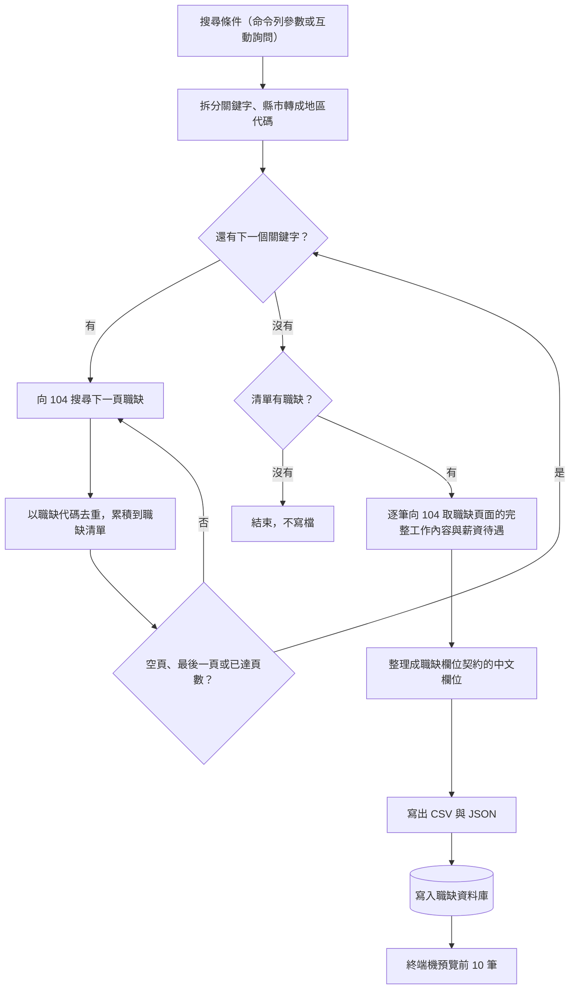

# 104 職缺爬蟲

- ID：104-job-scraper
- 狀態：✅ 已完成
- 依賴：job-database（依其[職缺欄位契約](job-database.md#821-職缺欄位契約)整理欄位，並依其[寫入規則](job-database.md#421-寫入規則)寫入資料庫）

## 1. 背景與目標

在 104 人力銀行網站上找職缺的問題：

- 手動複製職缺很耗時
- 搜尋結果只提供截斷的工作描述

本功能依關鍵字與地區批量抓取 104 職缺，產出結構化資料，並存進職缺資料庫，作為下游的輸入（UP-01）。

## 2. 範圍

範圍內（實作時只做這些）：

- 使用者故事，一個故事一章，細節見各章的「需求」：
  - [一次搜尋多個關鍵字與縣市，拿到不重複的職缺](#4-一次搜尋多個關鍵字與縣市拿到不重複的職缺search)（`search`）：✅
  - [每筆職缺都有完整的工作內容](#5-每筆職缺都有完整的工作內容detail)（`detail`）：✅
  - [用 Excel 或程式開啟結果](#6-用-excel-或程式開啟結果output)（`output`）：✅
  - [抓完的職缺自動存進職缺資料庫](#7-抓完的職缺自動存進職缺資料庫store)（`store`）：✅
  - [把過去抓好的 JSON 匯進來](#8-把過去抓好的-json-匯進來import)（`import`）：✅
- [§9 非功能需求](#9-非功能需求)：請求頻率限制、取不到職缺頁面內容時不回填
- [§10 共用規則](#10-共用規則)：CLI 參數

範圍外（實作時不要做）：

- 其他求職平台：另開一個功能
- 職缺資料庫的寫入規則、保存的資訊與資料庫路徑：屬 [job-database](job-database.md)，本功能只提供職缺與這次寫入的條件
- 跨次執行的去重：去重只在單次執行內，跨次去重屬 [job-database](job-database.md)

## 3. 輸入與輸出

- 輸入：
  - 使用者給的搜尋條件（關鍵字、縣市、頁數、職缺性質，見 [§10.2.1](#1021-cli)）
  - 104 的搜尋結果與每筆職缺頁面的內容（請求規則見 [§4.2.2](#422-請求與失敗處理)）
  - 過去抓好的 JSON（匯入時，見 [§8](#8-把過去抓好的-json-匯進來import)）
- 輸出：
  - `output/104/` 下同名的 CSV 與 JSON（見 [§6.2.1](#621-輸出檔)），欄位依 [job-database 的職缺欄位契約](job-database.md#821-職缺欄位契約)。
    - JSON：給下游讀取，也是本功能匯入資料庫的輸入。
    - CSV：供人用 Excel 瀏覽。
    - 職缺欄位契約是對下游的資料契約：下游需要完整的工作內容與固定的欄位結構。
  - 寫進職缺資料庫的職缺與這次的抓取條件（見 [§7](#7-抓完的職缺自動存進職缺資料庫store)）。

## 4. 一次搜尋多個關鍵字與縣市，拿到不重複的職缺（search）

身為求職者，我想要輸入多個關鍵字與縣市，一次取得不重複的職缺清單，以便不必逐頁瀏覽 104。

### 4.1 需求

- FR-search-keyword：多個關鍵字可用半形或全形逗號分隔，逐一搜尋。
  - 重複的關鍵字只搜尋一次，保留首次出現的順序。
- FR-search-area：縣市名稱可精準或模糊比對（如 `台北`）到 104 地區代碼。
  - 無法辨識或未填時搜尋全台灣。
- FR-search-dedup：單次執行內，以 `職缺代碼` 去重，輸出中每筆職缺唯一。
- FR-search-request：單一請求失敗或逾時，不中斷整次抓取，規則見 [§4.2.2](#422-請求與失敗處理)。
  - 請求之間的延遲見 [§9](#9-非功能需求)。

### 4.2 規則

#### 4.2.1 流程



- 搜尋條件：
  - 有帶關鍵字參數時直接執行，沒帶時逐步詢問關鍵字、縣市、頁數與職缺性質（見 [§10.2.1](#1021-cli)）。
  - 兩種方式拆分關鍵字與比對縣市的規則相同（見 [§4.2.3](#423-地區與去重)）。
- 搜尋回傳空頁時，不再往下翻，改搜下一個關鍵字。請求之間的延遲見 [§9](#9-非功能需求)。
- 所有關鍵字都搜完、去重之後，才逐筆取職缺頁面的內容，同一筆職缺不會重複請求（見 [§5](#5-每筆職缺都有完整的工作內容detail)）。
- 輸出檔見 [§6](#6-用-excel-或程式開啟結果output)，寫入資料庫見 [§7](#7-抓完的職缺自動存進職缺資料庫store)。

#### 4.2.2 請求與失敗處理

- 每個請求都有等待上限，逾時視為失敗。
- 某一頁搜尋失敗時，視為空頁：不再往下翻，改搜下一個關鍵字，程式不中斷。
- 取職缺頁面內容失敗時的處理見 [§5.2](#52-規則)。

#### 4.2.3 地區與去重

- 縣市名稱依內建的 22 個縣市清單比對：
  1. 先找完全相同的名稱。
  2. 找不到再找「輸入是縣市名的子字串，或縣市名是輸入的子字串」的第一筆。
- 這個比對規則的結果：
  - `新竹` 會對到清單中先出現的新竹市，要找新竹縣必須寫全名。
  - `臺北`（異體字）比對不到，會退回全台灣。
- 去重以 `職缺代碼` 為準，保留第一次出現的那筆：
  - 同一個關鍵字的不同分頁、不同關鍵字之間都會去重。
  - 只在單次執行內去重，跨次去重屬 job-database。

### 4.3 驗收

#### AC-search-keyword：關鍵字拆分

- Given：關鍵字字串混用半形、全形逗號與空白，或含重複的關鍵字
- When：拆分關鍵字
- Then：得到去除空白、不重複且保留原順序的關鍵字列表
- 通過條件：全部符合。

#### AC-search-area：地區解析

- Given：輸入精準名稱、模糊名稱、無法辨識的名稱與空值
- When：把縣市名稱轉成地區代碼
- Then：
  - 精準與模糊名稱得到正確代碼（`新竹` 對應新竹市）
  - 無法辨識的名稱與空值都搜尋全台灣
- 通過條件：全部符合。

#### AC-search-dedup：去重與分頁

- Given：不實際連線到 104，以固定的搜尋結果代替，兩個關鍵字的結果有重疊
- When：執行抓取
- Then：
  - 輸出中每筆職缺唯一
  - 到達最後一頁、遇到空頁或達到指定頁數時停止翻頁
- 通過條件：全部符合。

#### AC-search-request：請求與錯誤處理

- Given：不實際連線到 104，記錄每個送出的請求
- When：搜尋職缺、取職缺頁面內容，並讓 104 分別回應錯誤與網路中斷
- Then：
  - 每個請求都有等待上限
  - 104 回應錯誤或網路中斷時視為沒有結果，程式不中斷
- 通過條件：全部符合。

#### AC-search-real：實際抓取與輸出 〔需網路〕

- Given：可以連線到 104
- When：以兩個搜尋結果會重疊的關鍵字（`Python`、`Python工程師`）、1 頁、台北市執行抓取，輸出寫到測試用的目錄
- Then：
  - 職缺代碼不重複，而且少於兩個關鍵字抓到的原始筆數（代表跨關鍵字去重有生效）
  - CSV 以 BOM 開頭且表頭一致
  - 至少一筆有完整的工作內容
- 通過條件：全部符合。

## 5. 每筆職缺都有完整的工作內容（detail）

身為求職者，我想要每筆職缺都有完整的工作內容與薪資待遇，以便不必逐筆點開 104 的頁面，下游也能拿到完整的描述。

### 5.1 需求

- FR-detail：對每筆職缺另外取得職缺頁面上完整的「工作內容」與「薪資待遇」。
  - 取不到時兩欄為 `null`，不以搜尋摘要回填。

### 5.2 規則

- 104 搜尋結果中的工作描述只是截斷的摘要，所以每筆職缺都要另外取職缺頁面的內容。
- 下列兩種情況，`薪資待遇` 與 `工作內容` 都為 `null`：
  - 取職缺頁面內容失敗。
  - 職缺連結中找不到職缺頁面的代碼，不發出請求。
- 不用搜尋摘要回填：那只是截斷的摘要，回填會讓下游的 AI 收到看似完整、其實殘缺的資料。

### 5.3 驗收

#### AC-detail：欄位解析與取不到內容時不回填

- Given：
  - 含搜尋摘要的職缺
  - 取職缺頁面內容分別成功、失敗，以及職缺連結中沒有職缺頁面的代碼
- When：把職缺整理成職缺欄位契約的欄位
- Then：
  - 成功時填入完整的工作內容與薪資待遇
  - 失敗時兩欄為 `null`，不以搜尋摘要回填
  - 欄位順序等於[職缺欄位契約](job-database.md#821-職缺欄位契約)
- 通過條件：全部符合。

## 6. 用 Excel 或程式開啟結果（output）

身為求職者，我想要用 Excel 直接開啟結果，以便快速瀏覽與篩選；同一份結果也要有 JSON，交給程式或 AI 做後續分析。

### 6.1 需求

- FR-output-files：輸出 CSV（`utf-8-sig` 編碼）與 JSON（UTF-8）到 `output/104/`。
  - 欄位順序固定依[職缺欄位契約](job-database.md#821-職缺欄位契約)。
- FR-output-format：欄位格式正規化：
  - 日期欄位由 `YYYYMMDD` 轉為 `YYYY-MM-DD`。
  - 職缺與公司連結轉為完整 `https://` URL。

### 6.2 規則

#### 6.2.1 輸出檔

- 輸出目錄是專案根目錄的 `output/104/`：
  - 不論在哪個目錄執行都相同。
  - 不存在時自動建立。
  - 不進版控。
- 檔名是 `jobs_104_<關鍵字>_<YYYYMMDD_HHMMSS>.csv` 與 `.json`。`<關鍵字>` 的產生規則：
  - 多個關鍵字以 `_` 連接，超過 30 字元就截斷並加上 `_etc`。
  - 只保留文字與數字（含中文）以及 `-`、`_`，例如 `jobs_104_後端工程師_…`。
  - 結果為空時用 `all`。
- CSV 用 `utf-8-sig` 編碼，開頭的 BOM 讓 Excel 把檔案當成 UTF-8，中文才不會亂碼。

### 6.3 驗收

#### AC-output-files：輸出檔

- Given：不實際連線到 104，以固定的搜尋結果代替
- When：執行抓取並寫出檔案
- Then：
  - 產生同名的 CSV（以 BOM 開頭、表頭等於職缺欄位契約的欄位）與 JSON
  - 檔名依 [§6.2.1](#621-輸出檔) 的規則產生
  - 沒有抓到職缺時不寫檔
- 通過條件：全部符合。

#### AC-output-format：欄位格式正規化

- Given：`YYYYMMDD` 格式的日期、以 `//` 開頭的連結，以及空值
- When：正規化這些欄位
- Then：
  - 日期轉成 `YYYY-MM-DD`
  - 連結轉成完整的 `https://` URL
  - 空值轉成空字串
- 通過條件：全部符合。

## 7. 抓完的職缺自動存進職缺資料庫（store）

身為求職者，我想要抓完的職缺自動存進職缺資料庫，以便不必自己管理一堆輸出檔，也能看出哪些職缺是最近才出現的。

### 7.1 需求

- FR-store-write：寫出 CSV／JSON 後，預設把這次抓到的職缺寫進職缺資料庫。
  - 去重、出現時間與保存的資訊依 [job-database](job-database.md#4-累積寫進來的職缺看出哪些是新的save)。
  - 同時記錄這次抓取的條件，依 [§7.2.2](#722-記錄的抓取條件)。
- FR-store-path：`--db` 指定資料庫路徑，`--no-db` 略過寫入，參數見 [§10.2.1](#1021-cli)。

### 7.2 規則

#### 7.2.1 寫入時機與失敗處理

- 互動模式一律寫入預設的資料庫。
- 寫入資料庫失敗時，顯示以 `[-]` 開頭的錯誤訊息，不中斷程式，因為 CSV／JSON 已經寫出。

#### 7.2.2 記錄的抓取條件

執行紀錄的欄位見 [job-database §8.2.2](job-database.md#822-保存的資訊)，本功能寫入時填入的值與額外記錄的條件欄位：

- `執行時間`：寫出 CSV／JSON 時的時間，與檔名中的時間戳相同
- `來源`：`爬蟲`
- `關鍵字`：去重後的關鍵字，以 `, ` 合併
- `地區`：縣市名稱，全台灣時為 `全台灣`
- `職缺性質`：`0`／`1`／`2`，意義同 [§10.2.1](#1021-cli)
- `頁數`：每個關鍵字抓幾頁

### 7.3 驗收

#### AC-store：爬蟲寫入資料庫

- Given：不實際連線到 104，以固定的搜尋結果代替
- When：分別以 `--db <測試用路徑>`、`--db <測試用路徑> --no-db` 執行抓取
- Then：
  - 只有 `--db`：資料庫中有這次抓到的職缺，並有一筆 `來源` 為 `爬蟲` 的執行紀錄，條件是這次的關鍵字、地區、職缺性質與頁數
  - 加上 `--no-db`：不建立資料庫檔
  - 兩者都照常產生 CSV／JSON
- 通過條件：全部符合。

## 8. 把過去抓好的 JSON 匯進來（import）

身為求職者，我想要把過去已經抓好的 JSON 也匯進職缺資料庫，以便歷史資料不會斷掉。

### 8.1 需求

- FR-import：提供 `src/import_jobs.py`，可一次匯入一或多個本功能輸出的 JSON。
  - 同一個檔案重複匯入時略過，資料庫內容不變。

### 8.2 規則

- 去重與出現時間沿用 [job-database 的寫入規則](job-database.md#421-寫入規則)。
- 每個檔案是一次寫入，各自全部寫入或完全不寫入。

#### 8.2.1 匯入既有 JSON

- 每個檔案依序檢查：檔名時間 → 是否已匯入 → 檔案內容。
  - 已匯入的檔案不會再讀取內容。
- `執行時間` 取自檔名結尾的 `_<YYYYMMDD_HHMMSS>.json`（命名規則見 [§6.2.1](#621-輸出檔)）。
- 以下情況顯示 `[!]` 後略過該檔，繼續處理下一個檔案：
  - 檔名解析不出時間
  - 檔案不是合法的職缺 JSON：
    - 讀不到
    - 不是 JSON
    - 不是非空的陣列
    - 有元素不是物件
    - `職缺代碼` 不是非空字串
  - 寫入資料庫失敗（該檔完全不寫入）
- 已匯入過同名的檔案時，顯示 `[i]` 並略過，所以重複匯入不會改變資料庫。
- 記錄的值與條件（欄位見 [job-database §8.2.2](job-database.md#822-保存的資訊)）：
  - `來源`：`匯入`
  - `來源檔`：匯入的 JSON 檔名（不含目錄），同一個檔名只會出現一次
  - `關鍵字`、`地區`、`職缺性質`、`頁數` 都是 `null`，因為檔名中的關鍵字已經過清理與截斷，其餘條件檔案裡也沒有
- 抓取時寫入資料庫不記錄 `來源檔`。之後再匯入同一個 JSON：
  - 會被當成另一次寫入，多一筆執行紀錄。
  - 職缺資料不變：兩者的執行時間相同、職缺內容也相同，依 [job-database 的寫入規則](job-database.md#421-寫入規則)不會改變。

#### 8.2.2 匯入 CLI

```bash
uv run src/import_jobs.py output/104/*.json [--db data/jobs.db]
```

- 正常結束：至少一個檔案匯入成功，或全部都因為已匯入而略過。
- 顯示 `[-]` 並以錯誤結束：沒有指定檔案、無法開啟資料庫，或所有檔案都因為錯誤而被略過。

### 8.3 驗收

#### AC-import：匯入既有 JSON

- Given：下列 JSON：
  - 兩個檔名符合命名規則
  - 一個檔名沒有時間
  - 一個內容格式錯誤
- When：匯入全部檔案，再匯入一次
- Then：
  - 第一次：
    - 兩個合法檔案寫入，首次與最後出現時間取自檔名
    - 另兩個檔案顯示 `[!]` 並略過
    - 正常結束
  - 第二次：
    - 兩個合法檔案顯示 `[i]` 並略過，另兩個檔案仍顯示 `[!]`
    - 資料庫內容與第一次相同
    - 正常結束
  - 只指定錯誤的檔案或沒有指定檔案時，以錯誤結束
- 通過條件：全部符合。

## 9. 非功能需求

### 9.1 需求

- NFR-rate：請求之間要延遲，避免對 104 造成負擔（見 [非目標](../overview.md#非目標)）：
  - 分頁間 1.0–2.0 秒。
  - 關鍵字間 2.0–3.5 秒。
  - 取職缺頁面內容前 0.1–0.3 秒。
- NFR-null：取不到職缺頁面內容時缺值為 `null`，不以其他來源回填（依 [development.md](../../conventions/development.md#防禦性設計)，見 [§5](#5-每筆職缺都有完整的工作內容detail)）。

### 9.2 規則

- 取職缺頁面內容前不加延遲會被 104 拒絕。
- 延遲都取隨機區間，讓請求分散，不集中在固定間隔送出。

### 9.3 驗收

#### AC-nfr-rate：請求頻率限制

- Given：不實際連線到 104，也不實際等待，記錄每次延遲的秒數
- When：執行抓取，並取職缺頁面的內容
- Then：分頁間、關鍵字間、取職缺頁面內容前的延遲都在規定範圍內
- 通過條件：全部符合。

NFR-null 由 [AC-detail](#ac-detail欄位解析與取不到內容時不回填) 涵蓋（取不到時兩欄為 `null`），不另外寫。

## 10. 共用規則

跨越各章的規則：抓取 CLI 的參數。匯入 CLI 只有 [§8](#8-把過去抓好的-json-匯進來import) 用到，寫在該章。

### 10.1 需求

- FR-cli：支援以 `-k/--keyword`、`-p/--pages`、`-a/--area`、`-t/--type`、`--db`、`--no-db` 參數執行，參數依 [§10.2.1](#1021-cli)。
  - 未帶 `--keyword` 時進入互動引導模式。
  - 使用者按下 Ctrl+C 時印出取消訊息並正常結束。

### 10.2 規則

#### 10.2.1 CLI

```bash
uv run src/fetch_104_jobs.py                                    # 互動模式
uv run src/fetch_104_jobs.py -k "關鍵字1,關鍵字2" -p 頁數 -a 縣市 -t 性質
```

- `-k`, `--keyword`：搜尋關鍵字，多個用半形或全形逗號分隔
  - 有帶這個參數才會走 CLI 模式
- `-p`, `--pages`：每個關鍵字抓幾頁，每頁 30 筆，預設 `3`
- `-a`, `--area`：縣市名稱（比對規則見 [§4.2.3](#423-地區與去重)）
  - 不填代表全台灣
- `-t`, `--type`：職缺性質
  - `0`：全部（預設）
  - `1`：全職
  - `2`：兼職／工讀
- `--db`：職缺資料庫路徑，預設為專案根目錄的 `data/jobs.db`
- `--no-db`：只輸出 CSV／JSON，不寫入資料庫

### 10.3 驗收

#### AC-cli：CLI 與互動模式

- Given：不實際抓取，記錄收到的搜尋條件
- When：以不同參數執行，以及不帶參數並回答互動模式的問題
- Then：
  - 有帶 `--keyword` 時使用 CLI 模式，沒帶時進入互動模式
  - 參數的預設值符合 [§10.2.1](#1021-cli)
- 通過條件：全部符合。

#### AC-cli-interrupt：Ctrl+C 優雅退出

- Given：程式處於互動模式等待輸入
- When：按下 Ctrl+C
- Then：印出取消訊息，正常結束
- 通過條件：全部符合。

## 11. 待決問題

無。
