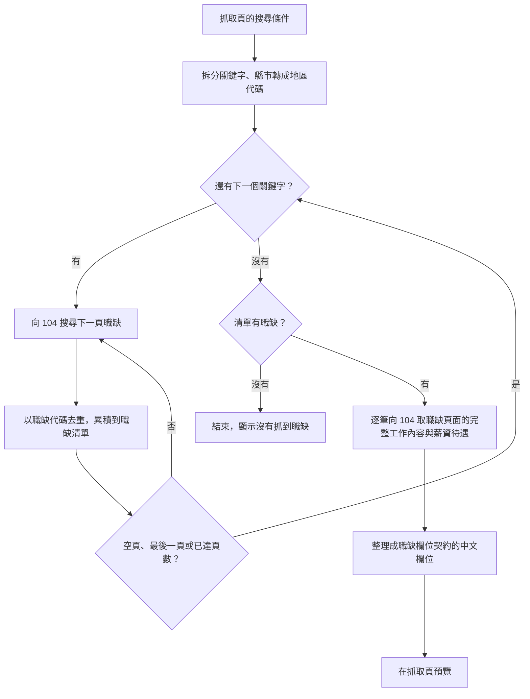

# 104 職缺爬蟲

- ID：104-job-scraper
- 狀態：待實作
- 依賴：job-database（依其[職缺欄位契約](job-database.md#821-職缺欄位契約)整理欄位，並依其[寫入規則](job-database.md#421-寫入規則)寫入資料庫；預覽沿用其[職缺表](job-database.md#5-在職缺表瀏覽篩選累積下來的職缺query)的操作，存入後用它[只看剛存入的職缺](job-database.md#6-只看剛存入的職缺just-saved)）

## 1. 背景與目標

在 104 人力銀行網站上找職缺的問題：

- 手動複製職缺很耗時
- 搜尋結果只提供截斷的工作描述

本功能在抓取頁依關鍵字與縣市批量抓取 104 職缺，整理成結構化資料，預覽後存進職缺資料庫，作為下游的輸入（UP-01）。

## 2. 範圍

範圍內（實作時只做這些）：

- 使用者故事，一個故事一章，細節見各章的「需求」：
  - [一次搜尋多個關鍵字與縣市，拿到不重複的職缺](#4-一次搜尋多個關鍵字與縣市拿到不重複的職缺search)（`search`）：✅，在抓取頁填條件、進度與停止〔規劃中〕
  - [每筆職缺都有完整的工作內容](#5-每筆職缺都有完整的工作內容detail)（`detail`）：✅
  - [預覽抓到的職缺，再決定要不要存進職缺資料庫](#6-預覽抓到的職缺再決定要不要存進職缺資料庫store)（`store`）：〔規劃中〕
- [§7 非功能需求](#7-非功能需求)：請求頻率限制、取不到職缺頁面內容時不回填
- [§8 共用規則](#8-共用規則)：作業

範圍外（實作時不要做）：

- 其他求職平台：另開一個功能
- 職缺資料庫的寫入規則、保存的資訊與資料庫路徑：屬 [job-database](job-database.md)，本功能只提供職缺與這次寫入的條件
- 跨次抓取的去重：去重只在單次抓取內，跨次去重屬 [job-database](job-database.md)
- 只存入預覽中的其中幾筆：整批存入或捨棄，理由見 [§6.2.2](#622-整批存入或捨棄)
- 把抓到的職缺輸出成 CSV 或 JSON 檔：瀏覽與篩選在職缺表上做，資料由職缺資料庫保存，改版時也不靠檔案重新匯入（見 [job-database 的 NFR-migration](job-database.md#71-需求)）

## 3. 輸入與輸出

- 輸入：
  - 使用者在抓取頁填的搜尋條件（關鍵字、縣市、頁數、職缺性質，見 [§4.2.2](#422-搜尋條件)）
  - 104 的搜尋結果與每筆職缺頁面的內容（請求規則見 [§4.2.3](#423-請求與失敗處理)）
- 輸出：
  - 抓取頁上這次抓到的職缺的預覽（見 [§6](#6-預覽抓到的職缺再決定要不要存進職缺資料庫store)），欄位依 [job-database 的職缺欄位契約](job-database.md#821-職缺欄位契約)。
    - 職缺欄位契約是對下游的資料契約：下游需要完整的工作內容與固定的欄位結構。
  - 使用者存入時，寫進職缺資料庫的職缺與這次的抓取條件（見 [§6.2.3](#623-記錄的抓取條件)）。

## 4. 一次搜尋多個關鍵字與縣市，拿到不重複的職缺（search）

身為求職者，我想要輸入多個關鍵字與縣市，一次取得不重複的職缺清單，以便不必逐頁瀏覽 104。

### 4.1 需求

- FR-search-form：〔規劃中〕在抓取頁的表單填搜尋條件後開始抓取，欄位見 [§4.2.2](#422-搜尋條件)。
  - 記住上次用的條件，下次打開抓取頁時沿用。
- FR-search-keyword：多個關鍵字可用半形或全形逗號分隔，逐一搜尋。
  - 重複的關鍵字只搜尋一次，保留首次出現的順序。
- FR-search-area：〔規劃中〕縣市從清單單選，轉成 104 的地區代碼；不選時搜尋全台灣。
- FR-search-dedup：單次抓取內，以 `職缺代碼` 去重，抓到的每筆職缺唯一。
- FR-search-request：單一請求失敗或逾時，不中斷整次抓取，規則見 [§4.2.3](#423-請求與失敗處理)。
  - 請求之間的延遲見 [§7](#7-非功能需求)。
- FR-search-progress：〔規劃中〕抓取中顯示進度，內容見 [§4.2.5](#425-抓取中與停止)。
- FR-search-stop：〔規劃中〕抓取中可以停止：不再發出新的請求，已經取完內容的職缺進入預覽，規則見 [§4.2.5](#425-抓取中與停止)。

### 4.2 規則

#### 4.2.1 流程

〔規劃中〕流程從抓取頁的搜尋條件開始，抓完後在抓取頁預覽；存入見 [§6](#6-預覽抓到的職缺再決定要不要存進職缺資料庫store)。

- 搜尋回傳空頁時，不再往下翻，改搜下一個關鍵字。請求之間的延遲見 [§7](#7-非功能需求)。
- 所有關鍵字都搜完、去重之後，才逐筆取職缺頁面的內容，同一筆職缺不會重複請求（見 [§5](#5-每筆職缺都有完整的工作內容detail)）。

#### 4.2.2 搜尋條件

〔規劃中〕

抓取頁的表單：

- 關鍵字：多個用半形或全形逗號分隔，拆分規則見 FR-search-keyword。
  - 至少要有一個關鍵字；只有空白或逗號時不能開始抓取，並說明原因。
- 縣市：從 22 個縣市單選，不選代表全台灣。
- 頁數：每個關鍵字抓幾頁，每頁 30 筆，正整數，預設 `3`。
- 職缺性質：
  - `0`：全部（預設）
  - `1`：全職
  - `2`：兼職／工讀

記住上次用的條件：

- 開始抓取時，把這次的條件記在瀏覽器。
- 記不住時（例如瀏覽器不允許保存），或記著的值已經不合法時，該欄退回預設，不是錯誤。

#### 4.2.3 請求與失敗處理

- 每個請求都有等待上限，逾時視為失敗。
- 某一頁搜尋失敗時，視為空頁：不再往下翻，改搜下一個關鍵字，抓取不中斷。
- 取職缺頁面內容失敗時的處理見 [§5.2](#52-規則)。

#### 4.2.4 去重

- 去重以 `職缺代碼` 為準，保留第一次出現的那筆：
  - 同一個關鍵字的不同分頁、不同關鍵字之間都會去重。
  - 只在單次抓取內去重，跨次去重屬 job-database。

#### 4.2.5 抓取中與停止

〔規劃中〕

- 抓取中顯示進度：
  - 搜尋時：搜尋到哪個關鍵字的第幾頁，已找到幾筆不重複的職缺。
  - 取職缺頁面內容時：取到第幾筆、共幾筆。
- 職缺不逐筆出現，抓完或停止後一次列在預覽（見 [§6](#6-預覽抓到的職缺再決定要不要存進職缺資料庫store)）。
- 停止：不再發出新的請求，已經送出的請求照常完成。
  - 取完內容的職缺進入預覽。
  - 還沒取內容的職缺不列出：它們沒有完整的工作內容與薪資待遇，列出來就違反 [§5](#5-每筆職缺都有完整的工作內容detail)。
- 沒有抓到職缺，或停止時還沒有取完內容的職缺：說明原因，沒有預覽。
- 抓取是在伺服器上跑的作業，重新整理或關掉瀏覽器時的行為見 [§8.2.1](#821-作業)。

### 4.3 驗收

#### AC-search-form：搜尋條件的表單

〔規劃中〕

- Given：打開抓取頁
- When：
  - (a) 關鍵字只填逗號與空白，按「開始抓取」
  - (b) 關鍵字填 `Python, 資料工程師`、縣市選台中市、頁數填 `2`、職缺性質選全職，開始抓取；抓完後重新打開抓取頁
  - (c) 瀏覽器不允許保存時打開抓取頁
- Then：
  - (a) 不開始抓取，說明至少要有一個關鍵字
  - (b) 以這組條件向 104 搜尋；重新打開時，表單是上次的條件
  - (c) 表單是預設：沒有關鍵字、全台灣、`3` 頁、全部
- 通過條件：全部符合。

#### AC-search-keyword：關鍵字拆分

- Given：關鍵字字串混用半形、全形逗號與空白，或含重複的關鍵字
- When：拆分關鍵字
- Then：得到去除空白、不重複且保留原順序的關鍵字列表
- 通過條件：全部符合。

#### AC-search-area：縣市

〔規劃中〕

- Given：抓取頁的縣市清單
- When：
  - (a) 選新竹縣後開始抓取
  - (b) 不選縣市就開始抓取
- Then：
  - 清單列出 22 個縣市
  - (a) 以新竹縣的地區代碼搜尋
  - (b) 搜尋全台灣
- 通過條件：全部符合。

#### AC-search-dedup：去重與分頁

- Given：
  - 兩個關鍵字在 104 的搜尋結果有重疊
  - 一個關鍵字在指定頁數內就到了最後一頁，另一個在中途遇到空頁
- When：執行抓取
- Then：
  - 抓到的每筆職缺唯一
  - 到達最後一頁、遇到空頁或達到指定頁數時停止翻頁
- 通過條件：全部符合。

#### AC-search-request：請求與錯誤處理

- Given：104 對部分搜尋與取職缺頁面內容的請求回應錯誤、網路中斷，或一直不回應
- When：執行抓取
- Then：
  - 一直不回應的請求，到等待上限後視為失敗
  - 失敗的請求都視為沒有結果：搜尋的那一頁當成空頁，取職缺頁面內容失敗照 [§5.2](#52-規則) 處理
  - 抓取不中斷
- 通過條件：全部符合。

#### AC-search-run：抓取中與停止

〔規劃中〕

- Given：以 2 個關鍵字、每個關鍵字 2 頁開始抓取
- When：
  - (a) 在搜尋時與取職缺頁面內容時各看一次抓取頁
  - (b) 取第 5 筆職缺的內容時按「停止」
  - (c) 搜尋第 1 頁時按「停止」
  - (d) 兩個關鍵字在 104 都搜不到職缺
  - 每個情境都從同一個 Given 開始，不接續前一個情境的結果
- Then：
  - (a) 搜尋時顯示關鍵字、第幾頁與已找到幾筆；取內容時顯示第幾筆、共幾筆；兩個時候預覽都還沒有列出職缺
  - (b) 第 5 筆取完後不再發出請求，預覽只列出取完內容的 5 筆
  - (c) 沒有預覽，說明還沒有取完內容的職缺
  - (d) 沒有預覽，說明沒有抓到職缺
- 通過條件：全部符合。

## 5. 每筆職缺都有完整的工作內容（detail）

身為求職者，我想要每筆職缺都有完整的工作內容與薪資待遇，以便不必逐筆點開 104 的頁面，下游也能拿到完整的描述。

### 5.1 需求

- FR-detail：對每筆職缺另外取得職缺頁面上完整的「工作內容」與「薪資待遇」。
  - 取不到時兩欄為 `null`，不以搜尋摘要回填。
- FR-detail-format：欄位格式正規化成[職缺欄位契約](job-database.md#821-職缺欄位契約)的格式：
  - 日期欄位由 `YYYYMMDD` 轉為 `YYYY-MM-DD`。
  - 職缺與公司連結轉為完整 `https://` URL。

### 5.2 規則

- 104 搜尋結果中的工作描述只是截斷的摘要，所以每筆職缺都要另外取職缺頁面的內容。
- 下列兩種情況，`薪資待遇` 與 `工作內容` 都為 `null`：
  - 取職缺頁面內容失敗。
  - 職缺連結中找不到職缺頁面的代碼，不發出請求。
- 不用搜尋摘要回填：那只是截斷的摘要，回填會讓下游的 AI 收到看似完整、其實殘缺的資料。

### 5.3 驗收

#### AC-detail：欄位解析與取不到內容時不回填

- Given：
  - 含搜尋摘要的職缺
  - 取職缺頁面內容分別成功、失敗，以及職缺連結中沒有職缺頁面的代碼
- When：把職缺整理成職缺欄位契約的欄位
- Then：
  - 成功時填入完整的工作內容與薪資待遇
  - 失敗時兩欄為 `null`，不以搜尋摘要回填
  - 欄位順序等於[職缺欄位契約](job-database.md#821-職缺欄位契約)
- 通過條件：全部符合。

#### AC-detail-format：欄位格式正規化

- Given：`YYYYMMDD` 格式的日期、以 `//` 開頭的連結，以及空值
- When：正規化這些欄位
- Then：
  - 日期轉成 `YYYY-MM-DD`
  - 連結轉成完整的 `https://` URL
  - 空值轉成空字串
- 通過條件：全部符合。

## 6. 預覽抓到的職缺，再決定要不要存進職缺資料庫（store）

〔規劃中〕本章整章改寫，尚未實作。

身為求職者，我想要先看過這次抓到的職缺，再決定要不要存進職缺資料庫，以便搜尋條件下錯或只是想先看看時，不會把不要的職缺混進累積下來的資料。

### 6.1 需求

- FR-store-preview：抓完或停止後，這次抓到的職缺一次列在抓取頁預覽，規則見 [§6.2.1](#621-預覽)。
  - 標出資料庫裡還沒有的職缺，並顯示這次抓到幾筆、其中幾筆資料庫裡還沒有。
- FR-store-save：預覽後整批存入或整批捨棄，不能只存入其中幾筆，規則見 [§6.2.2](#622-整批存入或捨棄)。
  - 存入時把這次的職缺寫進職缺資料庫，去重、出現時間與保存的資訊依 [job-database](job-database.md#4-累積寫進來的職缺看出哪些是新的save)。
  - 同時記錄這次抓取的條件，依 [§6.2.3](#623-記錄的抓取條件)。
- FR-store-failure：存入失敗時顯示原因，預覽留著，可以再存入一次。
- FR-store-jump：存入後帶著這次存入的職缺代碼清單打開職缺表，只列出剛存入的職缺（見 [job-database §6](job-database.md#6-只看剛存入的職缺just-saved)）。
- FR-store-keep：沒存入的抓取結果留到存入、捨棄或重新抓取為止，規則見 [§6.2.4](#624-沒存入的抓取結果)。

### 6.2 規則

#### 6.2.1 預覽

- 只顯示[職缺欄位契約](job-database.md#821-職缺欄位契約)的欄位：`首次出現時間`、`最後出現時間` 是存入時才決定的，預覽不顯示。
- 資料庫裡還沒有這個職缺代碼的職缺，在列上標「新」。
- 選欄位、排序與展開一列的操作和職缺表相同（見 [job-database §5.2](job-database.md#52-規則)），差別是：
  - 可以選的欄位只有職缺欄位契約的欄位。
  - 預設顯示：`職缺名稱`、`公司名稱`、`地區`、`薪資待遇`、`更新日期`。
  - 預設依 `職缺名稱` 由小到大排序。
  - 展開的內容沒有出現時間。
- 選好的欄位與排序另外記在瀏覽器，和職缺表各記各的；記不住時退回預設，不是錯誤。

#### 6.2.2 整批存入或捨棄

- 想擋掉的情況有三種：搜尋條件下錯整批不要、一批裡混了無關職缺、只是想先看看抓到什麼。
- 整批處理的規則單純：每次寫入出現的職缺就是這次抓到的全部職缺，不會有看到了卻沒記的。
- 取捨：捨棄的職缺不會留在職缺資料庫，之後查不到，也無法回頭確認是不是捨棄錯了。
- 存入或捨棄後，預覽清空。捨棄時職缺資料庫不變。
- 存入時照 job-database 的規則一次寫入，要嘛全部寫入，要嘛完全不寫入；存入失敗時資料庫不變，預覽照舊，可以再存入一次。

#### 6.2.3 記錄的抓取條件

執行紀錄的欄位見 [job-database §8.2.2](job-database.md#822-保存的資訊)，本功能寫入時填入的值與額外記錄的條件欄位：

- `執行時間`：抓完或停止的時間，也就是實際看到這些職缺的時候，不用按下存入的時間
- `來源`：`爬蟲`
- `關鍵字`：去重後的關鍵字，以 `, ` 合併
- `地區`：縣市名稱，全台灣時為 `全台灣`
- `職缺性質`：`0`／`1`／`2`，意義同 [§4.2.2](#422-搜尋條件)
- `頁數`：每個關鍵字要求抓幾頁
  - 中途停止時仍記要求的頁數。

#### 6.2.4 沒存入的抓取結果

- 留在伺服器，直到存入、捨棄或重新抓取：重新整理、切到別的分頁或關掉瀏覽器後，回到抓取頁仍看得到預覽；web app 關閉才會消失。
- 還有沒存入的結果時開始抓取，先確認會捨棄這次的結果：
  - 確認後捨棄，再開始抓取。
  - 取消時不抓取，預覽照舊。

### 6.3 驗收

#### AC-store-preview：預覽

- Given：資料庫已有職缺 A，這次抓到 A、B、C
- When：
  - (a) 抓完後看抓取頁
  - (b) 在預覽改選欄位與排序，展開 B
  - (c) 打開職缺表，再回到抓取頁
- Then：
  - (a) 預覽列出 A、B、C，B、C 標「新」，顯示抓到 3 筆、其中 2 筆資料庫裡還沒有
  - (a) 預覽的欄位與排序是 [§6.2.1](#621-預覽) 的預設；可以選的欄位只有職缺欄位契約的欄位
  - (a) 職缺資料庫裡還沒有 B、C
  - (b) 展開 B 顯示完整的職缺欄位、工作內容與連結，沒有出現時間
  - (c) 職缺表的欄位與排序沒有跟著改；回到抓取頁時，預覽沿用 (b) 改過的欄位與排序
- 通過條件：全部符合。

#### AC-store-save：整批存入或捨棄

- Given：
  - 資料庫已有職缺 A
  - 以關鍵字 `Python`、台北市、每個關鍵字 3 頁、全職抓到 A、B，抓完的時間是 T
- When：
  - (a) 過一段時間後按「存入」
  - (b) 按「捨棄」
  - 每個情境都從同一個 Given 開始，不接續前一個情境的結果
- Then：
  - (a) 資料庫有 A、B，兩筆的最後出現時間都是 T，B 的首次出現時間是 T
  - (a) 多一筆執行紀錄：`執行時間` 是 T、`來源` 是 `爬蟲`、`關鍵字` 是 `Python`、`地區` 是 `台北市`、`職缺性質` 是 `1`、`頁數` 是 `3`
  - (a) 跳到職缺表，只列出 A、B，顯示「剛存入的 2 筆」；抓取頁的預覽清空
  - (b) 資料庫不變，抓取頁的預覽清空
- 通過條件：全部符合。

#### AC-store-stopped：停止後存入

- Given：以每個關鍵字 3 頁開始抓取，取職缺頁面內容時在時間 T 按「停止」，預覽列出取完內容的職缺
- When：過一段時間後按「存入」
- Then：
  - 寫入的是預覽列出的職缺
  - 執行紀錄的 `執行時間` 是 T，`頁數` 是 `3`
- 通過條件：全部符合。

#### AC-store-failure：存入失敗

- Given：預覽中有職缺，職缺資料庫無法寫入
- When：按「存入」
- Then：
  - 顯示存入失敗與原因
  - 資料庫不變，預覽照舊，可以再按「存入」
- 通過條件：全部符合。

#### AC-store-keep：沒存入的抓取結果

- Given：抓完後還沒存入或捨棄
- When：
  - (a) 重新整理頁面；關掉瀏覽器後重新打開抓取頁
  - (b) 按「開始抓取」，在確認時取消
  - (c) 按「開始抓取」，在確認時確認
- Then：
  - (a) 兩種情況都仍看得到同一份預覽
  - (b) 不抓取，預覽照舊
  - (c) 原本的預覽捨棄、沒有寫入資料庫，開始新的抓取
- 通過條件：全部符合。

## 7. 非功能需求

### 7.1 需求

- NFR-rate：請求之間要延遲，避免對 104 造成負擔（見 [非目標](../overview.md#非目標)）：
  - 分頁間 1.0–2.0 秒。
  - 關鍵字間 2.0–3.5 秒。
  - 取職缺頁面內容前 0.1–0.3 秒。
- NFR-null：取不到職缺頁面內容時缺值為 `null`，不以其他來源回填（依 [development.md](../../conventions/development.md#防禦性設計)，見 [§5](#5-每筆職缺都有完整的工作內容detail)）。

### 7.2 規則

- 取職缺頁面內容前不加延遲會被 104 拒絕。
- 延遲都取隨機區間，讓請求分散，不集中在固定間隔送出。

### 7.3 驗收

#### AC-nfr-rate：請求頻率限制

- Given：以兩個關鍵字、每個關鍵字 2 頁抓取
- When：執行抓取，並取職缺頁面的內容
- Then：分頁間、關鍵字間、取職缺頁面內容前的延遲都在規定範圍內
- 通過條件：全部符合。

NFR-null 由 [AC-detail](#ac-detail欄位解析與取不到內容時不回填) 涵蓋（取不到時兩欄為 `null`），不另外寫。

## 8. 共用規則

跨越各章的規則：作業。

### 8.1 需求

- FR-job：〔規劃中〕抓取是在伺服器上跑的作業，規則見 [§8.2.1](#821-作業)。

### 8.2 規則

#### 8.2.1 作業

〔規劃中〕

- 抓取在伺服器上跑：重新整理、切到別的分頁或關掉瀏覽器，抓取都繼續跑；重新打開抓取頁時接回進度。
- 同一時間只跑一個作業：有其他作業在跑時，不能開始抓取，並說明原因。

### 8.3 驗收

#### AC-job：作業

〔規劃中〕

- Given：以 2 個關鍵字開始抓取，正在取職缺頁面的內容
- When：
  - (a) 重新整理頁面
  - (b) 關掉瀏覽器，等一段時間後重新打開抓取頁
- Then：抓取沒有中斷，抓取頁接回目前的進度，抓完後照常預覽
- 通過條件：全部符合。

#### AC-job-busy：有其他作業在跑時不能抓取

〔規劃中〕

- Given：有其他作業正在跑
- When：在抓取頁按「開始抓取」
- Then：不開始抓取，說明同一時間只能跑一個作業
- 通過條件：全部符合。

## 9. 待決問題

無。
