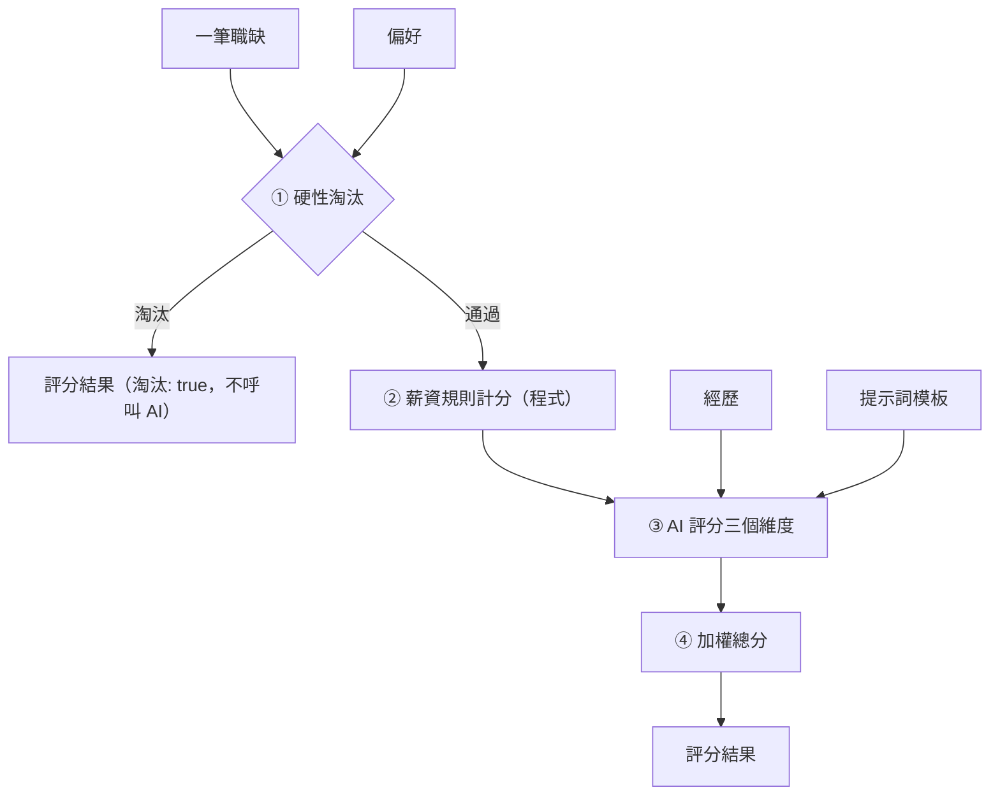
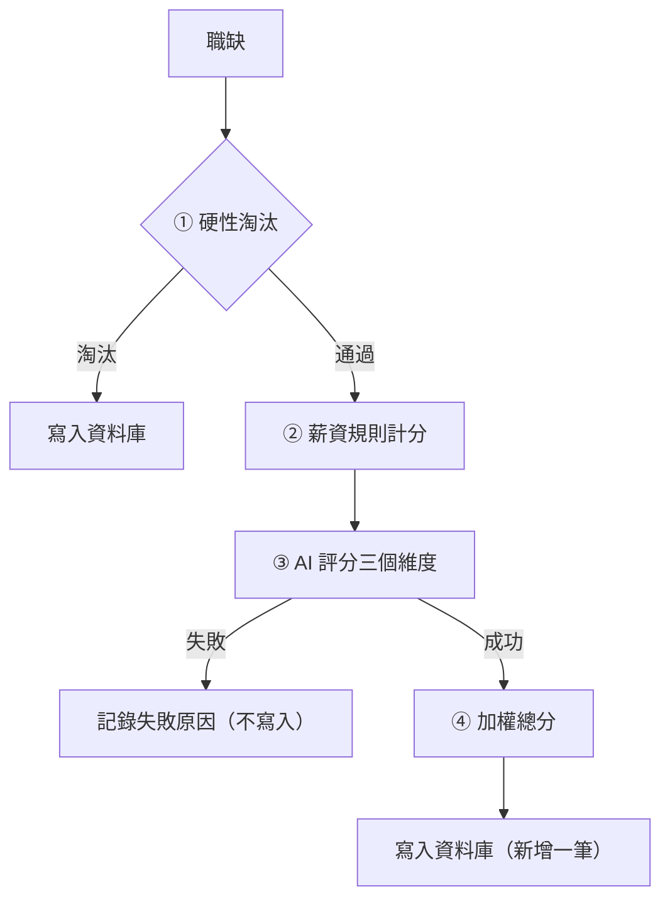

# 職缺自動評分

- ID：job-auto-scoring
- 狀態：待實作
- 依賴：job-database（從職缺資料庫讀取職缺，欄位依其職缺欄位契約；評分紀錄與設定保存在職缺資料庫；在職缺表上疊加評分的欄位、篩選、勾選與展開的內容）

## 1. 背景與目標

爬蟲一次會抓到上百筆職缺，逐筆閱讀並判斷是否適合自己，要花很多時間。判斷的結果如果散在各次的結果檔或腦中，也無法依分數排出先看哪些職缺（UP-02）。

本功能讓使用者快速判斷哪些職缺值得細看、原因是什麼：

- 輸入：使用者在網頁上編輯的工作偏好、工作經歷與提示詞模板
- 從職缺表勾選職缺，逐筆做多維度評分，產出總分與簡短評語
- 評分紀錄保存在職缺資料庫，在職缺表上依分數排序、篩選，展開一列看各維度的分數與理由
- 保留每一次的評分與評分時用的設定，換了設定也追得到每個分數的依據

## 2. 範圍

範圍內（實作時只做這些）：

- 使用者故事，一個故事一章，細節見各章的「需求」：
  - [自動評分並看懂每個分數](#4-自動評分並看懂每個分數score)（`score`）：✅，送去評分的方式與設定來源〔規劃中〕
  - [明顯不合的職缺直接淘汰](#5-明顯不合的職缺直接淘汰filter)（`filter`）：✅
  - [在職缺表依分數排序、篩選](#6-在職缺表依分數排序篩選rank)（`rank`）：〔規劃中〕
  - [換了設定後重評已評過的職缺](#7-換了設定後重評已評過的職缺rescore)（`rescore`）：〔規劃中〕
  - [在網頁上編輯設定並保留每個版本](#8-在網頁上編輯設定並保留每個版本settings)（`settings`）：〔規劃中〕
  - [換設定試跑而不影響正式分數](#9-換設定試跑而不影響正式分數dry-run)（`dry-run`）：〔規劃中〕
  - [追蹤同一筆職缺的評分變化](#10-追蹤同一筆職缺的評分變化history)（`history`）：✅，在展開列檢視〔規劃中〕
  - [看得出每個分數依據什麼評的](#11-看得出每個分數依據什麼評的basis)（`basis`）：〔規劃中〕
- [§12 非功能需求](#12-非功能需求)：只在必要時呼叫 AI、API key 不進版控、資訊不足時分數為 `null`、改版時保留資料
- [§13 共用規則](#13-共用規則)：評分結果格式、評分紀錄、代表的評分、作業、AI 供應商與 API key

範圍外（實作時不要做）：

- 在抓取頁送去評分：只從職缺表送出（見 [§4.2.12](#4212-勾選與送出)），評分才不依賴任何爬蟲
- 對 AI 的評分表態（同意／不同意）與已讀、想投、略過等標記：屬之後的標記功能，另外保存，不共用評分紀錄，見 [待辦：標記職缺](../../../backlog/tasks/job-marks.md)
- 標出職缺內容或設定改變後過時的評分：見 [待辦：標出過時的評分](../../../backlog/tasks/stale-scores.md)
- Gemini 以外的 AI 供應商：只保留可替換的介面
- 通勤便利度、資歷門檻、工作型態與福利、競爭程度／新鮮度等維度：候選做法見 [TODO.md](../../../backlog/TODO.md)
- 修改爬蟲或擴充爬蟲欄位：見 [TODO.md](../../../backlog/TODO.md#加入資歷門檻與工作型態維度)
- 同一次評分內的失敗重試：失敗的職缺可以再勾選重評（見 [§4.2.14](#4214-評分中與評完)），立即重試見 [TODO.md](../../../backlog/TODO.md#評分失敗時立即重試)
- 平行呼叫 AI：整批維持循序執行

## 3. 輸入與輸出

- 輸入的職缺：職缺資料庫中的職缺，由使用者在職缺表勾選（見 [§4.2.12](#4212-勾選與送出)）。
  - 欄位依 [job-database §8.2.1](job-database.md#821-職缺欄位契約)。
  - 各維度實際看哪些欄位見 [§4.2.4](#424-評分維度)。
- 輸入的設定：偏好、經歷、提示詞模板，由使用者在網頁上編輯，保存在職缺資料庫，見 [§8](#8-在網頁上編輯設定並保留每個版本settings)。
  - 格式見 [§4.2.2](#422-偏好的欄位字典)、[§4.2.8](#428-提示詞模板)。
- 輸出：評分紀錄，保存在職缺資料庫，欄位見 [§13.2.2](#1322-評分紀錄)。
  - 在職缺表上顯示為評分的欄位與展開列的內容，見 [§4](#4-自動評分並看懂每個分數score)、[§6](#6-在職缺表依分數排序篩選rank)、[§10](#10-追蹤同一筆職缺的評分變化history)、[§11](#11-看得出每個分數依據什麼評的basis)。
  - 試跑的結果不寫入（見 [§9](#9-換設定試跑而不影響正式分數dry-run)）。

## 4. 自動評分並看懂每個分數（score）

身為求職者，我想要依照我的偏好與經歷，替職缺表上勾選的職缺自動評分，並附上每個維度的分數與理由，以便不必逐筆閱讀就知道哪些職缺值得細看、為什麼。

### 4.1 需求

- FR-score-settings：〔規劃中〕用目前設定的偏好、經歷與提示詞模板評分，規則見 [§4.2.1](#421-評分用的設定)。
  - 偏好依 [§4.2.2](#422-偏好的欄位字典) 驗證，不符時不能儲存或套用（見 [§8.2.3](#823-檢查)），不補預設值。
- FR-score-salary：依 [§4.2.6](#426-薪資換算與計分) 換算月薪並計算薪資分數。
  - 面議、時薪、日薪、論件計酬與缺值都視為未知（`null`）。
  - 薪資未知不會因此被淘汰。
- FR-score-ai：由 AI 依提示詞模板（[§4.2.8](#428-提示詞模板)〔規劃中〕），為三個 AI 維度各給 1–5 分或 `null`。
  - 每個維度都附上理由，另外提供總評。
  - AI 回應必須通過 [§4.2.9](#429-ai-回應的檢查) 的檢查，否則視為失敗。
- FR-score-total：依 [§4.2.7](#427-總分) 計算 0–100 的加權總分。
  - 分數為 `null` 的維度以 3 分代入，讓所有沒被淘汰的職缺都有可以互相比較的總分。
- FR-score-store：評分結果都寫成評分紀錄，欄位依 [§13.2.2](#1322-評分紀錄)。
  - 評分成功與被淘汰的職缺都寫入。
  - 評分失敗的職缺不寫入。
- FR-score-detail：〔規劃中〕在職缺表點一列展開，顯示這筆職缺目前的評分與評分明細，內容見 [§4.2.10](#4210-展開列的評分)。
  - 沒評過的職缺顯示還沒有評分。
- FR-score-pick：〔規劃中〕職缺表的每一列都可以勾選，規則見 [§4.2.12](#4212-勾選與送出)。
- FR-score-confirm：〔規劃中〕送去評分前顯示確認視窗，內容與開始前的檢查見 [§4.2.13](#4213-送出前的確認)。
  - 有開始前的錯誤時顯示原因、不能送出，一筆都不評。
- FR-score-order：〔規劃中〕照職缺表目前的顯示順序，逐筆套用 [§4.2.11](#4211-評完寫入資料庫) 的流程。
- FR-score-failure：單筆評分失敗（AI 呼叫失敗或回應不通過 [§4.2.9](#429-ai-回應的檢查) 的檢查）時，不中斷整批。
  - 記下失敗原因並繼續下一筆。
  - 這樣整批已經花掉的時間與 AI 費用不會白費。
  - 〔規劃中〕失敗原因顯示在那一列上，見 [§4.2.14](#4214-評分中與評完)。
- FR-score-progress：〔規劃中〕評分中逐列顯示狀態與整體進度，規則見 [§4.2.14](#4214-評分中與評完)。
- FR-score-stop：〔規劃中〕評分中可以停止：評完目前這一筆就不再評，已評完的保留。
  - 評分會花錢，選錯模型時更需要停。
- FR-score-summary：〔規劃中〕評完或停止後顯示摘要，內容見 [§4.2.14](#4214-評分中與評完)。

### 4.2 規則

#### 4.2.1 評分用的設定

〔規劃中〕

- 評分用目前設定的三份內容（目前設定見 [§8.2.1](#821-設定的版本)）：
  - 偏好：偏好、門檻與權重，格式見 [§4.2.2](#422-偏好的欄位字典)
  - 經歷：工作經歷與技能，自由格式的 Markdown，原文放進提示詞
  - 提示詞模板：送給 AI 的指示與資料的排列，見 [§4.2.8](#428-提示詞模板)
- 評分在按下開始時讀一次目前設定，並依它重做開始前的檢查（見 [§4.2.13](#4213-送出前的確認)）；確認視窗開著時換了設定，以按下開始時的為準。
- 評分中換了設定只影響之後開始的評分。

#### 4.2.2 偏好的欄位字典

偏好的格式是 YAML，鍵名用中文。所有欄位都是必填。缺少欄位或型別錯誤時拒絕並顯示原因，不補預設值（什麼時候檢查見 [§8.2.3](#823-檢查)〔規劃中〕）。

- `目標方向`（list[str]）：想做的工作內容、想累積的能力，給 AI 判斷「職涯方向契合度」
- `產業偏好.喜歡`（list[str]）：偏好的產業或公司類型
  - 可以是空清單
- `產業偏好.不喜歡`（list[str]）：不偏好的產業（降低分數，但不淘汰）
  - 可以是空清單
- `薪資.期望月薪`（int）：期望月薪（元）
- `薪資.底線月薪`（int）：可接受的最低月薪（元）
  - 必須 ≤ `期望月薪`
- `薪資.年薪換算月數`（int）：年薪換算月薪時的除數（例如 14）
- `淘汰條件.公司`（list[str]）：直接淘汰的公司名稱（完全比對 `公司名稱`）
  - 可以是空清單
- `淘汰條件.職稱關鍵字`（list[str]）：`職缺名稱` 含其中任一字串就淘汰（不分大小寫）
  - 可以是空清單
  - 不可含空字串，空字串會命中所有職稱
- `權重`（dict[str, float]）：各維度的權重
  - 鍵必須剛好是 [§4.2.4](#424-評分維度) 的四個維度名稱
  - 值 ≥ 0，且總和 > 0
  - 不要求總和為 1

範例：

```yaml
目標方向:
  - 以 Python 開發後端服務與資料管線
  - 參與 LLM 應用的設計與落地
產業偏好:
  喜歡: [軟體及網路相關業, 金融科技]
  不喜歡: [博弈]
薪資:
  期望月薪: 70000
  底線月薪: 55000
  年薪換算月數: 14
淘汰條件:
  公司: []
  職稱關鍵字: [業務, 客服]
權重:
  職涯方向契合度: 0.4
  技能匹配度: 0.25
  產業公司吸引力: 0.15
  薪資水準: 0.2
```

#### 4.2.3 評分流程



- 「一筆職缺」是職缺資料庫中的一筆職缺，欄位見 [job-database 的職缺欄位契約](job-database.md#821-職缺欄位契約)。
- ① 的規則見 [§5.2.1](#521-硬性淘汰規則)。被淘汰的職缺在 ① 就停止，不呼叫 AI：
  - 節省費用
  - 不需要 API key
- ② 和 ③ 各自獨立，任何一個維度都可能是 `null`（未知），由 ④ 統一處理。
- 評分結果的欄位見 [§13.2.1](#1321-評分結果格式)。

#### 4.2.4 評分維度

每個維度的分數都是 1–5 的整數，或 `null`（資訊不足）。

- `職涯方向契合度`
  - 判斷者：AI
  - 使用的職缺欄位：職缺名稱、工作內容
  - 比對的個人資料：偏好的 `目標方向`
- `技能匹配度`
  - 判斷者：AI
  - 使用的職缺欄位：職缺名稱、工作內容、電腦專長、科系要求
  - 比對的個人資料：經歷全文
- `產業公司吸引力`
  - 判斷者：AI
  - 使用的職缺欄位：公司名稱、產業類別
  - 比對的個人資料：偏好的 `產業偏好`
- `薪資水準`
  - 判斷者：程式
  - 使用的職缺欄位：薪資待遇、薪資下限、薪資上限
  - 比對的個人資料：偏好的 `薪資`

AI 維度實際收到哪些欄位，由提示詞模板用了哪些變數決定（見 [§4.2.8](#428-提示詞模板)〔規劃中〕），上列是預設模板的內容。

#### 4.2.5 AI 維度的錨點描述

〔規劃中〕這些描述是預設模板的內容，讓分數有一致的標準；使用者可以在模板中修改（見 [§8](#8-在網頁上編輯設定並保留每個版本settings)）。

職涯方向契合度（包含這份工作能否累積目標方向需要的能力）：

- 5：主要工作內容就是目標方向之一，做了能直接累積目標能力
- 4：大部分工作內容符合目標方向，少部分無關
- 3：部分相關，或是可以作為轉往目標方向的跳板
- 2：只有少量沾邊，主要工作內容與目標無關
- 1：與目標方向無關或背道而馳
- null：`工作內容` 為 null，且無法只憑職缺名稱判斷

技能匹配度（依工作經歷評估現在能否勝任）：

- 5：要求的核心技能都具備，而且有實際經歷佐證
- 4：具備大部分核心技能，缺口可以在短期內補上
- 3：具備約一半的核心技能，有明顯但可以跨越的缺口
- 2：只具備少數要求的技能，需要大量補強
- 1：核心技能幾乎都不具備
- null：根據現有欄位（職缺名稱、工作內容、電腦專長、科系要求）仍無法判斷職缺要求哪些技能

`理由` 必須列出主要的技能缺口（沒有缺口就寫「無明顯缺口」）。

資料是否足以評分由 AI 判斷，程式不設固定條件：

- 例如 `工作內容` 為 null，但職缺名稱已經能看出核心技能（如「資深 iOS 工程師」）時，仍然可以給分。
- 這時 `理由` 要說明是依據哪些欄位判斷的。

產業公司吸引力（只根據產業類別與公司名稱判斷）：

- 5：屬於 `產業偏好.喜歡` 中的產業
- 4：與喜歡的產業高度相關
- 3：中性，既不在喜歡、也不在不喜歡的清單中
- 2：與不喜歡的產業相關
- 1：屬於 `產業偏好.不喜歡` 中的產業
- null：`產業類別` 為空

#### 4.2.6 薪資換算與計分

先換算成月薪，依 `薪資待遇` 的開頭字串判斷薪資類型（以 104 實際資料為準）：

- `月薪`：直接使用。
  - 例如 `月薪55,000~65,000元`，下限 55000、上限 65000。
- `年薪`：下限、上限都除以 `年薪換算月數`，四捨五入到整數（見 [§4.2.7](#427-總分) 的進位規則）。
  - 例如 `年薪700,000~1,000,000元`，下限 700000、上限 1000000。
- `待遇面議`、`時薪`、`日薪`、`論件計酬`、其他：無法換算，薪資未知。
  - 例如 `待遇面議`，下限、上限都是 0。
- `薪資待遇` 為 null：無法判斷類型，薪資未知。

其他規則：

- `薪資下限` 為 null 或 0 → 薪資未知。
- `薪資上限` ≥ 9999999 → 上限記為「無」。
  - 這個值代表「以上」、沒有上限，實際資料中的值是 `9999999`。
- `薪資上限` 為 null → 上限記為「無」。

再計算分數。使用的符號：

- `low`：換算後的月薪下限
- `high`：換算後的月薪上限，可能是「無」

依序判斷，第一個符合的條件決定分數：

1. 薪資未知：`null`
2. `low` ≥ `期望月薪`：5
3. `high` 不是「無」且 `high` ≥ `期望月薪`：4
4. 其他：2

「`high` < `底線月薪`」的情況已經在 [§5.2.1](#521-硬性淘汰規則) 被淘汰，不會進到計分。

`薪資水準` 的 `理由` 由程式產生，例如 `月薪 55,000–65,000，期望 70,000，未達期望`。

#### 4.2.7 總分

1. 分數為 `null` 的維度以 3 分（中性）代入。
   - 所有職缺都用相同的四個維度與權重計算，總分才能互相比較。
   - 若只用已知維度計算，等於假設缺少的維度與其他維度表現相同，缺資料的職缺反而可能排在前面。
2. 計算四個維度的加權平均 `avg = Σ(wᵢ·sᵢ) / Σwᵢ`。
3. 換算成 0–100 分：`總分 = (avg − 1) / 4 × 100`，四捨五入到整數。沒被淘汰的職缺一定有總分。
   - .5 一律進位（62.5 → 63），不用五成雙（62.5 → 62）。
   - 計算不能有誤差：57.5 要進位成 58，不能因為計算誤差變成 57.4999… 而被捨去。
   - 年薪換算月薪也用同一規則。
4. 分數為 `null` 的維度名稱依 [§4.2.4](#424-評分維度) 的順序列入 `未知維度`，讓使用者知道哪些分數是代入的。
   - `維度` 中的分數仍保留 `null`。
   - `評語` 維持 AI 的原文，不另外加註。

#### 4.2.8 提示詞模板

〔規劃中〕

- 模板與程式碼分開，使用者可以在網頁上修改整份模板（見 [§8](#8-在網頁上編輯設定並保留每個版本settings)）。
- 模板分成兩段，以 `<!-- SYSTEM -->` 與 `<!-- USER -->` 標記開頭，SYSTEM 在前：
  - SYSTEM：給 AI 的指示
  - USER：送給 AI 的資料
- 模板以 `$變數名稱` 放入資料，可以用的變數：
  - 個人資料：`$目標方向`、`$喜歡的產業`、`$不喜歡的產業`（取自偏好），`$工作經歷`（經歷全文）
  - 職缺：`$職缺名稱`、`$公司名稱`、`$產業類別`、`$電腦專長`、`$科系要求`、`$工作內容`
  - 職缺欄位為 null 或空字串、個人資料為空（例如空清單）時，放入「（無資料）」。
- 沒有薪資與淘汰條件的變數，不把它們交給 AI：
  - 避免重複判斷。
  - 避免 AI 的判斷和規則衝突。
- 程式固定、模板改不了的部分：三個 AI 維度的名稱與個數，以及回應格式（見 [§4.2.9](#429-ai-回應的檢查)），由程式要求 AI 照格式回應。
  - 模板只能改 AI 怎麼判斷，要加減維度仍要改程式。
- 預設模板的內容：
  - 評分者角色
  - [§4.2.5](#425-ai-維度的錨點描述) 的錨點描述
  - 以下規則：只根據提供的資料判斷；資訊不足時給 `null` 並在理由中說明，不准猜分數；理由要具體引用職缺內容；使用繁體中文
  - 全部的變數

#### 4.2.9 AI 回應的檢查

AI 要回傳三個 AI 維度各自的分數與理由，以及一到兩句總評：

- 分數是 1–5 的整數或 `null`，理由不可省略。
- 總評不可為空字串。
- 回應不符合這個格式時（例如分數超出範圍），視為該次評分失敗：
  - 記下失敗原因，繼續評下一筆（見 [§4.2.14](#4214-評分中與評完)）。
  - 不自行修正分數。

#### 4.2.10 展開列的評分

〔規劃中〕職缺表點一列展開時，在職缺的內容之外多顯示：

- 目前的評分：代表的評分（見 [§13.2.3](#1323-代表的評分)）的總分、淘汰、評語、評分時間。
- 評分明細：四個維度的分數與理由、`未知維度`。
  - 被淘汰時改顯示淘汰原因，並說明沒有呼叫 AI、沒有維度分數。
- 沒有評分時顯示還沒有評分。

所有評分紀錄與評分依據見 [§10](#10-追蹤同一筆職缺的評分變化history)、[§11](#11-看得出每個分數依據什麼評的basis)。

#### 4.2.11 評完寫入資料庫

每筆職缺照 [§4.2.3](#423-評分流程) 評分後，把結果寫入資料庫。沒被淘汰的職缺每次都呼叫 AI，不沿用上次的評分（見[決策紀錄：自動評分不做快取](../../decisions/product/no-score-cache.md)）。



- 每筆評完就寫入資料庫。
  - 寫入是新增一筆，不覆寫任何紀錄（見 [§10.2.1](#1021-什麼時候新增一筆)）。
  - 〔規劃中〕停止或中途中斷時，已經評完的職缺留在資料庫。
- 評分中途無法寫入資料庫時，顯示錯誤訊息並停止，已寫入的職缺留在資料庫；列的狀態與摘要照停止處理（見 [§4.2.14](#4214-評分中與評完)），寫入失敗的那一筆算失敗。

#### 4.2.12 勾選與送出

〔規劃中〕

- 職缺表的每一列都可以勾選，勾選的職缺用來送去評分或加入試跑清單（見 [§9](#9-換設定試跑而不影響正式分數dry-run)）。
- 有「全選」與「取消全選」，全選是指目前篩選後顯示的所有列。
- 改篩選時清掉勾選，送出的職缺一定是看得到的。
- 開始評分時清掉勾選，勾選的職缺交給評分作業，不會不小心再送一次；在確認視窗取消時勾選不變。
- 只從職缺表送去評分，抓取頁不能送去評分：評分才不依賴任何爬蟲，之後接新的求職平台時評分不必跟著擴充。
- 不論怎麼篩選都可以全選送出：想評完所有還沒評過的職缺時，全選後送出即可，不另外提供按鈕。
- 照職缺表目前的顯示順序評，中途停止時，排在前面的職缺已評完。

#### 4.2.13 送出前的確認

〔規劃中〕

確認視窗寫出：

- 勾選了幾筆，其中幾筆已評過
- 「包含已評過的職缺（重評）」勾選框，見 [§7](#7-換了設定後重評已評過的職缺rescore)
- 將評幾筆，其中幾筆符合淘汰條件、不呼叫 AI
- 用目前設定的哪一版偏好、經歷、提示詞模板
- 用哪個供應商與模型，模型可以在這裡選（見 [§13.2.5](#1325-ai-供應商與-api-key)）

開始前的錯誤在確認視窗就檢查，有錯時顯示原因、不能送出，一筆都不評：

- 將評的職缺是 0 筆，例如勾選的都評過、又沒勾重評
- 缺少 API key，而且有需要呼叫 AI 的職缺
- 目前設定的偏好格式錯誤（見 [§4.2.2](#422-偏好的欄位字典)），或提示詞模板有錯（見 [§8.2.3](#823-檢查)）
- 目前設定的偏好或經歷還是預設範例（內容和預設範例相同，不論是第幾版）：用範例評出的分數沒有意義，還會成為代表的評分

有其他作業在跑時不能送出（見 [§13.2.4](#1324-作業)）。

#### 4.2.14 評分中與評完

〔規劃中〕

評分中：

- 將評的職缺在列上標出排隊中，輪到時標出評分中；評完一筆就更新那一列的分數。
- 職缺表的列與順序固定，只更新分數與狀態；改篩選或改排序時才重新排列，切到別的分頁再回來或重新整理都不算，評分結束後重新整理才重新排列。
- 頁首顯示整體進度（評完幾筆／共幾筆），切到別的分頁也看得到、也繼續跑。
- 單筆失敗時，那一列標出評分失敗與失敗原因，繼續評下一筆。
- 停止：評完目前這一筆就不再評，還在排隊的不評。

評完或停止後顯示摘要：

- 評完：成功、淘汰、失敗各幾筆。
- 停止：成功、淘汰、失敗各幾筆，以及沒評的筆數。
- 有失敗時說明失敗的沒有寫入，列上看得到原因，可以再勾選重評。

評分失敗的職缺照 [§4.2.11](#4211-評完寫入資料庫) 不寫入：

- 失敗的列上看得到失敗原因，展開也看得到。
- 評分進行中重新整理時，照作業的規則接回進度，列上的排隊中、評分中、失敗與原因都還在（見 [§13.2.4](#1324-作業)）；評分結束後重新整理，失敗標示就消失。
- 可以再勾選重評。

### 4.3 驗收

本章與之後各章的驗收，除非另外寫明，目前設定的偏好與經歷都不是預設範例，模板與偏好都通過檢查。

#### AC-score-settings：評分用的設定

〔規劃中〕

- Given：目前設定是第 2 版偏好，另有權重不同的第 3 版
- When：勾選兩筆職缺送去評分，評第一筆時把第 3 版套用成目前設定
- Then：
  - 兩筆都用第 2 版評分，總分依第 2 版的權重
  - 之後再送出的評分才用第 3 版
- 通過條件：全部符合。

#### AC-score-salary：薪資計分

- Given：測試用的偏好（期望 70,000、底線 55,000、年薪 ÷14）
- When：以下列職缺計算薪資分數，並檢查是否被淘汰。每項是「`薪資待遇`（`薪資下限` / `薪資上限`）→ 薪資分數」：
  - `月薪70,000~90,000元`（70000 / 90000）→ 5
  - `月薪60,000~80,000元`（60000 / 80000）→ 4
  - `月薪56,000~60,000元`（56000 / 60000）→ 2
  - `年薪980,000~1,260,000元`（980000 / 1260000）→ 5，換算為 70,000~90,000
  - `年薪980,007~1,260,007元`（980007 / 1260007）→ 5，換算為 70,000.5~90,000.5，理由中為 70,001–90,001
  - `月薪50,000元以上`（50000 / 9999999）→ 2，沒有上限
  - `待遇面議`（0 / 0）→ `null`
  - `時薪500元以上`（500 / 9999999）→ `null`
  - `論件計酬3,000~15,000元`（3000 / 15000）→ `null`
  - null（null / null）→ `null`
- Then：薪資分數符合上列結果與 [§4.2.6](#426-薪資換算與計分)，而且都不會被淘汰
- 通過條件：全部符合。

#### AC-score-total：總分計算

- Given：權重 0.4 / 0.25 / 0.15 / 0.2
- When：以下列分數組合計算總分。每項是「職涯方向 / 技能 / 產業公司 / 薪資 → 總分」：
  - 5 / 5 / 5 / 5 → 100
  - 1 / 1 / 1 / 1 → 0
  - 4 / 4 / 5 / 4 → 79
  - 4 / 4 / 2 / 3 → 63，原始值 62.5，.5 一律進位
  - 5 / 1 / 3 / 3 → 58，原始值 57.5，不受計算誤差影響
  - 5 / 3 / `null` / `null` → 70，未知維度以 3 分代入
  - `null` / `null` / `null` / `null` → 50，全部未知，等同全部 3 分
- Then：結果符合上列總分與 [§4.2.7](#427-總分) 的公式
- 通過條件：全部符合。

#### AC-score-flow：評分流程與 AI 回應處理

- Given：
  - 一筆會被淘汰的職缺，與一筆不會被淘汰、薪資分數為 4 的職缺
  - AI 的回應有三種：
    - 職涯方向契合度 5 分、技能匹配度 `null`、產業公司吸引力 3 分，總評為「總評」
    - 職涯方向契合度與技能匹配度都是 `null`
    - 職涯方向契合度為 6 分
- When：分別評這兩筆職缺，並檢查超出範圍的回應
- Then：
  - 會被淘汰的職缺：
    - 沒有呼叫 AI
    - 結果為 `淘汰` true，`維度` 與 `總分` 都是 `null`
  - 不會被淘汰的職缺：
    - 呼叫 AI 1 次
    - `維度` 依序是四個維度名稱
    - `技能匹配度` 的分數為 `null`、`薪資水準` 為 4
    - `總分` 75，`未知維度` 為 `[技能匹配度]`，`評語` 為「總評」
  - 兩個維度都是 `null` 的回應：
    - `總分` 為 55
    - `未知維度` 為 `[職涯方向契合度, 技能匹配度]`
    - `評語` 維持「總評」，不加任何前綴
  - 6 分的回應不通過 [§4.2.9](#429-ai-回應的檢查) 的檢查
- 通過條件：全部符合。

#### AC-score-ai：理由引用職缺內容、分數符合判斷

〔規劃中〕操作改成網頁上的勾選與送去評分，判斷的結果不變。

- Given：
  - 使用者自己的偏好與經歷，提示詞模板是預設模板
  - 職缺資料庫中有幾筆還沒評分的職缺，其中至少一筆有工作內容、而且不會被淘汰
- When：勾選這些職缺送去評分
- Then：
  - 有工作內容、而且沒被淘汰的職缺評分成功
  - 三個 AI 維度的理由都具體引用職缺內容
  - `技能匹配度` 的理由列出主要的技能缺口，沒有缺口時寫「無明顯缺口」
  - 送給 AI 的資料包含偏好的目標方向、經歷、職缺的工作內容，空欄位寫成「（無資料）」
- 通過條件：
  - 評分成功，而且理由不是空的
  - 使用者展開這些職缺閱讀評分明細，確認理由確實引用了職缺內容，分數與自己的判斷大致相符

#### AC-score-store：評分結果入庫

〔規劃中〕操作改成網頁上的勾選與送去評分，判斷的結果不變。

- Given：
  - 三筆還沒評分的職缺，依序為會評分成功、會被淘汰、會評分失敗
- When：勾選這三筆送去評分
- Then：
  - 成功與淘汰的兩筆寫成評分紀錄，欄位依 [§13.2.2](#1322-評分紀錄)
  - 寫入的 `評分明細` 符合 [§13.2.1](#1321-評分結果格式)，淘汰、總分、評語與其中的值一致
  - 淘汰那筆的總分為 `null`
  - 評分失敗那筆沒有寫入
- 通過條件：全部符合。

#### AC-score-detail：展開列的評分

〔規劃中〕

- Given：
  - 職缺 A 評分成功，職缺 B 被淘汰，職缺 C 還沒評分
- When：在職缺表分別展開 A、B、C
- Then：
  - A：顯示總分、淘汰（否）、評語、評分時間，以及四個維度的分數與理由、`未知維度`，和寫入時相同
  - B：顯示淘汰、評語與評分時間，評分明細改顯示淘汰原因，並說明沒有呼叫 AI
  - C：顯示還沒有評分
- 通過條件：全部符合。

#### AC-score-pick：勾選

〔規劃中〕

- Given：職缺表列出 5 筆職缺
- When：
  - (a) 勾選 2 筆，再按「全選」
  - (b) 設一個只剩 3 筆符合的關鍵字篩選
  - (c) 按「全選」後送去評分並開始
- Then：
  - (a) 5 筆都被勾選；按「取消全選」後都不勾選
  - (b) 篩選改變後勾選都清掉
  - (c) 全選只勾選篩選後的 3 筆，送出的是這 3 筆；開始評分後勾選清掉
- 通過條件：全部符合。

#### AC-score-confirm：送出前的確認

〔規劃中〕

- Given：
  - 職缺表勾選了 4 筆：2 筆已評過；沒評過的 2 筆中，1 筆會被淘汰
  - 目前設定的偏好、經歷都不是預設範例
- When：
  - (a) 按「送去評分」
  - (b) 在確認視窗改選另一個模型後開始
  - (c) 沒有設定 API key，勾選 4 筆送去評分
  - (d) 沒有設定 API key，只勾選會被淘汰的那 1 筆送去評分
  - (e) 只勾選已評過的 2 筆送去評分，不勾重評
  - (f) 目前設定的經歷是預設範例，勾選 4 筆送去評分
  - 每個情境都從同一個 Given 開始，不接續前一個情境的結果
- Then：
  - (a) 確認視窗顯示勾選 4 筆、其中 2 筆已評過，將評 2 筆、其中 1 筆符合淘汰條件，用的三份設定的版本，以及供應商與模型；重評的勾選框預設不勾
  - (b) 呼叫 AI 的那筆用選的模型評分，評分紀錄的 `模型` 是選的模型
  - (c) 顯示提到 API key 的原因，不能送出
  - (d) 可以送出，評完這筆被淘汰
  - (e) 顯示將評 0 筆的原因，不能送出
  - (f) 顯示經歷還是預設範例的原因，不能送出
  - (c)、(e)、(f) 都沒有新增任何評分紀錄
- 通過條件：全部符合。

#### AC-score-order：照表格順序評分

〔規劃中〕

- Given：
  - 職缺表依某一欄排序後，五筆職缺由上而下依序為：正常、會被淘汰、正常、會評分失敗、正常
- When：全選送去評分
- Then：
  - 依表格由上而下的順序評分，五筆都有結果
  - AI 被呼叫 4 次，被淘汰的職缺沒有呼叫
  - 被淘汰的那筆 `淘汰` 為 true、沒有失敗原因
  - 成功的三筆沒有失敗原因
- 通過條件：全部符合。

#### AC-score-failure：單筆失敗不中斷整批

- Given：三筆職缺，AI 的回應分別為：
  - 第一筆：AI 呼叫失敗
  - 第二筆：回傳 6 分
  - 第三筆：正常
- When：勾選這三筆送去評分
- Then：
  - 前兩筆沒有寫入，列上標出評分失敗與失敗原因〔規劃中〕
  - 第三筆有總分，有寫入
  - 整批正常完成，沒有中斷
  - 〔規劃中〕重新整理後，前兩筆的失敗標示消失，仍是還沒評分，可以再勾選送去評分
- 通過條件：全部符合。

#### AC-score-run：評分中、停止與摘要

〔規劃中〕

- Given：職缺表勾選了 5 筆還沒評分的職缺
- When：
  - (a) 送去評分，評第 2 筆時切到別的分頁再切回職缺表
  - (b) 評第 3 筆時按「停止」
  - (c) 另一次送去評分，5 筆都評完，其中 1 筆被淘汰、1 筆失敗
  - 每個情境都從同一個 Given 開始，不接續前一個情境的結果
- Then：
  - (a) 還沒評的列標出排隊中、正在評的列標出評分中，評完的列更新分數；頁首顯示評完幾筆／共幾筆；切回來時評分仍在進行
  - (a) 評分中職缺表的列與順序不變，即使依總分排序、分數改變也一樣
  - (b) 第 3 筆評完後不再評，第 4、5 筆不評、沒有寫入；摘要寫出成功、淘汰、失敗各幾筆與沒評 2 筆
  - (c) 摘要寫出成功 3、淘汰 1、失敗 1，並說明失敗的沒有寫入、可以再勾選重評
- 通過條件：全部符合。

## 5. 明顯不合的職缺直接淘汰（filter）

身為求職者，我想要薪資太低、不想去的公司或職稱的職缺直接被淘汰，並寫出淘汰原因，以便不在它們身上浪費時間與 AI 費用，抽查時也能確認沒有誤殺。

### 5.1 需求

- FR-filter：依 [§5.2.1](#521-硬性淘汰規則) 檢查硬性淘汰條件。
  - 收集所有成立的淘汰原因。
  - 被淘汰的職缺不呼叫 AI。
- FR-filter-comment：被淘汰的職缺，`評語` 是淘汰原因組成的文字，格式見 [§5.2.2](#522-淘汰時的評語)。

### 5.2 規則

#### 5.2.1 硬性淘汰規則

符合任一條就淘汰。依序檢查全部條件，收集所有符合的原因，不在第一條就停止：

1. `公司名稱` 在 `淘汰條件.公司` 中 → 原因 `公司在排除名單：<公司名稱>`
2. `職缺名稱` 含 `淘汰條件.職稱關鍵字` 中的任一字串 → 原因 `職稱含排除關鍵字：<關鍵字>`
3. 依 [§4.2.6](#426-薪資換算與計分) 換算出的月薪上限存在，且小於 `底線月薪` → 原因 `薪資上限 <金額> 低於底線 <金額>`

薪資未知（面議、時薪、null 等）**不會**淘汰職缺。

淘汰在 [§4.2.3](#423-評分流程) 的第 ① 步執行。

#### 5.2.2 淘汰時的評語

- 格式是 `淘汰：` 接上[淘汰原因](#521-硬性淘汰規則)，多個原因以 `；` 分隔。
  - 例如 `淘汰：職稱含排除關鍵字：實習；薪資上限 30,000 低於底線 40,000`。
- 評分結果（[§13.2.1](#1321-評分結果格式)）與評分紀錄（[§13.2.2](#1322-評分紀錄)）的 `評語` 用同一段文字。

### 5.3 驗收

#### AC-filter-rules：硬性淘汰

- Given：測試用的偏好（底線 55,000、年薪 ÷14、排除「乙公司」與「業務」）
- When：以下列職缺檢查淘汰條件。每項是「`薪資待遇`（`薪資下限` / `薪資上限`）→ 淘汰原因」：
  - `月薪40,000~50,000元`（40000 / 50000）→ 1 條，含「底線」
  - `年薪560,000~700,000元`（560000 / 700000）→ 1 條，含「底線」，換算上限為 50,000
  - `月薪40,000~50,000元`（40000 / 50000），職稱 `業務專員`，公司 `乙公司` → 3 條（收集所有原因）
- Then：
  - 淘汰原因符合上列結果與 [§5.2.1](#521-硬性淘汰規則)
  - 職稱關鍵字不分大小寫（關鍵字 `sales` 會淘汰 `Senior SALES Manager`）
- 通過條件：全部符合。

#### AC-filter-no-key：被淘汰的職缺不需要 API key

〔規劃中〕操作改成網頁上的勾選與送去評分，判斷的結果不變。

- Given：
  - 沒有設定 API key
  - 一筆會被淘汰、還沒有評分的職缺
- When：只勾選這一筆送去評分
- Then：
  - 可以送出，正常評完
  - 這筆的評分明細 `淘汰` 為 true、`淘汰原因` 不為空
- 通過條件：全部符合。

#### AC-filter-comment：淘汰時的評語

〔規劃中〕操作改成網頁上的勾選與送去評分，判斷的結果不變。

- Given：一筆同時符合兩條淘汰條件的職缺
- When：送去評分
- Then：
  - 評分紀錄的 `評語` 是 `淘汰：<原因1>；<原因2>`
  - 總分仍為 `null`
- 通過條件：全部符合。

## 6. 在職缺表依分數排序、篩選（rank）

〔規劃中〕本章全部尚未實作。

身為求職者，我想要在職缺表上看到每筆職缺的分數，依總分排序、篩選，以便先看分數高的職缺，也能抽查被淘汰的職缺。

本章在職缺表（[job-database §5](job-database.md#5-在職缺表瀏覽篩選累積下來的職缺query)）之上疊加評分的欄位、預設排序與篩選。職缺表的其他規則不變：選欄位、排序、記在瀏覽器、還原預設檢視，以及顯示剛存入的職缺時其他篩選暫停，都照職缺表的規則，也適用於本章疊加的欄位與篩選。

### 6.1 需求

- FR-rank-columns：職缺表多了評分的欄位，可選的欄位與預設見 [§6.2.1](#621-評分的欄位)。
  - 欄位的值一律取自代表的評分（見 [§13.2.3](#1323-代表的評分)）。
  - 沒評分的職缺，這些欄位沒有值。
- FR-rank-sort：職缺表的預設排序改成依總分由高到低，規則見 [§6.2.2](#622-預設排序)。
- FR-rank-filter：可以依總分範圍與評分狀態篩選，規則見 [§6.2.3](#623-評分的篩選)。
  - 和職缺表的關鍵字、地區篩選同時生效，都要符合。

### 6.2 規則

#### 6.2.1 評分的欄位

- 可以選的欄位多了：`總分`、`淘汰`、`評語`、`評分時間`、四個維度的分數（欄名是維度名稱）、`供應商`、`模型`。
- 預設顯示的欄位多了 `總分`、`淘汰`、`評語`，依序是：`職缺名稱`、`公司名稱`、`地區`、`薪資待遇`、`總分`、`淘汰`、`評語`、`最後出現時間`。

#### 6.2.2 預設排序

- 依總分由高到低。
- 沒有總分的職缺（被淘汰與還沒評分）排在最後，照職缺表「沒有值的排在最後」的規則。
- 只要是依總分排序（預設排序或點 `總分` 欄），總分相同或都沒有總分時，再依最後出現時間由新到舊、職缺代碼排序。

#### 6.2.3 評分的篩選

- 總分範圍：可以只填下限、只填上限或都填，包含邊界。
  - 設了範圍時，排除沒有總分的職缺，也就是被淘汰與還沒評分的職缺。
- 評分狀態：全部、未淘汰、淘汰、未評分，預設是全部。
  - 未淘汰：評過而且沒被淘汰，不含未評分。
  - 淘汰：代表的評分是淘汰。
  - 未評分：沒有任何評分紀錄。
- 「清除篩選」與「還原預設檢視」也把這兩個篩選回到預設。

### 6.3 驗收

#### AC-rank-columns：評分的欄位

- Given：
  - 職缺 A 評分兩次，較新的一筆總分 80、較舊的一筆總分 60
  - 職缺 B 被淘汰，職缺 C 還沒評分
- When：第一次打開職缺表，再勾選四個維度、`供應商`、`模型` 欄
- Then：
  - 預設顯示的欄位依 [§6.2.1](#621-評分的欄位)
  - A 的總分是 80，維度分數、供應商、模型都是較新那筆的值
  - B 的淘汰欄標出淘汰，總分、維度、供應商、模型沒有值
  - C 的評分欄位都沒有值
- 通過條件：全部符合。

#### AC-rank-sort：預設依總分排序

- Given：總分 70 與 90 的兩筆職缺、一筆被淘汰、一筆還沒評分
- When：第一次打開職缺表
- Then：順序是 90、70，被淘汰與還沒評分的兩筆排在最後
- 通過條件：全部符合。

#### AC-rank-filter：評分的篩選

- Given：總分 50、70、90 的職缺各一筆，一筆被淘汰，一筆還沒評分
- When：分別以下列條件篩選，每項是「條件 → 列出的職缺」：
  - 總分下限 70 → 70、90
  - 總分 60～80 → 70
  - 評分狀態「未淘汰」→ 50、70、90
  - 評分狀態「淘汰」→ 被淘汰那筆
  - 評分狀態「未評分」→ 還沒評分那筆
  - 總分下限 0、評分狀態「全部」→ 50、70、90（排除沒有總分的）
- Then：
  - 列出的職缺符合上列結果
  - 按「清除篩選」後五筆都列出，評分狀態回到全部
- 通過條件：全部符合。

## 7. 換了設定後重評已評過的職缺（rescore）

〔規劃中〕本章整章改寫，尚未實作。

身為求職者，我想要勾選已評過的職缺重新評分，以便換了偏好、經歷、提示詞或模型之後，這些職缺的分數能反映新的設定。

### 7.1 需求

- FR-rescore：送去評分的確認視窗有「包含已評過的職缺（重評）」勾選框，預設不勾。
  - 不勾時只評勾選的職缺中還沒評過的。
  - 勾了時已評過的也評，照樣呼叫 AI，不沿用上次的評分，各新增一筆評分紀錄（見 [§10.2.1](#1021-什麼時候新增一筆)）。
  - 預設不勾，全選送出時才不會不小心重評、多花 AI 費用。
- FR-rescore-failure：重評失敗的職缺不寫入，保留原本的評分，代表的評分不變。

### 7.2 規則

- 要不要重評由使用者在確認視窗決定，不做快取（見[決策紀錄：自動評分不做快取](../../decisions/product/no-score-cache.md)）。
- 勾選框改變時，確認視窗的「將評幾筆」與「其中幾筆符合淘汰條件」跟著更新。
- 其餘的確認、順序、停止與摘要都和評還沒評過的職缺相同（見 [§4.2.13](#4213-送出前的確認)、[§4.2.14](#4214-評分中與評完)）。

### 7.3 驗收

#### AC-rescore：包含已評過的職缺

- Given：勾選 3 筆不會被淘汰的職缺，其中 1 筆已經有評分
- When：
  - (a) 不勾重評，送出
  - (b) 勾選同樣 3 筆，勾重評，送出
- Then：
  - (a) 確認視窗顯示將評 2 筆；只評沒評過的 2 筆，已評過那筆的評分紀錄不變
  - (b) 勾重評後確認視窗改顯示將評 3 筆；3 筆都呼叫 AI；已評過那筆多了一筆評分紀錄，原本的紀錄還在
- 通過條件：全部符合。

#### AC-rescore-failure：重評失敗時保留原本的評分

- Given：
  - 一筆不會被淘汰、已經有評分的職缺
  - 這次重評時 AI 呼叫失敗
- When：勾選這筆，勾重評，送出
- Then：
  - 摘要與列上都標出這筆失敗
  - 這筆沒有新增評分紀錄，職缺表上的分數仍是原本的評分
- 通過條件：全部符合。

## 8. 在網頁上編輯設定並保留每個版本（settings）

〔規劃中〕本章全部尚未實作。

身為求職者，我想要在網頁上編輯偏好、經歷與提示詞模板，每次儲存都留下一個有名稱的版本，隨時可以換回任何一版，以便調整設定時不怕改壞，回頭找以前的設定也容易。

### 8.1 需求

- FR-settings-store：偏好、經歷、提示詞模板各自保存在職缺資料庫，每次儲存留下一個版本，規則見 [§8.2.1](#821-設定的版本)。
  - 版本只新增、不刪除，評分紀錄指向的版本永遠查得到。
- FR-settings-meta：每個版本有名稱與描述，儲存時填寫。
  - 名稱必填，描述可以空白。
  - 之後可以修改名稱與描述，版本的內容不能改。
- FR-settings-current：目前設定是每份設定的其中一個版本，不一定是最新的一版。
  - 可以把任何一版套用成目前設定，套用不新增版本。
- FR-settings-default：第一版是專案附的預設內容，見 [§8.2.4](#824-第一版)。
- FR-settings-editor：每份設定有一個編輯區，規則見 [§8.2.2](#822-編輯區)。
- FR-settings-apply：編輯區旁的主按鈕依編輯區的狀態儲存並套用、套用或停用，規則見 [§8.2.2](#822-編輯區)。
- FR-settings-check：儲存與套用前檢查偏好與提示詞模板，規則見 [§8.2.3](#823-檢查)。
- FR-settings-no-rescore：儲存或套用都不自動重評，什麼時候讀設定見 [§4.2.1](#421-評分用的設定)。

### 8.2 規則

#### 8.2.1 設定的版本

- 偏好、經歷、提示詞模板各自有版本紀錄，版本以 1、2、3… 編號。
- 每個版本記下：編號、名稱、描述、儲存時間、內容。
- 版本紀錄由新到舊列出，標出目前設定是哪一版。
- 不另外記「什麼時候套用哪一版」：評分紀錄已經記下當時用的版本（見 [§11](#11-看得出每個分數依據什麼評的basis)），每筆分數的依據都追得到。取捨：版本紀錄看不出每一版實際用過哪段時間。
- 設定只存在職缺資料庫，不讀 `profile/` 等檔案。

#### 8.2.2 編輯區

- 編輯區一開始載入目前設定。
- 點版本紀錄的任何一版，把那一版載入編輯區，可以直接套用，或以它為底修改。
  - 編輯區有還沒儲存的修改時，先確認才蓋掉。
- 「還原預設」把預設範例或預設模板放進編輯區；編輯區已經是預設內容時停用。和載入的版本內容不同時，主按鈕照下面的規則變成「儲存並套用」。
- 「捨棄修改」讓編輯區回到目前設定。
- 編輯區的內容只給試跑用（見 [§9](#9-換設定試跑而不影響正式分數dry-run)），儲存或套用前不動目前設定。
  - 不直接改目前設定來試跑：試完不好要自己改回去；忘了改回去，下次正式評分就會用到實驗中的設定。
- 瀏覽器記住編輯區的內容與載入的是哪一版，直到套用、儲存或捨棄修改；記不住時退回目前設定。

主按鈕依編輯區的狀態：

- 和載入的那一版相比有修改：「儲存並套用」，填名稱與描述後存成新版本，並改用這一版。
  - 只要有修改就新增版本，即使內容剛好和其他版本相同，操作起來才不會疑惑怎麼變成套用別的版本。
- 沒有修改、載入的不是目前設定：「套用第 N 版」，只換目前設定，不新增版本。
  - 回到舊的設定時，版本紀錄不會多出內容重複的版本。
- 沒有修改、載入的就是目前設定：停用，顯示「已是目前設定」。

#### 8.2.3 檢查

- 提示詞模板整份都能改，儲存、套用、試跑、送去評分前檢查：
  - 缺少 `<!-- SYSTEM -->` 或 `<!-- USER -->` 標記、兩者順序顛倒，或用了不認得的變數（見 [§4.2.8](#428-提示詞模板)）：拒絕，顯示原因與可以用的變數。
  - 沒用到某個變數：提醒 AI 收不到這項資料，但允許。
- 偏好照 [§4.2.2](#422-偏好的欄位字典) 驗證，儲存、套用、試跑、送去評分前都檢查，有錯時拒絕並顯示原因，避免產生錯誤的評分。
- 經歷是自由格式，不檢查。
- 編輯時就顯示檢查結果，有錯時主按鈕停用。

#### 8.2.4 第一版

- 偏好與經歷的第一版是專案附的預設範例，提示詞模板的第一版是專案附的預設模板（內容見 [§4.2.8](#428-提示詞模板)）。
- 目前設定的偏好或經歷的內容和預設範例相同時（不論是第幾版），標出「預設範例」，而且不能送去評分（見 [§4.2.13](#4213-送出前的確認)）；試跑不擋。

### 8.3 驗收

#### AC-settings-version：儲存版本與修改名稱

- Given：偏好只有第 1 版（預設範例），它是目前設定
- When：
  - (a) 在編輯區修改偏好，按「儲存並套用」，不填名稱
  - (b) 填名稱「後端與 LLM」、描述留白，儲存
  - (c) 把第 2 版的名稱改成「後端」、描述改成「第一次填」
- Then：
  - (a) 不能儲存，要求填名稱
  - (b) 多了第 2 版，名稱、儲存時間與內容都記下，目前設定改成第 2 版；版本紀錄由新到舊列出並標出目前的是第 2 版
  - (b) 設定只存在職缺資料庫，專案目錄中沒有新增或修改任何檔案
  - (c) 第 2 版的名稱與描述改變，內容不變；沒有方式修改內容或刪除版本
- 通過條件：全部符合。

#### AC-settings-apply：主按鈕與套用舊版本

- Given：偏好有第 1、2、3 版，目前設定是第 3 版
- When：
  - (a) 打開設定頁
  - (b) 點版本紀錄的第 1 版
  - (c) 按「套用第 1 版」
  - (d) 修改編輯區後，按「儲存並套用」並填名稱
  - (e) 載入第 2 版，把內容改回和第 2 版相同
- Then：
  - (a) 編輯區是第 3 版的內容，主按鈕停用並顯示「已是目前設定」
  - (b) 編輯區換成第 1 版，主按鈕是「套用第 1 版」，目前設定仍是第 3 版
  - (c) 目前設定改成第 1 版，版本紀錄仍是 3 個版本
  - (d) 多了第 4 版，目前設定改成第 4 版；沒有任何評分紀錄因此新增或改變
  - (e) 主按鈕是「套用第 2 版」，不是「儲存並套用」
- 通過條件：全部符合。

#### AC-settings-editor：編輯區

- Given：目前設定的經歷是第 2 版
- When：
  - (a) 修改編輯區，關掉瀏覽器分頁後重新打開設定頁
  - (b) 點版本紀錄的第 1 版
  - (c) 在 (b) 的確認中取消，再按「捨棄修改」
  - (d) 按「還原預設」
  - (e) 在不允許保存的瀏覽器打開設定頁
- Then：
  - (a) 編輯區仍是修改後的內容，目前設定仍是第 2 版
  - (b) 先詢問是否蓋掉還沒儲存的修改
  - (c) 取消後編輯區不變；捨棄後編輯區回到第 2 版的內容
  - (d) 編輯區換成預設範例，主按鈕是「儲存並套用」
  - (e) 編輯區是目前設定的內容，沒有錯誤訊息
- 通過條件：全部符合。

#### AC-settings-check：檢查

- Given：在編輯區放入下列內容：
  - (a) 模板沒有 `<!-- USER -->` 標記
  - (b) 模板用了 `$年資`
  - (c) 模板沒用到 `$工作經歷`
  - (d) 偏好有錯，分別是：缺少 `權重`、`權重` 多了一個不存在的維度、`底線月薪` 大於 `期望月薪`、`淘汰條件.職稱關鍵字` 含空字串
  - (e) 經歷只有一行文字
- When：查看檢查結果並按主按鈕
- Then：
  - (a)、(b)、(d) 顯示原因，(b) 另外列出可以用的變數；主按鈕停用，不能儲存或套用，也不能試跑
  - (c) 顯示提醒，可以儲存
  - (e) 沒有檢查訊息，可以儲存
- 通過條件：全部符合。

#### AC-settings-default：第一版與預設範例

- Given：一個還沒有任何設定的職缺資料庫；專案的 `profile/` 下有偏好與經歷檔
- When：打開設定頁，再到職缺表勾選一筆職缺送去評分
- Then：
  - 三份設定都只有第 1 版，內容是預設範例與預設模板，不是 `profile/` 下檔案的內容
  - 偏好與經歷標出預設範例
  - 確認視窗顯示偏好與經歷還是預設範例，不能送出
- 通過條件：全部符合。

## 9. 換設定試跑而不影響正式分數（dry-run）

〔規劃中〕本章整章改寫，尚未實作。

身為求職者，我想要用編輯中的設定試評一批固定的職缺，和目前的評分並排比較，而且不影響正式分數，以便確認新設定比較好再儲存套用。

調整提示詞的開發者也用試跑，不另外開測試用的資料庫。

### 9.1 需求

- FR-dry-run-list：試跑清單，規則見 [§9.2.1](#921-試跑清單)。
- FR-dry-run：用三份設定編輯區的內容（見 [§8.2.2](#822-編輯區)）評試跑清單的職缺，照清單目前的顯示順序。
  - 照常完整評分，會呼叫 AI。
  - 不寫入評分紀錄，不影響代表的評分與正式分數。
  - 開始前的確認與可以停止，都和正式評分相同，差異見 [§9.2.2](#922-確認與進行)。
- FR-dry-run-result：試跑結果加在試跑清單的表上，規則見 [§9.2.3](#923-試跑結果)。
  - 點一列並排比較目前的評分與試跑的評分。
- FR-dry-run-stale：試跑後又改了清單或編輯區的內容，表上標示結果是改之前的；再按一次試跑才會用現在的清單與內容。
- FR-dry-run-no-store：試跑的結果不存：試跑結束後，結果只留在打開的設定頁，離開或重新整理就不見，規則見 [§9.2.3](#923-試跑結果)。

### 9.2 規則

#### 9.2.1 試跑清單

- 在職缺表勾選職缺（見 [§4.2.12](#4212-勾選與送出)）後按「加入試跑清單」，已在清單裡的不重複加入，並告知加入幾筆、幾筆原本就在清單裡。
- 清單和職缺表的勾選分開，記在瀏覽器：
  - 勾選在改篩選、送去評分後會清掉，清單不會。
  - 調整設定時可以反覆拿同一批職缺比較，開發者調整提示詞也有一批固定的職缺。
  - 記不住時清單是空的。
- 設定頁用一張表列出清單的職缺：`職缺名稱`、`公司名稱`、`目前總分`。
  - `目前總分` 是代表的評分的總分，被淘汰時標出淘汰。
  - 點欄位標題排序，再點一次反向，第三次回到加入的順序。
  - 可以移除單筆，或清空清單；清空前先確認。
  - 試跑中不能移除或清空。

#### 9.2.2 確認與進行

- 確認視窗寫出：清單幾筆、其中幾筆符合淘汰條件、用編輯區的哪些內容（沒修改時寫版本，有修改時寫以哪一版為底修改中）、供應商與模型；模型可以選。
- 開始前的錯誤：清單是空的、偏好格式錯誤、提示詞模板有錯、缺少 API key 而有需要呼叫 AI 的職缺。
  - 偏好或經歷還是預設範例時不擋。
- 試跑是一個作業，有其他作業在跑時不能開始（見 [§13.2.4](#1324-作業)）。
- 試跑中清單的表上逐列標出排隊中、試跑中、失敗與原因，頁首顯示整體進度；可以停止，停止後沒試跑的列標出沒試跑。

#### 9.2.3 試跑結果

- 表上多了 `試跑總分`、`差距`（試跑總分減目前總分）、狀態。
  - 被淘汰時總分標出淘汰。
  - 目前總分與試跑總分都是數字時才有差距，其他情況（任一邊被淘汰、還沒評分或失敗）沒有差距。
- 標出這次試跑用的設定與模型，以及結果不存。
- 點一列並排比較：
  - 目前的評分：總分、評語、各維度的分數與理由（被淘汰時是淘汰原因）
  - 試跑：同樣的內容，失敗時寫出失敗原因
- 試跑進行中重新整理或切換分頁，照作業的規則接回進度與已完成的結果（見 [§13.2.4](#1324-作業)）。
- 試跑結束後，結果只留在打開的設定頁，離開或重新整理就不見；試跑結束時沒有打開的設定頁，結果也不留。
- 可以清除試跑結果。

### 9.3 驗收

#### AC-dry-run-list：試跑清單

- Given：職缺表有 5 筆職缺，試跑清單是空的
- When：
  - (a) 勾選 2 筆，按「加入試跑清單」
  - (b) 勾選其中 1 筆與另 1 筆，再加入一次
  - (c) 改職缺表的篩選，再關掉瀏覽器分頁後重新打開設定頁
  - (d) 在清單表上依目前總分排序、移除 1 筆，再按「清空清單」並確認
- Then：
  - (a) 清單有 2 筆，列出職缺名稱、公司名稱、目前總分
  - (b) 清單有 3 筆，告知加入 1 筆、1 筆原本就在清單裡
  - (c) 職缺表的勾選清掉，清單仍是 3 筆
  - (d) 依目前總分排序；移除後剩 2 筆；清空前先確認，清空後是空的
- 通過條件：全部符合。

#### AC-dry-run：試跑不影響正式分數

- Given：
  - 試跑清單有 3 筆：一筆已評過、一筆還沒評分、一筆會被淘汰
  - 偏好的編輯區改了權重，還沒儲存；經歷是預設範例
- When：在設定頁按試跑，開始
- Then：
  - 確認視窗寫出清單 3 筆、其中 1 筆符合淘汰條件、偏好是以哪一版為底修改中，沒有因為經歷是預設範例而擋下
  - AI 被呼叫 2 次，送給 AI 的資料用編輯區的內容
  - 試跑前後，這 3 筆的評分紀錄與職缺表上的分數都沒有改變
  - 目前設定仍是原本的版本
- 通過條件：全部符合。

#### AC-dry-run-result：試跑結果與並排比較

- Given：試跑清單有 3 筆：目前總分 70、目前總分 60、還沒評分；第 3 筆試跑時 AI 呼叫失敗
- When：
  - (a) 試跑完成，第 1 筆的試跑總分是 75、第 2 筆被淘汰
  - (b) 點第 1 筆
  - (c) 修改偏好的編輯區
  - (d) 在清單表上移除 1 筆
  - (e) 重新整理設定頁
- Then：
  - (a) 第 1 筆的試跑總分 75、差距 +5；第 2 筆試跑總分標出淘汰、沒有差距；第 3 筆標出失敗與原因；表上標出用的設定與模型、結果不存
  - (b) 並排顯示目前的評分與試跑的總分、評語、各維度的分數與理由
  - (c)、(d) 表上標示試跑結果是改之前的
  - (e) 試跑結果不見，清單仍在
- 通過條件：全部符合。

## 10. 追蹤同一筆職缺的評分變化（history）

身為求職者，我想要同一筆職缺重評後，之前的評分都還留著，並分得出每一筆是哪個模型評的，以便比較前後的判斷，也不怕一次錯誤的評分蓋掉原本的資料。

### 10.1 需求

- FR-history-append：每次評分成功或被淘汰都新增一筆評分紀錄，不覆寫任何紀錄，規則見 [§10.2.1](#1021-什麼時候新增一筆)。
  - 評分失敗時照 [§4.2.11](#4211-評完寫入資料庫) 不寫入。
- FR-history-no-delete：不提供刪除評分紀錄的方式。
- FR-history-current：〔規劃中〕同一筆職缺有多筆評分紀錄時，只用一筆代表的評分，選法與用到的地方依 [§13.2.3](#1323-代表的評分)。
- FR-history-all：〔規劃中〕展開列列出這筆職缺的所有評分紀錄，規則見 [§10.2.2](#1022-所有評分紀錄)。
- FR-history-view：〔規劃中〕點所有評分紀錄中的一筆，展開列的評分、評分明細與評分依據換成那一筆，規則見 [§10.2.2](#1022-所有評分紀錄)。

### 10.2 規則

#### 10.2.1 什麼時候新增一筆

- 評分成功或被淘汰時，一律新增一筆，不和先前的紀錄比較。
  - 結果和上一筆完全相同也新增，例如被淘汰的職缺重評時。
- 評分失敗時不寫入（見 [§4.2.11](#4211-評完寫入資料庫)）。

#### 10.2.2 所有評分紀錄

〔規劃中〕

- 依評分時間由新到舊列出，評分時間相同時後寫入的在前。
- 每筆顯示評分時間、模型、總分、淘汰，並標出哪一筆是目前的評分。
- 點其中一筆時：
  - 展開列的評分、評分明細與評分依據（見 [§11](#11-看得出每個分數依據什麼評的basis)）換成那一筆。
  - 標示「檢視中，不是目前的評分」，可以回到目前的評分。
  - 職缺表那一列仍然顯示代表的評分。
- 沒有評分時顯示還沒有評分。

### 10.3 驗收

#### AC-history-append：重評新增而不覆寫

〔規劃中〕操作改成網頁上的勾選與送去評分，判斷的結果不變。

- Given：一筆正常的職缺，已在職缺資料庫中、還沒有任何評分
- When：
  - (a) 送去評分，再勾重評送去評分一次，職缺與設定都不變
  - (b) 套用改了 `權重` 的偏好後，再勾重評送去評分一次
- Then：
  - (a) AI 被呼叫 2 次，有兩筆評分紀錄
  - (b) 多一筆評分紀錄，總分依新權重改變，前兩筆不變
- 通過條件：全部符合。

#### AC-history-no-delete：不提供刪除評分紀錄

〔規劃中〕操作改成網頁上的勾選與送去評分，判斷的結果不變。

- Given：資料庫中已有評分紀錄
- When：檢查職缺表、展開列與設定頁提供的操作
- Then：
  - 沒有刪除評分紀錄的操作
  - 重評後，原本的評分紀錄都還在
- 通過條件：全部符合。

#### AC-history-current：代表的評分

〔規劃中〕

- Given：
  - 職缺 A：兩筆不同時間的評分紀錄，較新的總分 80、較舊的 60
  - 職缺 B：兩筆評分時間相同的評分紀錄，後寫入的那筆被淘汰
  - A、B 都在試跑清單
- When：打開職缺表並展開 A、B，再打開設定頁
- Then：
  - 職缺表：A 的總分是 80；B 標出淘汰
  - 展開列的目前的評分：A 是總分 80 那筆，B 是淘汰那筆
  - 試跑清單的目前總分：A 是 80，B 標出淘汰
  - 依評分狀態「淘汰」篩選時列出 B，不列出 A
- 通過條件：全部符合。

#### AC-history-all：所有評分紀錄與檢視舊評分

〔規劃中〕

- Given：與 [AC-history-current](#ac-history-current代表的評分) 相同，另有一筆還沒評分的職缺 C
- When：
  - (a) 展開 A、B、C
  - (b) 在 A 的所有評分紀錄點總分 60 那筆
  - (c) 按「回到目前的評分」
- Then：
  - (a) A、B 各列出兩筆，由新到舊；B 的兩筆評分時間相同，後寫入的在前；標出目前的評分；C 顯示還沒有評分
  - (b) A 的評分、評分明細與評分依據換成總分 60 那筆，標示「檢視中，不是目前的評分」；職缺表那一列仍是 80
  - (c) 回到總分 80 那筆，不再標示檢視中
- 通過條件：全部符合。

## 11. 看得出每個分數依據什麼評的（basis）

〔規劃中〕本章全部尚未實作。

身為求職者，我想要看得到每筆評分當時用的偏好、經歷與實際送給 AI 的提示詞，以便換過幾次設定之後，仍然知道每個分數是怎麼來的、要不要重評。

### 11.1 需求

- FR-basis-record：每筆評分紀錄記下評分依據，內容見 [§11.2.1](#1121-評分依據的內容)。
  - 被淘汰的職缺也記。
- FR-basis-show：展開列有評分依據，預設收合，規則見 [§11.2.2](#1122-顯示評分依據)。
  - 顯示的是展開列目前檢視的那筆評分紀錄的依據（見 [§10.2.2](#1022-所有評分紀錄)）。
- FR-basis-legacy：沒有記錄依據的舊評分，顯示「這筆評分沒有記錄依據」。

### 11.2 規則

#### 11.2.1 評分依據的內容

- 用到的偏好、經歷、提示詞模板各是哪一版（見 [§8.2.1](#821-設定的版本)）。
- 送評時的職缺內容快照：影響評分的欄位，也就是送進 AI 的 `職缺名稱`、`公司名稱`、`產業類別`、`電腦專長`、`科系要求`、`工作內容`，加上計算薪資分數與淘汰用的 `薪資待遇`、`薪資下限`、`薪資上限`。
- 要存快照，是因為職缺資料庫只保留每筆職缺的最新一版：職缺內容改過後，只靠設定的版本組不回當時送給 AI 的提示詞。
- 不存 AI 的原始回應：分數、理由與評語已經在評分明細裡。

#### 11.2.2 顯示評分依據

- 以分頁切換三項：
  - 偏好：這筆評分紀錄指向的版本的名稱、儲存時間與內容
  - 經歷：同上
  - 提示詞：這筆職缺實際送給 AI 的提示詞，由職缺內容快照與三份設定的版本組回來
- 被淘汰的職缺沒有呼叫 AI，沒有提示詞；提示詞分頁改說明這件事，並列出淘汰依據的快照欄位（`職缺名稱`、`公司名稱`、`薪資待遇`、`薪資下限`、`薪資上限`）。

### 11.3 驗收

#### AC-basis：記錄與顯示評分依據

- Given：
  - 目前設定是偏好第 2 版、經歷第 3 版、提示詞模板第 1 版
  - 職缺 A 不會被淘汰，職缺 B 會被淘汰
- When：
  - (a) 送去評分 A、B，之後 A 的工作內容在職缺資料庫中被更新，偏好也套用了第 4 版
  - (b) 展開 A，打開評分依據，依序切到偏好、經歷、提示詞
  - (c) 展開 B，切到提示詞
- Then：
  - (a) A、B 的評分紀錄都記下偏好第 2 版、經歷第 3 版、模板第 1 版與送評時的職缺內容快照
  - (b) 評分依據預設收合；偏好是第 2 版、經歷是第 3 版的名稱與內容；提示詞由評分當時的職缺內容與當時的設定版本組成：含評分當時的工作內容，不是更新後的，用的是偏好第 2 版、經歷第 3 版與模板第 1 版
  - (c) 說明被淘汰的職缺沒有提示詞，列出淘汰依據的快照欄位
- 通過條件：全部符合。

#### AC-basis-legacy：沒有依據的舊評分

- Given：一筆記錄評分依據之前寫入的評分紀錄
- When：展開這筆職缺，打開評分依據
- Then：顯示「這筆評分沒有記錄依據」
- 通過條件：全部符合。

## 12. 非功能需求

### 12.1 需求

- NFR-cost：只有真的需要 AI 判斷時才呼叫 AI。
  - 被淘汰的職缺不呼叫 AI（見 [§5](#5-明顯不合的職缺直接淘汰filter)）。
  - 〔規劃中〕送去評分時預設不重評已評過的職缺（見 [§7](#7-換了設定後重評已評過的職缺rescore)）。
- NFR-privacy：API key 不進版控，版控中只提供範本 `.env.example`（見 [§13.2.5](#1325-ai-供應商與-api-key)）。
  - 〔規劃中〕偏好與經歷保存在職缺資料庫（見 [§8](#8-在網頁上編輯設定並保留每個版本settings)），跟著職缺資料庫不進版控。
- NFR-null：資訊不足時分數為 `null`，不猜分數、不回填預設值（依 [development.md](../../conventions/development.md#防禦性設計)）。
  - AI 資訊不足時給 `null`（預設模板的規則，見 [§4.2.8](#428-提示詞模板)）；使用者改掉模板中這條規則時，由使用者自己負責。
  - 薪資無法換算時為 `null`（[§4.2.6](#426-薪資換算與計分)）。
  - 總分計算時才以 3 分代入，並把這些維度列入 `未知維度`（[§4.2.7](#427-總分)）。
- NFR-migration：〔規劃中〕資料庫結構改版時，保留評分紀錄與設定的版本。
  - 改版失敗時自動還原成改版前的內容，並告知使用者改版失敗，資料不會遺失。
  - 刻意移除某類資料屬於另外的決定，不在此限。
  - 職缺資料庫只保證職缺的資料，評分的資料由本功能自己保證。
  - 例外：拿掉手動評分之前寫入的手動評分紀錄，以及沒有對應職缺的評分紀錄，新結構無法表示，改版時略過並告知略過幾筆。

### 12.2 規則

- 呼叫 AI 時要求供應商不保存互動紀錄，因為提示詞含個人經歷。
- 整批依序呼叫 AI，不平行呼叫。

### 12.3 驗收

NFR-cost、NFR-privacy、NFR-null 由各章既有的驗收涵蓋，不另外寫：

- NFR-cost：
  - [AC-score-flow](#ac-score-flow評分流程與-ai-回應處理)（會被淘汰的職缺沒有呼叫 AI）
  - [AC-score-order](#ac-score-order照表格順序評分)（被淘汰的職缺沒有呼叫）
  - [AC-rescore](#ac-rescore包含已評過的職缺)（不勾重評時已評過的不評）
- NFR-privacy：
  - [AC-llm](#ac-llmai-供應商與-api-key)（真實的 `.env` 不進版控）
  - [AC-settings-version](#ac-settings-version儲存版本與修改名稱)（設定只存在職缺資料庫，沒有寫進專案目錄的檔案）
- NFR-null：
  - [AC-score-salary](#ac-score-salary薪資計分)（薪資未知為 `null`）
  - [AC-score-flow](#ac-score-flow評分流程與-ai-回應處理)（`null` 維度列入 `未知維度`）

#### AC-nfr-migration：改版時保留評分資料

〔規劃中〕

- Given：一個舊版結構的職缺資料庫，有評分紀錄與設定的版本
- When：
  - (a) 以新版開啟這個資料庫
  - (b) 改版過程中途失敗
- Then：
  - (a) 改版成功，評分紀錄與設定的版本的筆數與內容都和改版前相同；舊資料庫中的手動評分紀錄與沒有對應職缺的評分紀錄除外，改版時告知略過的筆數
  - (b) 顯示錯誤訊息，資料庫還原成改版前的內容
- 通過條件：全部符合。

## 13. 共用規則

跨越各章的規則：評分結果格式、評分紀錄、代表的評分、作業、AI 供應商與 API key。

### 13.1 需求

- FR-record：評分紀錄保存在職缺資料庫，欄位與保存規則依 [§13.2.2](#1322-評分紀錄)。
- FR-job：〔規劃中〕評分與試跑都是在伺服器上跑的作業，規則見 [§13.2.4](#1324-作業)。
- FR-llm：AI 供應商與 API key 依 [§13.2.5](#1325-ai-供應商與-api-key)。
  - 預設使用 Gemini。

### 13.2 規則

#### 13.2.1 評分結果格式

一筆職缺的評分結果：

- 評分紀錄的 `評分明細`（[§13.2.2](#1322-評分紀錄)）與試跑的結果都以它為基礎。
- 使用中文鍵名，與職缺欄位契約一致。

欄位：

- `職缺代碼`（str）：對應到輸入職缺
- `淘汰`（bool）：是否被硬性淘汰
- `淘汰原因`（list[str]）：[§5.2.1](#521-硬性淘汰規則) 的原因
  - 沒被淘汰時是空清單
- `維度`（dict[str, {分數: int | null, 理由: str}] | null）：鍵依 [§4.2.4](#424-評分維度) 的順序排列
  - 被淘汰時為 `null`
- `總分`（int | null）：0–100
  - 被淘汰時為 `null`
- `未知維度`（list[str]）：分數為 `null` 的維度
  - 被淘汰時是空清單
- `評語`（str）：AI 產生的一到兩句總評，程式不修改
  - 被淘汰時是淘汰原因組成的文字，格式見 [§5.2.2](#522-淘汰時的評語)

範例：

```json
{
  "職缺代碼": "8s12x",
  "淘汰": false,
  "淘汰原因": [],
  "維度": {
    "職涯方向契合度": {"分數": 4, "理由": "主要負責 Python 後端 API，另含部分維運工作"},
    "技能匹配度": {"分數": 4, "理由": "缺口：Kubernetes，可短期補上"},
    "產業公司吸引力": {"分數": 5, "理由": "軟體及網路相關業，屬於偏好產業"},
    "薪資水準": {"分數": 4, "理由": "月薪 60,000–80,000，區間涵蓋期望 70,000"}
  },
  "總分": 79,
  "未知維度": [],
  "評語": "方向相符的後端職缺，補上雲端部署經驗即可投遞。"
}
```

#### 13.2.2 評分紀錄

- 欄位名稱用中文。
- 所有時間都是本地時間，格式為 ISO 8601，精確到秒，例如 `2026-09-17T10:15:00`。

欄位：

- `職缺代碼`（str）：對應到 [job-database §8.2.1](job-database.md#821-職缺欄位契約) 的 `職缺代碼`
- `評分時間`（str）：這筆紀錄寫入的時間
- `淘汰`、`總分`、`評語`：取自評分結果（[§13.2.1](#1321-評分結果格式)）的同名欄位
  - `評語` 不可為空字串
- `評分明細`：整份評分結果，要看各維度的分數與理由、淘汰原因時讀這裡
  - 和 `總分`、`評語` 區分：`總分`、`評語` 是結論，`評分明細` 是得出結論的各維度分數與理由、淘汰原因。
- `供應商`、`模型`（str | null）：產生 AI 維度時使用的供應商與模型
  - 被淘汰的職缺沒有呼叫 AI，這兩項為 `null`。
- `評分依據`：〔規劃中〕評分時用的設定版本與職缺內容快照，見 [§11.2.1](#1121-評分依據的內容)
  - 記錄評分依據之前寫入的評分紀錄為 `null`。

保存規則：

- 每次評分都新增一筆，不覆寫、不刪除（見 [§10](#10-追蹤同一筆職缺的評分變化history)）。
- 評分紀錄和職缺資料分開保存：職缺被重新寫入職缺資料庫時，評分不會被清掉。
- 〔規劃中〕評分的職缺都來自職缺資料庫，不會有只有評分、沒有職缺資料的評分紀錄。

#### 13.2.3 代表的評分

- 同一筆職缺有多筆評分紀錄時，用評分時間最新的一筆。
  - 評分時間相同時，用後寫入的一筆。
  - 理由見[決策紀錄：多筆評分以最新的一筆為準](../../decisions/product/latest-score-wins.md)。
- 〔規劃中〕職缺表的評分欄位、排序與篩選，展開列的目前的評分，以及試跑清單的目前總分，都用代表的評分。

#### 13.2.4 作業

〔規劃中〕

- 評分與試跑都在伺服器上跑：重新整理、切到別的分頁或關掉瀏覽器，作業都繼續跑；重新打開頁面時接回進度。
- 同一時間只跑一個作業：有其他作業在跑時，不能開始評分或試跑，並說明原因。

#### 13.2.5 AI 供應商與 API key

- 目前只支援 `gemini`，預設模型是 `gemini-3.8-flash`。
  - 〔規劃中〕模型在送去評分與試跑的確認視窗選。
- API key 從環境變數 `GEMINI_API_KEY` 讀取：
  - 可以寫在專案根目錄的 `.env`，不進版控，範本是 `.env.example`。
  - shell 已經設定的值優先，`.env` 不會覆寫。
  - 只有真的要呼叫 AI 時才需要（被淘汰時不需要）。

### 13.3 驗收

FR-record 由 [AC-score-store](#ac-score-store評分結果入庫) 涵蓋，不另外寫。

#### AC-job：作業

〔規劃中〕

- Given：勾選了 5 筆職缺送去評分，正在評第 2 筆
- When：
  - (a) 重新整理頁面
  - (b) 關掉瀏覽器，等一段時間後重新打開職缺表
  - (c) 在設定頁按試跑
- Then：
  - (a)、(b) 評分沒有中斷，頁首接回目前的進度，評完的列有分數
  - (c) 不能開始試跑，說明同一時間只能跑一個作業
- 通過條件：全部符合。

#### AC-llm：AI 供應商與 API key

〔規劃中〕操作改成網頁上的勾選與送去評分，判斷的結果不變。

- Given：
  - 專案根目錄的 `.env` 設定了一個 API key
  - shell 也設定了另一個 `GEMINI_API_KEY`
- When：送去評分一筆需要呼叫 AI 的職缺
- Then：
  - 呼叫 AI 時用的是 shell 設定的 API key
  - 確認視窗顯示供應商 `gemini`，預設模型是 `gemini-3.8-flash`
  - 真實的 `.env` 不進版控，`.env.example` 有進版控
- 通過條件：全部符合。

## 14. 待決問題

無。
