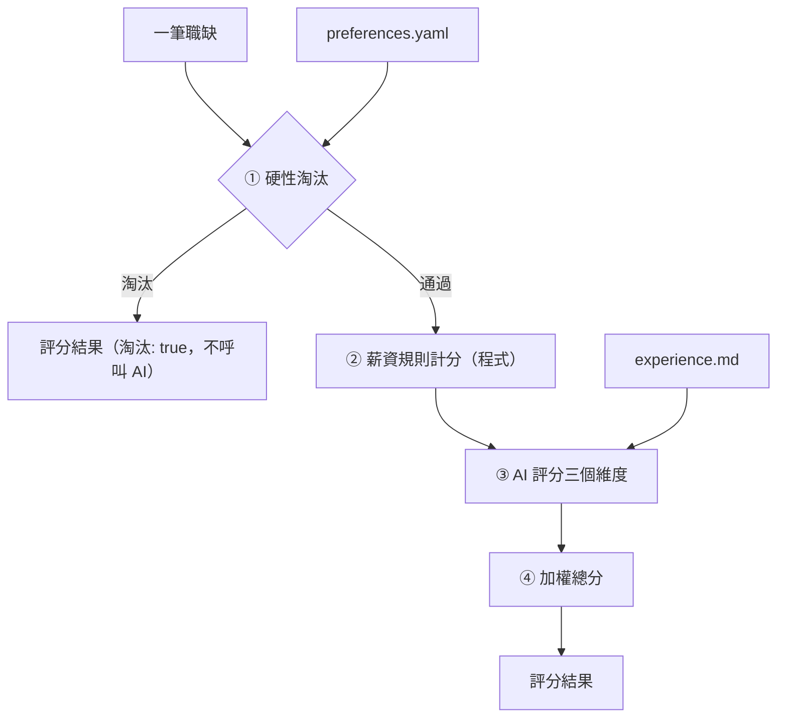
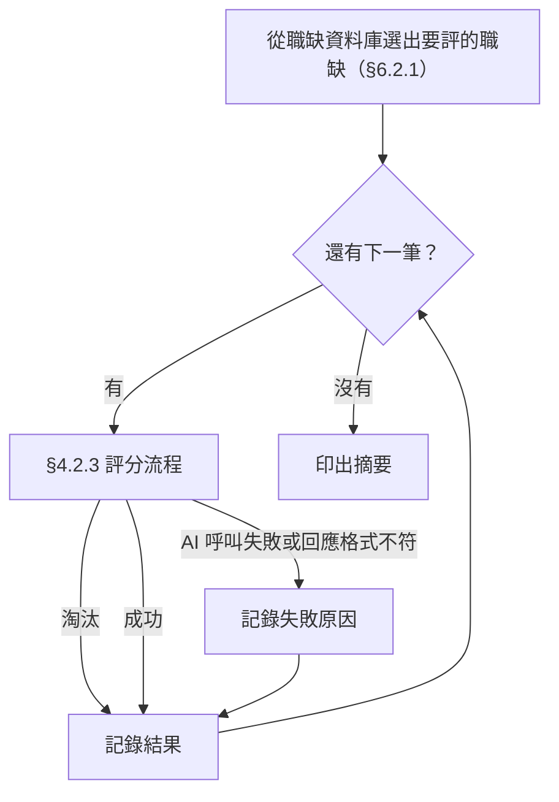
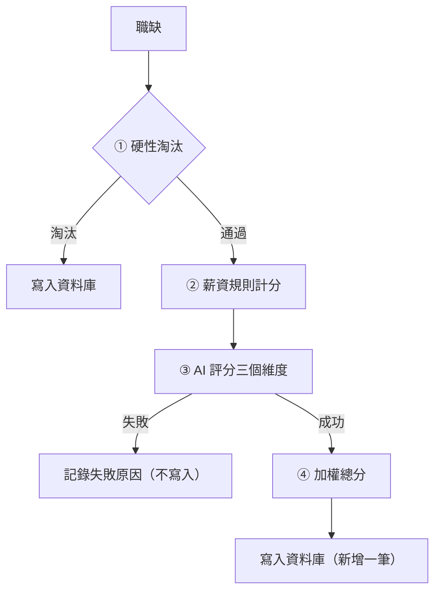

# 職缺自動評分

- ID：job-auto-scoring
- 狀態：✅ 已完成
- 依賴：
  - job-database：從職缺資料庫讀取要評分的職缺，欄位依其職缺欄位契約
  - job-score-database：評分結果寫成它的評分紀錄，並疊加自動評分需要的欄位

## 1. 背景與目標

爬蟲一次會抓到上百筆職缺，逐筆閱讀並判斷是否適合自己，要花很多時間。

本功能讓使用者快速判斷哪些職缺值得細看、原因是什麼（UP-02）：

- 輸入：使用者提供的工作偏好與工作經歷
- 對職缺資料庫中還沒評分的職缺，或使用者挑的職缺，逐筆做多維度評分
- 產出總分與簡短評語，寫進評分資料庫（[job-score-database](job-score-database.md)）

目前的入口是 CLI，只是為了快速開發，之後會整合進 app。

## 2. 範圍

範圍內（實作時只做這些）：

- 使用者故事，一個故事一章，細節見各章的「需求」：
  - [評單筆職缺並看懂每個分數](#4-評單筆職缺並看懂每個分數score)（`score`）：✅
  - [明顯不合的職缺直接淘汰](#5-明顯不合的職缺直接淘汰filter)（`filter`）：✅
  - [一次評完多筆職缺](#6-一次評完多筆職缺batch)（`batch`）：✅
  - [評分結果存進評分資料庫](#7-評分結果存進評分資料庫store)（`store`）：✅
  - [換設定試跑而不影響正式分數](#8-換設定試跑而不影響正式分數dry-run)（`dry-run`）：✅
  - [依分數列出時看得出是哪個模型評的](#9-依分數列出時看得出是哪個模型評的list)（`list`）：✅
  - [保留評分歷史並和手動評分並存](#10-保留評分歷史並和手動評分並存history)（`history`）：✅
  - [同一筆職缺有多筆評分時，查詢以代表的評分為準](#11-同一筆職缺有多筆評分時查詢以代表的評分為準current)（`current`）：✅
- [§12 非功能需求](#12-非功能需求)：只在必要時呼叫 AI、個人資料與 API key 不進版控、資訊不足時分數為 `null`
- [§13 共用規則](#13-共用規則)：評分結果格式、CLI、AI 供應商與 API key

範圍外（實作時不要做）：

- 依分數查詢評分、手動記錄評分：屬 [job-score-database](job-score-database.md)
- 互動式瀏覽介面：見 [TODO.md](../../../TODO.md#web-app)，介面形式見[決策紀錄：介面形式選型](../decisions/interface-selection.md)
- 試跑結果檔的排序與篩選：只產出檔案，交給讀取結果檔的工具，例如 pandas
- Gemini 以外的 AI 供應商：只保留可替換的介面
- 通勤便利度、資歷門檻、工作型態與福利、競爭程度／新鮮度等維度：候選做法見 [TODO.md](../../../TODO.md)
- 修改爬蟲或擴充爬蟲欄位：見 [TODO.md](../../../TODO.md#爬蟲)
- 同一次執行內的失敗重試：失敗的職缺下次執行會再評（見 [§6](#6-一次評完多筆職缺batch)），立即重試見 [TODO.md](../../../TODO.md#職缺自動評分範圍外)
- 平行呼叫 AI：整批維持循序執行

## 3. 輸入與輸出

- 輸入的職缺：職缺資料庫中的職缺，以 `--db` 指定資料庫，與評分結果寫入的是同一個資料庫。
  - 要評哪些職缺見 [§6.2.1](#621-要評哪些職缺)。
  - 還沒進資料庫的 JSON，先用爬蟲的匯入指令匯進來（見 [104-job-scraper §8](104-job-scraper.md#8-把過去抓好的-json-匯進來import)）。
  - 欄位依 [job-database §7.2.1](job-database.md#721-職缺欄位契約)。
  - 各維度實際看哪些欄位見 [§4.2.4](#424-評分維度)。
- 輸入的個人資料：`profile/preferences.yaml` 與 `profile/experience.md`，格式見 [§4.2.1](#421-個人資料檔)。
  - 由使用者自己維護，不來自其他功能。
- 終端機輸出：不論評幾筆，都只顯示進度與摘要，見 [§6.2.3](#623-摘要)。
- 試跑輸出：不論評幾筆，都寫成 `output/scores/` 下的試跑結果檔，見 [§8.2.2](#822-試跑結果檔)。
- 評分結果都寫進評分資料庫，寫入的欄位見 [§7.2.1](#721-寫入的評分紀錄)，查詢見 [job-score-database §4](job-score-database.md#4-依分數查詢評分query)，列表多帶的欄位見 [§9](#9-依分數列出時看得出是哪個模型評的list)。試跑的結果不寫入。

## 4. 評單筆職缺並看懂每個分數（score）

身為求職者，我想要依照寫成檔案的偏好與經歷替職缺評分，並看到每個維度的分數與理由，以便每次都用同一套標準，並知道總分是怎麼來的、判斷要不要相信它。

調整提示詞的開發者也用 `--job-no` 指定幾筆職缺反覆評分，並加上 `--dry-run`（`--job-no ... --dry-run`，見 [§13.2.2](#1322-cli)）避免寫進正式的評分。

### 4.1 需求

- FR-score-profile：從指定目錄讀取 `preferences.yaml` 與 `experience.md`。
  - `preferences.yaml` 依 [§4.2.2](#422-preferencesyaml-欄位字典) 驗證。
  - 缺少欄位、型別錯誤或權重的鍵不符時報錯，不補預設值。
- FR-score-salary：依 [§4.2.6](#426-薪資換算與計分) 換算月薪並計算薪資分數。
  - 面議、時薪、日薪、論件計酬與缺值都視為未知（`null`）。
  - 薪資未知不會因此被淘汰。
- FR-score-ai：由 AI 依 [§4.2.5](#425-ai-維度的錨點描述) 的錨點，為三個 AI 維度各給 1–5 分或 `null`。
  - 每個維度都附上理由，另外提供總評。
  - AI 回應必須通過 [§4.2.9](#429-ai-回應的檢查) 的檢查，否則視為失敗。
- FR-score-total：依 [§4.2.7](#427-總分) 計算 0–100 的加權總分。
  - 分數為 `null` 的維度以 3 分代入，讓所有沒被淘汰的職缺都有可以互相比較的總分。

### 4.2 規則

#### 4.2.1 個人資料檔

兩個檔案都放在 `profile/`：

- `profile/preferences.yaml`：偏好、門檻與權重。
  - 格式是 YAML，鍵名用中文。
- `profile/experience.md`：工作經歷與技能，原文放進提示詞。
  - 格式是自由格式的 Markdown。
- 兩個檔案都不進版控，版控中只保留 `.example` 範本（見 [§12.1](#121-需求)）。

#### 4.2.2 preferences.yaml 欄位字典

所有欄位都是必填。缺少欄位或型別錯誤時，顯示錯誤訊息並結束，不補預設值。

- `目標方向`（list[str]）：想做的工作內容、想累積的能力，給 AI 判斷「職涯方向契合度」
- `產業偏好.喜歡`（list[str]）：偏好的產業或公司類型
  - 可以是空清單
- `產業偏好.不喜歡`（list[str]）：不偏好的產業（降低分數，但不淘汰）
  - 可以是空清單
- `薪資.期望月薪`（int）：期望月薪（元）
- `薪資.底線月薪`（int）：可接受的最低月薪（元）
  - 必須 ≤ `期望月薪`
- `薪資.年薪換算月數`（int）：年薪換算月薪時的除數（例如 14）
- `淘汰條件.公司`（list[str]）：直接淘汰的公司名稱（完全比對 `公司名稱`）
  - 可以是空清單
- `淘汰條件.職稱關鍵字`（list[str]）：`職缺名稱` 含其中任一字串就淘汰（不分大小寫）
  - 可以是空清單
  - 不可含空字串，空字串會命中所有職稱
- `權重`（dict[str, float]）：各維度的權重
  - 鍵必須剛好是 [§4.2.4](#424-評分維度) 的四個維度名稱
  - 值 ≥ 0，且總和 > 0
  - 不要求總和為 1

範例：

```yaml
目標方向:
  - 以 Python 開發後端服務與資料管線
  - 參與 LLM 應用的設計與落地
產業偏好:
  喜歡: [軟體及網路相關業, 金融科技]
  不喜歡: [博弈]
薪資:
  期望月薪: 70000
  底線月薪: 55000
  年薪換算月數: 14
淘汰條件:
  公司: []
  職稱關鍵字: [業務, 客服]
權重:
  職涯方向契合度: 0.4
  技能匹配度: 0.25
  產業公司吸引力: 0.15
  薪資水準: 0.2
```

#### 4.2.3 評分流程



- 「一筆職缺」是職缺資料庫中的一筆職缺，欄位見 [job-database 的職缺欄位契約](job-database.md#721-職缺欄位契約)。
- ① 的規則見 [§5.2.1](#521-硬性淘汰規則)。被淘汰的職缺在 ① 就停止，不呼叫 AI：
  - 節省費用
  - 不需要 API key
- ② 和 ③ 各自獨立，任何一個維度都可能是 `null`（未知），由 ④ 統一處理。
- 評分結果的欄位見 [§13.2.1](#1321-評分結果格式)。

#### 4.2.4 評分維度

每個維度的分數都是 1–5 的整數，或 `null`（資訊不足）。

- `職涯方向契合度`
  - 判斷者：AI
  - 使用的職缺欄位：職缺名稱、工作內容
  - 比對的個人資料：`preferences.yaml` 的 `目標方向`
- `技能匹配度`
  - 判斷者：AI
  - 使用的職缺欄位：職缺名稱、工作內容、電腦專長、科系要求
  - 比對的個人資料：`experience.md` 全文
- `產業公司吸引力`
  - 判斷者：AI
  - 使用的職缺欄位：公司名稱、產業類別
  - 比對的個人資料：`preferences.yaml` 的 `產業偏好`
- `薪資水準`
  - 判斷者：程式
  - 使用的職缺欄位：薪資待遇、薪資下限、薪資上限
  - 比對的個人資料：`preferences.yaml` 的 `薪資`

#### 4.2.5 AI 維度的錨點描述

這些描述要原文放進提示詞，讓分數有一致的標準。

職涯方向契合度（包含這份工作能否累積目標方向需要的能力）：

- 5：主要工作內容就是目標方向之一，做了能直接累積目標能力
- 4：大部分工作內容符合目標方向，少部分無關
- 3：部分相關，或是可以作為轉往目標方向的跳板
- 2：只有少量沾邊，主要工作內容與目標無關
- 1：與目標方向無關或背道而馳
- null：`工作內容` 為 null，且無法只憑職缺名稱判斷

技能匹配度（依工作經歷評估現在能否勝任）：

- 5：要求的核心技能都具備，而且有實際經歷佐證
- 4：具備大部分核心技能，缺口可以在短期內補上
- 3：具備約一半的核心技能，有明顯但可以跨越的缺口
- 2：只具備少數要求的技能，需要大量補強
- 1：核心技能幾乎都不具備
- null：根據現有欄位（職缺名稱、工作內容、電腦專長、科系要求）仍無法判斷職缺要求哪些技能

`理由` 必須列出主要的技能缺口（沒有缺口就寫「無明顯缺口」）。

資料是否足以評分由 AI 判斷，程式不設固定條件：

- 例如 `工作內容` 為 null，但職缺名稱已經能看出核心技能（如「資深 iOS 工程師」）時，仍然可以給分。
- 這時 `理由` 要說明是依據哪些欄位判斷的。

產業公司吸引力（只根據產業類別與公司名稱判斷）：

- 5：屬於 `產業偏好.喜歡` 中的產業
- 4：與喜歡的產業高度相關
- 3：中性，既不在喜歡、也不在不喜歡的清單中
- 2：與不喜歡的產業相關
- 1：屬於 `產業偏好.不喜歡` 中的產業
- null：`產業類別` 為空

#### 4.2.6 薪資換算與計分

先換算成月薪，依 `薪資待遇` 的開頭字串判斷薪資類型（以 104 實際資料為準）：

- `月薪`：直接使用。
  - 例如 `月薪55,000~65,000元`，下限 55000、上限 65000。
- `年薪`：下限、上限都除以 `年薪換算月數`，四捨五入到整數（見 [§4.2.7](#427-總分) 的進位規則）。
  - 例如 `年薪700,000~1,000,000元`，下限 700000、上限 1000000。
- `待遇面議`、`時薪`、`日薪`、`論件計酬`、其他：無法換算，薪資未知。
  - 例如 `待遇面議`，下限、上限都是 0。
- `薪資待遇` 為 null：無法判斷類型，薪資未知。

其他規則：

- `薪資下限` 為 null 或 0 → 薪資未知。
- `薪資上限` ≥ 9999999 → 上限記為「無」。
  - 這個值代表「以上」、沒有上限，實際資料中的值是 `9999999`。
- `薪資上限` 為 null → 上限記為「無」。

再計算分數。使用的符號：

- `low`：換算後的月薪下限
- `high`：換算後的月薪上限，可能是「無」

依序判斷，第一個符合的條件決定分數：

1. 薪資未知：`null`
2. `low` ≥ `期望月薪`：5
3. `high` 不是「無」且 `high` ≥ `期望月薪`：4
4. 其他：2

「`high` < `底線月薪`」的情況已經在 [§5.2.1](#521-硬性淘汰規則) 被淘汰，不會進到計分。

`薪資水準` 的 `理由` 由程式產生，例如 `月薪 55,000–65,000，期望 70,000，未達期望`。

#### 4.2.7 總分

1. 分數為 `null` 的維度以 3 分（中性）代入。
   - 所有職缺都用相同的四個維度與權重計算，總分才能互相比較。
   - 若只用已知維度計算，等於假設缺少的維度與其他維度表現相同，缺資料的職缺反而可能排在前面。
2. 計算四個維度的加權平均 `avg = Σ(wᵢ·sᵢ) / Σwᵢ`。
3. 換算成 0–100 分：`總分 = (avg − 1) / 4 × 100`，四捨五入到整數。沒被淘汰的職缺一定有總分。
   - .5 一律進位（62.5 → 63），不用五成雙（62.5 → 62）。
   - 計算不能有誤差：57.5 要進位成 58，不能因為計算誤差變成 57.4999… 而被捨去。
   - 年薪換算月薪也用同一規則。
4. 分數為 `null` 的維度名稱依 [§4.2.4](#424-評分維度) 的順序列入 `未知維度`，讓使用者知道哪些分數是代入的。
   - `維度` 中的分數仍保留 `null`。
   - `評語` 維持 AI 的原文，不另外加註。

#### 4.2.8 提示詞設計

- 提示詞模板與程式碼分開存放，調整提示詞時不必改程式。
- 給 AI 的指示：評分者角色、[§4.2.5](#425-ai-維度的錨點描述) 的錨點描述，以及以下規則：
  - 只根據提供的資料判斷
  - 資訊不足時給 `null` 並在理由中說明，不准猜分數
  - 理由要具體引用職缺內容
  - 使用繁體中文
- 送給 AI 的資料：
  - `目標方向`、`產業偏好`
  - experience.md 全文
  - 職缺欄位：職缺名稱、公司名稱、產業類別、工作內容、電腦專長、科系要求
  - 欄位為 null 或空字串時，明確寫出「（無資料）」
- 不把薪資與淘汰條件交給 AI：
  - 避免重複判斷。
  - 避免 AI 的判斷和規則衝突。

#### 4.2.9 AI 回應的檢查

AI 要回傳三個 AI 維度各自的分數與理由，以及一到兩句總評：

- 分數是 1–5 的整數或 `null`，理由不可省略。
- 回應不符合這個格式時（例如分數超出範圍），視為該次評分失敗：
  - 記下失敗原因，列在摘要中，繼續評下一筆（見 [§6](#6-一次評完多筆職缺batch)）。
  - 不自行修正分數。

### 4.3 驗收

#### AC-score-profile：個人資料檔驗證與版控

- Given：
  - (a) `preferences.yaml` 缺少 `權重`
  - (b) `權重` 多了一個不存在的維度
  - (c) `底線月薪` 大於 `期望月薪`
  - (d) `淘汰條件.職稱關鍵字` 含空字串
- When：以這份偏好檔評一筆職缺
- Then：
  - 四種情況都顯示錯誤訊息並結束，不評分
  - 真實的 `profile/preferences.yaml`、`profile/experience.md`、`.env` 不進版控，對應的範本檔有進版控
  - 兩個範本檔都能通過驗證
- 通過條件：全部符合。

#### AC-score-salary：薪資計分

- Given：測試用的偏好（期望 70,000、底線 55,000、年薪 ÷14）
- When：以下列職缺計算薪資分數，並檢查是否被淘汰。每項是「`薪資待遇`（`薪資下限` / `薪資上限`）→ 薪資分數」：
  - `月薪70,000~90,000元`（70000 / 90000）→ 5
  - `月薪60,000~80,000元`（60000 / 80000）→ 4
  - `月薪56,000~60,000元`（56000 / 60000）→ 2
  - `年薪980,000~1,260,000元`（980000 / 1260000）→ 5，換算為 70,000~90,000
  - `年薪980,007~1,260,007元`（980007 / 1260007）→ 5，換算為 70,000.5~90,000.5，理由中為 70,001–90,001
  - `月薪50,000元以上`（50000 / 9999999）→ 2，沒有上限
  - `待遇面議`（0 / 0）→ `null`
  - `時薪500元以上`（500 / 9999999）→ `null`
  - `論件計酬3,000~15,000元`（3000 / 15000）→ `null`
  - null（null / null）→ `null`
- Then：薪資分數符合上列結果與 [§4.2.6](#426-薪資換算與計分)，而且都不會被淘汰
- 通過條件：全部符合。

#### AC-score-total：總分計算

- Given：權重 0.4 / 0.25 / 0.15 / 0.2
- When：以下列分數組合計算總分。每項是「職涯方向 / 技能 / 產業公司 / 薪資 → 總分」：
  - 5 / 5 / 5 / 5 → 100
  - 1 / 1 / 1 / 1 → 0
  - 4 / 4 / 5 / 4 → 79
  - 4 / 4 / 2 / 3 → 63，原始值 62.5，.5 一律進位
  - 5 / 1 / 3 / 3 → 58，原始值 57.5，不受計算誤差影響
  - 5 / 3 / `null` / `null` → 70，未知維度以 3 分代入
  - `null` / `null` / `null` / `null` → 50，全部未知，等同全部 3 分
- Then：結果符合上列總分與 [§4.2.7](#427-總分) 的公式
- 通過條件：全部符合。

#### AC-score-flow：評分流程與 AI 回應處理

- Given：
  - 一筆會被淘汰的職缺，與一筆不會被淘汰、薪資分數為 4 的職缺
  - AI 的回應以固定內容代替，準備三份：
    - 職涯方向契合度 5 分、技能匹配度 `null`、產業公司吸引力 3 分，總評為「總評」
    - 職涯方向契合度與技能匹配度都是 `null`
    - 職涯方向契合度為 6 分
- When：分別評這兩筆職缺，並檢查超出範圍的回應
- Then：
  - 會被淘汰的職缺：
    - 沒有呼叫 AI
    - 結果為 `淘汰` true，`維度` 與 `總分` 都是 `null`
  - 不會被淘汰的職缺：
    - 呼叫 AI 1 次
    - `維度` 依序是四個維度名稱
    - `技能匹配度` 的分數為 `null`、`薪資水準` 為 4
    - `總分` 75，`未知維度` 為 `[技能匹配度]`，`評語` 為「總評」
  - 兩個維度都是 `null` 的回應：
    - `總分` 為 55
    - `未知維度` 為 `[職涯方向契合度, 技能匹配度]`
    - `評語` 維持「總評」，不加任何前綴
  - 6 分的回應不通過 [§4.2.9](#429-ai-回應的檢查) 的檢查
- 通過條件：全部符合。

#### AC-score-real：真實評分 〔需網路〕

- Given：
  - 已設定 `GEMINI_API_KEY`，沒有設定時跳過並說明原因
  - 固定的擬真測試資料：偏好檔、經歷檔，以及 5 筆改寫自 104 的職缺，已匯入測試用的職缺資料庫
- When：以 `--job-no` 指定其中第一筆有工作內容、而且沒被淘汰的職缺評分
- Then：
  - 從資料庫取出這筆的評分明細（見 [§7](#7-評分結果存進評分資料庫store)），符合 [§13.2.1](#1321-評分結果格式)，四個維度依序出現
  - 每個維度都有非空的理由，分數是 1–5 或 `null`
  - 總分在 0–100 之間
  - 印出評分明細供使用者閱讀
- 通過條件：
  - 自動檢查全部符合
  - 使用者閱讀印出的理由，確認內容確實引用了職缺內容，而且與自己的判斷大致相符

## 5. 明顯不合的職缺直接淘汰（filter）

身為求職者，我想要薪資太低、不想去的公司或職稱的職缺直接被淘汰，以便不浪費時間與 AI 費用。

### 5.1 需求

- FR-filter：依 [§5.2.1](#521-硬性淘汰規則) 檢查硬性淘汰條件。
  - 收集所有成立的淘汰原因。
  - 被淘汰的職缺不呼叫 AI。
- FR-filter-comment：被淘汰的職缺，`評語` 是淘汰原因組成的文字，格式見 [§5.2.2](#522-淘汰時的評語)。

### 5.2 規則

#### 5.2.1 硬性淘汰規則

符合任一條就淘汰。依序檢查全部條件，收集所有符合的原因，不在第一條就停止：

1. `公司名稱` 在 `淘汰條件.公司` 中 → 原因 `公司在排除名單：<公司名稱>`
2. `職缺名稱` 含 `淘汰條件.職稱關鍵字` 中的任一字串 → 原因 `職稱含排除關鍵字：<關鍵字>`
3. 依 [§4.2.6](#426-薪資換算與計分) 換算出的月薪上限存在，且小於 `底線月薪` → 原因 `薪資上限 <金額> 低於底線 <金額>`

薪資未知（面議、時薪、null 等）**不會**淘汰職缺。

淘汰在 [§4.2.3](#423-評分流程) 的第 ① 步執行。

#### 5.2.2 淘汰時的評語

- 格式是 `淘汰：` 接上[淘汰原因](#521-硬性淘汰規則)，多個原因以 `；` 分隔。
  - 例如 `淘汰：職稱含排除關鍵字：實習；薪資上限 30,000 低於底線 40,000`。
- 評分結果（[§13.2.1](#1321-評分結果格式)）、試跑結果檔（[§8.2.2](#822-試跑結果檔)）與評分資料庫（[§7.2.1](#721-寫入的評分紀錄)）的 `評語` 用同一段文字。

### 5.3 驗收

#### AC-filter-rules：硬性淘汰

- Given：測試用的偏好（底線 55,000、年薪 ÷14、排除「乙公司」與「業務」）
- When：以下列職缺檢查淘汰條件。每項是「`薪資待遇`（`薪資下限` / `薪資上限`）→ 淘汰原因」：
  - `月薪40,000~50,000元`（40000 / 50000）→ 1 條，含「底線」
  - `年薪560,000~700,000元`（560000 / 700000）→ 1 條，含「底線」，換算上限為 50,000
  - `月薪40,000~50,000元`（40000 / 50000），職稱 `業務專員`，公司 `乙公司` → 3 條（收集所有原因）
- Then：
  - 淘汰原因符合上列結果與 [§5.2.1](#521-硬性淘汰規則)
  - 職稱關鍵字不分大小寫（關鍵字 `sales` 會淘汰 `Senior SALES Manager`）
- 通過條件：全部符合。

#### AC-filter-no-key：被淘汰的職缺不需要 API key

- Given：沒有設定 API key
- When：評一筆會被淘汰的職缺
- Then：
  - 正常結束
  - 資料庫中這筆的評分明細 `淘汰` 為 true、`淘汰原因` 不為空
- 通過條件：全部符合。

#### AC-filter-comment：淘汰時的評語

- Given：一筆同時符合兩條淘汰條件的職缺
- When：評整批
- Then：
  - 資料庫中的 `評語` 是 `淘汰：<原因1>；<原因2>`
  - 總分仍為 `null`
- 通過條件：全部符合。

## 6. 一次評完多筆職缺（batch）

身為求職者，我想要一次評完所有還沒評分的職缺，或一次評完我挑出來的職缺，並在結束時看到成功、淘汰、失敗各幾筆，以便不必一筆一筆操作，也知道哪些職缺評分失敗。

### 6.1 需求

- FR-batch-unscored：不指定職缺時，評職缺資料庫中所有還沒評分的職缺，範圍與順序依 [§6.2.1](#621-要評哪些職缺)。
  - 評分失敗的職缺不會寫進資料庫（見 [§7](#7-評分結果存進評分資料庫store)），下次執行時會再評一次。
- FR-batch-job-nos：以 `--job-no` 指定職缺時，只評這幾筆，已經評過的也照樣重評，不沿用上次的評分。
  - 指定一筆或多筆的行為相同，都依本章的流程評分與印出摘要。
- FR-batch-order：依 [§6.2.1](#621-要評哪些職缺) 的順序，逐筆套用 [§4.2.3](#423-評分流程) 的流程。
- FR-batch-failure：單筆評分失敗（AI 呼叫失敗或回應不通過 [§4.2.9](#429-ai-回應的檢查) 的檢查）時，不中斷整批。
  - 記下失敗原因並繼續下一筆。
  - 這樣整批已經花掉的時間與 AI 費用不會白費。
- FR-batch-summary：整批評分結束時印出摘要，格式見 [§6.2.3](#623-摘要)：
  - 總筆數、成功、淘汰、失敗筆數
  - 失敗的職缺與失敗原因
- FR-batch-no-file：整批評分不寫結果檔，評分結果只寫進評分資料庫（見 [§7](#7-評分結果存進評分資料庫store)）。

### 6.2 規則

#### 6.2.1 要評哪些職缺

- 不指定 `--job-no`：
  - 評職缺資料庫中所有沒有任何評分紀錄的職缺。
    - 已經有評分的職缺不評，不論是自動或手動評分。所以手動評分不會被整批評分蓋過（查詢以最新的一筆為準，見 [§11](#11-同一筆職缺有多筆評分時查詢以代表的評分為準current)）。
    - 換了偏好、經歷或模型之後，要重評某幾筆時用 `--job-no` 指定。
  - 順序是最後出現時間由新到舊，中途中斷時，最近才出現的職缺已經先評完。最後出現時間相同的職缺，順序不保證。
  - 不限筆數。
  - 沒有需要評分的職缺時，印出 `[i] 沒有還沒評分的職缺`，正常結束。
- 指定 `--job-no`：
  - 依指定的順序評，重複的職缺代碼只評一次。
  - 有任何一筆不在職缺資料庫時，列出找不到的職缺代碼，顯示錯誤訊息並結束，一筆都不評。

#### 6.2.2 流程



- 每筆的「§4.2.3 評分流程」改為 [§7.2.2](#722-流程)：評完寫入資料庫。
- 逐筆處理，不平行呼叫 AI。
- 每筆開始前印出進度，例如 `⏳ [i] (3/120) Python 工程師 - 甲公司`。
- API key：
  - 整批都被淘汰時不需要 API key。
  - 缺少 API key 或指定了不支援的供應商，而且有需要呼叫 AI 的職缺時，每一筆都會失敗，所以在開始評分前就顯示錯誤訊息並結束，一筆都不評，也不寫入資料庫。
- AI 呼叫失敗，或回應不通過 [§4.2.9](#429-ai-回應的檢查) 的檢查：算單筆失敗，失敗原因記錄錯誤訊息。
- 不管成功、淘汰或失敗，每一筆職缺都會有一筆結果，算進摘要的筆數。
- 為什麼不寫結果檔：挑職缺改用依分數查詢（見 [job-score-database §4](job-score-database.md#4-依分數查詢評分query)），評分失敗的職缺列在摘要中。

#### 6.2.3 摘要

整批結束後印出：

```
🎉 [+] 評分完成：共 120 筆，成功 95、淘汰 23、失敗 2
```

有失敗時，另外逐筆印出 `[!] <職缺代碼> <職缺名稱>：<失敗原因>`。

### 6.3 驗收

#### AC-batch-unscored：選出還沒評分的職缺

- Given：職缺資料庫中有四筆職缺，最後出現時間各不相同：
  - 一筆沒有任何評分
  - 一筆只有手動評分
  - 一筆已經有自動評分
  - 一筆沒有任何評分，最後出現時間最新
- When：不指定 `--job-no` 評分，AI 的回應以固定內容代替
- Then：
  - 評了兩筆：沒有任何評分的兩筆；只有手動評分與已經有自動評分的那兩筆沒有評
  - 順序是最後出現時間由新到舊
  - 再執行一次時，印出 `[i] 沒有還沒評分的職缺`，正常結束，沒有呼叫 AI
- 通過條件：全部符合。

#### AC-batch-job-nos：指定職缺

- Given：職缺資料庫中有三筆不會被淘汰的職缺，其中一筆已經有自動評分
- When：
  - (a) 以 `--job-no` 依序指定已評過的那筆與另一筆，並重複指定其中一筆
  - (b) 以 `--job-no` 指定一筆存在的職缺與一個不存在的職缺代碼
  - (c) 以 `--job-no` 只指定已評過的那筆
- Then：
  - (a) 只評指定的兩筆，順序與指定的相同，各評一次，都呼叫 AI；沒有印出評分結果的 JSON，印出摘要
  - (b) 顯示錯誤訊息，內容包含不存在的職缺代碼，並結束；資料庫中沒有新增任何評分
  - (c) 呼叫 AI 重評，沒有印出評分結果的 JSON，印出摘要 `共 1 筆`
- 通過條件：全部符合。

#### AC-batch-order：整批評分

- Given：
  - 五筆職缺，依序為：正常、會被淘汰、正常、會評分失敗、正常
  - AI 的回應以固定內容代替
- When：依這個順序評整批
- Then：
  - 結果有 5 筆，職缺代碼的順序與評分的順序相同
  - AI 被呼叫 4 次，被淘汰的職缺沒有呼叫
  - 被淘汰的那筆 `淘汰` 為 true、沒有失敗原因
  - 成功的三筆沒有失敗原因
- 通過條件：全部符合。

#### AC-batch-failure：單筆失敗不中斷整批

- Given：三筆職缺，AI 的回應以固定內容代替：
  - 第一筆：AI 呼叫失敗
  - 第二筆：回傳 6 分
  - 第三筆：正常
- When：評整批
- Then：
  - 前兩筆有失敗原因，`總分`、`維度`、`評語` 為 `null`，`淘汰` 為 false
  - 第三筆有總分
  - 整批正常完成，沒有中斷
  - 前兩筆沒有寫進資料庫，第三筆有
- 通過條件：全部符合。

#### AC-batch-cli：整批 CLI 與摘要

- Given：測試用的偏好、經歷，職缺資料庫中有一筆正常、一筆會被淘汰的職缺，都還沒評分
- When：
  - (a) AI 的回應以固定內容代替，不指定 `--job-no` 執行 CLI
  - (b) 沒有設定 API key，職缺資料庫中只有會被淘汰的那筆，不指定 `--job-no`
  - (c) 沒有設定 API key，不指定 `--job-no`
  - (d) AI 的回應以固定內容代替，正常那筆 AI 呼叫失敗，不指定 `--job-no`
- Then：
  - (a) 正常結束，沒有印出評分結果的 JSON，摘要含 `共 2 筆，成功 1、淘汰 1、失敗 0`，沒有產生任何結果檔
  - (b) 正常結束，資料庫中該筆 `淘汰` 為 true
  - (c) 顯示提到 `GEMINI_API_KEY` 的錯誤訊息並結束，資料庫中沒有新增任何評分，會被淘汰的那筆也沒有
  - (d) 正常結束，摘要逐筆列出失敗的職缺代碼、職缺名稱與失敗原因
- 通過條件：全部符合。

#### AC-batch-real：真實整批評分 〔需網路〕

- Given：與 AC-score-real 相同
- When：不指定 `--job-no` 評分
- Then：
  - 正常結束
  - 印出摘要與前幾名的評語供使用者閱讀
- 只驗真實串接：選出哪些職缺、寫進資料庫等業務規則，由 [AC-batch-unscored](#ac-batch-unscored選出還沒評分的職缺)、[AC-store-write](#ac-store-write評分結果入庫) 以固定的 AI 回應驗證。
- 通過條件：
  - 自動檢查全部符合
  - 使用者抽查前幾名的評分理由是否合理

## 7. 評分結果存進評分資料庫（store）

身為求職者，我想要每次評分的結果都自動存進評分資料庫，以便之後依分數查詢。

### 7.1 需求

- FR-store-write：評分結果都寫進評分資料庫，寫入的欄位依 [§7.2.1](#721-寫入的評分紀錄)。
  - 評分成功與被淘汰的職缺都寫入。
  - 評分失敗的職缺不寫入，保留原本的評分。
- FR-store-db-path：CLI 以 `--db` 指定資料庫路徑。
  - 預設為 `data/jobs.db`，與 [job-database §7.1](job-database.md#71-需求) 的預設路徑相同。
  - 評分結果都會寫入資料庫，只有試跑例外（見 [§8](#8-換設定試跑而不影響正式分數dry-run)）。
- FR-store-get：以職缺代碼取出單筆的 `評分明細`（[§7.2.1](#721-寫入的評分紀錄)），得到各維度的分數與理由。
  - 內容與寫入時的評分結果相同。
  - 沒有評過這筆職缺時明確表示查不到。
  - 這筆職缺只有手動評分（見 [job-score-database §5](job-score-database.md#5-手動記錄評分manual)）時，沒有 `評分明細`，同樣表示查不到。

依分數列出評分屬 [job-score-database §4](job-score-database.md#4-依分數查詢評分query)，本功能只在列表多帶欄位（見 [§9](#9-依分數列出時看得出是哪個模型評的list)）。

### 7.2 規則

#### 7.2.1 寫入的評分紀錄

評分紀錄的基本欄位與保存規則依 [job-score-database §8.2](job-score-database.md#82-規則)，本功能這樣填：

- `職缺代碼`、`淘汰`、`總分`、`評語`：取自評分結果（[§13.2.1](#1321-評分結果格式)）的同名欄位。
- `評分時間`：這次寫入的時間。

另外疊加以下幾項，只有自動評分會有：

- `評分明細`：整份評分結果，格式依 [§13.2.1](#1321-評分結果格式)，要看各維度的分數與理由、淘汰原因時讀這裡。
  - 依分數列出時不帶這一項（見 [§9.2.1](#921-列表多帶的欄位)），以職缺代碼另外取出。
- `供應商`、`模型`：產生 AI 維度時使用的供應商與模型。
  - 被淘汰的職缺沒有呼叫 AI，這兩項為 `null`。

其他規則：

- 不記錄評分時使用的偏好檔與經歷內容，只記錄供應商與模型（見 [TODO.md](../../../TODO.md#職缺自動評分範圍外)）。
- 資料庫只放正式評分：試跑（換偏好檔、經歷、模型或提示詞來比較）時要加 `--dry-run`，否則會寫進資料庫，成為這筆職缺最新的評分（見 [§8](#8-換設定試跑而不影響正式分數dry-run)）。

#### 7.2.2 流程

每筆職缺套用以下流程，取代 [§4.2.3](#423-評分流程) 的直接評分。沒被淘汰的職缺每次都呼叫 AI，不沿用上次的評分。



- 每筆評完就寫入資料庫。
  - 寫入是新增一筆，不覆寫任何紀錄（見 [§10](#10-保留評分歷史並和手動評分並存history)）。
  - 和手動評分（見 [job-score-database §5](job-score-database.md#5-手動記錄評分manual)）並存，互不覆寫（見 [§10](#10-保留評分歷史並和手動評分並存history)）。
  - 整批中途中止時，已經評完的職缺留在資料庫。
  - 下次不指定 `--job-no` 執行時，已經有評分的職缺不再評（見 [§6.2.1](#621-要評哪些職缺)），只評剩下的職缺。
- 評分中途無法寫入資料庫時，顯示錯誤訊息並中止，已寫入的職缺留在資料庫。

### 7.3 驗收

#### AC-store-write：評分結果入庫

- Given：
  - 資料庫中已有「會評分失敗」那筆職缺的舊結果
  - 三筆職缺，依序為會評分成功、會被淘汰、會評分失敗
  - AI 的回應以固定內容代替
- When：以 `--job-no` 指定這三筆評分。已經有評分的職缺，不指定 `--job-no` 時不會評，所以要指定
- Then：
  - 成功與淘汰的兩筆寫入資料庫，欄位依 [§7.2.1](#721-寫入的評分紀錄)
  - 寫入的 `評分明細` 符合 [§13.2.1](#1321-評分結果格式)，淘汰、總分、評語與其中的值一致
  - 淘汰那筆的總分為 `null`
  - 評分失敗那筆的舊結果不變
- 通過條件：全部符合。

#### AC-store-db-path：資料庫路徑

- Given：
  - 一個只有職缺資料、還沒有評分結果的既有資料庫
  - 沒有設定 API key
- When：以 `--db` 指定該資料庫，評一筆會被淘汰的職缺
- Then：
  - 正常結束
  - 該資料庫多了這筆職缺的評分結果
  - 原本的職缺資料不變
- 通過條件：全部符合。

#### AC-store-get：取出單筆評分結果

- Given：
  - 資料庫中有一筆評過分的職缺
  - 另一筆職缺只有手動評分
- When：分別以評過、沒評過與只有手動評分的職缺代碼取出評分結果
- Then：
  - 評過時得到完整的評分結果，與寫入時相同，格式符合 [§13.2.1](#1321-評分結果格式)，各維度的分數與理由都在
  - 沒評過與只有手動評分時都明確表示查不到
- 通過條件：全部符合。

#### AC-store-real：真實評分結果入庫 〔需網路〕

- Given：與 [AC-score-real](#ac-score-real真實評分-需網路)、[AC-batch-real](#ac-batch-real真實整批評分-需網路) 相同，兩者共用一個測試用的資料庫，開始前清空，再匯入測試職缺
- When：執行 AC-score-real 與 AC-batch-real 的評分
- Then：
  - AC-score-real：資料庫有該職缺的結果
  - AC-batch-real：評分成功與被淘汰的職缺都有結果
    - 評分失敗的職缺不檢查：共用的資料庫中可能留有 AC-score-real 寫入的結果。失敗不寫入由 [AC-store-write](#ac-store-write評分結果入庫) 驗證
  - 沒被淘汰的職缺：
    - 總分、評語與評分明細中的值一致
    - 供應商、模型為 `gemini`、`gemini-3.8-flash`
  - 被淘汰的職缺：總分、供應商、模型為 `null`，`評分明細` 的 `淘汰原因` 不是空清單
  - 印出資料庫的路徑，跑完保留，使用者可以直接打開查看
- 通過條件：全部符合。

## 8. 換設定試跑而不影響正式分數（dry-run）

身為求職者，我想要換一份偏好、經歷或模型試跑評分，而且不影響已存的正式分數，以便比較不同設定的結果。

### 8.1 需求

- FR-dry-run：指定 `--dry-run` 時照常完整評分（會呼叫 AI），但不讀寫評分。
  - 必須以 `--job-no` 指定要評的一或多筆職缺，兩次試跑才能評同一組職缺來比較。
  - 職缺照樣從職缺資料庫讀取，但不寫入資料庫。
  - 指定一筆或多筆，結果都用同一種方式產出：寫成試跑的結果檔，不在終端機印出評分結果的 JSON。
- FR-dry-run-output：試跑結果寫成 JSON 與 CSV 兩個檔案，位置與格式依 [§8.2.2](#822-試跑結果檔)。
  - 每次試跑寫成新的一組檔案，不覆寫上次的試跑，換設定前後的兩次試跑可以並排比較。
  - CSV 用 Excel 開啟時能正常顯示中文。

### 8.2 規則

#### 8.2.1 流程

- 要評的職缺：`--job-no` 指定的職缺，找不到職缺與重複指定的處理同 [§6.2.1](#621-要評哪些職缺)。
  - 沒有指定 `--job-no` 時顯示錯誤訊息並結束。
- 試跑只從資料庫讀職缺，不讀寫評分，直接照 [§4.2.3](#423-評分流程) 的流程評分。
  - 資料庫檔不存在時顯示錯誤訊息並結束，不建立資料庫檔。
- 流程、進度、摘要與單筆失敗的處理都依 [§6.2](#62-規則)，評分失敗時列在摘要中，不算錯誤。
- 開始評分前先印出 `[i] 試跑：不寫入資料庫，不影響已存的評分`。
- 摘要（[§6.2.3](#623-摘要)）最後多印兩行試跑結果檔的路徑：

  ```
  [i] JSON：output/scores/dryrun_20260921_103000.json
  [i] CSV：output/scores/dryrun_20260921_103000.csv
  ```

- 需要呼叫 AI 時才需要 API key，規則同 [§6.2.2](#622-流程)；缺少 API key 時不寫試跑結果檔。
- 參數說明見 [§13.2.2](#1322-cli)。

#### 8.2.2 試跑結果檔

- 位置：專案根目錄的 `output/scores/`
  - 不論在哪個目錄執行，都寫到這裡。
  - 不存在時自動建立。
  - 不進版控。
- 檔名：`dryrun_` 加上試跑開始的時間 `YYYYMMDD_HHMMSS`。
  - 例如 `2026-09-21 10:30:00` 開始的試跑，輸出 `dryrun_20260921_103000.json` 與 `.csv`。
  - 帶時間，每次試跑才不會覆寫上次的結果。
  - 同名的檔案已經存在時（兩次試跑在同一秒開始），加上流水號，例如 `dryrun_20260921_103000_2.json`，仍不覆寫。
- 每筆除了 [§13.2.1](#1321-評分結果格式) 的欄位，還有：
  - 從職缺帶入的 `職缺名稱`、`公司名稱`、`薪資待遇`、`職缺連結`，不必回頭查職缺就能比較
  - `失敗原因` 欄位

欄位：

- `職缺代碼`（str）
- `職缺名稱`、`公司名稱`、`薪資待遇`、`職缺連結`（同 [job-database §7.2.1](job-database.md#721-職缺欄位契約)）：從職缺原樣帶入
- `淘汰`、`淘汰原因`、`維度`、`總分`、`未知維度`、`評語`（同 [§13.2.1](#1321-評分結果格式)）
  - 評分失敗時 `淘汰` 為 false，清單為空，其餘為 `null`
- `失敗原因`（str | null）：評分失敗時的錯誤訊息
  - 其他情況為 `null`

檔案格式：

- JSON：UTF-8，中文直接寫出、不轉成跳脫碼，縮排 2。
  - 內容是依評分順序排列的陣列，不另外排序。
  - 每個元素的鍵依上列順序排列。
- CSV：UTF-8 加上 BOM（`utf-8-sig`），Excel 才能正常顯示中文。每筆一列，欄位順序如下：
  - `職缺代碼`、`職缺名稱`、`公司名稱`、`薪資待遇`
  - `總分`，以及四個維度的分數
    - 欄名就是維度名稱，依 [§4.2.4](#424-評分維度) 的順序
    - 未知時留空
  - `未知維度`、`淘汰原因`（清單以 `, ` 合併）
  - `評語`、`失敗原因`、`職缺連結`

  CSV 不放各維度的理由，要看理由時查 JSON。

### 8.3 驗收

#### AC-dry-run：dry-run 試跑

- Given：
  - AI 的回應以固定內容代替，並記錄呼叫次數與收到的內容
  - 職缺資料庫中有一筆正常與一筆會被淘汰的職缺，正常的那筆已有評分結果
- When：
  - (a) 以 `--dry-run` 評正常的那筆兩次，兩次的開始時間不同
  - (b) 以 `--dry-run` 指定兩筆職缺
  - (c) 以 `--dry-run` 並以 `--db` 指定不存在的路徑，評正常的那筆
  - (d) 以 `--dry-run` 評分，不指定 `--job-no`
- Then：
  - (a)
    - 兩次都正常結束，終端機沒有印出評分結果的 JSON
    - 產生兩組只有該筆的試跑結果檔，檔名不同，第一次的檔案沒有被覆寫
    - AI 被呼叫 2 次
    - 送給 AI 的資料包含偏好的目標方向、經歷、職缺的工作內容，空欄位寫成「（無資料）」
    - 資料庫中該筆的結果沒有改變
  - (b) 正常結束，試跑結果檔有兩筆，資料庫沒有改變
  - (c) 顯示錯誤訊息並結束，沒有建立資料庫檔
  - (d) 顯示提到 `--job-no` 的錯誤訊息並結束，沒有呼叫 AI
- 通過條件：全部符合。

#### AC-dry-run-output：試跑結果檔

- Given：
  - 五筆職缺的試跑結果，依序為：正常、被淘汰、正常、評分失敗、正常
  - 試跑開始的時間是 `2026-01-02 03:04:05`
- When：
  - (a) 寫出試跑結果檔
  - (b) 接著以同一個開始時間再寫出一次
- Then：
  - (a)
    - 產生 `dryrun_20260102_030405.json` 與 `.csv`
    - JSON 可解析，每個元素的鍵與順序符合 [§8.2.2](#822-試跑結果檔) 的欄位
    - CSV：
      - 表頭符合 [§8.2.2](#822-試跑結果檔) 的欄位順序
      - 列的順序與 JSON 相同
      - 未知維度的分數欄是空的
      - 被淘汰那列的 `淘汰原因` 以 `, ` 合併
  - (b) 產生 `dryrun_20260102_030405_2.json` 與 `.csv`，(a) 的檔案沒有被覆寫
- 通過條件：全部符合。

## 9. 依分數列出時看得出是哪個模型評的（list）

身為求職者，我想要依分數列出評過的職缺時，也看到每筆是哪個供應商與模型評的，以便換過模型後分辨分數出自哪一次設定。

本章在評分資料庫的[依分數查詢評分](job-score-database.md#4-依分數查詢評分query)之上，疊加自動評分的欄位。

### 9.1 需求

- FR-list：依分數列出評分時，每筆在評分資料庫列表的欄位之外，多帶 [§9.2.1](#921-列表多帶的欄位) 的欄位。
  - 評分資料庫的列表規則不變：既有欄位、排序與篩選照 [job-score-database §4.2.1](job-score-database.md#421-列出評過分的職缺的結果)。

### 9.2 規則

#### 9.2.1 列表多帶的欄位

- `供應商`、`模型`：同 [§7.2.1](#721-寫入的評分紀錄)，被淘汰的職缺為 `null`。
- 不帶 `評分明細`：要看各維度的分數與理由時，以職缺代碼另外取出（見 [§7](#7-評分結果存進評分資料庫store)）。

### 9.3 驗收

#### AC-list：列表多帶供應商與模型

- Given：
  - 一筆正常、一筆會被淘汰的職缺
  - AI 的回應以固定內容代替
- When：評整批後依分數列出
- Then：
  - 每筆有評分資料庫列表的全部欄位，另外有 `供應商`、`模型`
  - 正常那筆的供應商、模型是這次評分用的；被淘汰那筆為 `null`
  - 沒有 `評分明細`
- 通過條件：全部符合。

## 10. 保留評分歷史並和手動評分並存（history）

身為求職者，我想要每次評分都留下紀錄，自動與手動評分都不覆寫任何紀錄，以便保留 AI 與自己每一次的判斷，也不會因為一次錯誤的評分弄壞已有的資料。

本章在評分資料庫的[評分紀錄契約](job-score-database.md#821-評分紀錄契約)與[保存規則](job-score-database.md#822-保存規則)之上，疊加自動評分與手動評分並存的規則。

### 10.1 需求

- FR-history-source：每筆評分紀錄標示 `評分來源`，值依 [§10.2.1](#1021-評分來源)。
  - 不遷移既有的評分紀錄：本功能之前建立的職缺資料庫要刪除後重建，評分紀錄不保留（遷移見 [TODO.md](../../../TODO.md#評分資料庫)）。
- FR-history-append：自動評分每次寫入都新增一筆紀錄，不覆寫任何紀錄，規則見 [§10.2.2](#1022-什麼時候新增一筆)。
  - 評分失敗時照 [§7](#7-評分結果存進評分資料庫store) 不寫入。
- FR-history-coexist：手動評分與自動評分並存，互不覆寫。
  - 手動評分每次寫入也新增一筆，取代評分資料庫「同一筆職缺再次手動評分時覆寫」的規則（見 [job-score-database §5](job-score-database.md#5-手動記錄評分manual)）。
  - 自動評分不覆寫手動評分。
- FR-history-no-delete：不提供刪除評分紀錄的方式。
  - 取代評分資料庫「清掉評分即可重評」的規則。
- FR-history-rename：`評分結果` 欄位改名為 `評分明細`，內容不變。
  - 和 `總分`、`評語` 區分：`總分`、`評語` 是結論，`評分明細` 是得出結論的各維度分數與理由、淘汰原因。
  - 評分結果格式（[§13.2.1](#1321-評分結果格式)）指一筆職缺評分結果的整份 JSON，名稱不變。

### 10.2 規則

#### 10.2.1 評分來源

- `manual`：使用者手動填入的評分。
- `auto`：本功能寫入的評分，包括被硬性淘汰的職缺，因為自動評分本來就包含規則判斷與 AI 判斷。
  - `供應商`、`模型` 只有 `auto` 且呼叫過 AI 時才有值；手動評分與被淘汰的職缺為 `null`。

#### 10.2.2 什麼時候新增一筆

- 自動評分成功或被淘汰時，一律新增一筆，不和先前的紀錄比較。
  - 結果和上一筆完全相同也新增，例如被淘汰的職缺重評時。
- 手動評分每次寫入也新增一筆。
- 評分失敗時不寫入（見 [§7](#7-評分結果存進評分資料庫store)）。

#### 10.2.3 多筆評分時的查詢

同一筆職缺有多筆評分紀錄時，查詢以代表的評分為準，見 [§11](#11-同一筆職缺有多筆評分時查詢以代表的評分為準current)。

### 10.3 驗收

#### AC-history-source：評分來源

- Given：
  - 一筆正常、一筆會被淘汰的職缺，AI 的回應以固定內容代替
  - 職缺資料庫中已有這兩筆職缺，還沒有任何評分
- When：評整批，再手動評分正常那筆
- Then：
  - 正常那筆的自動評分為 `auto`，供應商、模型有值
  - 被淘汰那筆為 `auto`，供應商、模型為 `null`
  - 手動評分為 `manual`，供應商、模型為 `null`
- 通過條件：全部符合。

#### AC-history-append：自動評分新增而不覆寫

- Given：一筆正常的職缺，已在職缺資料庫中、還沒有任何評分，AI 的回應以固定內容代替
- When：都以 `--job-no` 指定這筆
  - (a) 評兩次，職缺與設定都不變
  - (b) 修改 `權重` 後再評一次
- Then：
  - (a) AI 被呼叫 2 次，有兩筆 `auto` 紀錄
  - (b) 多一筆 `auto` 紀錄，總分依新權重改變，前兩筆不變
- 通過條件：全部符合。

#### AC-history-coexist：手動與自動並存

- Given：一筆職缺已有一筆自動評分
- When：
  - (a) 手動評分這筆職缺
  - (b) 以 `--job-no` 指定這筆再自動評分一次
  - (c) 再手動評分一次，評語不同
- Then：
  - (a) 自動評分的紀錄不變，多了一筆 `manual` 紀錄
  - (b) 手動評分的紀錄不變，多了一筆 `auto` 紀錄
  - (c) 多了一筆 `manual` 紀錄，上一筆 `manual` 紀錄還在、內容不變
- 通過條件：全部符合。

#### AC-history-no-delete：不提供刪除評分紀錄

- Given：資料庫中已有評分紀錄
- When：檢查評分資料庫與評分 CLI 提供的操作
- Then：
  - 沒有刪除評分紀錄的操作或參數
  - 以 `--job-no` 重新評分後，原本的評分紀錄都還在
- 通過條件：全部符合。

## 11. 同一筆職缺有多筆評分時，查詢以代表的評分為準（current）

身為求職者，我想要同一筆職缺有多筆評分時，查詢只看到一筆代表的評分，也能翻出這筆職缺的所有評分紀錄，以便排序時以最新的判斷為準，並比較前後的判斷。

本章依 [§10](#10-保留評分歷史並和手動評分並存history) 留下的多筆評分紀錄，調整評分資料庫與 [§7](#7-評分結果存進評分資料庫store) 的查詢。

### 11.1 需求

- FR-current-pick：以下查詢每筆職缺只用一筆代表的評分，選法依 [§11.2.1](#1121-代表的評分)。
  - 依分數列出（[job-score-database §4](job-score-database.md#4-依分數查詢評分query)）
  - 以職缺代碼取出評分紀錄（[job-score-database §6](job-score-database.md#6-取出單筆的完整評分紀錄detail)）
  - 以職缺代碼取出評分明細（[§7](#7-評分結果存進評分資料庫store)）
  - 列表與取出的評分紀錄多帶 `評分來源` 欄位。
  - 代表的評分是手動評分時沒有評分明細，取出評分明細時明確表示查不到。
- FR-current-all：以職缺代碼取出這筆職缺的所有評分紀錄，依評分時間由新到舊，評分時間相同時後寫入的在前。
  - 沒有評過這筆職缺時是空清單。

### 11.2 規則

#### 11.2.1 代表的評分

- 用評分時間最新的一筆，不分 `auto` 或 `manual`。
  - 評分時間相同時，用後寫入的一筆。
  - 為什麼不讓手動評分優先，見[決策紀錄：多筆評分以最新的一筆為準](../decisions/latest-score-wins.md)。
- 依分數列出時的排序與篩選照 [job-score-database §4.2.1](job-score-database.md#421-列出評過分的職缺的結果)，以代表的評分計算。
  - 例如自動評分沒淘汰、較新的手動評分淘汰時，只列出沒被淘汰的職缺不含這筆。

#### 11.2.2 所有評分紀錄的欄位

每筆評分紀錄包含：

- 評分紀錄的基本欄位（[job-score-database §8.2.1](job-score-database.md#821-評分紀錄契約)）
- `評分來源`（[§10.2.1](#1021-評分來源)）
- `供應商`、`模型`（[§7.2.1](#721-寫入的評分紀錄)）
- `評分明細`（[§7.2.1](#721-寫入的評分紀錄)）：用來比較 AI 每一次各維度的分數與理由
  - 手動評分沒有評分明細，為 `null`

### 11.3 驗收

#### AC-current-pick：代表的評分

- Given：
  - 職缺 A：兩筆不同時間的 `auto` 紀錄
  - 職缺 B：一筆 `auto`、一筆 `manual` 紀錄，`manual` 的評分時間較新
  - 職缺 C：一筆 `auto`、一筆 `manual` 紀錄，`auto` 的評分時間較新
  - 職缺 D：一筆 `manual`、一筆 `auto` 紀錄，評分時間相同，`auto` 後寫入
- When：
  - 依分數列出
  - 分別以職缺代碼取出評分紀錄
  - 分別以職缺代碼取出評分明細
- Then：
  - 列出時每筆職缺只有一筆：A、C、D 用較新或後寫入的 `auto`，B 用 `manual`，並帶出 `評分來源`
  - 取出的評分紀錄與列出的那筆相同
  - A、C、D 取出列出的那筆 `auto` 的評分明細，B 明確表示查不到
- 通過條件：全部符合。

#### AC-current-all：所有評分紀錄

- Given：與 [AC-current-pick](#ac-current-pick代表的評分) 相同
- When：分別取出 A、B、C、D 與一筆沒評過的職缺的所有評分紀錄
- Then：
  - 每筆職缺各兩筆，依評分時間由新到舊；D 的兩筆評分時間相同，後寫入的 `auto` 在前
  - 沒評過的職缺是空清單
- 通過條件：全部符合。

## 12. 非功能需求

### 12.1 需求

- NFR-cost：只有真的需要 AI 判斷時才呼叫 AI。
  - 被淘汰的職缺不呼叫 AI（見 [§5](#5-明顯不合的職缺直接淘汰filter)）。
- NFR-privacy：真實的個人資料檔與 API key 不進版控。版控中只提供範本：
  - `profile/preferences.yaml`、`profile/experience.md` 的範本是 `.example` 檔（見 [§4.2.1](#421-個人資料檔)）。
  - `.env` 的範本是 `.env.example`（見 [§13.2.3](#1323-ai-供應商與-api-key)）。
- NFR-null：資訊不足時分數為 `null`，不猜分數、不回填預設值（依 [development.md](../../conventions/development.md#防禦性設計)）。
  - AI 資訊不足時給 `null`（[§4.2.8](#428-提示詞設計)）。
  - 薪資無法換算時為 `null`（[§4.2.6](#426-薪資換算與計分)）。
  - 總分計算時才以 3 分代入，並把這些維度列入 `未知維度`（[§4.2.7](#427-總分)）。

### 12.2 規則

- 呼叫 AI 時要求供應商不保存互動紀錄，因為提示詞含個人經歷。
- 整批依序呼叫 AI，不平行呼叫（見 [§6.2.2](#622-流程)）。

### 12.3 驗收

本章的需求由各章既有的驗收涵蓋，不另外寫：

- NFR-cost：
  - [AC-score-flow](#ac-score-flow評分流程與-ai-回應處理)（會被淘汰的職缺沒有呼叫 AI）
  - [AC-batch-order](#ac-batch-order整批評分)（被淘汰的職缺沒有呼叫）
- NFR-privacy：[AC-score-profile](#ac-score-profile個人資料檔驗證與版控)（真實的個人資料與 API key 不進版控）
- NFR-null：
  - [AC-score-salary](#ac-score-salary薪資計分)（薪資未知為 `null`）
  - [AC-score-flow](#ac-score-flow評分流程與-ai-回應處理)（`null` 維度列入 `未知維度`）

## 13. 共用規則

跨越各章的規則：評分結果格式、CLI、AI 供應商的選擇與 API key。

### 13.1 需求

- FR-cli：提供 `src/score_job.py` CLI，參數與錯誤訊息依 [§13.2.2](#1322-cli)。
  - 以 `--job-no` 指定要評的職缺，省略時評所有還沒評分的職缺（見 [§6.2.1](#621-要評哪些職缺)）；不論評幾筆，都只印出進度與摘要。
  - `--dry-run` 試跑，見 [§8](#8-換設定試跑而不影響正式分數dry-run)。
- FR-llm：AI 供應商以 `--provider` 選擇，規則依 [§13.2.3](#1323-ai-供應商與-api-key)。
  - 預設使用 Gemini。

### 13.2 規則

#### 13.2.1 評分結果格式

一筆職缺的評分結果：

- 試跑結果檔（[§8.2.2](#822-試跑結果檔)）與寫進評分資料庫的 `評分明細` 欄位（[§7.2.1](#721-寫入的評分紀錄)）都以它為基礎。
- 不在終端機印出，要看時從資料庫取出評分明細（見 [§7](#7-評分結果存進評分資料庫store)）。
- 使用中文鍵名，與爬蟲的輸出一致。

欄位：

- `職缺代碼`（str）：對應到輸入職缺
- `淘汰`（bool）：是否被硬性淘汰
- `淘汰原因`（list[str]）：[§5.2.1](#521-硬性淘汰規則) 的原因
  - 沒被淘汰時是空清單
- `維度`（dict[str, {分數: int | null, 理由: str}] | null）：鍵依 [§4.2.4](#424-評分維度) 的順序排列
  - 被淘汰時為 `null`
- `總分`（int | null）：0–100
  - 被淘汰時為 `null`
- `未知維度`（list[str]）：分數為 `null` 的維度
  - 被淘汰時是空清單
- `評語`（str）：AI 產生的一到兩句總評，程式不修改
  - 被淘汰時是淘汰原因組成的文字，格式見 [§5.2.2](#522-淘汰時的評語)

範例：

```json
{
  "職缺代碼": "8s12x",
  "淘汰": false,
  "淘汰原因": [],
  "維度": {
    "職涯方向契合度": {"分數": 4, "理由": "主要負責 Python 後端 API，另含部分維運工作"},
    "技能匹配度": {"分數": 4, "理由": "缺口：Kubernetes，可短期補上"},
    "產業公司吸引力": {"分數": 5, "理由": "軟體及網路相關業，屬於偏好產業"},
    "薪資水準": {"分數": 4, "理由": "月薪 60,000–80,000，區間涵蓋期望 70,000"}
  },
  "總分": 79,
  "未知維度": [],
  "評語": "方向相符的後端職缺，補上雲端部署經驗即可投遞。"
}
```

#### 13.2.2 CLI

```bash
uv run src/score_job.py [--job-no <職缺代碼> [<職缺代碼> ...]] [--dry-run] \
    [--profile-dir profile] [--provider gemini] [--model gemini-3.8-flash] [--db data/jobs.db]
```

- `--job-no`：只評這幾筆職缺，可以指定多筆，以空白分隔
  - 指定一筆或多筆的行為相同，依指定的順序評，已經評過的也照樣重評（見 [§6.2.1](#621-要評哪些職缺)）
  - 有職缺代碼不在職缺資料庫時顯示錯誤訊息並結束，一筆都不評
  - 省略時評所有還沒評分的職缺（見 [§6](#6-一次評完多筆職缺batch)）
- `--profile-dir`：放 `preferences.yaml` 與 `experience.md` 的目錄
  - 預設為專案根目錄下的 `profile/`，不論在哪個目錄執行都相同
- `--provider`：AI 供應商，預設 `gemini`
- `--model`：模型名稱，預設 `gemini-3.8-flash`
- `--dry-run`：試跑（見 [§8](#8-換設定試跑而不影響正式分數dry-run)），用於換一份偏好檔、經歷或模型，實際看 AI 會給幾分、理由是什麼
  - 完整評分，會呼叫 AI
  - 必須搭配 `--job-no`
  - 只從資料庫讀職缺，不讀寫評分，不影響已存的正式分數
  - 結果都寫成試跑結果檔（檔名見 [§8.2.2](#822-試跑結果檔)），不印出評分結果的 JSON
- `--db`：讀取職缺與寫入評分的資料庫，預設為專案根目錄的 `data/jobs.db`（見 [§7](#7-評分結果存進評分資料庫store)）
  - 檔案不存在時顯示錯誤訊息並結束，不建立資料庫檔

輸出：

- 正式評分：結果只寫進資料庫，終端機只顯示進度與摘要。
- 試跑：結果寫成試跑結果檔，終端機只顯示進度與摘要。

以下情況會顯示錯誤訊息並結束，不產生評分結果：

- 個人資料檔缺少或格式錯誤
- 資料庫檔不存在
- `--job-no` 指定的職缺代碼不在職缺資料庫
- 試跑沒有指定 `--job-no`
- 不支援的供應商
- 缺少 API key（只有真的要呼叫 AI 時才需要）
- 無法開啟或寫入資料庫（評分中途無法寫入的行為見 [§7.2.2](#722-流程)）

個別職缺評分失敗（AI 呼叫失敗，或回應不通過 [§4.2.9](#429-ai-回應的檢查) 的檢查）不算錯誤，失敗筆數見摘要。

#### 13.2.3 AI 供應商與 API key

- 以 `--provider`、`--model` 選擇 AI 供應商與模型，目前只支援 `gemini`。
- API key 從環境變數 `GEMINI_API_KEY` 讀取：
  - 可以寫在專案根目錄的 `.env`，不進版控，範本是 `.env.example`。
  - shell 已經設定的值優先，`.env` 不會覆寫。
  - 只有真的要呼叫 AI 時才需要（被淘汰時不需要）。

### 13.3 驗收

#### AC-cli-error：錯誤處理

- Given：沒有設定 API key
- When：
  - (a) 評一筆正常的職缺
  - (b) 指定不存在的職缺代碼
  - (c) 指定不支援的供應商
  - (d) 以 `--db` 指定不存在的資料庫檔
- Then：
  - (a) 顯示提到 `GEMINI_API_KEY` 的錯誤訊息並結束
  - (b) 顯示錯誤訊息並結束
  - (c) 被拒絕，提示不支援的供應商
  - (d) 顯示錯誤訊息並結束，沒有建立資料庫檔
- 通過條件：全部符合。

## 14. 待決問題

無。
