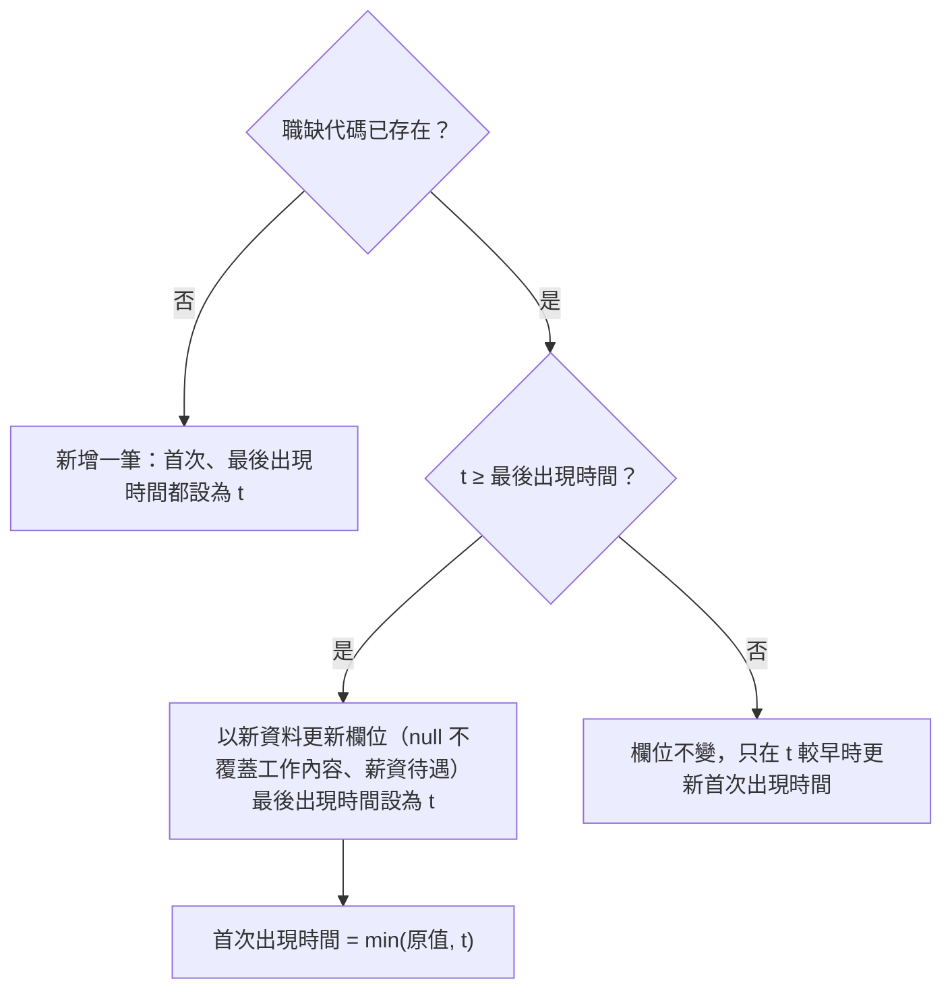

# 職缺資料庫

- ID：job-database
- 狀態：待實作
- 依賴：無

## 1. 背景與目標

求職者每隔一段時間就會取得一些新職缺，但每一次的結果都是獨立的清單，彼此沒有關聯（UP-01）：

- 同一筆職缺在不同次的結果中重複出現，只能人工比對。
- 看不出哪些職缺是這次新出現的，也看不出一筆職缺開了多久。
- 零散的清單無法累積成歷史資料，看不出職缺的長期變化。

本功能把寫進來的職缺全部整理到同一個職缺資料庫：

- 以職缺代碼跨次去重
- 記錄每筆職缺第一次與最後一次出現的時間
- 記錄每次寫入的條件
- 在職缺表上瀏覽、篩選、排序累積下來的職缺

## 2. 範圍

範圍內（實作時只做這些）：

- 使用者故事，一個故事一章，細節見各章的「需求」：
  - [累積寫進來的職缺，看出哪些是新的](#4-累積寫進來的職缺看出哪些是新的save)（`save`）：✅
  - [在職缺表瀏覽、篩選累積下來的職缺](#5-在職缺表瀏覽篩選累積下來的職缺query)（`query`）：〔規劃中〕
  - [只看剛存入的職缺](#6-只看剛存入的職缺just-saved)（`just-saved`）：〔規劃中〕
- [§7 非功能需求](#7-非功能需求)：資料庫只存在本機、缺值不回填、改版時保留資料
- [§8 共用規則](#8-共用規則)：資料庫路徑、職缺欄位契約、保存的資訊

範圍外（實作時不要做）：

- 把職缺寫進資料庫的入口與寫入條件：屬各來源功能，職缺怎麼流進資料庫見[使用者旅程](../overview.md#使用者旅程)
- 判斷職缺是否已下架：只記錄最後一次出現的時間，不推論是否下架（見 [§8.2.2](#822-保存的資訊)）
- 保留職缺內容的歷史版本：只保留最新一版
- 在職缺表挑選過去任何一次寫入的職缺：只做「剛存入的職缺」（見 [§6](#6-只看剛存入的職缺just-saved)），職缺表才不依賴執行紀錄；執行紀錄的用途等趨勢分析規劃時再定（見 [TODO.md](../../../TODO.md#做趨勢圖表)）
- 在網頁上手動新增一筆職缺：和職缺欄位契約的平台中立化一起規劃，見 [TODO.md](../../../TODO.md#把職缺欄位契約改成平台中立)

## 3. 輸入與輸出

- 輸入：一份職缺清單與這次寫入的條件，由寫入資料庫的功能提供（有哪些來源見[使用者旅程](../overview.md#使用者旅程)）。
  - 職缺的欄位依 [§8.2.1](#821-職缺欄位契約) 的職缺欄位契約。
- 輸出：職缺資料庫，保存的資訊見 [§8.2.2](#822-保存的資訊)。
  - 下游需要以職缺代碼為準、欄位固定的職缺資料。
  - 使用者在職缺表上瀏覽累積下來的職缺，見 [§5](#5-在職缺表瀏覽篩選累積下來的職缺query)。

## 4. 累積寫進來的職缺，看出哪些是新的（save）

身為求職者，我想要職缺全部累積到同一個地方，並知道哪些職缺是最近才出現的，以便不必自己管理一堆結果檔，也能優先查看新職缺。

### 4.1 需求

- FR-save-dedup：同一個 `職缺代碼` 在資料庫中只保留一筆職缺。
  - 首次出現時間、最後出現時間，以及更新欄位的時機依 [§4.2.1](#421-寫入規則)。
- FR-save-keep-detail：新資料的 `工作內容` 或 `薪資待遇` 為 `null`，而資料庫中已有非 null 的值時，保留舊值。
- FR-save-run：每次寫入都記一筆執行紀錄，內容依 [§8.2.2](#822-保存的資訊)。
  - 同時記錄這次寫入出現了哪些職缺。
- FR-save-transaction：一次寫入要嘛全部寫入，要嘛完全不寫入。
  - 中途失敗時，不留下只寫一半的資料。

### 4.2 規則

#### 4.2.1 寫入規則

以一次寫入的時間 `t` 寫入一批職缺，對每筆職缺：

- 只有 `t` 不早於資料庫中的最後出現時間時，才用新資料覆蓋欄位。結果：
  - 寫入的先後順序不會影響結果，補寫比較舊的資料也不會蓋掉新的。
  - 資料庫永遠保留最新一版的內容。
- 每筆職缺都記為這次寫入出現的職缺，不管是新增還是更新。

#### 4.2.2 詳情欄位不被 null 覆蓋

`工作內容`、`薪資待遇` 保留舊值，是缺值不回填（見 [§7](#7-非功能需求)）唯一的例外，理由如下：

- 來源取得職缺的詳細內容常因暫時性錯誤失敗，失敗時這兩欄為 `null`。
- 資料庫中的舊值來自同一個來源的同一個欄位，不是用摘要之類的其他來源回填。
- 如果讓 `null` 覆蓋舊值，一次失敗就會讓下游少了完整的工作內容。

### 4.3 驗收

#### AC-save-dedup：跨次去重與出現時間

- Given：
  - 兩批職缺有部分重疊，分別以時間 t1 < t2 寫入
  - 另一組以 t2、t1 的順序寫入
- When：寫入兩批
- Then：
  - 每個職缺代碼只有一筆
  - 重疊的職缺首次出現時間為 t1、最後出現時間為 t2，欄位內容為 t2 那批的值
  - 兩種寫入順序得到的職缺資料相同
- 通過條件：全部符合。

#### AC-save-keep-detail：null 不覆蓋既有內容

- Given：`工作內容` 與 `薪資待遇` 依下列情況設定資料庫中的值與新資料的值
- When：以較晚的時間寫入新資料
- Then：
  - 資料庫中非 null、新資料為 `null` → 保留舊值
  - 資料庫中非 null、新資料非 null → 寫入新值
  - 資料庫中為 `null`、新資料非 null → 寫入新值
  - 其他欄位的 `null` 照常覆蓋
- 通過條件：全部符合。

#### AC-save-run：執行紀錄與整批寫入

- Given：
  - 第一批：一批職缺與這次寫入的條件
  - 第二批：其中有一筆在寫入時會失敗
- When：分別寫入
- Then：
  - 第一批多一筆執行紀錄，條件與職缺數正確，並記錄了這次出現的每筆職缺
  - 第二批寫入失敗後，資料庫內容沒有任何改變
- 通過條件：全部符合。

## 5. 在職缺表瀏覽、篩選累積下來的職缺（query）

〔規劃中〕本章整章改寫，尚未實作。

身為求職者，我想要在一張表上瀏覽、篩選、排序累積下來的職缺，並點開任一筆看完整內容，以便不必自己下 SQL，也不必在多個工具之間切換。

### 5.1 需求

- FR-query-list：職缺表一次列出全部符合篩選條件的職缺，不分頁，規則見 [§5.2.1](#521-列出的職缺)。
  - 顯示符合幾筆、共幾筆。
- FR-query-columns：可以勾選要顯示的欄位，可選的欄位與預設見 [§5.2.2](#522-欄位)。
- FR-query-sort：點欄位標題依該欄排序，再點一次反向，規則見 [§5.2.3](#523-排序)。
- FR-query-expand：點一列展開，顯示這筆職缺的完整內容，內容見 [§5.2.4](#524-展開的列)。
  - 再點一次收合。
- FR-query-filter：以關鍵字與地區篩選，規則見 [§5.2.5](#525-篩選)。
  - 「清除篩選」讓篩選回到預設（不篩選）。
- FR-query-remember：選好的欄位、篩選與排序記在瀏覽器，下次打開職缺表時沿用。
  - 記不住時（例如瀏覽器不允許保存）退回預設，不是錯誤。
- FR-query-reset：「還原預設檢視」讓欄位、篩選與排序都回到預設。

### 5.2 規則

#### 5.2.1 列出的職缺

- 每筆職缺的欄位依[保存的資訊](#822-保存的資訊)：[職缺欄位契約](#821-職缺欄位契約)的全部欄位，接著是 `首次出現時間`、`最後出現時間`。
- 預設排序是最後出現時間由新到舊，最近還出現的職缺排在前面。
- 沒有符合條件的職缺時，表格是空的並顯示符合 0 筆，不是錯誤。

#### 5.2.2 欄位

- 可以選的欄位：[職缺欄位契約](#821-職缺欄位契約)的全部欄位，加上 `首次出現時間`、`最後出現時間`。
- 預設顯示：`職缺名稱`、`公司名稱`、`地區`、`薪資待遇`、`最後出現時間`。
- 至少要留一欄，不能全部取消。
- 不另外取出縣市，也沒有「縣市」欄，要看地點時選 `地區` 欄。

#### 5.2.3 排序

- 點一個欄位的標題時依該欄排序，再點同一欄反向。
  - 第一次點數字欄位時由大到小，其他欄位由小到大。
- 沒有值的職缺（`null` 或空字串）一律排在最後，不論升冪或降冪。
- 值相同時，再以職缺代碼排序，同樣的資料每次排出來的順序才一致；預設排序也一樣。

#### 5.2.4 展開的列

- 點一列在它下方展開，一次只展開一列。
- 展開的內容：
  - 職缺欄位契約的全部欄位，包括完整的 `工作內容`
  - `首次出現時間`、`最後出現時間`
  - 職缺頁與公司頁的連結（`職缺連結`、`公司連結`），在新分頁開啟

#### 5.2.5 篩選

- 關鍵字：比對 `職缺名稱`、`公司名稱`、`工作內容`、`電腦專長`，任一欄含關鍵字就算符合。
- 地區：比對 `地區` 是否包含輸入的文字，可以篩到縣市或行政區，例如 `台北市`、`內湖`。
  - 不和關鍵字篩選合併：合併的話，輸入「台北」也會篩到工作內容提到台北的職缺。
  - `地區` 合併了縣市行政區與街道地址，所以也會比對到街道名稱；拆成兩欄後改成只比對縣市行政區（見 [TODO.md](../../../TODO.md#拆開地區欄位)）。
- 關鍵字與地區用同一套比對規則：
  - 多個關鍵字或多個地名以半形或全形逗號分隔，符合任一個就算。
  - 前後的空白不算，只有空白或逗號時等於沒有輸入。
  - 不分大小寫。
  - 「臺」視為「台」：輸入與欄位內容都把「臺」換成「台」再比對，因為 104 的地區一律寫「台」，其他欄位兩種寫法都有。
- 關鍵字與地區都有輸入時，兩個條件都要符合。
- 沒有輸入的條件不篩選。

### 5.3 驗收

#### AC-query-list：一次列出全部符合的職缺

- Given：資料庫中有 3 筆職缺，最後出現時間各不相同
- When：
  - (a) 不設任何篩選，打開職缺表
  - (b) 設一個只有 1 筆符合的關鍵字
  - (c) 設一個沒有職缺符合的關鍵字
- Then：
  - (a) 3 筆都列出，沒有分頁，顯示符合 3 筆、共 3 筆；順序是最後出現時間由新到舊
  - (b) 只列出那 1 筆，顯示符合 1 筆、共 3 筆
  - (c) 表格是空的，顯示符合 0 筆、共 3 筆，沒有錯誤訊息
- 通過條件：全部符合。

#### AC-query-columns：選欄位

- Given：第一次打開職缺表
- When：
  - (a) 查看顯示的欄位
  - (b) 勾選 `首次出現時間`、取消勾選 `薪資待遇`
  - (c) 取消勾選到只剩一欄，再取消最後一欄
- Then：
  - (a) 只顯示 [§5.2.2](#522-欄位) 的預設欄位；可以選的欄位是職缺欄位契約的全部欄位加上兩個出現時間
  - (b) 表格多了 `首次出現時間`、少了 `薪資待遇`
  - (c) 最後一欄取消不掉，表格至少留一欄
- 通過條件：全部符合。

#### AC-query-sort：排序

- Given：3 筆職缺，其中一筆的 `薪資下限` 為 `null`，另兩筆的 `薪資下限` 不同
- When：
  - (a) 點 `薪資下限` 標題
  - (b) 再點一次
- Then：
  - (a) 依 `薪資下限` 由大到小排序，`null` 那筆排在最後
  - (b) 順序反向，`null` 那筆仍排在最後
- 通過條件：全部符合。

#### AC-query-expand：展開一列

- Given：職缺表列出幾筆職缺
- When：
  - (a) 點其中一列
  - (b) 再點另一列
  - (c) 再點同一列
- Then：
  - (a) 該列下方展開，顯示 [§5.2.4](#524-展開的列) 的全部內容，包括完整的工作內容、兩個出現時間，以及可以點開的職缺頁與公司頁連結
  - (b) 前一列收合，改展開這一列
  - (c) 這一列收合
- 通過條件：全部符合。

#### AC-query-filter：關鍵字與地區篩選

- Given：下列職缺：
  - A：職缺名稱含 `Python`，地區 `台北市內湖區 …`
  - B：工作內容提到「台北」，地區 `新北市板橋區 …`
  - C：電腦專長含 `Rust`，地區 `台中市西屯區 …`
- When：分別以下列條件篩選，每項是「條件 → 列出的職缺」：
  - 關鍵字 `python` → A（不分大小寫）
  - 關鍵字 `Python，Rust` → A、C（全形逗號、符合任一個）
  - 關鍵字 ` , ` → A、B、C（等於沒有輸入）
  - 地區 `臺北` → A（臺視為台）
  - 地區 `台北` → A，不含 B（地區不比對工作內容）
  - 地區 `內湖, 台中` → A、C
  - 關鍵字 `Python`、地區 `台中` → 無（兩個條件都要符合）
- Then：
  - 列出的職缺符合上列結果
  - 按「清除篩選」後 A、B、C 都列出
- 通過條件：全部符合。

#### AC-query-remember：記住欄位、篩選與排序

- Given：在職缺表選了欄位、設了關鍵字篩選、改了排序
- When：
  - (a) 關掉瀏覽器分頁後重新打開職缺表
  - (b) 在不允許保存的瀏覽器（例如封鎖網站資料）打開職缺表
- Then：
  - (a) 欄位、篩選與排序都和關掉前相同
  - (b) 職缺表正常顯示，欄位、篩選與排序是預設值，沒有錯誤訊息
- 通過條件：全部符合。

#### AC-query-reset：還原預設檢視

- Given：選了欄位、設了關鍵字與地區篩選、改了排序
- When：按「還原預設檢視」，再重新打開職缺表
- Then：
  - 欄位、篩選與排序都回到預設
  - 重新打開後仍是預設
- 通過條件：全部符合。

## 6. 只看剛存入的職缺（just-saved）

〔規劃中〕本章全部尚未實作。

身為求職者，我想要剛存入資料庫的那批職缺在職缺表上單獨列出來，以便存入後馬上從這批職缺開始看，不必自己設篩選找出它們。

### 6.1 需求

- FR-just-saved-list：職缺表可以只列出指定的幾筆職缺，並顯示「剛存入的 N 筆」標籤。
  - 由存入職缺的一方帶著這次存入的職缺代碼清單打開職缺表。
  - N 是清單中存在於資料庫的職缺數，和列出的筆數一致。
  - 這是暫時的篩選，不寫進記在瀏覽器的篩選。
- FR-just-saved-pause：顯示「剛存入的 N 筆」時，其他篩選暫停，規則見 [§6.2.1](#621-其他篩選暫停)。
- FR-just-saved-close：關掉標籤後回到原本的篩選。
- FR-just-saved-reset：顯示「剛存入的 N 筆」時，「還原預設檢視」只還原欄位與排序，篩選維持暫停。

### 6.2 規則

#### 6.2.1 其他篩選暫停

- 其他篩選的欄位反灰、不能調整，「清除篩選」也不能用，職缺表只列出這 N 筆。
- 記在瀏覽器的篩選不受影響，關掉標籤後照原樣生效。
- 不和其他篩選疊加：疊加的話，標籤寫 N 筆，表格卻可能只列出其中幾筆。

### 6.3 驗收

#### AC-just-saved-list：只列出剛存入的職缺

- Given：
  - 資料庫中有 5 筆職缺，其中 2 筆是剛存入的
  - 帶來的職缺代碼清單是這 2 筆，加上 1 個資料庫裡沒有的代碼
  - 職缺表記著一個關鍵字篩選，剛存入的 2 筆有 1 筆不符合
- When：
  - (a) 帶著這份清單打開職缺表
  - (b) 按「還原預設檢視」
  - (c) 關掉「剛存入的 2 筆」標籤
  - (d) 再帶著清單打開一次，然後不帶清單重新打開職缺表
- Then：
  - (a) 只列出這 2 筆，顯示「剛存入的 2 筆」；關鍵字、地區與「清除篩選」都不能用
  - (b) 欄位與排序回到預設，仍只列出這 2 筆，篩選仍不能用
  - (c) 回到原本的關鍵字篩選，只列出符合的職缺，篩選可以調整
  - (d) 套用的是原本的關鍵字篩選，記著的篩選沒有被剛存入的清單取代
- 通過條件：全部符合。

## 7. 非功能需求

### 7.1 需求

- NFR-local：資料庫只存在本機，不進版控。
- NFR-null：欄位缺值時存成 `null`，不回填（依 [development.md](../../conventions/development.md#防禦性設計)）。
  - 唯一的例外是 `工作內容`、`薪資待遇` 不被 `null` 覆蓋，理由見 [§4.2.2](#422-詳情欄位不被-null-覆蓋)。
- NFR-migration：〔規劃中〕資料庫結構改版時，保留既有的職缺、執行紀錄與每次寫入出現的職缺。
  - 改版失敗時自動還原成改版前的內容，並告知使用者改版失敗，資料不會遺失。
  - 刻意移除某類資料屬於另外的決定，不在此限。
  - 職缺資料庫用來累積歷史，資料不遺失是它自己的承諾，不靠其他地方留下的檔案重新匯入。

### 7.2 規則

見 [§4.2.2](#422-詳情欄位不被-null-覆蓋)。

### 7.3 驗收

NFR-local、NFR-null 由各章既有的驗收涵蓋，不另外寫：

- NFR-local：[AC-db](#ac-db自動建立資料庫)（資料庫不進版控）
- NFR-null：[AC-save-keep-detail](#ac-save-keep-detailnull-不覆蓋既有內容)（其他欄位的 `null` 照常覆蓋）

#### AC-nfr-migration：改版時保留資料

〔規劃中〕

- Given：一個舊版結構的職缺資料庫，有職缺、執行紀錄與每次寫入出現的職缺
- When：
  - (a) 以新版開啟這個資料庫
  - (b) 改版過程中途失敗
- Then：
  - (a) 改版成功，職缺、執行紀錄與每次寫入出現的職缺的筆數與內容都和改版前相同
  - (b) 顯示錯誤訊息，資料庫還原成改版前的內容
- 通過條件：全部符合。

## 8. 共用規則

跨越各章的規則：資料庫路徑、職缺欄位契約與保存的資訊。

### 8.1 需求

- FR-db：所有寫入都進同一份職缺資料庫，預設位置是專案根目錄的 `data/jobs.db`。
  - 不論在哪個目錄執行，預設的位置都相同。
  - 資料庫不存在時自動建立。
  - 實際路徑可由來源功能指定，例如各 CLI 的 `--db` 參數。

### 8.2 規則

#### 8.2.1 職缺欄位契約

一筆職缺有哪些欄位，由這份契約決定：

- 欄位名稱用中文，寫入資料庫與來源功能的輸出檔都用同一組名稱。
- 寫進資料庫的職缺要照這份契約整理欄位，下游讀取職缺時也以它作為輸入契約。
- 目前的欄位來自 104 職缺，新增其他求職平台時在這裡擴充（見 [TODO.md](../../../TODO.md#把職缺欄位契約改成平台中立)）。

欄位：

- `職缺代碼`（str）：求職平台的職缺識別碼，用於去重
- `職缺名稱`（str）
- `公司名稱`（str）
- `產業類別`（str）：例如 `電腦系統整合服務業`
- `地區`（str）：以空白合併縣市行政區與街道地址
- `薪資待遇`（str | null）：原始薪資描述，例如 `月薪60,000~70,000元`、`待遇面議`
  - 來源取不到職缺的詳細內容時為 `null`
- `薪資下限`（int | null）：保留平台的原始值
  - 面議時為 `0`
- `薪資上限`（int | null）：保留平台的原始值
  - 面議時為 `0`
  - 沒有上限（如「月薪50,000元以上」）時為 `9999999`，下游以 ≥ 9999999 判斷
- `更新日期`（str）：`YYYY-MM-DD`
- `應徵人數`（int）：缺值時為 `0`
- `工作內容`（str | null）：完整工作描述
  - 來源取不到職缺的詳細內容時為 `null`
- `電腦專長`（str）：以 `, ` 合併，例如 `Python, Git`
  - 沒有時為空字串
- `科系要求`（str）：以 `, ` 合併
  - 沒有時為空字串
- `特色標籤`（str）：以 `, ` 合併，例如 `週休二日, 距捷運站210公尺`
- `職缺連結`（str）：完整的 `https://` URL
- `公司連結`（str）：完整的 `https://` URL

#### 8.2.2 保存的資訊

- 欄位名稱沿用[職缺欄位契約](#821-職缺欄位契約)的中文名稱。
- 所有時間都是本地時間，格式為 ISO 8601，精確到秒，例如 `2026-09-17T10:15:00`。

每筆職缺：

- 職缺欄位契約的全部欄位，順序與契約相同，以 `職缺代碼` 識別
- `首次出現時間`：這筆職缺第一次出現的時間
- `最後出現時間`：這筆職缺最後一次出現的時間
- 不記錄下架狀態：「最後出現時間」較早，不代表職缺已經下架，可能只是之後的搜尋條件沒有涵蓋它。

每次寫入：

- `執行編號`：自動遞增的編號
- `執行時間`：這次寫入的時間，由來源功能提供
- `來源`：寫入方式的名稱，目前是 `爬蟲` 或 `匯入`
- `職缺數`：這次寫入的職缺筆數
- 來源功能提供的寫入條件：搜尋條件（`關鍵字`、`地區`、`職缺性質`、`頁數`）與 `來源檔`，意義由提供的功能定義。
  - 沒有提供該欄位的來源寫入時為 `null`。
  - 目前的欄位來自 104-job-scraper 的抓取與匯入，新增其他來源時要重新設計（見 [TODO.md](../../../TODO.md#把職缺欄位契約改成平台中立)）。

每次寫入出現的職缺：

- 以 `執行編號` 與 `職缺代碼` 對應。
- 同一次寫入中重複的職缺代碼只記一次，`職缺數` 也只算一次。

### 8.3 驗收

#### AC-db：自動建立資料庫

- Given：指定的資料庫路徑與上層目錄都不存在
- When：開啟資料庫
- Then：
  - 目錄與檔案被建立
  - 可以保存職缺、執行紀錄與每次寫入出現的職缺
  - 職缺的欄位依序是[職缺欄位契約](#821-職缺欄位契約)的欄位，接著是 `首次出現時間`、`最後出現時間`
  - 預設的職缺資料庫不進版控
- 通過條件：全部符合。

## 9. 待決問題

無。
