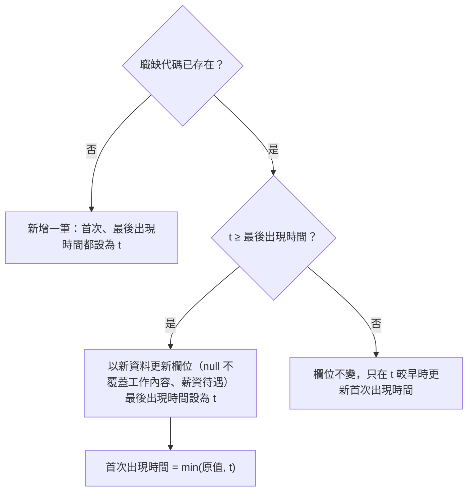

# 職缺資料庫

- ID：job-database
- 狀態：✅ 已完成
- 依賴：無

## 1. 背景與目標

求職者每隔一段時間就會取得一些新職缺，但每一次的結果都是獨立的清單，彼此沒有關聯（UP-01）：

- 同一筆職缺在不同次的結果中重複出現，只能人工比對。
- 看不出哪些職缺是這次新出現的，也看不出一筆職缺開了多久。
- 零散的清單無法累積成歷史資料，看不出職缺的長期變化。

本功能把寫進來的職缺全部整理到同一個職缺資料庫：

- 以職缺代碼跨次去重
- 記錄每筆職缺第一次與最後一次出現的時間
- 記錄每次寫入的條件

## 2. 範圍

範圍內（實作時只做這些）：

- 使用者故事，一個故事一章，細節見各章的「需求」：
  - [累積寫進來的職缺，看出哪些是新的](#4-累積寫進來的職缺看出哪些是新的save)（`save`）：✅
  - [查出累積下來的職缺](#5-查出累積下來的職缺query)（`query`）：✅
- [§6 非功能需求](#6-非功能需求)：資料庫只存在本機、缺值不回填
- [§7 共用規則](#7-共用規則)：資料庫路徑、職缺欄位契約、保存的資訊

範圍外（實作時不要做）：

- 把職缺寫進資料庫的入口、CLI 與寫入條件：屬各來源功能，職缺怎麼流進資料庫見[使用者旅程](../overview.md#使用者旅程)
- 判斷職缺是否已下架：只記錄最後一次出現的時間，不推論是否下架（見 [§7.2.2](#722-保存的資訊)）
- 保留職缺內容的歷史版本：只保留最新一版
- 互動式瀏覽介面：本功能只提供查詢，介面見 [TODO.md](../../../TODO.md#web-app)，介面形式見[決策紀錄：介面形式選型](../decisions/interface-selection.md)

## 3. 輸入與輸出

- 輸入：一份職缺清單與這次寫入的條件，由寫入資料庫的功能提供（有哪些來源見[使用者旅程](../overview.md#使用者旅程)）。
  - 職缺的欄位依 [§7.2.1](#721-職缺欄位契約) 的職缺欄位契約。
- 輸出：職缺資料庫，保存的資訊見 [§7.2.2](#722-保存的資訊)。
  - 下游需要以職缺代碼為準、欄位固定的職缺資料。
  - 也可以依條件列出職缺、取出單筆內容，見 [§5](#5-查出累積下來的職缺query)。

## 4. 累積寫進來的職缺，看出哪些是新的（save）

身為求職者，我想要職缺全部累積到同一個地方，並知道哪些職缺是最近才出現的，以便不必自己管理一堆結果檔，也能優先查看新職缺。

### 4.1 需求

- FR-save-dedup：同一個 `職缺代碼` 在資料庫中只保留一筆職缺。
  - 首次出現時間、最後出現時間，以及更新欄位的時機依 [§4.2.1](#421-寫入規則)。
- FR-save-keep-detail：新資料的 `工作內容` 或 `薪資待遇` 為 `null`，而資料庫中已有非 null 的值時，保留舊值。
- FR-save-run：每次寫入都記一筆執行紀錄，內容依 [§7.2.2](#722-保存的資訊)。
  - 同時記錄這次寫入出現了哪些職缺。
- FR-save-summary：每次寫入後，在終端機顯示新增筆數、更新筆數與資料庫路徑。
- FR-save-transaction：一次寫入要嘛全部寫入，要嘛完全不寫入。
  - 中途失敗時，不留下只寫一半的資料。

### 4.2 規則

#### 4.2.1 寫入規則

以一次寫入的時間 `t` 寫入一批職缺，對每筆職缺：



- 新增一筆算「新增」，其餘情況都算「更新」。
- 只有 `t` 不早於資料庫中的最後出現時間時，才用新資料覆蓋欄位。結果：
  - 寫入的先後順序不會影響結果，補寫比較舊的資料也不會蓋掉新的。
  - 資料庫永遠保留最新一版的內容。
- 每筆職缺都記為這次寫入出現的職缺，不管是新增還是更新。

#### 4.2.2 詳情欄位不被 null 覆蓋

`工作內容`、`薪資待遇` 保留舊值，是缺值不回填（見 [§6](#6-非功能需求)）唯一的例外，理由如下：

- 來源取得職缺的詳細內容常因暫時性錯誤失敗，失敗時這兩欄為 `null`。
- 資料庫中的舊值來自同一個來源的同一個欄位，不是用摘要之類的其他來源回填。
- 如果讓 `null` 覆蓋舊值，一次失敗就會讓下游少了完整的工作內容。

#### 4.2.3 寫入摘要

每次寫入後在終端機顯示摘要，不分來源，例如：

```
[+] 已寫入資料庫：新增 42 筆、更新 18 筆（data/jobs.db）
```

### 4.3 驗收

#### AC-save-dedup：跨次去重與出現時間

- Given：
  - 兩批職缺有部分重疊，分別以時間 t1 < t2 寫入
  - 另一組以 t2、t1 的順序寫入
- When：寫入兩批
- Then：
  - 每個職缺代碼只有一筆
  - 重疊的職缺首次出現時間為 t1、最後出現時間為 t2，欄位內容為 t2 那批的值
  - 兩種寫入順序得到的職缺資料相同
  - 顯示的新增、更新筆數正確
- 通過條件：全部符合。

#### AC-save-keep-detail：null 不覆蓋既有內容

- Given：`工作內容` 與 `薪資待遇` 依下列情況設定資料庫中的值與新資料的值
- When：以較晚的時間寫入新資料
- Then：
  - 資料庫中非 null、新資料為 `null` → 保留舊值
  - 資料庫中非 null、新資料非 null → 寫入新值
  - 資料庫中為 `null`、新資料非 null → 寫入新值
  - 其他欄位的 `null` 照常覆蓋
- 通過條件：全部符合。

#### AC-save-run：執行紀錄與整批寫入

- Given：
  - 第一批：一批職缺與這次寫入的條件
  - 第二批：其中有一筆在寫入時會失敗
- When：分別寫入
- Then：
  - 第一批多一筆執行紀錄，條件與職缺數正確，並記錄了這次出現的每筆職缺
  - 第二批寫入失敗後，資料庫內容沒有任何改變
- 通過條件：全部符合。

## 5. 查出累積下來的職缺（query）

身為求職者，我想要依條件列出職缺、也能取出單筆的完整內容，以便不必自己下 SQL 就看得到累積下來的職缺。

### 5.1 需求

- FR-query-list：依條件列出職缺，結果依 [§5.2.1](#521-列出職缺的結果)。
  - 可以只列出某一次寫入出現的職缺。
  - 可以指定最多取幾筆、從第幾筆開始。
- FR-query-get：以職缺代碼取出單筆職缺的完整內容。
  - 沒有這筆職缺時明確表示查不到，不回傳空白的職缺。
- FR-query-runs：列出每次寫入的執行紀錄，欄位依 [§7.2.2](#722-保存的資訊)。
  - 可以指定最多取幾筆。
  - 排序是執行時間由新到舊。

### 5.2 規則

#### 5.2.1 列出職缺的結果

- 每筆職缺的欄位依[保存的資訊](#722-保存的資訊)：[職缺欄位契約](#721-職缺欄位契約)的全部欄位，接著是 `首次出現時間`、`最後出現時間`。
- 排序是最後出現時間由新到舊，最近還出現的職缺排在前面。
  - 最後出現時間相同時，再以職缺代碼排序，同樣的資料每次查出來的順序才一致。
- 沒有符合條件的職缺時是空清單，不是錯誤。

### 5.3 驗收

#### AC-query-list：依條件列出職缺

- Given：分兩次寫入的職缺，其中一筆兩次都出現
- When：
  - 不指定條件列出
  - 只列出第二次寫入出現的職缺
  - 指定最多取 1 筆
  - 以不存在的寫入條件列出
- Then：
  - 不指定條件時，每個職缺代碼只有一筆，欄位依 [§5.2.1](#521-列出職缺的結果)
  - 排序是最後出現時間由新到舊
  - 指定某一次寫入時，只有那次出現的職缺
  - 指定筆數時，回傳的筆數不超過指定值
  - 沒有符合條件時是空清單
- 通過條件：全部符合。

#### AC-query-get：取出單筆職缺

- Given：資料庫中有一筆職缺
- When：分別以存在與不存在的職缺代碼取出
- Then：
  - 存在時得到該筆職缺，欄位依 [§5.2.1](#521-列出職缺的結果)
  - 不存在時明確表示查不到
- 通過條件：全部符合。

#### AC-query-runs：列出執行紀錄

- Given：兩次寫入留下的執行紀錄，其中一次沒有提供 `來源檔`
- When：列出執行紀錄
- Then：
  - 兩次都列出，欄位依[保存的資訊](#722-保存的資訊)
  - 排序是執行時間由新到舊
  - 沒有提供的條件欄位是 `null`
- 通過條件：全部符合。

## 6. 非功能需求

### 6.1 需求

- NFR-local：資料庫只存在本機，不進版控。
- NFR-null：欄位缺值時存成 `null`，不回填（依 [development.md](../../conventions/development.md#防禦性設計)）。
  - 唯一的例外是 `工作內容`、`薪資待遇` 不被 `null` 覆蓋，理由見 [§4.2.2](#422-詳情欄位不被-null-覆蓋)。

### 6.2 規則

見 [§4.2.2](#422-詳情欄位不被-null-覆蓋)。

### 6.3 驗收

本章的需求由各章既有的驗收涵蓋，不另外寫：

- NFR-local：[AC-db](#ac-db自動建立資料庫)（資料庫不進版控）
- NFR-null：[AC-save-keep-detail](#ac-save-keep-detailnull-不覆蓋既有內容)（其他欄位的 `null` 照常覆蓋）

## 7. 共用規則

跨越各章的規則：資料庫路徑、職缺欄位契約與保存的資訊。

### 7.1 需求

- FR-db：所有寫入都進同一份職缺資料庫，預設位置是專案根目錄的 `data/jobs.db`。
  - 不論在哪個目錄執行，預設的位置都相同。
  - 資料庫不存在時自動建立。
  - 實際路徑可由來源功能指定，例如各 CLI 的 `--db` 參數。

### 7.2 規則

#### 7.2.1 職缺欄位契約

一筆職缺有哪些欄位，由這份契約決定：

- 欄位名稱用中文，寫入資料庫與來源功能的輸出檔都用同一組名稱。
- 寫進資料庫的職缺要照這份契約整理欄位，下游讀取職缺時也以它作為輸入契約。
- 目前的欄位來自 104 職缺，新增其他求職平台時在這裡擴充（見 [TODO.md](../../../TODO.md#職缺資料庫)）。

欄位：

- `職缺代碼`（str）：求職平台的職缺識別碼，用於去重
- `職缺名稱`（str）
- `公司名稱`（str）
- `產業類別`（str）：例如 `電腦系統整合服務業`
- `地區`（str）：以空白合併縣市行政區與街道地址
- `薪資待遇`（str | null）：原始薪資描述，例如 `月薪60,000~70,000元`、`待遇面議`
  - 來源取不到職缺的詳細內容時為 `null`
- `薪資下限`（int | null）：保留平台的原始值
  - 面議時為 `0`
- `薪資上限`（int | null）：保留平台的原始值
  - 面議時為 `0`
  - 沒有上限（如「月薪50,000元以上」）時為 `9999999`，下游以 ≥ 9999999 判斷
- `更新日期`（str）：`YYYY-MM-DD`
- `應徵人數`（int）：缺值時為 `0`
- `工作內容`（str | null）：完整工作描述
  - 來源取不到職缺的詳細內容時為 `null`
- `電腦專長`（str）：以 `, ` 合併，例如 `Python, Git`
  - 沒有時為空字串
- `科系要求`（str）：以 `, ` 合併
  - 沒有時為空字串
- `特色標籤`（str）：以 `, ` 合併，例如 `週休二日, 距捷運站210公尺`
- `職缺連結`（str）：完整的 `https://` URL
- `公司連結`（str）：完整的 `https://` URL

#### 7.2.2 保存的資訊

- 欄位名稱沿用[職缺欄位契約](#721-職缺欄位契約)的中文名稱。
- 所有時間都是本地時間，格式為 ISO 8601，精確到秒，例如 `2026-09-17T10:15:00`。

每筆職缺：

- 職缺欄位契約的全部欄位，順序與契約相同，以 `職缺代碼` 識別
- `首次出現時間`：這筆職缺第一次出現的時間
- `最後出現時間`：這筆職缺最後一次出現的時間
- 不記錄下架狀態：「最後出現時間」較早，不代表職缺已經下架，可能只是之後的搜尋條件沒有涵蓋它。

每次寫入：

- `執行編號`：自動遞增的編號
- `執行時間`：這次寫入的時間，由來源功能提供
- `來源`：寫入方式的名稱，目前是 `爬蟲` 或 `匯入`
- `職缺數`：這次寫入的職缺筆數
- 來源功能提供的寫入條件：搜尋條件（`關鍵字`、`地區`、`職缺性質`、`頁數`）與 `來源檔`，意義由提供的功能定義。
  - 沒有提供該欄位的來源寫入時為 `null`。
  - 目前的欄位來自 104-job-scraper 的抓取與匯入，新增其他來源時要重新設計（見 [TODO.md](../../../TODO.md#職缺資料庫)）。

每次寫入出現的職缺：

- 以 `執行編號` 與 `職缺代碼` 對應。
- 同一次寫入中重複的職缺代碼只記一次，`職缺數` 也只算一次。

### 7.3 驗收

#### AC-db：自動建立資料庫

- Given：指定的資料庫路徑與上層目錄都不存在
- When：開啟資料庫
- Then：
  - 目錄與檔案被建立
  - 可以保存職缺、執行紀錄與每次寫入出現的職缺
  - 職缺的欄位依序是[職缺欄位契約](#721-職缺欄位契約)的欄位，接著是 `首次出現時間`、`最後出現時間`
  - 預設的職缺資料庫不進版控
- 通過條件：全部符合。

## 8. 待決問題

無。
