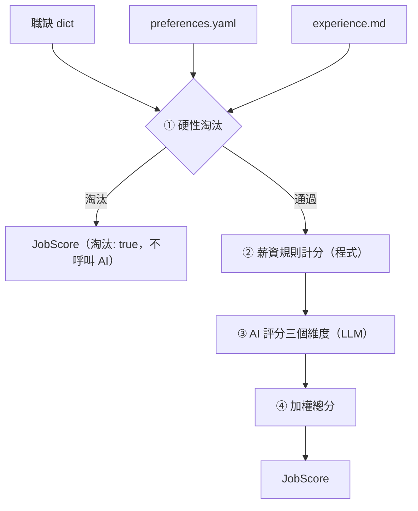

# 工作評分邏輯技術規格

本文描述單筆職缺的評分方法：維度定義、規則、提示詞設計與輸出格式。需求與驗收標準見 [F1-01 PRD](../prd/features/F1-01-job-scoring.md)，職缺欄位定義見 [104-scraper.md §3](104-scraper.md#3-資料欄位對應字典-data-dictionary)。

## 1. 評分流程



- 被淘汰的職缺在 ① 就停止，**不呼叫 AI**，以節省費用，也不需要 API key。
- ② 和 ③ 各自獨立，任何一個維度都可能是 `null`（未知），由 ④ 統一處理。

## 2. 輸入：個人資料檔

兩個檔案都放在 `profile/`，並加入 `.gitignore`；版控中只保留 `.example` 範本。

| 檔案 | 格式 | 用途 |
| :--- | :--- | :--- |
| `profile/preferences.yaml` | YAML（中文鍵名） | 程式讀取的偏好、門檻與權重 |
| `profile/experience.md` | 自由格式的 Markdown | 工作經歷與技能，原文放進提示詞 |

### 2.1 preferences.yaml 欄位字典

所有欄位都是**必填**。缺少欄位或型別錯誤時，印出 `[-]` 訊息並結束，不補預設值。

| 欄位 | 型態 | 說明 |
| :--- | :--- | :--- |
| `目標方向` | list[str] | 想做的工作內容、想累積的能力，給 AI 判斷「職涯方向契合度」 |
| `產業偏好.喜歡` | list[str] | 偏好的產業或公司類型，可以是空清單 |
| `產業偏好.不喜歡` | list[str] | 不偏好的產業（降低分數，但不淘汰），可以是空清單 |
| `薪資.期望月薪` | int | 期望月薪（元） |
| `薪資.底線月薪` | int | 可接受的最低月薪（元），必須 ≤ `期望月薪` |
| `薪資.年薪換算月數` | int | 年薪換算月薪時的除數（例如 14） |
| `淘汰條件.公司` | list[str] | 直接淘汰的公司名稱（完全比對 `公司名稱`），可以是空清單 |
| `淘汰條件.職稱關鍵字` | list[str] | `職缺名稱` 含其中任一字串就淘汰（不分大小寫），可以是空清單，但不可含空字串（空字串會命中所有職稱） |
| `權重` | dict[str, float] | 鍵必須剛好是第 3 節的四個維度名稱，值 ≥ 0，且總和 > 0。不要求總和為 1 |

範例：

```yaml
目標方向:
  - 以 Python 開發後端服務與資料管線
  - 參與 LLM 應用的設計與落地
產業偏好:
  喜歡: [軟體及網路相關業, 金融科技]
  不喜歡: [博弈]
薪資:
  期望月薪: 70000
  底線月薪: 55000
  年薪換算月數: 14
淘汰條件:
  公司: []
  職稱關鍵字: [業務, 客服]
權重:
  職涯方向契合度: 0.4
  技能匹配度: 0.25
  產業公司吸引力: 0.15
  薪資水準: 0.2
```

## 3. 評分維度

每個維度的分數都是 1–5 的整數，或 `null`（資訊不足）。

| 維度名稱 | 判斷者 | 使用的職缺欄位 | 比對的個人資料 |
| :--- | :--- | :--- | :--- |
| `職涯方向契合度` | AI | 職缺名稱、工作內容 | `目標方向` |
| `技能匹配度` | AI | 職缺名稱、工作內容、電腦專長、科系要求 | experience.md |
| `產業公司吸引力` | AI | 公司名稱、產業類別 | `產業偏好` |
| `薪資水準` | 程式 | 薪資待遇、薪資下限、薪資上限 | `薪資` |

### 3.1 AI 維度的錨點描述

這些描述要原文放進提示詞，讓分數有一致的標準。

**職涯方向契合度**（包含這份工作能否累積目標方向需要的能力）

| 分數 | 描述 |
| :-- | :--- |
| 5 | 主要工作內容就是目標方向之一，做了能直接累積目標能力 |
| 4 | 大部分工作內容符合目標方向，少部分無關 |
| 3 | 部分相關，或是可以作為轉往目標方向的跳板 |
| 2 | 只有少量沾邊，主要工作內容與目標無關 |
| 1 | 與目標方向無關或背道而馳 |
| null | `工作內容` 為 null，且無法只憑職缺名稱判斷 |

**技能匹配度**（依工作經歷評估現在能否勝任）

| 分數 | 描述 |
| :-- | :--- |
| 5 | 要求的核心技能都具備，而且有實際經歷佐證 |
| 4 | 具備大部分核心技能，缺口可以在短期內補上 |
| 3 | 具備約一半的核心技能，有明顯但可以跨越的缺口 |
| 2 | 只具備少數要求的技能，需要大量補強 |
| 1 | 核心技能幾乎都不具備 |
| null | 根據現有欄位（職缺名稱、工作內容、電腦專長、科系要求）仍無法判斷職缺要求哪些技能 |

`理由` 必須列出主要的技能缺口（沒有缺口就寫「無明顯缺口」）。

資料是否足以評分由 AI 判斷，程式不設固定條件。例如 `工作內容` 為 null，但職缺名稱已經能看出核心技能（如「資深 iOS 工程師」）時，仍然可以給分，但 `理由` 要說明是依據哪些欄位判斷的。

**產業公司吸引力**（F3 完成前只根據產業類別與公司名稱判斷）

| 分數 | 描述 |
| :-- | :--- |
| 5 | 屬於 `產業偏好.喜歡` 中的產業 |
| 4 | 與喜歡的產業高度相關 |
| 3 | 中性，既不在喜歡、也不在不喜歡的清單中 |
| 2 | 與不喜歡的產業相關 |
| 1 | 屬於 `產業偏好.不喜歡` 中的產業 |
| null | `產業類別` 為空 |

## 4. 硬性淘汰規則

依序檢查以下條件，**收集所有符合的原因**（不在第一條就停止），只要有任何一條就淘汰：

1. `公司名稱` 在 `淘汰條件.公司` 中 → 原因 `公司在排除名單：<公司名稱>`
2. `職缺名稱` 含 `淘汰條件.職稱關鍵字` 中的任一字串 → 原因 `職稱含排除關鍵字：<關鍵字>`
3. 依第 5 節換算出的月薪上限存在，且小於 `底線月薪` → 原因 `薪資上限 <金額> 低於底線 <金額>`

薪資未知（面議、時薪、null 等）**不會**淘汰職缺。

## 5. 薪資換算與計分

### 5.1 換算成月薪

依 `薪資待遇` 的開頭字串判斷薪資類型（以 104 實際資料為準）：

| `薪資待遇` 開頭 | 換算方式 | 範例（薪資待遇 / 下限 / 上限） |
| :--- | :--- | :--- |
| `月薪` | 直接使用 | `月薪55,000~65,000元` / 55000 / 65000 |
| `年薪` | 下限、上限都除以 `年薪換算月數`，四捨五入到整數 | `年薪700,000~1,000,000元` / 700000 / 1000000 |
| `待遇面議`、`時薪`、`日薪`、`論件計酬`、其他 | 無法換算 → 薪資未知 | `待遇面議` / 0 / 0 |
| `薪資待遇` 為 null | 無法判斷類型 → 薪資未知 | — |

其他規則：

- `薪資下限` 為 null 或 0 → 薪資未知。
- `薪資上限` ≥ 9999999 代表「以上」、沒有上限，換算後的上限記為「無」（實際資料中的值是 `9999999`）。
- `薪資上限` 為 null → 上限記為「無」。

### 5.2 計分

設換算後的月薪下限為 `low`，上限為 `high`（可能是「無」）：

| 條件（依序判斷） | 分數 |
| :--- | :-- |
| 薪資未知 | `null` |
| `low` ≥ `期望月薪` | 5 |
| `high` 不是「無」且 `high` ≥ `期望月薪` | 4 |
| 其他 | 2 |

「`high` < `底線月薪`」的情況已經在第 4 節被淘汰，不會進到計分。

`薪資水準` 的 `理由` 由程式產生，例如 `月薪 55,000–65,000，期望 70,000，未達期望`。

## 6. 總分

1. 分數為 `null` 的維度以 **3 分**（中性）代入。所有職缺都用相同的四個維度與權重計算，總分才能互相比較；若只用已知維度計算，等於假設缺少的維度與其他維度表現相同，缺資料的職缺反而可能排在前面。
2. 計算四個維度的加權平均 `avg = Σ(wᵢ·sᵢ) / Σwᵢ`。
3. 換算成 0–100 分：`總分 = round((avg − 1) / 4 × 100)`。沒被淘汰的職缺一定有總分。
4. 分數為 `null` 的維度名稱依第 3 節的順序列入 `未知維度`，讓使用者知道哪些分數是代入的；`維度` 中的分數仍保留 `null`，`評語` 維持 AI 的原文，不另外加註。

## 7. 輸出：JobScore

使用中文鍵名，與爬蟲的輸出一致：

| 欄位 | 型態 | 說明 |
| :--- | :--- | :--- |
| `職缺代碼` | str | 對應到輸入職缺 |
| `淘汰` | bool | 是否被硬性淘汰 |
| `淘汰原因` | list[str] | 第 4 節的原因；沒被淘汰時是空清單 |
| `維度` | dict[str, {分數: int \| null, 理由: str}] \| null | 鍵依第 3 節的順序排列；被淘汰時為 `null` |
| `總分` | int \| null | 0–100；被淘汰時為 `null` |
| `未知維度` | list[str] | 分數為 `null` 的維度；被淘汰時是空清單 |
| `評語` | str \| null | AI 產生的一到兩句總評，程式不修改；被淘汰時為 `null` |

`JobScore` 是 Pydantic 模型，以 alias 定義中文鍵名；`model_dump(by_alias=True)` 的結果就是上表的格式。

範例：

```json
{
  "職缺代碼": "8s12x",
  "淘汰": false,
  "淘汰原因": [],
  "維度": {
    "職涯方向契合度": {"分數": 4, "理由": "主要負責 Python 後端 API，另含部分維運工作"},
    "技能匹配度": {"分數": 4, "理由": "缺口：Kubernetes，可短期補上"},
    "產業公司吸引力": {"分數": 5, "理由": "軟體及網路相關業，屬於偏好產業"},
    "薪資水準": {"分數": 4, "理由": "月薪 60,000–80,000，區間涵蓋期望 70,000"}
  },
  "總分": 79,
  "未知維度": [],
  "評語": "方向相符的後端職缺，補上雲端部署經驗即可投遞。"
}
```

## 8. 實作設計

### 8.1 模組佈局

```
.env.example                 API key 範本（進版控）
.env                         真實 API key（不進版控）
profile/
  preferences.example.yaml   範本（進版控）
  experience.example.md      範本（進版控）
  preferences.yaml           真實資料（不進版控）
  experience.md              真實資料（不進版控）
src/
  score_job.py               CLI 進入點
  job_scoring/
    models.py                Pydantic 模型：Preferences、AIAssessment、JobScore
    profile.py               load_preferences(path: str | Path) -> Preferences
                             load_experience(path: str | Path) -> str
    rules.py                 check_hard_filters(job, prefs) -> list[str]
                             score_salary(job, prefs) -> tuple[int | None, str]（分數, 理由）
    prompt.py                build_prompt(job, prefs, experience) -> tuple[str, str]（system, user）
    prompts/scoring.md       提示詞模板
    llm.py                   LLMClient Protocol、GeminiClient、get_client(provider, model)
    scorer.py                compute_total(scores, weights) -> int（第 6 節，scores 的值可為 None）
                             score_job(job, prefs, experience, client) -> JobScore
tests/
  conftest.py                共用 fixture（測試資料、假的 LLM client）
  test_job_scoring_profile.py
  test_job_scoring_rules.py
  test_job_scoring_scorer.py
  test_job_scoring_llm.py       GeminiClient 的請求與錯誤處理（以假的 SDK client 測試）
  test_score_job_cli.py
  test_job_scoring_network.py  需要網路的測試（network 標記）
```

用 `uv run src/score_job.py` 執行時，`src/` 會在 import 路徑上，可以直接 `import job_scoring`。pytest 已在 `pyproject.toml` 設定 `pythonpath = ["src"]`，測試中也可以直接 import。

新增的依賴：`google-genai`、`pydantic`、`pyyaml`、`python-dotenv`（dev：`types-PyYAML`）。

### 8.2 提示詞設計

- 模板放在 `prompts/scoring.md`，和程式碼分開，方便反覆調整。
- **system**：評分者角色、第 3.1 節的錨點描述，以及以下規則：
  - 只根據提供的資料判斷
  - 資訊不足時給 `null` 並在理由中說明，不准猜分數
  - 理由要具體引用職缺內容
  - 使用繁體中文
- **user**：`目標方向`、`產業偏好`、experience.md 全文，以及職缺欄位（職缺名稱、公司名稱、產業類別、工作內容、電腦專長、科系要求）。欄位為 null 或空字串時，明確寫出「（無資料）」。
- **不把薪資與淘汰條件交給 AI**，避免重複判斷，也避免 AI 的判斷和規則衝突。
- 不設定溫度等取樣參數：Gemini 3.8 Flash 已不支援 `temperature`、`top_p`、`top_k`（[官方說明](https://ai.google.dev/gemini-api/docs/latest-model)）。

### 8.3 AI 輸出 schema（AIAssessment）

LLM 必須輸出以下 JSON。欄位使用英文名稱，讓 schema 對各家模型都比較穩定，再由 `scorer.py` 轉成第 7 節的中文鍵名：

```json
{
  "career_fit":   {"score": 1-5 | null, "reason": "..."},
  "skill_match":  {"score": 1-5 | null, "reason": "..."},
  "industry_fit": {"score": 1-5 | null, "reason": "..."},
  "comment": "..."
}
```

回應無法通過 Pydantic 驗證時（例如分數超出範圍），視為該次評分失敗：印出 `[-]` 並結束，不自行修正分數。

### 8.4 LLM 供應商抽象層

```python
class LLMClient(Protocol):
    def assess(self, system: str, user: str) -> AIAssessment: ...
```

- `GeminiClient(model)`：使用 `google-genai`（≥ 2.3.0，Interactions API）。呼叫 `client.interactions.create(model=..., input=..., system_instruction=..., response_format={"type": "text", "mime_type": "application/json", "schema_": AIAssessment.model_json_schema()}, store=False, stream=False, timeout=120)`，再用 `AIAssessment.model_validate_json(interaction.output_text)` 驗證（參考 [Gemini structured output 文件](https://ai.google.dev/gemini-api/docs/structured-output)）。
  - SDK 的 TypedDict 鍵名是 `schema_`，送出時會序列化成 API 的 `schema`。
  - `store=False`：提示詞含個人經歷，不在伺服器端保存互動紀錄。
  - SDK 的錯誤類別（HTTP、連線、逾時）沒有公開匯出，因此 `interactions.create` 拋出的任何例外都轉成 `LLMError`；`output_text` 為空時也是 `LLMError`。
- API key 從環境變數 `GEMINI_API_KEY` 讀取，由 `GeminiClient` 建構時檢查，**沒有設定或是空字串**就拋出例外。CLI 只在「沒被淘汰、也不是 `--dry-run`」時才建立 client，所以只有真的要呼叫 AI 時才需要 key。
- API key 放在專案根目錄的 `.env`（不進版控，範本是 `.env.example`）。`score_job.py` 啟動時用 `python-dotenv` 的 `load_dotenv(專案根目錄 / ".env")` 載入。`load_dotenv` 預設**不覆寫已經存在的環境變數**（[python-dotenv](https://github.com/theskumar/python-dotenv)），所以 shell 設定的值優先；測試時用 `GEMINI_API_KEY=` 設成空字串，就能模擬沒有 key 的情況，不受 `.env` 影響。
- 預設模型：`gemini-3.8-flash`，可用 `--model` 覆寫。
- `get_client(provider, model)`：用供應商名稱查表建立 client，不認得的名稱就拋出 `ValueError`。之後加入 OpenAI 時，只要新增 `OpenAIClient` 並註冊到表中，其他模組都不用改。

### 8.5 CLI

```bash
uv run src/score_job.py --jobs output/104/<檔名>.json [--job-no <職缺代碼>] \
    [--profile-dir profile] [--provider gemini] [--model gemini-3.8-flash] [--dry-run]
```

| 參數 | 說明 |
| :--- | :--- |
| `--jobs` | 必填，爬蟲輸出的 JSON 檔 |
| `--job-no` | 要評分的職缺代碼；省略時使用第一筆；找不到時印出 `[-]` 並結束 |
| `--profile-dir` | 放 `preferences.yaml` 與 `experience.md` 的目錄，預設為專案根目錄下的 `profile/`（以腳本位置為基準，不受工作目錄影響） |
| `--provider` | LLM 供應商，預設 `gemini` |
| `--model` | 模型名稱，預設 `gemini-3.8-flash` |
| `--dry-run` | 先執行硬性淘汰與薪資計分，再印出完整的 system 與 user 提示詞，**不建立 LLM client、不發出網路請求** |

評分結果以 JSON 印到 stdout（`ensure_ascii=False`，縮排 2）。進度與錯誤訊息印到 stderr，方便把 stdout 導向檔案。

進入點是 `main(argv: list[str] | None = None) -> int`，回傳結束碼；`if __name__ == "__main__"` 區塊只負責 `sys.exit(main())`。測試直接呼叫 `main([...])`，不必另外啟動子行程。

結束碼：成功（包括被淘汰）為 0；個人資料檔缺少或格式錯誤、找不到職缺、缺少 API key、AI 回應格式錯誤時，印出 `[-]` 並以 1 結束。
