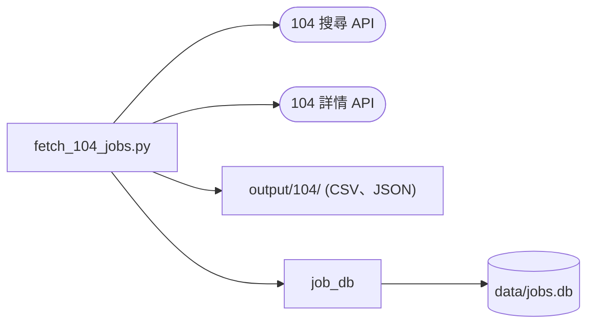

# 104 職缺爬蟲：技術設計

- 功能文件：[104-job-scraper.md](../features/104-job-scraper.md)
- 程式碼：[src/fetch_104_jobs.py](../../src/fetch_104_jobs.py)

## 1. 總覽



- `fetch_104_jobs.py`：單檔腳本，包含 CLI 與互動模式、呼叫 104 API、整理欄位、寫出檔案與終端機預覽。
- 專案內只依賴 `job_db`，用來寫入職缺資料庫，寫入的設計見 [job-database 技術設計](job-database.md)。
  - 以 `uv run src/fetch_104_jobs.py` 執行時，`src/` 在 import 路徑上，不需要額外設定。

## 2. 流程

實現 FR-search-*、FR-detail、FR-output-*。業務規則見[功能文件的流程](../features/104-job-scraper.md#421-流程)。

1. `main` 解析參數，沒有 `--keyword` 時改由 `run_interactive` 詢問搜尋條件。兩者都呼叫 `execute_scraping`。
2. 逐一關鍵字、逐頁呼叫搜尋 API，以 `職缺代碼` 去重後累積成原始職缺清單。
3. `parse_jobs` 逐筆呼叫詳情 API，把原始職缺整理成欄位字典的中文欄位。
4. 寫出 CSV 與 JSON，再經由 `job_db` 寫入資料庫（`--no-db` 時略過）。
5. 在終端機印出前 10 筆的預覽表格。

進度與預覽表格都 `print` 到 stdout。

## 3. 資料與儲存

實現 FR-output-files。

- `OUTPUT_DIR`：以腳本位置推算專案根目錄下的 `output/104/`，已列入 `.gitignore`。
- 欄位字典的欄位與 104 API 欄位的對照，以下是搜尋 API 的欄位，另有標註的除外：
  - `職缺代碼` ← `jobNo`
  - `職缺名稱` ← `jobName`
  - `公司名稱` ← `custName`
  - `產業類別` ← `coIndustryDesc`
  - `地區` ← `jobAddrNoDesc` + `jobAddress`
  - `薪資待遇` ← 詳情 API 的 `jobDetail.salary`
  - `薪資下限` ← `salaryLow`
  - `薪資上限` ← `salaryHigh`
  - `更新日期` ← `appearDate`
  - `應徵人數` ← `applyCnt`
  - `工作內容` ← 詳情 API 的 `jobDetail.jobDescription`
  - `電腦專長` ← `pcSkills[].description`
  - `科系要求` ← `major`
  - `特色標籤` ← `tags` 的 `desc`
  - `職缺連結` ← `link.job`
  - `公司連結` ← `link.cust`
- 新增欄位時要同步修改：
  - `parse_jobs()` 與 `CSV_FIELDNAMES`
  - 功能文件的[欄位字典](../features/104-job-scraper.md#821-欄位字典)
  - `job_db` 的 `JOB_COLUMNS`：`job_db` 不 import 爬蟲，另外定義一份欄名與型態，由測試檢查兩份一致（見 [job-database 技術設計](job-database.md#1-總覽)）

## 4. 外部系統整合

實現 FR-search-request、FR-detail、NFR-rate。

104 API：

- 搜尋：`https://www.104.com.tw/jobs/search/api/jobs`
  - `timeout=10`
  - 回傳的 `description` 只是關鍵字高亮的截斷摘要
- 詳情：`https://www.104.com.tw/job/ajax/content/{job_id}`
  - `timeout=5`
  - `job_id` 是職缺連結中 `/job/` 後面的 base36 代碼（如 `8s12x`）

標頭：

- 缺少 `User-Agent` 或 `Referer` 時，104 一律回 403。兩個標頭都放在 `DEFAULT_HEADERS`，不可移除。
- 搜尋 API 的 Referer 是 `https://www.104.com.tw/jobs/search/`。
- 詳情 API 會檢查 Referer 是否為該職缺自己的頁面（`https://www.104.com.tw/job/{job_id}`），沿用搜尋頁的 Referer 會被擋。
- `Accept-Language` 設為 `zh-TW` 優先，讓回傳內容是繁體中文。

頻率：

- 詳情請求不加延遲會被 104 拒絕，延遲的區間見[功能文件的非功能需求](../features/104-job-scraper.md#7-非功能需求)。

## 5. 錯誤處理與結束碼

- 搜尋 API 回非 200 或拋出 `requests.exceptions.RequestException` 時，`fetch_jobs` 回傳空結果，視為空頁。
- 詳情 API 回非 200 或拋出任何例外時，`fetch_job_detail` 回傳 `None`，`薪資待遇` 與 `工作內容` 為 `None`。
- 寫出 CSV／JSON 發生 `IOError` 時印出錯誤，不中斷程式。
- 寫入資料庫失敗的處理見 [job-database 技術設計](job-database.md#4-錯誤處理與結束碼)。
- 按下 Ctrl+C 時，`__main__` 區塊攔下 `KeyboardInterrupt`，印出取消訊息並以結束碼 0 結束。

## 6. 驗收對照

測試資料：

- 離線測試都在 `tests/test_fetch_104_jobs.py`。
- `requests.get` 與 `time.sleep` 以 monkeypatch 換成假函式，檔案寫到 `tmp_path`。

一次跑完所有離線驗收：

```bash
uv run pytest tests/test_fetch_104_jobs.py
```

型別檢查：`uv run mypy src/`，通過條件為沒有錯誤。

### search

- [AC-search-keyword](../features/104-job-scraper.md#ac-search-keyword關鍵字拆分)：`uv run pytest tests/test_fetch_104_jobs.py -k parse_keywords`
- [AC-search-area](../features/104-job-scraper.md#ac-search-area地區解析)：`uv run pytest tests/test_fetch_104_jobs.py -k resolve_area`
- [AC-search-dedup](../features/104-job-scraper.md#ac-search-dedup去重與分頁)：`uv run pytest tests/test_fetch_104_jobs.py -k "dedups or stops_on_empty_page or respects_page_limit or accepts_single_string"`
- [AC-search-request](../features/104-job-scraper.md#ac-search-request請求與錯誤處理)：`uv run pytest tests/test_fetch_104_jobs.py -k fetch_job`
- [AC-search-real](../features/104-job-scraper.md#ac-search-real實際抓取與輸出-需網路)〔需網路〕：`uv run pytest -m network tests/e2e/test_fetch_104_jobs.py`

### detail

- [AC-detail](../features/104-job-scraper.md#ac-detail欄位解析與取不到內容時不回填)：`uv run pytest tests/test_fetch_104_jobs.py -k "parse_jobs or extract"`

### output

- [AC-output-files](../features/104-job-scraper.md#ac-output-files輸出檔)：`uv run pytest tests/test_fetch_104_jobs.py -k "save or execute_scraping_filename or execute_scraping_no_jobs"`
- [AC-output-format](../features/104-job-scraper.md#ac-output-format欄位格式正規化)：`uv run pytest tests/test_fetch_104_jobs.py -k "format_date or normalize_url"`

### 非功能需求

- [AC-nfr-rate](../features/104-job-scraper.md#ac-nfr-rate請求頻率限制)：`uv run pytest tests/test_fetch_104_jobs.py -k "dedups or parse_jobs_with_detail"`

### 共用規則

- [AC-cli](../features/104-job-scraper.md#ac-clicli-與互動模式)：`uv run pytest tests/test_fetch_104_jobs.py -k "main_cli or main_without_keyword or run_interactive"`
- [AC-cli-interrupt](../features/104-job-scraper.md#ac-cli-interruptctrlc-優雅退出)：`uv run pytest tests/test_fetch_104_jobs.py -k ctrl_c`
