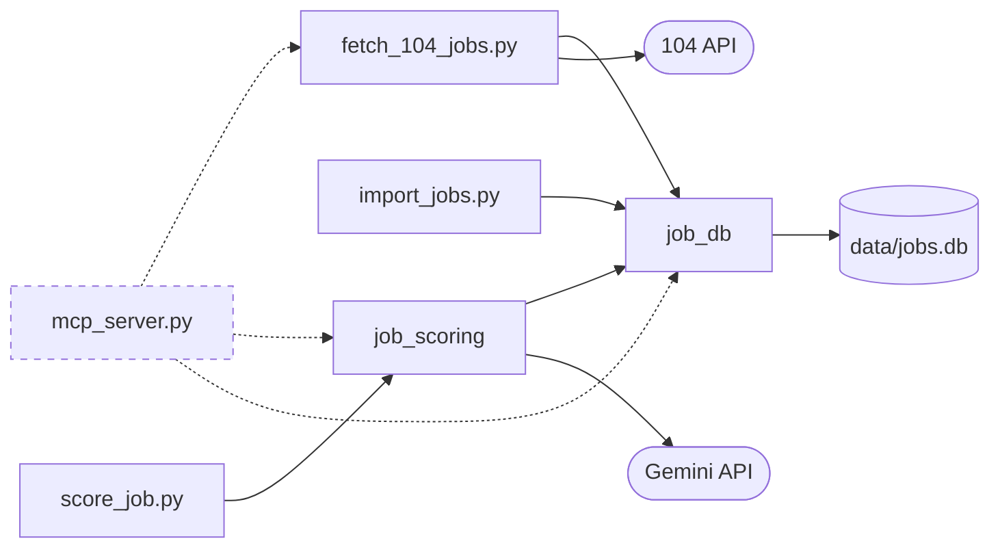

# 系統架構

本文件是跨功能的技術總覽：模組之間怎麼依賴、資料放在哪裡、用了哪些技術。

- 功能之間的資料流見 [專案總覽的使用者旅程](../product/overview.md#使用者旅程)。
- 各模組的細節見對應的技術設計（尚未實作的功能沒有技術設計，暫定的技術方案記在 [TODO.md](../../TODO.md#mcp-server-實作備忘)），本文件只列總覽並連過去。
- 〔規劃中〕標示尚未實作的部分。

## 執行方式

- 在本機手動執行，不排程（見 [非目標](../product/overview.md#非目標)）。
- 每個進入點都是 `src/` 下的一支腳本，以 `uv run src/<腳本>.py` 執行：
  - `fetch_104_jobs.py`：抓取 104 職缺（見 [104-job-scraper 的 CLI](../product/features/104-job-scraper.md#822-cli)）
  - `import_jobs.py`：把既有的職缺 JSON 匯入資料庫（見 [job-database 的匯入 CLI](../product/features/job-database.md#522-匯入-cli)）
  - `score_job.py`：評分單筆或整批職缺（見 [job-scoring 的 CLI](../product/features/job-scoring.md#1122-cli)）
  - `mcp_server.py`：〔規劃中〕讓 agent 以 tool 操作抓取、評分與查詢（見 [mcp-server 的功能文件](../product/features/mcp-server.md)）

## 模組依賴

- 實線：已完成
- 虛線：規劃中

- `job_db` 在最底層，不 import 專案內的其他模組。原因見 [job-database 的技術設計總覽](tech-design/job-database.md#1-總覽)。
- `job_scoring` 經由 `job_db/scores.py` 寫入 `job_scores`（見 [job-scoring 的技術設計總覽](tech-design/job-scoring.md#1-總覽)）。
- 〔規劃中〕mcp-server 的 tool 只做參數檢查與格式轉換，邏輯都呼叫 CLI 用的同一組函式。

## 資料存放

`data/jobs.db`：所有功能共用的 SQLite 資料庫，不進版控。選用 SQLite 的理由見 [決策紀錄：資料庫選型](decisions/database-selection.md)。

- 所有表的建表語法都放在 `job_db` 的 schema，開啟資料庫時一起建立。
- 各表由哪個功能負責：
  - `jobs`、`scrape_runs`、`run_jobs`：job-database（見 [資料表](tech-design/job-database.md#32-資料表)）
    - 寫入：爬蟲、匯入 CLI
  - `job_scores`：job-scoring（見 [資料表](tech-design/job-scoring.md#32-job_scores-資料表)）
    - 寫入：評分（CLI 或 mcp-server）
- 表之間以 `職缺代碼` 關聯，它是 `jobs` 與 `job_scores` 的主鍵。
- 欄名沿用中文，與爬蟲的 CSV／JSON、評分結果、mcp-server 回傳的鍵名一致。

檔案：

- `output/104/`：爬蟲每次輸出一組 CSV 與 JSON，不進版控（見 [輸出檔](../product/features/104-job-scraper.md#621-輸出檔)）
  - JSON 是評分 CLI 與匯入 CLI 的輸入
- `output/scores/`：整批評分的結果檔 JSON 與 CSV，不進版控（見 [結果檔](../product/features/job-scoring.md#622-結果檔)）
- `output/e2e/`：e2e 測試留下供查看的檔案，例如評分測試的資料庫 `jobs.db`，不進版控（見 [測試](../conventions/development.md#測試)）
- `profile/`：求職偏好與工作經歷（見 [個人資料檔](../product/features/job-scoring.md#421-個人資料檔)）
  - 範本進版控，真實資料不進版控
- `.env`：API key，不進版控，範本是 `.env.example`

## 技術選型

- 語言與套件管理：Python 3.14，依賴由 uv 管理（見 [依賴管理](../conventions/development.md#依賴管理)）
- 資料庫：SQLite，使用標準函式庫 `sqlite3`（見 [決策紀錄：資料庫選型](decisions/database-selection.md)）
- 抓取：`requests` 呼叫 104 的內部 API（見 [104 API 的限制](tech-design/104-job-scraper.md#4-外部系統整合)）
- LLM：Gemini，使用 `google-genai`
  - 經由 `LLMClient` 抽象層呼叫，換供應商不必改其他模組（見 [LLM 供應商抽象層](tech-design/job-scoring.md#41-llm-供應商抽象層)）
- 資料驗證：Pydantic，驗證偏好檔、AI 輸出與評分結果
- 設定檔：偏好檔用 YAML（`pyyaml`），API key 用 `.env`（`python-dotenv`）
- Agent 介面：〔規劃中〕官方 `mcp` Python SDK，以 stdio 傳輸
