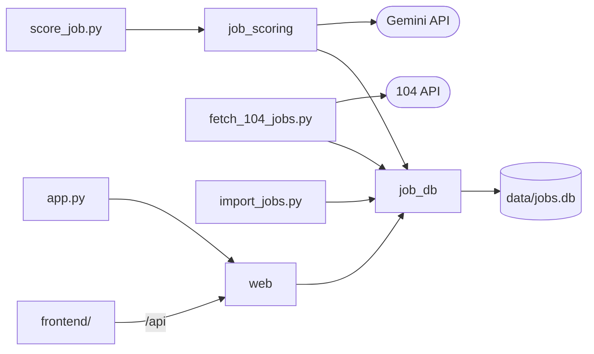

# 系統架構

本文件是跨功能的技術總覽：模組之間怎麼依賴、資料放在哪裡、用了哪些技術。

- 功能之間的資料流見 [專案總覽的使用者旅程](../product/overview.md#使用者旅程)。
- 各模組的細節見對應的技術設計，本文件只列總覽並連過去。

## 執行方式

- 在本機手動執行，不排程（見 [非目標](../product/overview.md#非目標)）。
- 每個進入點都是 `src/` 下的一支腳本，以 `uv run src/<腳本>.py` 執行：
  - `fetch_104_jobs.py`：抓取 104 職缺（見 [104-job-scraper 的 CLI](../product/features/104-job-scraper.md#1021-cli)）
  - `import_jobs.py`：把既有的職缺 JSON 匯入資料庫（見 [104-job-scraper 的匯入 CLI](../product/features/104-job-scraper.md#822-匯入-cli)）
  - `score_job.py`：評分還沒評分或指定的職缺（見 [job-auto-scoring 的 CLI](../product/features/job-auto-scoring.md#1022-cli)）
  - `app.py`：網頁，以 uvicorn 在 `127.0.0.1:8000` 提供 API 與 build 好的前端，只接受本機連線
    - 前端在 `frontend/`，要先 build 才能從這裡打開
    - 開發時改用 Vite 的開發伺服器，它把 `/api` 轉給 `app.py`
    - 目前只有職缺表（見 [job-database 的職缺表](tech-design/job-database.md#22-職缺表的前後端分工)），抓取與設定頁還在製作中

## 模組依賴

- `job_db` 在最底層，不 import 專案內的其他模組。原因見 [job-database 的技術設計總覽](tech-design/job-database.md#1-總覽)。
- `web`：網頁的後端，組裝各功能的 API（都在 `/api` 下），並提供 build 好的前端。
  - 各功能的 API 各自一個模組，由擁有該資料的功能負責，例如職缺表的 `web/job_table.py` 屬於 job-database。
  - 每個請求各自開一條資料庫連線，用完就關：同步的端點跑在 threadpool，`sqlite3` 的連線不能跨執行緒使用。
  - 啟動時先開一次資料庫，資料庫的錯誤在啟動時就出現。
  - 不是 `/api` 開頭的路徑一律回前端的 `index.html`，前端以 react-router 切換頁面，重新整理 `/crawl` 這類路徑時才打得開。
- `frontend/`：網頁的前端。
  - 各功能的頁面各自一個目錄，例如 `frontend/src/job-database/`。
  - 外殼與導覽在 `frontend/src/app/`。
- `job_scoring` 經由 `job_db/scores.py` 寫入 `job_scores`（見 [job-auto-scoring 的技術設計總覽](tech-design/job-auto-scoring.md#1-總覽)）。`scores.py` 屬於 job-score-database（見 [job-score-database 的技術設計總覽](tech-design/job-score-database.md#1-總覽)）。

## 資料存放

`data/jobs.db`：所有功能共用的 SQLite 資料庫，不進版控。選用 SQLite 的理由見 [決策紀錄：資料庫選型](../decisions/tech/database-selection.md)。

- 所有表的建表語法都放在 `job_db` 的 schema，開啟資料庫時一起建立。
- 各表由哪個功能負責：
  - `jobs`、`scrape_runs`、`run_jobs`：job-database（見 [資料表](tech-design/job-database.md#32-資料表)）
    - 寫入：104-job-scraper 的爬蟲與匯入 CLI（見 [寫入資料庫與匯入](tech-design/104-job-scraper.md#4-寫入資料庫與匯入)）
  - `job_scores`：job-score-database（見 [資料表](tech-design/job-score-database.md#21-job_scores-資料表)）
    - job-auto-scoring 疊加 `評分編號`、`評分來源`、`評分明細`、`供應商`、`模型`，同一筆職缺可以有多列（見 [自動評分欄位](tech-design/job-auto-scoring.md#32-job_scores-的自動評分欄位)）
    - 寫入：評分 CLI
- 表之間以 `職缺代碼` 關聯，它是 `jobs` 的主鍵；`job_scores` 以 `評分編號` 為主鍵，同一個 `職缺代碼` 可以有多列。
- 欄名沿用中文，與[職缺欄位契約](../product/features/job-database.md#821-職缺欄位契約)、評分結果的鍵名一致。

檔案：

- `output/104/`：爬蟲每次輸出一組 CSV 與 JSON，不進版控（見 [輸出檔](../product/features/104-job-scraper.md#621-輸出檔)）
  - JSON 是匯入 CLI 的輸入
- `output/scores/`：試跑評分的結果檔 JSON 與 CSV，不進版控（格式見[試跑結果檔](../product/features/job-auto-scoring.md#722-試跑結果檔)）
- `output/e2e/`：e2e 測試留下供查看的檔案，例如評分測試的資料庫 `jobs.db`，不進版控（見 [測試](../conventions/development.md#測試)）
- `profile/`：求職偏好與工作經歷（見 [個人資料檔](../product/features/job-auto-scoring.md#421-個人資料檔)）
  - 範本進版控，真實資料不進版控
- `.env`：API key，不進版控，範本是 `.env.example`

## 技術選型

- 語言與套件管理：Python 3.14，依賴由 uv 管理（見 [依賴管理](../conventions/development.md#依賴管理)）
- 資料庫：SQLite，使用標準函式庫 `sqlite3`（見 [決策紀錄：資料庫選型](../decisions/tech/database-selection.md)）
- 抓取：`requests` 呼叫 104 的內部 API（見 [104 API 的限制](tech-design/104-job-scraper.md#5-外部系統整合)）
- LLM：Gemini，使用 `google-genai`
  - 經由 `LLMClient` 抽象層呼叫，換供應商不必改其他模組（見 [LLM 供應商抽象層](tech-design/job-auto-scoring.md#41-llm-供應商抽象層)）
- 資料驗證：Pydantic，驗證偏好檔、AI 輸出與評分結果
- 設定檔：偏好檔用 YAML（`pyyaml`），API key 用 `.env`（`python-dotenv`）
- 網頁：後端 FastAPI（以 uvicorn 執行），前端 React + TypeScript，以 Vite build（見 [決策紀錄：web app 框架選型](../decisions/tech/web-framework-selection.md)）
  - 前後端的 API 型別以 `openapi-typescript` 從 FastAPI 的 OpenAPI 產生（見 [API 型別](../conventions/development.md#api-型別)）
  - 頁面切換用 `react-router-dom`
- 測試：pytest
  - 前端的規則用 Vitest
  - 瀏覽器行為用 Playwright（`pytest-playwright`），使用容器內的 Chromium（見 [瀏覽器測試](../conventions/development.md#瀏覽器測試)）
- 前端的 lint 與格式：ESLint、Prettier（見 [前端的 lint 與格式](../conventions/development.md#前端的-lint-與格式)）
