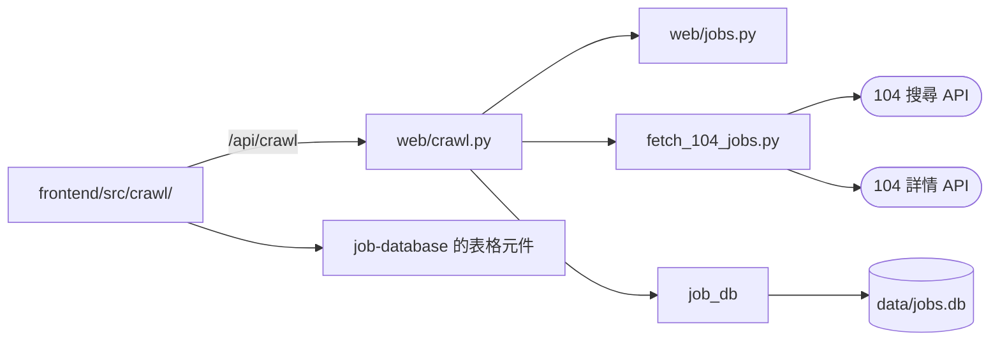

# 104 職缺爬蟲：技術設計

- 功能文件：[104-job-scraper.md](../../product/features/104-job-scraper.md)
- 程式碼：
  - [src/fetch_104_jobs.py](../../../src/fetch_104_jobs.py)：向 104 抓取
  - [src/web/crawl.py](../../../src/web/crawl.py)：抓取頁的 API
  - [frontend/src/crawl/](../../../frontend/src/crawl/)：抓取頁
  - 作業執行器 [src/web/jobs.py](../../../src/web/jobs.py) 是各功能共用的，見 [architecture.md](../architecture.md#模組依賴)

## 1. 總覽



- `fetch_104_jobs.py`：向 104 搜尋、以職缺代碼去重、逐筆取職缺頁面的內容，整理成職缺欄位契約的欄位。
  - 不寫檔、不寫資料庫，也不 import `job_db`：抓到的職缺只回傳給呼叫端。
  - 呼叫端以停止旗標要求停止，並從進度回呼拿到進度。
- `web/crawl.py`：抓取頁的 API。
  - 在作業執行器跑抓取。
  - 在記憶體保存沒存入的抓取結果，存入時交給 `job_db` 寫入。
- `web/jobs.py`：作業執行器，同一時間只跑一個作業，規則見[功能文件的作業](../../product/features/104-job-scraper.md#821-作業)。
- `frontend/src/crawl/`：
  - 條件表單。
  - 抓取中輪詢進度。
  - 預覽：沿用 job-database 的表格、欄位定義與展開內容，只能選職缺欄位契約的欄位。

## 2. 流程

實現 FR-search-*、FR-detail、FR-store-*、FR-job。業務規則見[功能文件的流程](../../product/features/104-job-scraper.md#421-流程)。

1. 開始抓取：頁面送出條件，`web/crawl.py` 驗證後在作業執行器開一個「抓取」作業。
   - 驗證的項目：關鍵字拆完不能是空的、縣市要在清單裡。
   - 有沒存入的結果、但請求沒有確認捨棄時，拒絕開始。
   - 舊結果在作業開始時才清掉：驗證失敗或已有作業在跑時，舊結果不受影響。
2. 抓取作業在背景執行緒呼叫 `fetch_104_jobs.scrape`：
   - 先搜完所有關鍵字、去重，再逐筆取職缺頁面的內容。
   - 每個請求送出前回報進度並檢查停止旗標。
   - 請求之間的延遲用停止旗標的等待，按停止時不必等延遲結束。
3. 作業結束時，先把結果交給抓取的狀態，再釋放作業執行器，查詢的一方才不會看到「作業已結束、結果卻還沒出現」的空檔：
   - 有取完內容的職缺：成為沒存入的結果，連同這次的條件與抓完或停止的時間。
   - 沒有：記下沒有預覽的原因（沒有抓到職缺，或停止時還沒有取完內容的職缺）。
4. 頁面輪詢狀態：
   - 抓取中：
     - 收到回應後隔 1 秒再查。
     - 同時只有一個查詢。
   - 預覽的「新」每次查詢時依職缺資料庫重新判斷。
5. 存入：
   - 以 `job_db` 的 `save_run` 一次寫入，執行時間用抓完或停止的時間。
   - 成功後清掉沒存入的結果，回傳職缺代碼。
   - 頁面帶著代碼打開職缺表的[只看剛存入的職缺](../../product/features/job-database.md#6-只看剛存入的職缺just-saved)。
6. 捨棄：清掉沒存入的結果，職缺資料庫不變。

## 3. 資料與儲存

實現 FR-store-*、FR-search-form。

- 沒存入的抓取結果只在 web app 的記憶體，web app 關閉就消失，不寫檔。
- 寫入職缺資料庫交給 `job_db`，去重見 [job-database 的寫入流程](job-database.md#21-寫入一批職缺)，資料表見 [job-database 的資料表](job-database.md#32-資料表)。帶入的條件：
  - `來源` 是 `爬蟲`。
  - `關鍵字` 是去重後的關鍵字，以 `, ` 合併。
  - `地區` 是縣市名稱，全台灣時為 `全台灣`。
- 記在瀏覽器的兩份資料，和職缺表各記各的：
  - `crawl.form.v1`：上次開始抓取的條件。
  - `crawl.previewView.v1`：預覽的欄位與排序。
- 職缺欄位契約的欄位與 104 API 欄位的對照。以下是搜尋 API 的欄位，另有標註的除外：
  - `職缺代碼` ← `jobNo`
  - `職缺名稱` ← `jobName`
  - `公司名稱` ← `custName`
  - `產業類別` ← `coIndustryDesc`
  - `地區` ← `jobAddrNoDesc` + `jobAddress`
  - `薪資待遇` ← 詳情 API 的 `jobDetail.salary`
  - `薪資下限` ← `salaryLow`
  - `薪資上限` ← `salaryHigh`
  - `更新日期` ← `appearDate`
  - `應徵人數` ← `applyCnt`
  - `工作內容` ← 詳情 API 的 `jobDetail.jobDescription`
  - `電腦專長` ← `pcSkills[].description`
  - `科系要求` ← `major`
  - `特色標籤` ← `tags` 的 `desc`
  - `職缺連結` ← `link.job`
  - `公司連結` ← `link.cust`
- 欄位由 [job-database 的職缺欄位契約](../../product/features/job-database.md#821-職缺欄位契約)決定，`job_db` 的 `JOB_COLUMNS` 是它的實作。
- 新增欄位時要同步修改：
  - 職缺欄位契約與 `job_db` 的 `JOB_COLUMNS`
  - 本功能整理欄位的地方：`fetch_104_jobs.py` 不 import `job_db`，兩邊的欄名與順序是否一致由本功能的測試檢查（見 [§6](#6-驗收對照)）

## 4. 外部系統整合

實現 FR-search-request、FR-detail、NFR-rate。

104 API：

- 搜尋：`https://www.104.com.tw/jobs/search/api/jobs`
  - `timeout=10`
  - 回傳的 `description` 只是關鍵字高亮的截斷摘要
- 詳情：`https://www.104.com.tw/job/ajax/content/{job_id}`
  - `timeout=5`
  - `job_id` 是職缺連結中 `/job/` 後面的 base36 代碼（如 `8s12x`）

標頭：

- 缺少 `User-Agent` 或 `Referer` 時，104 一律回 403。兩個標頭都放在 `DEFAULT_HEADERS`，不可移除。
- 搜尋 API 的 Referer 是 `https://www.104.com.tw/jobs/search/`。
- 詳情 API 會檢查 Referer 是否為該職缺自己的頁面（`https://www.104.com.tw/job/{job_id}`），沿用搜尋頁的 Referer 會被擋。
- `Accept-Language` 設為 `zh-TW` 優先，讓回傳內容是繁體中文。

頻率：

- 詳情請求不加延遲會被 104 拒絕，延遲的區間見[功能文件的非功能需求](../../product/features/104-job-scraper.md#7-非功能需求)。

## 5. 錯誤處理

抓取：

- 搜尋 API 回非 200，或拋出 `requests.exceptions.RequestException` 時，視為空頁。
- 詳情 API 回非 200 或拋出任何例外時，`薪資待遇` 與 `工作內容` 為 `None`。
- 請求失敗：
  - 都不顯示在頁面上。
  - 伺服器的輸出只印出其中幾種：
    - 搜尋 API 的失敗都會印出。
    - 詳情 API 只在拋出例外時印出，回非 200 時不印。
- 抓取作業拋出未預期的例外時：
  - 沒有預覽，原因寫「抓取失敗：」加上例外訊息。
  - 作業執行器照常釋放。

API：

- 拒絕的請求回 422（條件不合法）或 409（已有作業在跑、有沒存入的結果但沒有確認捨棄）。
  - `detail` 是給人看的一句話，頁面直接顯示。
- 存入時發生 `sqlite3.Error` 或 `OSError` 回 500，`detail` 寫「存入失敗：」加上原因。
  - `save_run` 整批在同一個 transaction，失敗時資料庫不變。
  - 沒存入的結果保留，可以再存入一次。

頁面：

- 取不到狀態時：
  - 保留畫面上的狀態。
  - 顯示原因並持續重試，下次取到時訊息消失。
- 只採用最後送出的查詢的回應：按鈕操作後的查詢與輪詢重疊時，晚到的舊回應不會蓋掉新狀態。
- 開始抓取的請求還沒有結果時不能再按一次，連按不會送出兩個請求。

## 6. 驗收對照

測試資料：

- `fake_104` 取代 `requests.get`，回應設定好的搜尋結果，並記錄收到的請求。
  - 可以讓第 n 個請求停住，在固定的時間點檢查進度或按停止。
- `no_sleep` 取代請求之間的延遲並記錄秒數。
- 資料庫在 `tmp_path`。
- 瀏覽器測試的伺服器和測試在同一個行程，同樣用 `fake_104`，見 [development.md 的瀏覽器測試](../../conventions/development.md#瀏覽器測試)。

一次跑完所有離線驗收：

```bash
uv run pytest tests/test_fetch_104_jobs.py tests/test_web_crawl.py tests/test_browser_crawl.py
npm test --prefix frontend -- crawl
```

不屬於任何 AC 的檢查：

- 型別檢查：`uv run mypy src/`，通過條件為沒有錯誤。
- 職缺欄位契約一致性（見 [§3](#3-資料與儲存)）：`uv run pytest tests/test_fetch_104_jobs.py -k parse_job_matches_job_columns`，檢查整理出來的欄名、順序與 `job_db` 的 `JOB_COLUMNS` 相同。
- 請求標頭（見 [§4](#4-外部系統整合)）：`uv run pytest tests/test_fetch_104_jobs.py -k "sends_headers or uses_job_referer"`，檢查每個請求都帶 `User-Agent`、`Referer` 與 `timeout`，詳情 API 的 `Referer` 是該職缺自己的頁面。
- 頁面取不到狀態、回應慢與連按開始（見 [§5](#5-錯誤處理)）：`uv run pytest tests/test_browser_crawl.py -k "refresh or slow or double_click"`。
- 與 104 的整合檢查〔需網路〕：`uv run pytest -m network tests/e2e/test_fetch_104_jobs.py`，真的向 104 抓一次，檢查去重、欄位順序，以及至少一筆取到工作內容。

### search

- [AC-search-form](../../product/features/104-job-scraper.md#ac-search-form搜尋條件的表單)：`uv run pytest tests/test_browser_crawl.py -k crawl_form`；記住的條件逐欄檢查：`npm test --prefix frontend -- form`
- [AC-search-keyword](../../product/features/104-job-scraper.md#ac-search-keyword關鍵字拆分)：`uv run pytest tests/test_fetch_104_jobs.py -k parse_keywords`
- [AC-search-area](../../product/features/104-job-scraper.md#ac-search-area縣市)：`uv run pytest tests/test_browser_crawl.py -k crawl_area`
- [AC-search-dedup](../../product/features/104-job-scraper.md#ac-search-dedup去重與分頁)：`uv run pytest tests/test_fetch_104_jobs.py -k "scrape_dedups or stops_on_empty_page or respects_page_limit"`
- [AC-search-request](../../product/features/104-job-scraper.md#ac-search-request請求與錯誤處理)：`uv run pytest tests/test_fetch_104_jobs.py -k "fetch_job or search_failure or detail_failure"`
- [AC-search-run](../../product/features/104-job-scraper.md#ac-search-run抓取中與停止)：`uv run pytest tests/test_browser_crawl.py -k crawl_run`；停止與進度的細節：`uv run pytest tests/test_fetch_104_jobs.py -k "reports_progress or scrape_stop"`

### detail

- [AC-detail](../../product/features/104-job-scraper.md#ac-detail欄位解析與取不到內容時不回填)：`uv run pytest tests/test_fetch_104_jobs.py -k "parse_job or extract or without_job_id"`
- [AC-detail-format](../../product/features/104-job-scraper.md#ac-detail-format欄位格式正規化)：`uv run pytest tests/test_fetch_104_jobs.py -k "format_date or normalize_url"`

### store

- [AC-store-preview](../../product/features/104-job-scraper.md#ac-store-preview預覽)：`uv run pytest tests/test_browser_crawl.py -k store_preview`
- [AC-store-save](../../product/features/104-job-scraper.md#ac-store-save整批存入或捨棄)：`uv run pytest tests/test_browser_crawl.py -k "store_save or store_discard"`；寫入的時間與條件：`uv run pytest tests/test_web_crawl.py -k save_preview`
- [AC-store-stopped](../../product/features/104-job-scraper.md#ac-store-stopped停止後存入)：`uv run pytest tests/test_browser_crawl.py -k store_stopped`
- [AC-store-failure](../../product/features/104-job-scraper.md#ac-store-failure存入失敗)：`uv run pytest tests/test_browser_crawl.py -k store_failure`，以資料庫的 trigger 讓寫入失敗
- [AC-store-keep](../../product/features/104-job-scraper.md#ac-store-keep沒存入的抓取結果)：`uv run pytest tests/test_browser_crawl.py -k store_keep`

### 非功能需求

- [AC-nfr-rate](../../product/features/104-job-scraper.md#ac-nfr-rate請求頻率限制)：`uv run pytest tests/test_fetch_104_jobs.py -k scrape_rate_limit`

### 共用規則

- [AC-job](../../product/features/104-job-scraper.md#ac-job作業)：`uv run pytest tests/test_browser_crawl.py -k "crawl_job and not busy"`
- [AC-job-busy](../../product/features/104-job-scraper.md#ac-job-busy有其他作業在跑時不能抓取)：`uv run pytest tests/test_browser_crawl.py -k job_busy`
