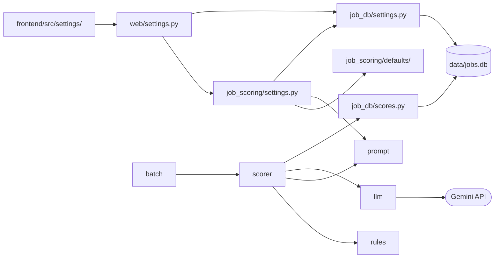

# 職缺自動評分：技術設計

- 功能文件：[job-auto-scoring.md](../../product/features/job-auto-scoring.md)
- 程式碼：
  - 評分：[src/job_scoring/](../../../src/job_scoring/)
  - 評分紀錄與設定的讀寫：[src/job_db/scores.py](../../../src/job_db/scores.py)、[src/job_db/settings.py](../../../src/job_db/settings.py)，建表語法在 [src/job_db/schema.py](../../../src/job_db/schema.py)
  - 設定頁：[src/web/settings.py](../../../src/web/settings.py)、[frontend/src/settings/](../../../frontend/src/settings/)

## 1. 總覽



模組職責，都在 `src/job_scoring/` 下，另有標註的除外：

- `settings.py`：評分用的設定：預設內容、偏好與模板的檢查、替新資料庫寫入第 1 版，以及讀出目前設定（`ScoringSettings`）。
- `defaults/`：專案附的預設偏好、預設經歷與預設模板，是每份設定的第 1 版。
- `models.py`：Pydantic 模型，包括偏好、AI 輸出、評分結果與整批的單筆結果。
- `rules.py`：程式端的規則，包括硬性淘汰、薪資換算與計分，以及共用的進位函式。
- `prompt.py`：由模板組出 system 與 user 提示詞、模板變數的比對，以及送評時的職缺內容快照。
- `llm.py`：LLM 供應商抽象層與 Gemini 實作。
- `scorer.py`：單筆評分流程、總分計算，以及「評分並寫入資料庫」這一步。
- `batch.py`：逐筆評分，一筆也走這裡；另有寫出試跑結果檔。
- `job_db/scores.py`：讀寫 `job_scores`。
- `job_db/settings.py`：讀寫設定的版本。
- `web/settings.py`：設定頁的 API。
- `frontend/src/settings/`：設定頁。

整批評分目前沒有呼叫端：評分 CLI 已拿掉，在職缺表送去評分的介面還沒做。

依賴限制：

- 只有 `llm.py` 可以 import 特定供應商的 SDK（`google` 開頭的模組）。
  - 換供應商或新增供應商時，評分規則的程式都不必改（見 [§4.1](#41-llm-供應商抽象層)）。
  - 由[驗收對照](#6-驗收對照)的「供應商隔離」以 `ast` 掃描 import 檢查。
- 評分紀錄與設定的讀寫放在 `job_db` 套件，不另開套件：同一個套件管理整份資料庫的連線、schema 與改版。
  - `job_db` 不 import 專案內的其他模組（原因見 [job-database 技術設計的總覽](job-database.md#1-總覽)），所以 `scores.py`、`settings.py` 的參數都用基本型別，由 `scorer.py`、`job_scoring/settings.py` 把資料轉好再傳入。
- 帶職缺欄位的評分查詢放在 `scores.py`，不放 `queries.py`：
  - `queries.py` 屬於 job-database，job-database 不依賴任何功能，它的查詢不能 JOIN `job_scores`。
  - 本功能依賴 job-database，由 `scores.py` JOIN `jobs` 不違反依賴方向。

## 2. 流程

### 2.1 單筆評分

實現 FR-score-salary、FR-score-ai、FR-score-total、FR-score-store、FR-filter、FR-history-append、FR-basis-record。業務規則見[功能文件的評分流程](../../product/features/job-auto-scoring.md#423-評分流程)。

`scorer.score_and_save` 評分並寫入資料庫，[整批評分](#22-整批評分)的每一筆都經過這一步：

1. 以 `rules.py` 檢查硬性淘汰，被淘汰的職缺不呼叫 AI。
2. 沒被淘汰時，`prompt.py` 用設定的模板組出提示詞，再用呼叫端傳入的 client 呼叫 AI。
   - 每次都呼叫，不查上次的評分。
3. `rules.py` 算薪資分數，`scorer.py` 算總分。
4. 交給 `job_db/scores.py` 新增一列（[§3.2](#32-job_scores)），連同評分依據：設定的三個版本號與職缺內容快照。
   - 被淘汰的職缺，`供應商`、`模型` 寫 `NULL`，評分依據照樣記。
5. 評分失敗時例外往外拋，不寫入。

評分用的設定以一個 `ScoringSettings` 傳入，裡面有偏好、經歷、模板與各自的版本號。這樣寫進評分依據的版本，一定就是評分時用的內容。

試跑時呼叫端傳入的連線是 `None`：跳過寫入，其餘步驟相同，所以試跑與正式評分走同一套評分邏輯。

總分與年薪換算共用 `rules.round_half_up`：以 `Fraction` 精確計算再 .5 進位，避免浮點誤差，也不用 Python `round()` 的五成雙。

### 2.2 整批評分

實現 FR-score-failure。`batch.score_batch` 是評分的共用進入點：

- 要評的職缺、設定、資料庫連線、供應商與模型都由呼叫端傳入，整批用同一組設定。
- client 以 `client_factory` 傳入：
  - 開始評分前先以 `rules.check_hard_filters` 檢查，有需要呼叫 AI 的職缺時才建立 client，之後整批共用。
  - 整批都被淘汰時就不需要 API key。
  - 建立失敗（不支援的供應商、缺少 API key）時直接往外拋，這時還沒評任何一筆，所以會被淘汰的職缺也不會寫入。
- 每筆都經過 `scorer.score_and_save`，哪些錯誤算單筆失敗見 [§5](#5-錯誤處理)。
- `batch.write_dry_run_results` 把試跑結果寫成 JSON 與 CSV，目前沒有呼叫端。

### 2.3 提示詞模板

實現 FR-score-ai、FR-settings-check。模板的規則見[功能文件的提示詞模板](../../product/features/job-auto-scoring.md#428-提示詞模板)。

- 模板依 `<!-- SYSTEM -->`、`<!-- USER -->` 拆成兩段。
- SYSTEM 標記之前的內容是模板的註解，不送給 AI，也不檢查。
- 變數名稱是中文，不用 `string.Template`：
  - 中文沒有空白分隔，`$職缺名稱與…` 照 `string.Template` 的規則會被當成一個叫「職缺名稱與…」的變數。
  - 改成遇到 `$` 時以已知的變數名稱比對，長的優先。
  - `$` 之後接文字、卻不是已知變數的，算不認得的變數，名稱取到第一個不是文字的字元為止。
  - 其他的 `$`（例如接數字或空白）原樣保留。
- 職缺欄位為 `null` 或空字串、個人資料為空時，放入「（無資料）」。
- 職缺內容快照取送進 AI 的 6 個欄位，加上淘汰與薪資計分用的 3 個欄位（見[功能文件的評分依據的內容](../../product/features/job-auto-scoring.md#1121-評分依據的內容)）。

### 2.4 設定頁

實現 FR-settings-*。規則見[功能文件的在網頁上編輯設定並保留每個版本](../../product/features/job-auto-scoring.md#8-在網頁上編輯設定並保留每個版本settings)。

後端：

- web app 啟動時，替還沒有任何版本的設定寫入第 1 版並設成目前設定（`ensure_defaults`），內容是 `defaults/` 的檔案。
- 設定只存在職缺資料庫，不讀 `profile/` 等檔案。
- 「預設範例」以內容和預設檔案完全相同判斷，不論是第幾版。
- 檢查放在後端，前端呼叫檢查的 API 顯示結果：偏好的驗證用的就是評分時的 `Preferences` 模型，規則只寫一份。
  - pydantic 常見的錯誤改寫成中文，寫成「欄位路徑：原因」；其他的沿用 pydantic 的訊息。
- 儲存與套用時後端再檢查一次，前端擋不住的情況（例如舊版本在規則改變後不合法）也不會變成目前設定。
- 儲存新版本時：
  - 版本號取該種設定的最大版本號加一。
  - 新增與改成目前設定在同一個 transaction 中。
- API 不提供刪除版本的端點。

前端：

- 編輯區的內容記在 `localStorage` 的 `settings.drafts.v1`，每份設定記「以哪一版為底」與內容。
  - 讀取時逐份檢查，格式不對或那一版不存在的丟掉，退回目前設定。
  - 和目前設定相同、也沒有修改時就不記。
- 主按鈕的三態只看編輯區，規則寫成純函式，用 Vitest 測：
  - 有修改時儲存並套用。
  - 載入的不是目前設定時套用那一版。
  - 否則停用。
- 檢查在停止輸入 300ms 後送出，只採用最後一次送出的回應。
  - 檢查失敗時顯示原因，每 2 秒自動重試。
  - 還沒有檢查結果或有錯誤時，主按鈕停用。
- 儲存或套用成功後，那份設定的編輯區仍是送出的內容時才清掉：等待回應時又改過的內容保留。
  - 伺服器上已經改好，所以不論重新取得設定成不成功都要清掉，否則重新打開時會把已存的內容當成修改再存一次。
  - 重新取得設定失敗時，畫面上的版本紀錄與目前設定都已過時，整頁改成請使用者重新整理。

## 3. 資料與儲存

實現 FR-record、FR-settings-store、FR-basis-record、NFR-migration。欄位的業務意義見功能文件的[評分紀錄](../../product/features/job-auto-scoring.md#1322-評分紀錄)與[設定的版本](../../product/features/job-auto-scoring.md#821-設定的版本)。

- 建表語法與 job-database 的表一起放在 `job_db/schema.py`。
- 開啟資料庫見 [job-database 技術設計的開啟資料庫](job-database.md#31-開啟資料庫)。
- 改版的機制見 [job-database 技術設計的資料庫改版](job-database.md#34-資料庫改版)。

### 3.1 設定的版本

`settings_versions`：每種設定的每一版一列。

- `種類`（TEXT）：`preferences`、`experience`、`template`，以 `CHECK` 限制
- `版本`（INTEGER）：每種設定各自從 1 開始
- 主鍵是（`種類`, `版本`）
- `名稱`（TEXT NOT NULL）
- `描述`（TEXT NOT NULL）：沒填時是空字串
- `儲存時間`（TEXT NOT NULL）：本地時間，ISO 8601，精確到秒
- `內容`（TEXT NOT NULL）

`current_settings`：每種設定一列，指向目前設定是哪一版。

- `種類`（TEXT）：主鍵
- `版本`（INTEGER NOT NULL）
- （`種類`, `版本`）以外鍵指向 `settings_versions`

設計理由：

- 版本的內容不能改，只有 `名稱`、`描述` 可以改。
- 沒有刪除版本的函式，評分紀錄記下的版本永遠查得到。
- 目前設定另外成表，而不是在版本上加旗標：一種設定只會有一列，不必維持「只有一版是目前設定」的限制。
- 不記「什麼時候套用哪一版」，理由見[功能文件的設定的版本](../../product/features/job-auto-scoring.md#821-設定的版本)。

### 3.2 job_scores

每次評分一列，同一筆職缺可以有多列。

- `評分編號`（INTEGER）：主鍵，`AUTOINCREMENT`
  - 評分時間只精確到秒，同一秒內的多列以它排先後
- `職缺代碼`（TEXT NOT NULL）：以外鍵指向 `jobs`
- `評分時間`（TEXT NOT NULL）：本地時間，ISO 8601，精確到秒
- `淘汰`（INTEGER NOT NULL）：`0`／`1`
- `總分`（INTEGER）：被淘汰時為 `NULL`
- `評語`（TEXT）：新的評分一定有值
  - 欄位不設 `NOT NULL`，因為最舊版被淘汰時寫入的列是 `NULL`
- `評分明細`（TEXT）：`JobScore.model_dump(by_alias=True)` 的中文鍵 dict，以 `json.dumps(ensure_ascii=False)` 存成字串
- `供應商`、`模型`（TEXT）：被淘汰時為 `NULL`
- 評分依據：`偏好版本`、`經歷版本`、`模板版本`（INTEGER）與 `職缺快照`（TEXT，JSON）
  - 改版前寫入的列四欄都是 `NULL`
  - 以 `CHECK` 限制四欄要嘛全是 `NULL`、要嘛全有值

索引：

- `job_scores_job`：（`職缺代碼`, `評分時間`），查一筆職缺的紀錄與最新一筆時使用。

設計理由：

- 和 `jobs` 分開存放：職缺被重新寫入時，job-database 會覆寫整列（見[功能文件的寫入規則](../../product/features/job-database.md#421-寫入規則)），分數放在同一張表就得另外避開。
- `職缺代碼` 以外鍵指向 `jobs`：評分的職缺都來自職缺資料庫。
- `淘汰`、`總分`、`評語` 與 `評分明細` 中的值重複：另外成欄是為了讓 SQL 可以直接篩選與排序，不解析 JSON。
- 版本欄不設外鍵：
  - 外鍵的目標是（`種類`, `版本`）組合鍵，每欄的種類固定，SQLite 的外鍵寫不出常數。
  - 版本只新增、不刪除，不會指到不存在的版本。
- 快照另外存，不靠版本號組回：職缺資料庫只保留每筆職缺的最新一版，職缺內容改過後就組不回當時的提示詞。

### 3.3 寫入與查詢

寫入（`job_db/scores.py`）：

- 只 `INSERT`，不覆寫任何列，也不和先前的列比較。
- 沒有任何刪除評分紀錄的函式（FR-history-no-delete）。
- 每筆職缺的寫入各自是一個 transaction，整批中途中止時已經評完的職缺留在資料庫。

查詢（`job_db/scores.py`）：

- 代表的評分（見[功能文件的代表的評分](../../product/features/job-auto-scoring.md#1323-代表的評分)）以 window function 挑出：`ROW_NUMBER() OVER (PARTITION BY 職缺代碼 ORDER BY 評分時間 DESC, 評分編號 DESC)` 取第 1 列。
  - 評分時間相同時，後寫入的 `評分編號` 較大，排在前面。
  - 依分數列出、取出單筆評分紀錄、取出評分明細共用這個子查詢。
- 依分數列出時先挑代表再套 `淘汰` 篩選與排序：先篩再挑的話，代表被篩掉的職缺會改以別列出現。
  - 第一個排序鍵明寫 `總分 IS NULL`，把沒有總分的列排到最後，不依賴 SQLite 對 `NULL` 的預設排序。
  - 最後一個排序鍵是 `職缺代碼`，同樣的資料每次查出來的順序才一致。
  - `limit`、`offset` 是負數時拋出 `ValueError`：SQLite 把負的 `LIMIT` 當成不限筆數，不擋下來會靜默回傳全部。
- 取出所有評分紀錄時不經過代表的挑選。
  - `評分明細` 與 `職缺快照` 以 `json.loads` 還原。

### 3.4 改版：舊版的 job_scores

實現 NFR-migration。改版的機制（版本號、備份、同一個 transaction、失敗時還原）見 [job-database 技術設計的資料庫改版](job-database.md#34-資料庫改版)，這裡只寫評分的資料怎麼搬。

開始記版本之前（第 0 版）的 `job_scores` 有幾種樣子，依欄位判斷：

- 最舊版：以 `職缺代碼` 為主鍵，評分明細的欄名是 `評分結果`，還有 `快取鍵`。
  - 只有自動評分會寫入 `評分結果`，是 `NULL` 的列是手動評分。
  - 更早的 `評分結果` 是 `NOT NULL`，自動評分淘汰時寫入的列 `評語` 是 `NULL`。
- 之後的版本有 `評分編號` 與 `評分來源`（`auto`／`manual`），有些還留著 `快取鍵` 欄位與限制手動評分的唯一索引 `job_scores_manual`。
- 兩者都不是時拋錯，不猜：SQLite 把找不到的雙引號欄名當成字串，猜錯時整欄會被寫成欄名。

改成第 1 版：

1. 刪掉舊的索引，把舊表改名，建新表。
2. 只搬自動評分，而且 `jobs` 裡有對應的職缺；手動評分與沒有對應職缺的評分新結構無法表示，略過並分別計數。
3. 有 `評分編號` 的保留原本的編號，同一秒內「後寫入的在前」的順序才不變；最舊版依寫入順序重新編號。
4. `評分結果` 搬到 `評分明細`，評分依據的四欄是 `NULL`。
5. 刪掉舊表，建立設定的兩張表（內容是空的，第 1 版在 web app 啟動時寫入）。

### 3.5 API key

實現 NFR-privacy。

```
.env.example                 API key 範本（進版控）
.env                         真實 API key（不進版控）
```

- `.env` 由 `src/app.py` 啟動時以 `load_dotenv(專案根目錄 / ".env")` 載入。
  - `load_dotenv` 預設**不覆寫已經存在的環境變數**（[python-dotenv](https://github.com/theskumar/python-dotenv)），所以 shell 設定的值優先。
  - 測試時把 `GEMINI_API_KEY` 設成空字串，就能模擬沒有 key 的情況，不受 `.env` 影響。

## 4. 外部系統整合

### 4.1 LLM 供應商抽象層

實現 FR-llm、NFR-privacy。

```python
class LLMClient(Protocol):
    def assess(self, system: str, user: str) -> AIAssessment: ...
```

- `get_client(provider, model)`：用供應商名稱查表建立 client。
  - 不認得的名稱就拋出 `ValueError`。
  - 加入其他供應商時，只要新增對應的 client 並註冊到表中，其他模組都不用改。
- `GeminiClient(model)`：使用 `google-genai` 的 Interactions API（參考 [Gemini structured output 文件](https://ai.google.dev/gemini-api/docs/structured-output)）。
  - 以 structured output 要求符合 `AIAssessment` schema 的 JSON，再用 Pydantic 驗證。
  - `response_format` 裡 schema 的鍵名要寫 `schema_`（SDK 的 TypedDict 鍵名），送出時才會序列化成 API 的 `schema`。
  - `store=False`：提示詞含個人經歷，不在伺服器端保存互動紀錄。
  - 不設定溫度等取樣參數：Gemini 3.8 Flash 已不支援 `temperature`、`top_p`、`top_k`（[官方說明](https://ai.google.dev/gemini-api/docs/latest-model)）。
  - SDK 的錯誤類別（HTTP、連線、逾時）沒有公開匯出，因此 `interactions.create` 拋出的任何例外都轉成 `LLMError`。
  - `output_text` 為空時也是 `LLMError`。
  - 建構時檢查 `GEMINI_API_KEY`，沒有設定或是空字串就拋出 `LLMError`。

### 4.2 AI 輸出 schema

實現 FR-score-ai。

AI 必須輸出以下 JSON（Pydantic 模型 `AIAssessment`）：

```json
{
  "career_fit":   {"score": 1-5 | null, "reason": "..."},
  "skill_match":  {"score": 1-5 | null, "reason": "..."},
  "industry_fit": {"score": 1-5 | null, "reason": "..."},
  "comment": "..."
}
```

- 欄位使用英文名稱，讓 schema 對各家模型都比較穩定。
- 由 `scorer.py` 轉成評分結果（`JobScore`）的中文鍵名。
  - `JobScore` 以 alias 定義中文鍵名，`model_dump(by_alias=True)` 的結果就是[功能文件的評分結果格式](../../product/features/job-auto-scoring.md#1321-評分結果格式)。
- 不通過驗證時拋出 `ValidationError`，視為評分失敗，不自行修正分數。

## 5. 錯誤處理

整批評分：

- 單筆的 `LLMError` 與 `ValidationError` 算單筆失敗，失敗原因記錄例外訊息，繼續下一筆。
- client 建立失敗（`ValueError` 不支援的供應商、`LLMError` 缺少 API key）時在開始評分前往外拋。
- `sqlite3.Error` 讓評分中止，已寫入的職缺留在資料庫。
- 其他例外代表程式錯誤，直接往外拋。

設定頁的 API：

- 名稱空白、內容檢查有錯時回 422，`detail` 寫出原因，什麼都不存。
- 要套用或修改的版本不存在時回 404。
- 不認得的設定種類由 FastAPI 的路徑驗證回 422。

改版失敗時的訊息與結束碼見 [job-database 技術設計的資料庫改版](job-database.md#34-資料庫改版)。

## 6. 驗收對照

- 只列已實作的 AC；〔規劃中〕的 AC 完成後再補上。
- 除了〔需網路〕的條目，都離線執行，也不需要 API key：AI 的回應以假的 LLM client 代替。
- 設定頁的瀏覽器行為以 Playwright 測，開始前會自動 build 前端（見 [development.md 的瀏覽器測試](../../conventions/development.md#瀏覽器測試)）。

共用的測試資料放在 `tests/conftest.py`：

- 測試用的偏好、經歷與兩筆職缺：`ok`（不會被淘汰）與 `out`（會被淘汰）。
  - 偏好的 `目標方向`、經歷、職缺的工作內容分別放入 `目標標記-AAA`、`經歷標記-BBB`、`工作標記-CCC`，用來檢查提示詞的內容。
  - 測試設定的版本號是偏好第 2 版、經歷第 3 版、模板第 1 版，三個都不同，才分得出寫錯欄。
- 假的 LLM client：回傳固定內容並記錄呼叫次數。
  - 整批用的版本可以對指定職缺拋出 `LLMError` 或回傳超出範圍的分數。
- 資料庫建在 `tmp_path`。
  - 評分紀錄有外鍵，測試先把職缺寫進資料庫再評分。
- 改版的測試以 SQL 建出各種舊版的資料庫。
- e2e 的固定輸入在 `tests/e2e/data/`：擬真的偏好與經歷（測試資料，不是使用者的設定），以及 5 筆改寫自 104 的職缺（虛構公司、內文重新表述）。

一次跑完所有離線驗收：

```bash
uv run pytest tests/test_job_scoring_*.py tests/test_job_db_scores.py tests/test_job_db_settings.py tests/test_job_db_upgrade.py tests/test_app.py tests/test_web_settings.py tests/test_browser_settings.py
npm test --prefix frontend -- drafts
```

其他檢查：

- 型別檢查：`uv run mypy src/` 與 `npm run typecheck --prefix frontend`，通過條件為沒有錯誤。
- 前端的 API 型別是否最新：`uv run pytest tests/test_web_openapi.py`。
- 供應商隔離：`uv run pytest tests/test_job_scoring_llm.py -k provider_sdk_isolated`，通過條件為只有 `llm.py` import `google` 開頭的模組。
- 真實的 `.env` 不進版控、`.env.example` 有進版控：`uv run pytest tests/test_job_scoring_llm.py -k env_ignored`。
- 整合檢查〔需網路〕：`uv run pytest -m network -s tests/e2e/test_job_scoring.py`
  - 以 e2e 的固定輸入與預設模板評所有職缺，沒有設定 `GEMINI_API_KEY` 時跳過並說明原因。
  - 自動檢查：每一筆有工作內容、而且沒被淘汰的職缺都評分成功，評分明細的格式、各維度的理由與分數範圍、供應商與模型都正確。
  - 印出這些職缺的評分明細與測試資料庫的路徑，給使用者閱讀理由。
- 操作改成在網頁送去評分、判斷的結果不變的 AC，送去評分的介面完成前，由整批評分的測試驗判斷的部分：
  - 評分結果入庫：`uv run pytest tests/test_job_scoring_batch.py -k store`
  - 被淘汰的不需要 API key：`uv run pytest tests/test_job_scoring_batch.py -k all_eliminated`
  - 淘汰時的評語：`uv run pytest tests/test_job_scoring_batch.py -k filter_comment`
  - 重評失敗時保留原本的評分：`uv run pytest tests/test_job_scoring_batch.py -k rescore_failure`
  - 重評新增而不覆寫、不提供刪除：`uv run pytest tests/test_job_scoring_batch.py -k "history_append or history_no_delete"`
  - 代表的評分與所有評分紀錄的查詢：`uv run pytest tests/test_job_scoring_batch.py -k current`

### score

- [AC-score-salary](../../product/features/job-auto-scoring.md#ac-score-salary薪資計分)：`uv run pytest tests/test_job_scoring_rules.py -k score_salary`
- [AC-score-total](../../product/features/job-auto-scoring.md#ac-score-total總分計算)：`uv run pytest tests/test_job_scoring_scorer.py -k compute_total`
- [AC-score-flow](../../product/features/job-auto-scoring.md#ac-score-flow評分流程與-ai-回應處理)：`uv run pytest tests/test_job_scoring_scorer.py -k score_job`
  - 送給 AI 的資料與「（無資料）」：`uv run pytest tests/test_job_scoring_prompt.py`
- [AC-score-failure](../../product/features/job-auto-scoring.md#ac-score-failure單筆失敗不中斷整批)：`uv run pytest tests/test_job_scoring_batch.py -k failure_does_not_stop`
  - 只驗寫入與整批不中斷；列上的失敗標示〔規劃中〕

### filter

- [AC-filter-rules](../../product/features/job-auto-scoring.md#ac-filter-rules硬性淘汰)：`uv run pytest tests/test_job_scoring_rules.py -k check_hard_filters`

### settings

- [AC-settings-version](../../product/features/job-auto-scoring.md#ac-settings-version儲存版本與修改名稱)：`uv run pytest tests/test_browser_settings.py -k settings_version`
  - API 與資料庫：`uv run pytest tests/test_web_settings.py -k "save_version or update_meta or no_delete"` 與 `uv run pytest tests/test_job_db_settings.py`
  - 專案目錄沒有新增或修改任何檔案：比對儲存前後的 `git status --porcelain --ignored`
- [AC-settings-apply](../../product/features/job-auto-scoring.md#ac-settings-apply主按鈕與套用舊版本)：`uv run pytest tests/test_browser_settings.py -k settings_apply`，以及 `npm test --prefix frontend -- drafts`
  - API：`uv run pytest tests/test_web_settings.py -k apply`
- [AC-settings-editor](../../product/features/job-auto-scoring.md#ac-settings-editor編輯區)：`uv run pytest tests/test_browser_settings.py -k "settings_editor or rename_keeps or typing or reload_failure or retries"`，以及 `npm test --prefix frontend -- drafts`
  - 不允許保存的瀏覽器：以 Playwright 的 init script 讓讀取 `localStorage` 丟出例外。
- [AC-settings-check](../../product/features/job-auto-scoring.md#ac-settings-check檢查)：`uv run pytest tests/test_job_scoring_settings.py -k check` 與 `uv run pytest tests/test_browser_settings.py -k settings_check`
  - 不能試跑那一項〔規劃中〕
- [AC-settings-default](../../product/features/job-auto-scoring.md#ac-settings-default第一版與預設範例)：`uv run pytest tests/test_browser_settings.py -k settings_default` 與 `uv run pytest tests/test_web_settings.py -k first_versions`
  - 確認視窗那一項〔規劃中〕

### basis

- [AC-basis](../../product/features/job-auto-scoring.md#ac-basis記錄與顯示評分依據)：`uv run pytest tests/test_job_scoring_batch.py -k basis`
  - 只驗 (a) 的記錄；(b)、(c) 的顯示〔規劃中〕

### 非功能需求

- [AC-nfr-migration](../../product/features/job-auto-scoring.md#ac-nfr-migration改版時保留評分資料)：`uv run pytest tests/test_job_db_upgrade.py tests/test_app.py`
  - 以 SQL 建出三種舊版的資料庫，各含自動、手動與沒有對應職缺的評分。
  - 中途失敗以替換改版步驟模擬。
  - 設定的版本：第 0 版還沒有設定的資料表，沒有要保留的內容。
    - 目前只驗改版後建出空的設定資料表。
    - 之後改版時要補上「設定的版本筆數與內容不變」的驗證。
