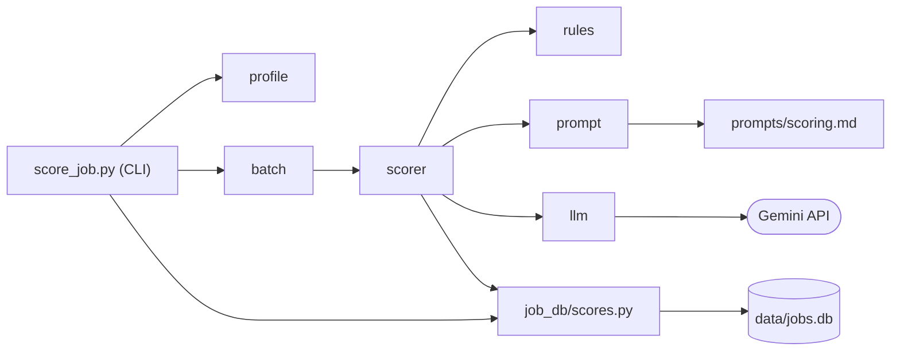

# 職缺自動評分：技術設計

- 功能文件：[job-auto-scoring.md](../../product/features/job-auto-scoring.md)
- 程式碼：[src/score_job.py](../../../src/score_job.py)（CLI）、[src/job_scoring/](../../../src/job_scoring/)

## 1. 總覽



模組職責，都在 `src/job_scoring/` 下，另有標註的除外：

- `score_job.py`（`src/`）：CLI 進入點，解析參數、載入 `.env`、開啟資料庫、選出要評的職缺，交給整批評分並印出摘要。
- `models.py`：Pydantic 模型，包括偏好檔、AI 輸出、評分結果與整批的單筆結果。
- `profile.py`：讀取並驗證 `preferences.yaml` 與 `experience.md`。
- `rules.py`：程式端的規則，包括硬性淘汰、薪資換算與計分，以及共用的進位函式。
- `prompt.py`：由模板組出 system 與 user 提示詞。
- `prompts/scoring.md`：提示詞模板，和程式碼分開，調整提示詞時不必改程式。
- `llm.py`：LLM 供應商抽象層與 Gemini 實作。
- `scorer.py`：單筆評分流程、總分計算，以及「評分並寫入資料庫」這一步。
- `batch.py`：逐筆評分（一筆也走這裡）、寫出試跑結果檔。
- `job_db/scores.py`：屬於 job-score-database（見 [job-score-database 技術設計](job-score-database.md#1-總覽)），本功能用它選出還沒評分的職缺、新增自動評分、取出評分明細，並在依分數列出時多帶欄位。
- `job_db/queries.py`：屬於 job-database，本功能用 `get_job` 取出 `--job-no` 指定的職缺。

依賴限制：

- 只有 `llm.py` 可以 import 特定供應商的 SDK（`google` 開頭的模組）：換供應商或新增供應商時，評分規則的程式都不必改（見 [§4.1](#41-llm-供應商抽象層)）。由[驗收對照](#6-驗收對照)的「供應商隔離」以 `ast` 掃描 import 檢查。
- `job_db` 不 import 專案內的其他模組（原因見 [job-database 的技術設計](job-database.md#1-總覽)），所以 `job_db/scores.py` 的參數都用基本型別，由 `scorer.py` 把評分結果轉好再傳入。

import 路徑：

- 用 `uv run src/score_job.py` 執行時，`src/` 會在 import 路徑上，可以直接 `import job_scoring`。
- pytest 已在 `pyproject.toml` 設定 `pythonpath = ["src"]`，測試中也可以直接 import。

## 2. 流程

### 2.1 單筆評分

實現 FR-score-*、FR-filter、FR-store-write、FR-dry-run、FR-history-append。業務規則見[功能文件的評分流程](../../product/features/job-auto-scoring.md#423-評分流程)。

`scorer.score_and_save` 評分並寫入資料庫，[整批評分](#22-整批評分)的每一筆都經過這一步：

1. `scorer.score_job` 以 `rules.py` 檢查硬性淘汰，被淘汰的職缺不呼叫 AI。
2. 沒被淘汰時，`prompt.py` 組出提示詞，用呼叫端傳入的 client 呼叫 AI；每次都呼叫，不查上次的評分。
3. `rules.py` 算薪資分數，`scorer.py` 算總分。
4. 交給 `job_db/scores.py` 新增一列（[§3.2](#32-job_scores-的自動評分欄位)）。被淘汰的職缺，`供應商`、`模型` 寫 `NULL`。
5. 評分失敗時例外往外拋，不寫入。

試跑時呼叫端傳入的連線是 `None`：跳過寫入，其餘步驟相同，所以試跑與正式評分走同一套評分邏輯。

總分與年薪換算共用 `rules.round_half_up`：以 `Fraction` 精確計算再 .5 進位，避免浮點誤差，也不用 Python `round()` 的五成雙。

### 2.2 整批評分

實現 FR-batch-*。`batch.score_batch` 是評分的共用進入點，不綁定 CLI，其他入口也呼叫同一個函式：

- 要評的職缺由呼叫端選好傳入（CLI 的選法見 [§5](#5-cli-與錯誤處理)）。
- 資料庫連線、供應商與模型由參數傳入。連線是 `None` 時為試跑，原樣傳給 `score_and_save`。
- client 以 `client_factory` 傳入：
  - 開始評分前先以 `rules.check_hard_filters` 檢查，有需要呼叫 AI 的職缺時才建立 client，之後整批共用；整批都被淘汰時就不需要 API key。
  - 建立失敗（不支援的供應商、缺少 API key）時直接往外拋，這時還沒評任何一筆，所以會被淘汰的職缺也不會寫入。
- 每筆都經過 `scorer.score_and_save`，哪些錯誤算單筆失敗見 [§5](#5-cli-與錯誤處理)。
- `batch.write_dry_run_results` 把試跑結果寫成 JSON 與 CSV，格式見[功能文件的試跑結果檔](../../product/features/job-auto-scoring.md#822-試跑結果檔)。
  - 檔名由呼叫端傳入的開始時間決定；`.json` 或 `.csv` 已經存在時依序加上 `_2`、`_3`，不覆寫。

## 3. 資料與儲存

### 3.1 個人資料檔與 API key

實現 FR-score-profile、NFR-privacy。

```
.env.example                 API key 範本（進版控）
.env                         真實 API key（不進版控）
profile/
  preferences.example.yaml   範本（進版控）
  experience.example.md      範本（進版控）
  preferences.yaml           真實資料（不進版控）
  experience.md              真實資料（不進版控）
```

- `profile/`、`output/scores/` 的預設位置都以 `score_job.py` 的位置推算專案根目錄，不受工作目錄影響。
- `.env` 由 `score_job.py` 啟動時以 `load_dotenv(專案根目錄 / ".env")` 載入。
  - `load_dotenv` 預設**不覆寫已經存在的環境變數**（[python-dotenv](https://github.com/theskumar/python-dotenv)），所以 shell 設定的值優先。
  - 測試時把 `GEMINI_API_KEY` 設成空字串，就能模擬沒有 key 的情況，不受 `.env` 影響。

### 3.2 job_scores 的自動評分欄位

實現 FR-store-write、FR-store-db-path、FR-store-get、FR-list、FR-history-*、FR-current-*。`job_scores` 的基本欄位、查詢與設計理由見 [job-score-database 技術設計](job-score-database.md#21-job_scores-資料表)，業務意義見[功能文件的寫入的評分紀錄](../../product/features/job-auto-scoring.md#721-寫入的評分紀錄)與[保留評分歷史](../../product/features/job-auto-scoring.md#10-保留評分歷史並和手動評分並存history)。

疊加的欄位，建表語法同樣在 `job_db/schema.py`：

- `評分編號`（INTEGER）：主鍵，`AUTOINCREMENT`
  - 同一筆職缺可以有多列，所以不能再以 `職缺代碼` 當主鍵
  - 評分時間只精確到秒，同一秒內的多列以它排先後
- `評分來源`（TEXT）：`auto`／`manual`，以 `CHECK` 限制
- `評分明細`（TEXT | null）：`scorer.py` 以 `JobScore.model_dump(by_alias=True)` 轉成中文鍵的 dict，`job_db/scores.py` 以 `json.dumps(ensure_ascii=False)` 存成字串，取出時以 `json.loads` 還原
  - 自動評分一定有值，手動評分為 `null`
- `供應商`、`模型`（TEXT | null）：被淘汰時為 `null`

索引：

- `job_scores_job`：`(職缺代碼, 評分時間)`，查一筆職缺的紀錄與最新一筆時使用。

其他欄位的來源：

- `評語`：取自評分結果；被淘汰時由 `scorer.py` 以淘汰原因組成（見[功能文件的淘汰時的評語](../../product/features/job-auto-scoring.md#522-淘汰時的評語)）。
- `淘汰`、`總分`、`評語` 與 `評分明細` 中的值重複：另外成欄是為了讓 SQL 可以直接篩選與排序，不解析 JSON。

寫入（都在 `job_db/scores.py`）：

- 自動評分（`save_auto_score`）與手動評分（`save_score`）都只 `INSERT`，不覆寫任何列，也不和先前的列比較。
- 沒有任何刪除評分紀錄的函式，CLI 也沒有對應的參數（FR-history-no-delete）。
- 每筆職缺的寫入各自是一個 transaction，整批中途中止時已經評完的職缺留在資料庫。
- 評分中途發生 `sqlite3.Error` 時，CLI 回傳 1，已寫入的職缺留在資料庫。

既有資料庫：

- `open_db` 建表用 `CREATE TABLE IF NOT EXISTS`，不會修改既有的表，所以舊版的表另外處理。
- 拿掉快取之前的版本（有 `評分來源`，另有 `快取鍵` 欄位與 `job_scores_manual` 唯一索引）就地遷移，保留所有評分紀錄：
  - `DROP INDEX IF EXISTS job_scores_manual`：這個索引限制每筆職缺最多一筆手動評分，留著的話手動評分無法新增第二筆。
  - 有 `快取鍵` 欄位時 `ALTER TABLE ... DROP COLUMN`。
- 更早的版本（`job_scores` 以 `職缺代碼` 為主鍵、欄名是 `評分結果`）不遷移，要刪除後重建。`open_db` 建表前先檢查：`job_scores` 已存在但沒有 `評分來源` 欄位時，拋出 `sqlite3.DatabaseError`，提示刪除資料庫檔後重建，評分 CLI 印出 `[-]` 並回傳 1。
  - 不擋下的話，SQLite 會把找不到的雙引號欄名當成字串：查詢靜默查不到，呼叫 AI 付了費用之後寫入才失敗。
  - 爬蟲與匯入 CLI 也經過 `open_db`，同樣會被擋下。
- 遷移的做法見 [TODO.md](../../../TODO.md#評分資料庫)。

查詢（都在 `job_db/scores.py`）：

- 還沒評分的職缺（`list_unscored_jobs`）：`jobs` 中在 `job_scores` 沒有任何列的職缺（`NOT EXISTS`，自動與手動都算），依 `最後出現時間 DESC, 職缺代碼` 排序。欄位同 `get_job`，放在 `scores.py` 是因為要讀 `job_scores`，`queries.py` 屬於 job-database，不知道評分。
- 代表的評分（見[功能文件的代表的評分](../../product/features/job-auto-scoring.md#1121-代表的評分)）以 window function 挑出：`ROW_NUMBER() OVER (PARTITION BY 職缺代碼 ORDER BY 評分時間 DESC, 評分編號 DESC)` 取第 1 列，不分來源。
  - 評分時間相同時，後寫入的 `評分編號` 較大，排在前面。
  - 依分數列出（`list_scored_jobs`）、取出評分紀錄（`get_score`）、取出評分明細（`get_score_details`）共用這個子查詢。
- 依分數列出時先挑代表再套 `淘汰` 篩選與排序：先篩再挑的話，代表被篩掉的職缺會改以別列出現。
- 列表多帶 `評分來源`、`供應商`、`模型`，不帶 `評分明細`；取出評分紀錄多帶 `評分來源`。
- 取出評分明細：代表那列是 `manual` 或沒評過時回傳 `None`。
- 取出所有評分紀錄（`list_scores`）：不經過代表的挑選，`評分明細` 以 `json.loads` 還原，手動評分為 `None`。
- 「最新」一律以 `評分時間 DESC, 評分編號 DESC` 排序。

## 4. 外部系統整合

### 4.1 LLM 供應商抽象層

實現 FR-llm、NFR-privacy。

```python
class LLMClient(Protocol):
    def assess(self, system: str, user: str) -> AIAssessment: ...
```

- `get_client(provider, model)`：用供應商名稱查表建立 client。
  - 不認得的名稱就拋出 `ValueError`。
  - 加入其他供應商時，只要新增對應的 client 並註冊到表中，其他模組都不用改。
- `GeminiClient(model)`：使用 `google-genai` 的 Interactions API（參考 [Gemini structured output 文件](https://ai.google.dev/gemini-api/docs/structured-output)）。
  - 以 structured output 要求符合 `AIAssessment` schema 的 JSON，再用 Pydantic 驗證。
  - `response_format` 裡 schema 的鍵名要寫 `schema_`（SDK 的 TypedDict 鍵名），送出時才會序列化成 API 的 `schema`。
  - `store=False`：提示詞含個人經歷，不在伺服器端保存互動紀錄。
  - 不設定溫度等取樣參數：Gemini 3.8 Flash 已不支援 `temperature`、`top_p`、`top_k`（[官方說明](https://ai.google.dev/gemini-api/docs/latest-model)）。
  - SDK 的錯誤類別（HTTP、連線、逾時）沒有公開匯出，因此 `interactions.create` 拋出的任何例外都轉成 `LLMError`。
  - `output_text` 為空時也是 `LLMError`。
  - 建構時檢查 `GEMINI_API_KEY`，沒有設定或是空字串就拋出 `LLMError`。

### 4.2 AI 輸出 schema

實現 FR-score-ai。

AI 必須輸出以下 JSON（Pydantic 模型 `AIAssessment`）：

```json
{
  "career_fit":   {"score": 1-5 | null, "reason": "..."},
  "skill_match":  {"score": 1-5 | null, "reason": "..."},
  "industry_fit": {"score": 1-5 | null, "reason": "..."},
  "comment": "..."
}
```

- 欄位使用英文名稱，讓 schema 對各家模型都比較穩定。
- 由 `scorer.py` 轉成評分結果（`JobScore`）的中文鍵名。
  - `JobScore` 以 alias 定義中文鍵名，`model_dump(by_alias=True)` 的結果就是[功能文件的評分結果格式](../../product/features/job-auto-scoring.md#1321-評分結果格式)。
- 不通過驗證時拋出 `ValidationError`，視為評分失敗，不自行修正分數。

## 5. CLI 與錯誤處理

實現 FR-cli、FR-store-db-path、FR-dry-run。

進入點：

- `main(argv: list[str] | None = None) -> int`，回傳結束碼。
- `if __name__ == "__main__"` 區塊只負責 `sys.exit(main())`。
- 測試直接呼叫 `main([...])`，不必另外啟動子行程。

資料庫與要評的職缺：

- `--db` 的檔案不存在時直接報錯，不交給 `open_db`：`open_db` 會建立空的資料庫，裡面沒有職缺，評分也沒有意義。
- 正式評分以 `open_db` 開啟；試跑以 `open_db_readonly`（`file:...?mode=ro`）開啟，只讀職缺，不建表、不遷移，也不會寫入。
- 選職缺（`select_jobs`）：
  - 有 `--job-no` 時以 `dict.fromkeys` 依指定順序去除重複，逐筆 `get_job`；有找不到的代碼時一次列出，一筆都不評。
  - 沒有 `--job-no` 時用 `list_unscored_jobs`（[§3.2](#32-job_scores-的自動評分欄位)）。
- 選好的職缺交給 `batch.score_batch`，試跑時以 `None` 取代寫入的連線，評完再寫出試跑結果檔。

錯誤處理：

- 單筆的 `LLMError` 與 `ValidationError` 算單筆失敗，失敗原因記錄例外訊息，繼續下一筆。
- client 建立失敗（`ValueError` 不支援的供應商、`LLMError` 缺少 API key）時在開始評分前往外拋，由 CLI 印出 `[-]` 並回傳 1。
- `sqlite3.Error` 讓評分中止，行為見 [§3.2](#32-job_scores-的自動評分欄位) 的寫入。
- 其他例外代表程式錯誤，直接讓程式中止。

輸出：

- 不論評幾筆，stdout 都不輸出，進度、摘要與錯誤訊息都印到 stderr。
- 正式評分的結果只寫進資料庫；試跑的結果寫成檔案，摘要最後印出兩個檔案的路徑。

結束碼：

- `0`：成功，包括被淘汰、有職缺評分失敗，以及沒有還沒評分的職缺
- `1`：印出 `[-]` 並結束，情況見[功能文件的 CLI](../../product/features/job-auto-scoring.md#1322-cli)

## 6. 驗收對照

- 只列已實作故事的 AC，〔規劃中〕的故事完成後再補上。
- 除了〔需網路〕的條目，都離線執行，也不需要 API key。

共用的測試資料放在 `tests/conftest.py`：

- 測試用的偏好檔、經歷檔，以及兩筆職缺：`ok`（不會被淘汰）與 `out`（會被淘汰）。
  - 偏好的 `目標方向`、經歷、職缺的工作內容分別放入 `目標標記-AAA`、`經歷標記-BBB`、`工作標記-CCC`，用來檢查提示詞的內容。
- 假的 LLM client：回傳固定內容並記錄呼叫次數；整批用的版本可以對指定職缺拋出 `LLMError` 或回傳超出範圍的分數。
- `forbid_client`：把 `get_client` 換成一呼叫就讓測試失敗的函式，並把 `GEMINI_API_KEY` 設為空字串。
- `isolate_db`（autouse）：把 CLI 的預設資料庫換成 `tmp_path` 下的檔案，所有測試都不會寫入 `data/jobs.db`。
- `jobs_db`：在 `isolate_db` 的資料庫寫入 `ok`、`out` 兩筆職缺，還沒有任何評分。
- e2e 的固定輸入在 `tests/e2e/data/`：擬真的偏好檔與經歷檔，以及 5 筆改寫自 104 的職缺（虛構公司、內文重新表述）。
  - 單筆與整批共用 `output/e2e/jobs.db`，開始前刪除上次留下的檔案再匯入這 5 筆職缺，跑完保留。

一次跑完所有離線驗收：

```bash
uv run pytest tests/test_job_scoring_*.py tests/test_score_job_cli.py
```

不屬於任何 AC 的檢查：

- 型別檢查：`uv run mypy src/`，通過條件為 `Success: no issues found`。
- 供應商隔離：`uv run pytest tests/test_score_job_cli.py -k provider_sdk_isolated`，通過條件為只有 `llm.py` import `google` 開頭的模組。
- 既有資料庫的遷移（[§3.2](#32-job_scores-的自動評分欄位)）：`uv run pytest tests/test_score_job_cli.py -k migrates`

### score

- [AC-score-profile](../../product/features/job-auto-scoring.md#ac-score-profile個人資料檔驗證與版控)：`uv run pytest tests/test_job_scoring_profile.py`
- [AC-score-salary](../../product/features/job-auto-scoring.md#ac-score-salary薪資計分)：`uv run pytest tests/test_job_scoring_rules.py -k score_salary`
- [AC-score-total](../../product/features/job-auto-scoring.md#ac-score-total總分計算)：`uv run pytest tests/test_job_scoring_scorer.py -k compute_total`
- [AC-score-flow](../../product/features/job-auto-scoring.md#ac-score-flow評分流程與-ai-回應處理)：`uv run pytest tests/test_job_scoring_scorer.py -k score_job`
- [AC-score-real](../../product/features/job-auto-scoring.md#ac-score-real真實評分-需網路)〔需網路〕：`uv run pytest -m network -s tests/e2e/test_job_scoring.py -k real_scoring`

### filter

- [AC-filter-rules](../../product/features/job-auto-scoring.md#ac-filter-rules硬性淘汰)：`uv run pytest tests/test_job_scoring_rules.py -k check_hard_filters`
- [AC-filter-no-key](../../product/features/job-auto-scoring.md#ac-filter-no-key被淘汰的職缺不需要-api-key)：`uv run pytest tests/test_score_job_cli.py -k eliminated`
- [AC-filter-comment](../../product/features/job-auto-scoring.md#ac-filter-comment淘汰時的評語)：`uv run pytest tests/test_job_scoring_batch.py -k filter_comment`

### batch

- [AC-batch-unscored](../../product/features/job-auto-scoring.md#ac-batch-unscored選出還沒評分的職缺)：`uv run pytest tests/test_score_job_cli.py -k unscored`
- [AC-batch-job-nos](../../product/features/job-auto-scoring.md#ac-batch-job-nos指定職缺)：`uv run pytest tests/test_score_job_cli.py -k job_nos`
- [AC-batch-order](../../product/features/job-auto-scoring.md#ac-batch-order整批評分)：`uv run pytest tests/test_job_scoring_batch.py -k batch_scoring`
- [AC-batch-failure](../../product/features/job-auto-scoring.md#ac-batch-failure單筆失敗不中斷整批)：`uv run pytest tests/test_job_scoring_batch.py -k failure`
- [AC-batch-cli](../../product/features/job-auto-scoring.md#ac-batch-cli整批-cli-與摘要)：`uv run pytest tests/test_score_job_cli.py -k batch` 與 `uv run pytest tests/test_job_scoring_batch.py -k client_error`
- [AC-batch-real](../../product/features/job-auto-scoring.md#ac-batch-real真實整批評分-需網路)〔需網路〕：`uv run pytest -m network -s tests/e2e/test_job_scoring.py -k real_batch`

### store

- [AC-store-write](../../product/features/job-auto-scoring.md#ac-store-write評分結果入庫)：`uv run pytest tests/test_job_scoring_batch.py -k store`
- [AC-store-get](../../product/features/job-auto-scoring.md#ac-store-get取出單筆評分結果)：`uv run pytest tests/test_job_scoring_batch.py -k get_score_details`
- [AC-store-db-path](../../product/features/job-auto-scoring.md#ac-store-db-path資料庫路徑)：`uv run pytest tests/test_score_job_cli.py -k db_path`
- [AC-store-real](../../product/features/job-auto-scoring.md#ac-store-real真實評分結果入庫-需網路)〔需網路〕：`uv run pytest -m network -s tests/e2e/test_job_scoring.py -k real`

### dry-run

- [AC-dry-run](../../product/features/job-auto-scoring.md#ac-dry-rundry-run-試跑)：`uv run pytest tests/test_score_job_cli.py -k dry_run`
- [AC-dry-run-output](../../product/features/job-auto-scoring.md#ac-dry-run-output試跑結果檔)：`uv run pytest tests/test_job_scoring_batch.py -k dry_run_results`

### list

- [AC-list](../../product/features/job-auto-scoring.md#ac-list列表多帶供應商與模型)：`uv run pytest tests/test_job_scoring_batch.py -k list_scored_jobs`

### history

- [AC-history-source](../../product/features/job-auto-scoring.md#ac-history-source評分來源)：`uv run pytest tests/test_job_scoring_batch.py -k history_source`
- [AC-history-append](../../product/features/job-auto-scoring.md#ac-history-append自動評分新增而不覆寫)：`uv run pytest tests/test_job_scoring_batch.py -k history_append`
- [AC-history-coexist](../../product/features/job-auto-scoring.md#ac-history-coexist手動與自動並存)：`uv run pytest tests/test_job_scoring_batch.py -k history_coexist`
- [AC-history-no-delete](../../product/features/job-auto-scoring.md#ac-history-no-delete不提供刪除評分紀錄)：`uv run pytest tests/test_score_job_cli.py -k no_delete`

### current

- [AC-current-pick](../../product/features/job-auto-scoring.md#ac-current-pick代表的評分)：`uv run pytest tests/test_job_scoring_batch.py -k current_pick`
- [AC-current-all](../../product/features/job-auto-scoring.md#ac-current-all所有評分紀錄)：`uv run pytest tests/test_job_scoring_batch.py -k current_all`

### 共用規則

- [AC-cli-error](../../product/features/job-auto-scoring.md#ac-cli-error錯誤處理)：`uv run pytest tests/test_score_job_cli.py -k "error and not provider_sdk"`
