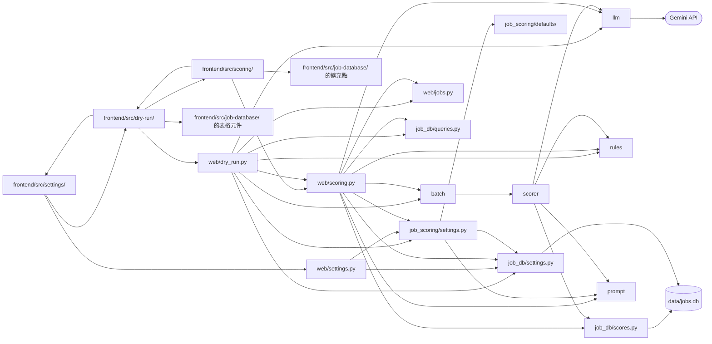
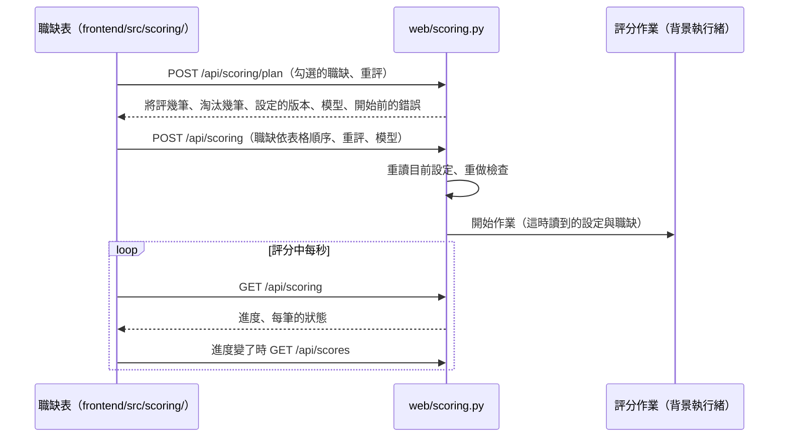
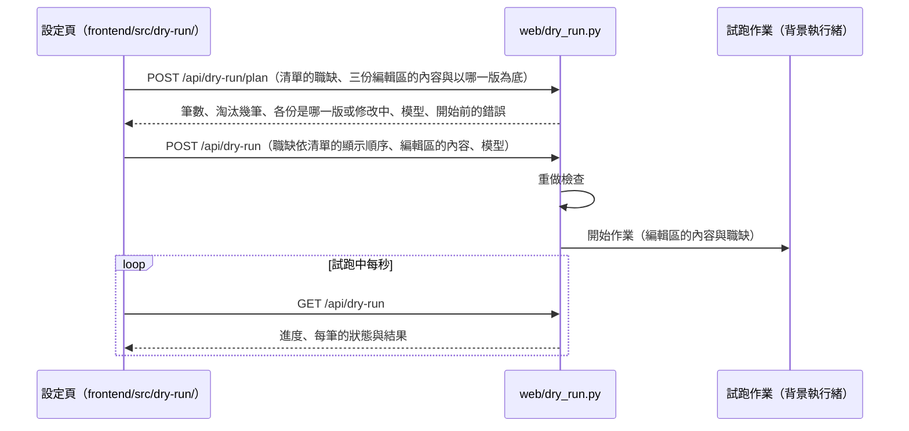

# 職缺自動評分：技術設計

- 功能文件：[job-auto-scoring.md](../../product/features/job-auto-scoring.md)
- 程式碼：
  - 評分：[src/job_scoring/](../../../src/job_scoring/)
  - 評分紀錄與設定的讀寫：[src/job_db/scores.py](../../../src/job_db/scores.py)、[src/job_db/settings.py](../../../src/job_db/settings.py)，建表語法在 [src/job_db/schema.py](../../../src/job_db/schema.py)
  - 設定頁：[src/web/settings.py](../../../src/web/settings.py)、[frontend/src/settings/](../../../frontend/src/settings/)
  - 職缺表上的評分與送去評分：[src/web/scoring.py](../../../src/web/scoring.py)、[frontend/src/scoring/](../../../frontend/src/scoring/)
  - 試跑：[src/web/dry_run.py](../../../src/web/dry_run.py)、[frontend/src/dry-run/](../../../frontend/src/dry-run/)

## 1. 總覽


```mermaid
flowchart LR
    page["frontend/src/settings/"] --> api["web/settings.py"]
    page --> dry["frontend/src/dry-run/"]
    table["frontend/src/scoring/"] --> ext["frontend/src/job-database/ 的擴充點"]
    table --> sapi["web/scoring.py"]
    table --> dry
    dry --> table
    dry --> page
    dry --> tablecomp["frontend/src/job-database/ 的表格元件"]
    dry --> dapi["web/dry_run.py"]
    dapi --> sapi
    dapi --> batch
    dapi --> settings
    dapi --> runner
    dapi --> llm
    dapi --> rules
    dapi --> dbsettings
    dapi --> queries
    api --> settings["job_scoring/settings.py"]
    api --> dbsettings["job_db/settings.py"]
    sapi --> batch
    sapi --> settings
    sapi --> scores
    sapi --> runner["web/jobs.py"]
    sapi --> llm
    sapi --> rules
    sapi --> prompt
    sapi --> dbsettings
    sapi --> queries["job_db/queries.py"]
    settings --> defaults["job_scoring/defaults/"]
    settings --> prompt
    settings --> dbsettings
    batch --> scorer
    scorer --> rules
    scorer --> prompt
    scorer --> llm
    scorer --> scores["job_db/scores.py"]
    llm --> gemini(["Gemini API"])
    scores --> db[("data/jobs.db")]
    dbsettings --> db
```

模組職責，都在 `src/job_scoring/` 下，另有標註的除外：

- `settings.py`：評分用的設定：預設內容、偏好與模板的檢查、替新資料庫寫入第 1 版，以及由三份內容組出評分用的設定（`ScoringSettings`）。
  - 正式評分用目前設定，試跑用編輯區的內容。
- `defaults/`：專案附的預設偏好、預設經歷與預設模板，是每份設定的第 1 版。
- `models.py`：Pydantic 模型，包括偏好、AI 輸出、評分結果與整批的單筆結果。
- `rules.py`：程式端的規則，包括硬性淘汰、薪資換算與計分，以及共用的進位函式。
- `prompt.py`：由模板組出 system 與 user 提示詞、模板變數的比對，以及送評時的職缺內容快照。
- `llm.py`：LLM 供應商抽象層與 Gemini 實作。
- `scorer.py`：單筆評分流程、總分計算，以及「評分並寫入資料庫」這一步。
- `batch.py`：逐筆評分，一筆也走這裡；送去評分與試跑共用。
- `job_db/scores.py`：讀寫 `job_scores`。
- `job_db/settings.py`：讀寫設定的版本。
- `web/settings.py`：設定頁的 API。
- `web/scoring.py`：職缺表上的評分與送去評分的 API。
  - 評分作業交給共用的作業執行器 `web/jobs.py` 在背景跑。
- `web/dry_run.py`：試跑的 API，試跑作業同樣交給 `web/jobs.py`。
- `frontend/src/settings/`：設定頁。
- `frontend/src/scoring/`：疊加在職缺表上的評分（欄位、篩選、勾選、確認視窗、展開列、加入試跑清單），以及頁首的評分進度。
- `frontend/src/dry-run/`：設定頁下方的試跑清單（清單、確認視窗、試跑結果與並排比較），以及頁首的試跑進度。

依賴限制：

- 只有 `llm.py` 可以 import 特定供應商的 SDK（`google` 開頭的模組）。
  - 換供應商或新增供應商時，評分規則的程式都不必改（見 [§4.1](#41-llm-供應商抽象層)）。
  - 由[驗收對照](#6-驗收對照)的「供應商隔離」以 `ast` 掃描 import 檢查。
- 評分紀錄與設定的讀寫放在 `job_db` 套件，不另開套件：同一個套件管理整份資料庫的連線、schema 與改版。
  - `job_db` 不 import 專案內的其他模組（原因見 [job-database 技術設計的總覽](job-database.md#1-總覽)），所以 `scores.py`、`settings.py` 的參數都用基本型別，由 `scorer.py`、`job_scoring/settings.py` 把資料轉好再傳入。
- 職缺表的職缺與評分分成兩個 API，由前端以職缺代碼合併：
  - `GET /api/jobs` 屬於 job-database，job-database 不依賴任何功能，不能帶評分。
  - `GET /api/scores` 只給評分，不 JOIN `jobs`。
- 前端的 `frontend/src/scoring/` 實作職缺表的擴充點（見 [job-database 技術設計的職缺表的前後端分工](job-database.md#22-職缺表的前後端分工)）：
  - `frontend/src/job-database/` 不 import 評分。
  - 由外殼 `frontend/src/app/App.tsx` 把評分的擴充交給職缺表。

## 2. 流程

### 2.1 單筆評分

實現 FR-score-salary、FR-score-ai、FR-score-total、FR-score-store、FR-filter、FR-history-append、FR-basis-record。業務規則見[功能文件的評分流程](../../product/features/job-auto-scoring.md#423-評分流程)。

`scorer.score_and_save` 評分並寫入資料庫，[整批評分](#22-整批評分)的每一筆都經過這一步：

1. 以 `rules.py` 檢查硬性淘汰，被淘汰的職缺不呼叫 AI。
2. 沒被淘汰時，`prompt.py` 用設定的模板組出提示詞，再用呼叫端傳入的 client 呼叫 AI。
   - 每次都呼叫，不查上次的評分。
3. `rules.py` 算薪資分數，`scorer.py` 算總分。
4. 交給 `job_db/scores.py` 新增一列（[§3.2](#32-job_scores)），連同評分依據：設定的三個版本號與職缺內容快照。
   - 被淘汰的職缺，`供應商`、`模型` 寫 `NULL`，評分依據照樣記。
5. 評分失敗時例外往外拋，不寫入。

評分用的設定以一個 `ScoringSettings` 傳入，裡面有偏好、經歷、模板與各自的版本號。這樣寫進評分依據的版本，一定就是評分時用的內容。

試跑時呼叫端傳入的連線是 `None`：跳過寫入，其餘步驟相同，所以試跑與正式評分走同一套評分邏輯。

總分與年薪換算共用 `rules.round_half_up`：以 `Fraction` 精確計算再 .5 進位，避免浮點誤差，也不用 Python `round()` 的五成雙。

### 2.2 整批評分

實現 FR-score-failure、FR-score-order。`batch.score_batch` 是評分的共用進入點：

- 要評的職缺、設定、資料庫連線、供應商與模型都由呼叫端傳入，整批用同一組設定。
- 依傳入的順序逐筆評。
- 呼叫端以回呼得知進度，並決定要不要停：
  - 每筆開始前先問要不要停，要停就不再評之後的職缺，回傳的結果只有評過的那幾筆。
  - 每筆開始前、評完（含失敗）後各通知一次。
- client 以 `client_factory` 傳入：
  - 開始評分前先以 `rules.check_hard_filters` 檢查，有需要呼叫 AI 的職缺時才建立 client，之後整批共用。
  - 整批都被淘汰時就不需要 API key。
  - 建立失敗（不支援的供應商、缺少 API key）時直接往外拋，這時還沒評任何一筆，所以會被淘汰的職缺也不會寫入。
- 每筆都經過 `scorer.score_and_save`，哪些錯誤算單筆失敗見 [§5](#5-錯誤處理)。
- 呼叫端是送去評分的作業（[§2.5](#25-送去評分)）與試跑的作業（[§2.7](#27-試跑)）。

### 2.3 提示詞模板

實現 FR-score-ai、FR-settings-check。模板的規則見[功能文件的提示詞模板](../../product/features/job-auto-scoring.md#428-提示詞模板)。

- 模板依 `<!-- SYSTEM -->`、`<!-- USER -->` 拆成兩段。
- SYSTEM 標記之前的內容是模板的註解，不送給 AI，也不檢查。
- 變數名稱是中文，不用 `string.Template`：
  - 中文沒有空白分隔，`$職缺名稱與…` 照 `string.Template` 的規則會被當成一個叫「職缺名稱與…」的變數。
  - 改成遇到 `$` 時以已知的變數名稱比對，長的優先。
  - `$` 之後接文字、卻不是已知變數的，算不認得的變數，名稱取到第一個不是文字的字元為止。
  - 其他的 `$`（例如接數字或空白）原樣保留。
- 職缺欄位為 `null` 或空字串、個人資料為空時，放入「（無資料）」。
- 職缺內容快照取送進 AI 的 6 個欄位，加上淘汰與薪資計分用的 3 個欄位（見[功能文件的評分依據的內容](../../product/features/job-auto-scoring.md#1121-評分依據的內容)）。

### 2.4 設定頁

實現 FR-settings-*。規則見[功能文件的在網頁上編輯設定並保留每個版本](../../product/features/job-auto-scoring.md#8-在網頁上編輯設定並保留每個版本settings)。

後端：

- web app 啟動時，替還沒有任何版本的設定寫入第 1 版並設成目前設定（`ensure_defaults`），內容是 `defaults/` 的檔案。
- 設定只存在職缺資料庫，不讀 `profile/` 等檔案。
- 「預設範例」以內容和預設檔案完全相同判斷，不論是第幾版。
- 檢查放在後端，前端呼叫檢查的 API 顯示結果：偏好的驗證用的就是評分時的 `Preferences` 模型，規則只寫一份。
  - pydantic 常見的錯誤改寫成中文，寫成「欄位路徑：原因」；其他的沿用 pydantic 的訊息。
- 儲存與套用時後端再檢查一次，前端擋不住的情況（例如舊版本在規則改變後不合法）也不會變成目前設定。
- 儲存新版本時：
  - 版本號取該種設定的最大版本號加一。
  - 新增與改成目前設定在同一個 transaction 中。
- API 不提供刪除版本的端點。

前端：

- 編輯區的內容記在 `localStorage` 的 `settings.drafts.v1`，每份設定記「以哪一版為底」與內容。
  - 讀取時逐份檢查，格式不對或那一版不存在的丟掉，退回目前設定。
  - 和目前設定相同、也沒有修改時就不記。
- 主按鈕的三態只看編輯區，規則寫成純函式，用 Vitest 測：
  - 有修改時儲存並套用。
  - 載入的不是目前設定時套用那一版。
  - 否則停用。
- 檢查在停止輸入 300ms 後送出，只採用最後一次送出的回應。
  - 檢查失敗時顯示原因，每 2 秒自動重試。
  - 還沒有檢查結果或有錯誤時，主按鈕停用。
- 儲存或套用成功後，那份設定的編輯區仍是送出的內容時才清掉：等待回應時又改過的內容保留。
  - 伺服器上已經改好，所以不論重新取得設定成不成功都要清掉，否則重新打開時會把已存的內容當成修改再存一次。
  - 重新取得設定失敗時，畫面上的版本紀錄與目前設定都已過時，整頁改成請使用者重新整理。

### 2.5 送去評分

實現 FR-score-pick、FR-score-confirm、FR-score-settings、FR-score-progress、FR-score-stop、FR-score-summary、FR-rescore、FR-job 與 FR-llm 的模型選擇。規則見功能文件的[勾選與送出](../../product/features/job-auto-scoring.md#4212-勾選與送出)到[評分中與評完](../../product/features/job-auto-scoring.md#4214-評分中與評完)。


```mermaid
sequenceDiagram
    participant T as 職缺表（frontend/src/scoring/）
    participant A as web/scoring.py
    participant J as 評分作業（背景執行緒）
    T->>A: POST /api/scoring/plan（勾選的職缺、重評）
    A-->>T: 將評幾筆、淘汰幾筆、設定的版本、模型、開始前的錯誤
    T->>A: POST /api/scoring（職缺依表格順序、重評、模型）
    A->>A: 重讀目前設定、重做檢查
    A->>J: 開始作業（這時讀到的設定與職缺）
    loop 評分中每秒
        T->>A: GET /api/scoring
        A-->>T: 進度、每筆的狀態
        T->>A: 進度變了時 GET /api/scores
    end
```

確認與開始（後端）：

- 開始前的檢查只寫在後端，確認視窗與開始評分共用：
  - 勾選的職缺不在職缺資料庫、將評 0 筆
  - 目前設定的偏好或模板有錯（和評分時用同一個檢查）
  - 偏好或經歷還是預設範例
  - 缺 API key，而且有需要呼叫 AI 的職缺：
    - 淘汰筆數用目前的偏好算
    - 偏好有錯時當作每筆都要呼叫 AI
  - 有其他作業在跑：
    - 確認視窗列在錯誤裡
    - 開始時其他檢查都通過才回 409，否則照其他錯誤回 422（見 [§5](#5-錯誤處理)）
- 開始時重讀目前設定、重做一次檢查：確認視窗開著時換了設定，以按下開始時的為準。
  - 有錯時回 422，錯誤清單顯示在確認視窗。
- 通過後把這時讀到的設定與職缺交給作業，整批都用它們。
  - 評分中換了設定只影響之後開始的評分。
- 模型只能選 `llm.MODELS` 列出的：
  - 清單的名稱以供應商的模型清單 API 確認過。
  - 第一個是預設。

作業（後端）：

- 由各功能共用的作業執行器 `web/jobs.py` 在背景執行緒跑：
  - 同一時間只跑一個作業。
  - 背景執行緒開自己的資料庫連線。
- 進度與每筆的狀態（排隊中、評分中、評分失敗與原因）只放在記憶體。
  - 評完的職缺不留狀態，分數從資料庫讀。
- 作業結束時保留最近一次的結果（各結果的筆數、沒評的筆數、失敗的列、讓作業停止的錯誤），web app 關閉時一起消失。
- 停止以作業的停止旗標傳給 `score_batch`，評完目前這一筆才生效。

前端：

- 評分的狀態放在包住整個頁面的 context，頁首的進度與職缺表共用。
- 評分中每秒輪詢：
  - 收到回應後才排下一次。
  - 只採用最後送出的那次回應。
- 評完一筆或作業結束時，重新取各職缺代表的評分。
  - 取不到時每 2 秒自動重試。
  - 讀過一次之後再讀不到時沿用上次的評分，原因顯示在表格上方。
- 結束後的摘要與失敗標示只給「這次打開頁面後看過它在跑」的作業：伺服器保留最近一次的結果，評分結束後重新整理時就不再顯示，符合「評分結束後重新整理，失敗標示就消失」。
- 固定的列順序：
  - 開始評分時記下職缺表列出的職缺代碼與檢視（排序、篩選、剛存入的清單），記在 `localStorage` 的 `jobAutoScoring.frozen.v1`，連同作業編號。
  - 檢視相同時照記下的順序列出這些職缺，分數改變後不再符合篩選的列也留著。
  - 使用者改排序或篩選時丟掉。
  - 重新整理後第一次取到狀態時，同一個作業還在跑才沿用，所以評分結束後重新整理就重新排列。
- 勾選只在職缺表這一頁，改篩選或開始評分時清掉。

### 2.6 職缺表上的評分

實現 FR-rank-*、FR-score-detail、FR-history-current、FR-history-all、FR-history-view、FR-basis-show、FR-basis-legacy。規則見功能文件的[在職缺表依分數排序、篩選](../../product/features/job-auto-scoring.md#6-在職缺表依分數排序篩選rank)、[所有評分紀錄](../../product/features/job-auto-scoring.md#1022-所有評分紀錄)與[顯示評分依據](../../product/features/job-auto-scoring.md#1122-顯示評分依據)。

- `GET /api/scores` 一次給每筆職缺代表的評分，只帶職缺表的欄位要用的值（含四個維度的分數），不帶理由等完整明細。
- 評分的欄位、預設檢視與篩選都經由職缺表的擴充點加上去，所以選欄位、排序、記住的檢視、還原預設檢視與剛存入的職缺都照職缺表的規則。
  - 依總分排序時，總分相同或都沒有總分的，以欄位的 `tieBreak` 依最後出現時間由新到舊排，最後才是職缺代碼。
  - 篩選的值和關鍵字、地區一起記在職缺表的檢視裡。
- 展開一列時才取 `GET /api/scores/{職缺代碼}`：這筆職缺的所有評分紀錄，含明細與評分依據。
  - 代表的評分改變（例如剛評完）時：
    - 重新取。
    - 檢視中的舊評分回到目前的評分。
- 評分依據的提示詞在後端組回：用評分時存下的職缺快照與三份設定的版本，經過評分時同一個組提示詞的函式，規則只寫一份。
  - 那一版的偏好不符合現在的規則、組不回來時，回傳原因代替提示詞。

### 2.7 試跑

實現 FR-dry-run-*、FR-settings-editor 的「編輯區的內容給試跑用」、FR-job 與 FR-llm 的試跑部分。規則見[功能文件的換設定試跑而不影響正式分數](../../product/features/job-auto-scoring.md#9-換設定試跑而不影響正式分數dry-run)。


```mermaid
sequenceDiagram
    participant P as 設定頁（frontend/src/dry-run/）
    participant A as web/dry_run.py
    participant J as 試跑作業（背景執行緒）
    P->>A: POST /api/dry-run/plan（清單的職缺、三份編輯區的內容與以哪一版為底）
    A-->>P: 筆數、淘汰幾筆、各份是哪一版或修改中、模型、開始前的錯誤
    P->>A: POST /api/dry-run（職缺依清單的顯示順序、編輯區的內容、模型）
    A->>A: 重做檢查
    A->>J: 開始作業（編輯區的內容與職缺）
    loop 試跑中每秒
        P->>A: GET /api/dry-run
        A-->>P: 進度、每筆的狀態與結果
    end
```

後端：

- 編輯區的內容由前端送來，每份附上以哪一版為底：
  - 後端拿那一版的內容比對，決定確認視窗與結果標示寫「第 N 版」還是「以第 N 版為底修改中」。
  - 組出設定時和正式評分用同一個檢查，錯誤訊息標出是哪一份。
- 開始前的檢查和送去評分同一套寫法，差別是不檢查預設範例（見[功能文件的確認與進行](../../product/features/job-auto-scoring.md#922-確認與進行)）。
- 作業呼叫 `score_batch` 時傳入的連線是 `None`，整個作業都不開資料庫連線，所以不可能寫入評分紀錄。
  - 職缺在開始時就讀好。
- 每筆的狀態與結果（評分結果或失敗原因）只放在記憶體，連同用的內容與模型。
  - 結束時保留最近一次的試跑，下一次試跑或 web app 關閉時消失。
  - 回傳用的內容：前端拿它和編輯區比較，判斷試跑後改過沒有。

前端：

- 試跑清單記在 `localStorage` 的 `jobAutoScoring.dryRunList.v1`，內容是職缺代碼，依加入的順序。
  - 職缺表的評分擴充寫入，設定頁讀出；兩者不會同時打開，打開時讀一次即可。
  - 格式不對或記不住時是空的清單。
- 清單的表共用職缺表的表格元件：
  - 不能選欄位。
  - 排序可以回到沒有排序，也就是加入的順序。
  - 移除按鈕放在列前的標記位置。
- 淘汰在總分欄以一個比所有分數都小的值表示：
  - 當作最低分排序：
    - 由大到小時排在所有分數之後。
    - 由小到大時排在所有分數之前。
  - 沒有總分的列不論升降冪都排最後。
  - 顯示成淘汰標籤。
- 試跑的狀態放在包住整個頁面的 context，頁首的進度與設定頁共用。
  - 輪詢的寫法同[送去評分](#25-送去評分)。
- 試跑結果只給「這次打開設定頁後看過它在跑」的試跑：
  - 設定頁的元件自己記看過哪些試跑，離開或重新整理設定頁就忘掉。
  - 所以試跑結束後離開、重新整理設定頁，或試跑結束時不在設定頁，結果都不顯示。
- 過時標示比較兩樣：
  - 清單：以集合比較試跑的職缺與目前的清單，只改排序不算。
  - 編輯區：三份內容都要和試跑用的相同。
- 並排比較的目前的評分在點開時才取 `GET /api/scores/{職缺代碼}`，用第一筆（代表的評分）。
  - 代表的評分改變時重新取。

## 3. 資料與儲存

實現 FR-record、FR-settings-store、FR-basis-record、NFR-migration。欄位的業務意義見功能文件的[評分紀錄](../../product/features/job-auto-scoring.md#1322-評分紀錄)與[設定的版本](../../product/features/job-auto-scoring.md#821-設定的版本)。

- 建表語法與 job-database 的表一起放在 `job_db/schema.py`。
- 開啟資料庫見 [job-database 技術設計的開啟資料庫](job-database.md#31-開啟資料庫)。
- 改版的機制見 [job-database 技術設計的資料庫改版](job-database.md#34-資料庫改版)。

### 3.1 設定的版本

`settings_versions`：每種設定的每一版一列。

- `種類`（TEXT）：`preferences`、`experience`、`template`，以 `CHECK` 限制
- `版本`（INTEGER）：每種設定各自從 1 開始
- 主鍵是（`種類`, `版本`）
- `名稱`（TEXT NOT NULL）
- `描述`（TEXT NOT NULL）：沒填時是空字串
- `儲存時間`（TEXT NOT NULL）：本地時間，ISO 8601，精確到秒
- `內容`（TEXT NOT NULL）

`current_settings`：每種設定一列，指向目前設定是哪一版。

- `種類`（TEXT）：主鍵
- `版本`（INTEGER NOT NULL）
- （`種類`, `版本`）以外鍵指向 `settings_versions`

設計理由：

- 版本的內容不能改，只有 `名稱`、`描述` 可以改。
- 沒有刪除版本的函式，評分紀錄記下的版本永遠查得到。
- 目前設定另外成表，而不是在版本上加旗標：一種設定只會有一列，不必維持「只有一版是目前設定」的限制。
- 不記「什麼時候套用哪一版」，理由見[功能文件的設定的版本](../../product/features/job-auto-scoring.md#821-設定的版本)。

### 3.2 job_scores

每次評分一列，同一筆職缺可以有多列。

- `評分編號`（INTEGER）：主鍵，`AUTOINCREMENT`
  - 評分時間只精確到秒，同一秒內的多列以它排先後
- `職缺代碼`（TEXT NOT NULL）：以外鍵指向 `jobs`
- `評分時間`（TEXT NOT NULL）：本地時間，ISO 8601，精確到秒
- `淘汰`（INTEGER NOT NULL）：`0`／`1`
- `總分`（INTEGER）：被淘汰時為 `NULL`
- `評語`（TEXT）：新的評分一定有值
  - 欄位不設 `NOT NULL`，因為最舊版被淘汰時寫入的列是 `NULL`
- `評分明細`（TEXT）：`JobScore.model_dump(by_alias=True)` 的中文鍵 dict，以 `json.dumps(ensure_ascii=False)` 存成字串
- `供應商`、`模型`（TEXT）：被淘汰時為 `NULL`
- 評分依據：`偏好版本`、`經歷版本`、`模板版本`（INTEGER）與 `職缺快照`（TEXT，JSON）
  - 改版前寫入的列四欄都是 `NULL`
  - 以 `CHECK` 限制四欄要嘛全是 `NULL`、要嘛全有值

索引：

- `job_scores_job`：（`職缺代碼`, `評分時間`），查一筆職缺的紀錄與最新一筆時使用。

設計理由：

- 和 `jobs` 分開存放：職缺被重新寫入時，job-database 會覆寫整列（見[功能文件的寫入規則](../../product/features/job-database.md#421-寫入規則)），分數放在同一張表就得另外避開。
- `職缺代碼` 以外鍵指向 `jobs`：評分的職缺都來自職缺資料庫。
- `淘汰`、`總分`、`評語` 與 `評分明細` 中的值重複，另外成欄：
  - 列出各職缺代表的評分與所有評分紀錄時直接讀欄位，不必解析 JSON。
  - 之後要在 SQL 裡篩選或排序時也用得到。
- 版本欄不設外鍵：
  - 外鍵的目標是（`種類`, `版本`）組合鍵，每欄的種類固定，SQLite 的外鍵寫不出常數。
  - 版本只新增、不刪除，不會指到不存在的版本。
- 快照另外存，不靠版本號組回：職缺資料庫只保留每筆職缺的最新一版，職缺內容改過後就組不回當時的提示詞。

### 3.3 寫入與查詢

寫入（`job_db/scores.py`）：

- 只 `INSERT`，不覆寫任何列，也不和先前的列比較。
- 沒有任何刪除評分紀錄的函式（FR-history-no-delete）。
- 每筆職缺的寫入各自是一個 transaction，整批中途中止時已經評完的職缺留在資料庫。

查詢（`job_db/scores.py`）：

- 代表的評分（見[功能文件的代表的評分](../../product/features/job-auto-scoring.md#1323-代表的評分)）以 window function 挑出：`ROW_NUMBER() OVER (PARTITION BY 職缺代碼 ORDER BY 評分時間 DESC, 評分編號 DESC)` 取第 1 列。
  - 評分時間相同時，後寫入的 `評分編號` 較大，排在前面。
  - 列出各職缺代表的評分時使用。
  - 篩選與排序在前端做。
- 取出一筆職缺的所有評分紀錄時不經過代表的挑選，順序同上，第一筆就是代表的評分。
- `評分明細` 與 `職缺快照` 以 `json.loads` 還原。

### 3.4 改版：舊版的 job_scores

實現 NFR-migration。改版的機制（版本號、備份、同一個 transaction、失敗時還原）見 [job-database 技術設計的資料庫改版](job-database.md#34-資料庫改版)，這裡只寫評分的資料怎麼搬。

開始記版本之前（第 0 版）的 `job_scores` 有幾種樣子，依欄位判斷：

- 最舊版：以 `職缺代碼` 為主鍵，評分明細的欄名是 `評分結果`，還有 `快取鍵`。
  - 只有自動評分會寫入 `評分結果`，是 `NULL` 的列是手動評分。
  - 更早的 `評分結果` 是 `NOT NULL`，自動評分淘汰時寫入的列 `評語` 是 `NULL`。
- 之後的版本有 `評分編號` 與 `評分來源`（`auto`／`manual`），有些還留著 `快取鍵` 欄位與限制手動評分的唯一索引 `job_scores_manual`。
- 兩者都不是時拋錯，不猜：SQLite 把找不到的雙引號欄名當成字串，猜錯時整欄會被寫成欄名。

改成第 1 版：

1. 刪掉舊的索引，把舊表改名，建新表。
2. 只搬自動評分，而且 `jobs` 裡有對應的職缺；手動評分與沒有對應職缺的評分新結構無法表示，略過並分別計數。
3. 有 `評分編號` 的保留原本的編號，同一秒內「後寫入的在前」的順序才不變；最舊版依寫入順序重新編號。
4. `評分結果` 搬到 `評分明細`，評分依據的四欄是 `NULL`。
5. 刪掉舊表，建立設定的兩張表（內容是空的，第 1 版在 web app 啟動時寫入）。

### 3.5 API key

實現 NFR-privacy。

```
.env.example                 API key 範本（進版控）
.env                         真實 API key（不進版控）
```

- `.env` 由 `src/app.py` 啟動時以 `load_dotenv(專案根目錄 / ".env")` 載入。
  - `load_dotenv` 預設**不覆寫已經存在的環境變數**（[python-dotenv](https://github.com/theskumar/python-dotenv)），所以 shell 設定的值優先。
  - 測試時把 `GEMINI_API_KEY` 設成空字串，就能模擬沒有 key 的情況，不受 `.env` 影響。

## 4. 外部系統整合

### 4.1 LLM 供應商抽象層

實現 FR-llm、NFR-privacy。

```python
class LLMClient(Protocol):
    def assess(self, system: str, user: str) -> AIAssessment: ...
```

- `get_client(provider, model)`：用供應商名稱查表建立 client。
  - 不認得的名稱就拋出 `ValueError`。
  - 加入其他供應商時，只要新增對應的 client 並註冊到表中，其他模組都不用改。
- `GeminiClient(model)`：使用 `google-genai` 的 Interactions API（參考 [Gemini structured output 文件](https://ai.google.dev/gemini-api/docs/structured-output)）。
  - 以 structured output 要求符合 `AIAssessment` schema 的 JSON，再用 Pydantic 驗證。
  - `response_format` 裡 schema 的鍵名要寫 `schema_`（SDK 的 TypedDict 鍵名），送出時才會序列化成 API 的 `schema`。
  - `store=False`：提示詞含個人經歷，不在伺服器端保存互動紀錄。
  - 不設定溫度等取樣參數：Gemini 3.8 Flash 已不支援 `temperature`、`top_p`、`top_k`（[官方說明](https://ai.google.dev/gemini-api/docs/latest-model)）。
  - SDK 的錯誤類別（HTTP、連線、逾時）沒有公開匯出，因此 `interactions.create` 拋出的任何例外都轉成 `LLMError`。
  - `output_text` 為空時也是 `LLMError`。
  - 建構時檢查 `GEMINI_API_KEY`，沒有設定或是空字串就拋出 `LLMError`。

### 4.2 AI 輸出 schema

實現 FR-score-ai。

AI 必須輸出以下 JSON（Pydantic 模型 `AIAssessment`）：

```json
{
  "career_fit":   {"score": 1-5 | null, "reason": "..."},
  "skill_match":  {"score": 1-5 | null, "reason": "..."},
  "industry_fit": {"score": 1-5 | null, "reason": "..."},
  "comment": "..."
}
```

- 欄位使用英文名稱，讓 schema 對各家模型都比較穩定。
- 由 `scorer.py` 轉成評分結果（`JobScore`）的中文鍵名。
  - `JobScore` 以 alias 定義中文鍵名，`model_dump(by_alias=True)` 的結果就是[功能文件的評分結果格式](../../product/features/job-auto-scoring.md#1321-評分結果格式)。
- 不通過驗證時拋出 `ValidationError`，視為評分失敗，不自行修正分數。

## 5. 錯誤處理

整批評分：

- 單筆的 `LLMError` 與 `ValidationError` 算單筆失敗，失敗原因記錄例外訊息，繼續下一筆。
- client 建立失敗（`ValueError` 不支援的供應商、`LLMError` 缺少 API key）時在開始評分前往外拋。
- `sqlite3.Error` 讓評分中止，已寫入的職缺留在資料庫。
- 其他例外代表程式錯誤，直接往外拋。

送去評分的作業：

- client 建立失敗：一筆都不評，作業以錯誤結束，全部算沒評。
- 寫入資料庫失敗、或其他例外：
  - 正在評的那一筆算失敗，之後的不評。
  - 作業以錯誤結束，摘要照停止處理。
  - 其他例外在記下錯誤之後照樣往外拋，留下 traceback。

試跑的作業：

- client 建立失敗：一筆都不評，全部標成沒試跑，作業以錯誤結束。
- 其他例外：正在試跑的那一筆算失敗，其餘標成沒試跑，記下錯誤之後照樣往外拋。

送去評分與試跑的 API：

- 開始前的檢查有錯時回 422，`detail` 是錯誤清單。
- 不認得的模型也是 422。
- 其他檢查都通過、但已有作業在跑時回 409。

設定頁的 API：

- 名稱空白、內容檢查有錯時回 422，`detail` 寫出原因，什麼都不存。
- 要套用或修改的版本不存在時回 404。
- 不認得的設定種類由 FastAPI 的路徑驗證回 422。

改版失敗時的訊息與結束碼見 [job-database 技術設計的資料庫改版](job-database.md#34-資料庫改版)。

## 6. 驗收對照

- 除了〔需網路〕的條目，都離線執行，也不需要 API key：AI 的回應以假的 LLM client 代替。
- 網頁的 API 以 FastAPI 的 TestClient 測。
- 設定頁、職缺表上的評分與試跑以 Playwright 測，開始前會自動 build 前端（見 [development.md 的瀏覽器測試](../../conventions/development.md#瀏覽器測試)）。

共用的測試資料放在 `tests/conftest.py`：

- 測試用的偏好、經歷與兩筆職缺：`ok`（不會被淘汰）與 `out`（會被淘汰）。
  - 偏好的 `目標方向`、經歷、職缺的工作內容分別放入 `目標標記-AAA`、`經歷標記-BBB`、`工作標記-CCC`，用來檢查提示詞的內容。
  - 測試設定的版本號是偏好第 2 版、經歷第 3 版、模板第 1 版，三個都不同，才分得出寫錯欄。
- 假的 LLM client：回傳固定內容並記錄呼叫次數。
  - 整批用的版本可以對指定職缺拋出 `LLMError` 或回傳超出範圍的分數。
  - 網頁用的版本換掉 API 建立 client 的函式，另外可以停在指定的職缺，用來觀察評分中的狀態。
- 網頁的評分測試用已換掉預設範例的設定：偏好與經歷都是第 2 版。
- 資料庫建在 `tmp_path`。
  - 評分紀錄有外鍵，測試先把職缺寫進資料庫再評分。
- 改版的測試以 SQL 建出各種舊版的資料庫。
- e2e 的固定輸入在 `tests/e2e/data/`：擬真的偏好與經歷（測試資料，不是使用者的設定），以及 5 筆改寫自 104 的職缺（虛構公司、內文重新表述）。

一次跑完所有離線驗收：

```bash
uv run pytest tests/test_job_scoring_*.py tests/test_job_db_scores.py tests/test_job_db_settings.py tests/test_job_db_upgrade.py tests/test_app.py tests/test_web_settings.py tests/test_web_scoring.py tests/test_web_dry_run.py tests/test_browser_settings.py tests/test_browser_scoring.py tests/test_browser_dry_run.py
npm test --prefix frontend -- drafts scoring dry-run
```

其他檢查：

- 型別檢查：`uv run mypy src/` 與 `npm run typecheck --prefix frontend`，通過條件為沒有錯誤。
- 前端的 API 型別是否最新：`uv run pytest tests/test_web_openapi.py`。
- 供應商隔離：`uv run pytest tests/test_job_scoring_llm.py -k provider_sdk_isolated`，通過條件為只有 `llm.py` import `google` 開頭的模組。
- 評分作業的錯誤處理：`uv run pytest tests/test_web_scoring.py -k "write_failure or unexpected_error or client_error"`
- 試跑作業的錯誤處理：`uv run pytest tests/test_web_dry_run.py -k "client_error or unexpected_error or rechecks or unknown"`
- 職缺表上的評分資料讀不到時：`uv run pytest tests/test_browser_scoring.py -k "failure_keeps or retry_after or state_failure or stop_failure"`

### score

- [AC-score-salary](../../product/features/job-auto-scoring.md#ac-score-salary薪資計分)：`uv run pytest tests/test_job_scoring_rules.py -k score_salary`
- [AC-score-total](../../product/features/job-auto-scoring.md#ac-score-total總分計算)：`uv run pytest tests/test_job_scoring_scorer.py -k compute_total`
- [AC-score-flow](../../product/features/job-auto-scoring.md#ac-score-flow評分流程與-ai-回應處理)：`uv run pytest tests/test_job_scoring_scorer.py -k score_job`
  - 送給 AI 的資料與「（無資料）」：`uv run pytest tests/test_job_scoring_prompt.py`
- [AC-score-settings](../../product/features/job-auto-scoring.md#ac-score-settings評分用的設定)：`uv run pytest tests/test_web_scoring.py -k settings_read_at_start`
  - 以假的 LLM 停在第一筆，這時經由設定頁的 API 儲存第 3 版。
- [AC-score-ai](../../product/features/job-auto-scoring.md#ac-score-ai理由引用職缺內容分數符合判斷)〔需網路〕：`uv run pytest -m network -s tests/e2e/test_job_scoring.py`
  - 經由網頁的 API 存入 e2e 的偏好與經歷、送去評分所有職缺，以真的 Gemini 評分。
  - 沒有設定 `GEMINI_API_KEY` 時跳過並說明原因。
  - 自動檢查：作業沒有錯誤，每一筆有工作內容、而且沒被淘汰的職缺都評分成功，評分明細的格式、各維度的理由與分數範圍、供應商與模型都正確。
  - 印出這些職缺的評分明細與測試資料庫的路徑，給使用者閱讀理由。
- [AC-score-store](../../product/features/job-auto-scoring.md#ac-score-store評分結果入庫)：`uv run pytest tests/test_job_scoring_batch.py -k store_write`
  - 經由網頁送去評分，成功與淘汰的寫入、失敗的不寫入：`uv run pytest tests/test_web_scoring.py -k order_failure_and_summary`
- [AC-score-detail](../../product/features/job-auto-scoring.md#ac-score-detail展開列的評分)：`uv run pytest tests/test_browser_scoring.py -k detail_history_and_basis`
- [AC-score-pick](../../product/features/job-auto-scoring.md#ac-score-pick勾選)：`uv run pytest tests/test_browser_scoring.py -k test_pick`
- [AC-score-confirm](../../product/features/job-auto-scoring.md#ac-score-confirm送出前的確認)：`uv run pytest tests/test_browser_scoring.py -k confirm` 與 `uv run pytest tests/test_web_scoring.py -k "plan or selected_model or no_api_key"`
- [AC-score-order](../../product/features/job-auto-scoring.md#ac-score-order照表格順序評分)：`uv run pytest tests/test_web_scoring.py -k order_failure_and_summary`
  - 職缺依表格的顯示順序送出：`uv run pytest tests/test_browser_scoring.py -k run_progress`
- [AC-score-failure](../../product/features/job-auto-scoring.md#ac-score-failure單筆失敗不中斷整批)：`uv run pytest tests/test_web_scoring.py -k order_failure_and_summary` 與 `uv run pytest tests/test_browser_scoring.py -k run_summary_and_failure`
- [AC-score-run](../../product/features/job-auto-scoring.md#ac-score-run評分中停止與摘要)：`uv run pytest tests/test_browser_scoring.py -k "run_progress or run_summary"` 與 `uv run pytest tests/test_web_scoring.py -k "running_state or stop"`，以及 `npm test --prefix frontend -- scoring/summary`

### filter

- [AC-filter-rules](../../product/features/job-auto-scoring.md#ac-filter-rules硬性淘汰)：`uv run pytest tests/test_job_scoring_rules.py -k check_hard_filters`
- [AC-filter-no-key](../../product/features/job-auto-scoring.md#ac-filter-no-key被淘汰的職缺不需要-api-key)：`uv run pytest tests/test_web_scoring.py -k no_api_key`
- [AC-filter-comment](../../product/features/job-auto-scoring.md#ac-filter-comment淘汰時的評語)：`uv run pytest tests/test_web_scoring.py -k eliminated_comment`

### rank

- [AC-rank-columns](../../product/features/job-auto-scoring.md#ac-rank-columns評分的欄位)：`uv run pytest tests/test_browser_scoring.py -k rank_columns`，以及 `npm test --prefix frontend -- scoring/columns`
- [AC-rank-sort](../../product/features/job-auto-scoring.md#ac-rank-sort預設依總分排序)：`uv run pytest tests/test_browser_scoring.py -k rank_columns_and_sort`，以及 `npm test --prefix frontend -- scoring/columns`
- [AC-rank-filter](../../product/features/job-auto-scoring.md#ac-rank-filter評分的篩選)：`uv run pytest tests/test_browser_scoring.py -k rank_filter`，以及 `npm test --prefix frontend -- scoring/filters`

### rescore

- [AC-rescore](../../product/features/job-auto-scoring.md#ac-rescore包含已評過的職缺)：`uv run pytest tests/test_web_scoring.py -k "test_rescore or rescore_counts"` 與 `uv run pytest tests/test_browser_scoring.py -k test_confirm`
- [AC-rescore-failure](../../product/features/job-auto-scoring.md#ac-rescore-failure重評失敗時保留原本的評分)：`uv run pytest tests/test_web_scoring.py -k rescore_failure`

### settings

- [AC-settings-version](../../product/features/job-auto-scoring.md#ac-settings-version儲存版本與修改名稱)：`uv run pytest tests/test_browser_settings.py -k settings_version`
  - API 與資料庫：`uv run pytest tests/test_web_settings.py -k "save_version or update_meta or no_delete"` 與 `uv run pytest tests/test_job_db_settings.py`
  - 專案目錄沒有新增或修改任何檔案：比對儲存前後的 `git status --porcelain --ignored`
- [AC-settings-apply](../../product/features/job-auto-scoring.md#ac-settings-apply主按鈕與套用舊版本)：`uv run pytest tests/test_browser_settings.py -k settings_apply`，以及 `npm test --prefix frontend -- drafts`
  - API：`uv run pytest tests/test_web_settings.py -k apply`
- [AC-settings-editor](../../product/features/job-auto-scoring.md#ac-settings-editor編輯區)：`uv run pytest tests/test_browser_settings.py -k "settings_editor or rename_keeps or typing or reload_failure or retries"`，以及 `npm test --prefix frontend -- drafts`
  - 不允許保存的瀏覽器：以 Playwright 的 init script 讓讀取 `localStorage` 丟出例外。
- [AC-settings-check](../../product/features/job-auto-scoring.md#ac-settings-check檢查)：`uv run pytest tests/test_job_scoring_settings.py -k check` 與 `uv run pytest tests/test_browser_settings.py -k settings_check`
  - 不能試跑：`uv run pytest tests/test_browser_dry_run.py -k invalid_editor` 與 `uv run pytest tests/test_web_dry_run.py -k invalid_editor`
- [AC-settings-default](../../product/features/job-auto-scoring.md#ac-settings-default第一版與預設範例)：`uv run pytest tests/test_browser_settings.py -k settings_default` 與 `uv run pytest tests/test_web_settings.py -k first_versions`
  - 確認視窗擋下預設範例：`uv run pytest tests/test_web_scoring.py -k default` 與 `uv run pytest tests/test_browser_scoring.py -k default_experience`

### dry-run

- [AC-dry-run-list](../../product/features/job-auto-scoring.md#ac-dry-run-list試跑清單)：`uv run pytest tests/test_browser_dry_run.py -k test_dry_run_list`，以及 `npm test --prefix frontend -- dry-run`
- [AC-dry-run](../../product/features/job-auto-scoring.md#ac-dry-run試跑不影響正式分數)：`uv run pytest tests/test_browser_dry_run.py -k does_not_store` 與 `uv run pytest tests/test_web_dry_run.py -k "does_not_store or uses_editor"`
- [AC-dry-run-result](../../product/features/job-auto-scoring.md#ac-dry-run-result試跑結果與並排比較)：`uv run pytest tests/test_browser_dry_run.py -k "dry_run_result or finished_elsewhere"`，以及 `npm test --prefix frontend -- dry-run/table`
  - 試跑中重新整理、切換分頁與停止：`uv run pytest tests/test_browser_dry_run.py -k progress_reload_and_stop` 與 `uv run pytest tests/test_web_dry_run.py -k "running_state_and_stop or failure_does_not_stop"`

### history

- [AC-history-append](../../product/features/job-auto-scoring.md#ac-history-append重評新增而不覆寫)：`uv run pytest tests/test_web_scoring.py -k history_append`
- [AC-history-no-delete](../../product/features/job-auto-scoring.md#ac-history-no-delete不提供刪除評分紀錄)：`uv run pytest tests/test_web_settings.py -k no_delete_endpoints` 與 `uv run pytest tests/test_job_scoring_batch.py -k history_no_delete`
  - 以 OpenAPI 列出所有端點，唯一的刪除是抓取頁的捨棄預覽。
  - `job_db` 沒有刪除評分紀錄的函式。
- [AC-history-current](../../product/features/job-auto-scoring.md#ac-history-current代表的評分)：`uv run pytest tests/test_browser_scoring.py -k detail_history_and_basis` 與 `uv run pytest tests/test_web_scoring.py -k scores_current`
  - 依評分狀態「淘汰」篩選時以代表的評分為準：`npm test --prefix frontend -- scoring/filters`
  - 試跑清單的目前總分：`uv run pytest tests/test_browser_dry_run.py -k list_current_total`
- [AC-history-all](../../product/features/job-auto-scoring.md#ac-history-all所有評分紀錄與檢視舊評分)：`uv run pytest tests/test_browser_scoring.py -k detail_history_and_basis` 與 `uv run pytest tests/test_web_scoring.py -k history_order`

### basis

- [AC-basis](../../product/features/job-auto-scoring.md#ac-basis記錄與顯示評分依據)：`uv run pytest tests/test_web_scoring.py -k history_basis` 與 `uv run pytest tests/test_browser_scoring.py -k detail_history_and_basis`
  - 記錄的部分另見 `uv run pytest tests/test_job_scoring_batch.py -k basis`
- [AC-basis-legacy](../../product/features/job-auto-scoring.md#ac-basis-legacy沒有依據的舊評分)：`uv run pytest tests/test_browser_scoring.py -k detail_history_and_basis` 與 `uv run pytest tests/test_web_scoring.py -k legacy`

### 非功能需求

- [AC-nfr-migration](../../product/features/job-auto-scoring.md#ac-nfr-migration改版時保留評分資料)：`uv run pytest tests/test_job_db_upgrade.py tests/test_app.py -k "not env"`
  - 以 SQL 建出三種舊版的資料庫，各含自動、手動與沒有對應職缺的評分。
  - 中途失敗以替換改版步驟模擬。
  - 設定的版本：第 0 版還沒有設定的資料表，沒有要保留的內容。
    - 目前只驗改版後建出空的設定資料表。
    - 之後改版時要補上「設定的版本筆數與內容不變」的驗證。

### 共用規則

- [AC-job](../../product/features/job-auto-scoring.md#ac-job作業)：`uv run pytest tests/test_browser_scoring.py -k run_progress`
  - (a) 評分中重新整理、(b) 另開一個頁面，都接回進度。
  - 已有其他作業在跑時不能開始：`uv run pytest tests/test_web_scoring.py -k while_other_job_running`
  - (c) 評分中在設定頁按試跑：`uv run pytest tests/test_browser_dry_run.py -k one_job_at_a_time` 與 `uv run pytest tests/test_web_dry_run.py -k "one_job_at_a_time or other_job_blocks"`
- [AC-llm](../../product/features/job-auto-scoring.md#ac-llmai-供應商與-api-key)：`uv run pytest tests/test_app.py -k env` 與 `uv run pytest tests/test_browser_scoring.py -k test_confirm`
  - 真實的 `.env` 不進版控、`.env.example` 有進版控：`uv run pytest tests/test_job_scoring_llm.py -k env_ignored`
