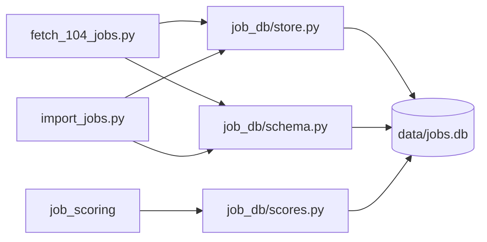

# 職缺資料庫：技術設計

- 功能文件：[job-database.md](../../product/features/job-database.md)
- 程式碼：[src/job_db/](../../../src/job_db/)、[src/import_jobs.py](../../../src/import_jobs.py)（匯入 CLI）、[src/fetch_104_jobs.py](../../../src/fetch_104_jobs.py)（寫入資料庫的部分）

## 1. 總覽



模組職責：

- `job_db/schema.py`：所有資料表的建表語法，以及開啟資料庫並建立缺少的表（含 job-scoring 的 `job_scores`）。
- `job_db/store.py`：寫入一次抓取的結果、匯入 JSON。
- `job_db/scores.py`：寫入評分結果，由 job-scoring 呼叫（見 [job-scoring 技術設計](job-scoring.md#32-job_scores-資料表)）。
- `import_jobs.py`：匯入 CLI。
- `fetch_104_jobs.py`：寫出 CSV／JSON 後呼叫 `job_db` 寫入資料庫。

依賴限制：

- `job_db` 在最底層，不 import 專案內的其他模組。
  - 原因：爬蟲會 import `job_db`，反向 import 會形成循環。
  - 因此 `schema.py` 另外定義一份 `jobs` 的欄名與型態（`JOB_COLUMNS`），不 import 爬蟲的 `CSV_FIELDNAMES`。兩份欄名是否一致由測試檢查。
  - 其他模組呼叫 `job_db` 時，參數都用基本型別。
- 使用標準函式庫 `sqlite3`，不新增依賴（選用 SQLite 的理由見 [決策紀錄：資料庫選型](../decisions/database-selection.md)）。
- `fetch_104_jobs.py` 原本是單檔自足腳本，加入本功能後依賴 `src/job_db/`。
  - 以 `uv run src/fetch_104_jobs.py` 執行時，`src/` 在 import 路徑上，不需要額外設定。

## 2. 流程

### 2.1 寫入一次執行

實現 FR-save-*。業務規則見[功能文件的寫入規則](../../product/features/job-database.md#421-寫入規則)。

`store.save_run` 是爬蟲與匯入共用的進入點，整批在同一個 transaction 中：

1. 在 `scrape_runs` 新增一列，`職缺數` 先填 0。
2. 逐筆寫入 `jobs`：
   - 先查出既有列的首次與最後出現時間，依規則新增或更新。
   - 更新時，`工作內容`、`薪資待遇` 以 `COALESCE(新值, 舊值)` 寫入，其他欄位直接覆蓋。
3. 逐筆以 `INSERT OR IGNORE` 寫入 `run_jobs`，同一批重複的職缺代碼只留一列。
4. 以不重複的職缺代碼數回填 `scrape_runs.職缺數`。
5. commit 後在 stderr 印出新增、更新筆數與資料庫路徑。

任何一步拋出例外，整個 transaction rollback，三張表都不變。

### 2.2 匯入 JSON

實現 FR-import。業務規則見[功能文件的匯入既有 JSON](../../product/features/job-database.md#521-匯入既有-json)。

`store.import_json` 處理單一檔案：

1. 從檔名取出執行時間，取不到就拋出 `ValueError`。
2. `scrape_runs` 已有相同 `來源檔` 時回傳 `None`，不讀取檔案內容。
3. 讀取並驗證 JSON，不合法就拋出 `ValueError`。
4. 以 `來源` 為 `匯入`、`來源檔` 為檔名呼叫 `save_run`。

## 3. 資料與儲存

實現 FR-db、FR-save-run。每個欄位的業務意義見[功能文件的保存的資訊](../../product/features/job-database.md#721-保存的資訊)。

### 3.1 開啟資料庫

- 預設路徑 `DEFAULT_DB_PATH` 以模組位置推算專案根目錄的 `data/jobs.db`，`data/` 已列入 `.gitignore`。
- `open_db` 自動建立上層目錄，並以 `CREATE TABLE IF NOT EXISTS` 建立所有表。
  - 在既有的資料庫上執行時，只補上缺少的表，不影響原有資料。
- `PRAGMA foreign_keys = ON` 在 transaction 中設定不會生效，所以先以 autocommit 模式開啟連線、設定好之後，才切換成手動 transaction。

### 3.2 資料表

`jobs`：每筆職缺一列。

- 104-job-scraper 欄位字典的全部欄位：
  - 欄名、順序與字典相同
  - `職缺代碼` 是主鍵
  - 型態依字典轉換：str → `TEXT`，int → `INTEGER`
- `首次出現時間`（TEXT NOT NULL）
- `最後出現時間`（TEXT NOT NULL）

`scrape_runs`：每次抓取或匯入一列。

- `執行編號`（INTEGER）：主鍵，`AUTOINCREMENT`
- `執行時間`（TEXT NOT NULL）
- `來源`（TEXT NOT NULL）
- `關鍵字`（TEXT）
- `地區`（TEXT）
- `職缺性質`（INTEGER）
- `頁數`（INTEGER）
- `來源檔`（TEXT UNIQUE）：匯入時用來判斷是否已匯入過
  - 爬蟲寫入時為 `NULL`，SQLite 的 UNIQUE 允許多個 `NULL`
- `職缺數`（INTEGER NOT NULL）

`run_jobs`：一次執行與其中出現的職缺。

- 主鍵是（`執行編號`, `職缺代碼`）。
- 兩欄分別以外鍵指向 `scrape_runs` 與 `jobs`。

設計理由：

- 欄名沿用中文，讓 `pandas.read_sql` 讀出來的欄位與 CSV／JSON 一致，job-scoring 不需要做欄名對照。
- 時間存成 ISO 8601 字串，字串比較的結果與時間先後相同，寫入規則可以直接比較。

### 3.3 查詢

沒有查詢介面，使用者與下游功能直接以 SQL 讀取 `data/jobs.db`：

- 終端機：`sqlite3 data/jobs.db`（開發容器已安裝，見 [devcontainer.md](../ai-coding-setup/devcontainer.md#容器內的工具)）
- 程式或 notebook：`pandas.read_sql`，中文欄名讀出來就與 CSV／JSON 一致
- 評分結果在 `job_scores`，以 `職缺代碼` JOIN `jobs`（見 [job-scoring 技術設計](job-scoring.md#32-job_scores-資料表)）

## 4. 錯誤處理與結束碼

爬蟲寫入資料庫：

- 開啟或寫入時發生 `sqlite3.Error` 或 `OSError`，在 stderr 印出 `[-]`，不中斷程式，因為 CSV／JSON 已經寫出。

匯入 CLI：

- 進入點是 `main(argv: list[str] | None = None) -> int`，測試直接呼叫。
- 單一檔案發生 `ValueError` 或 `sqlite3.Error` 時印出 `[!]`，略過該檔，繼續下一個。
- 已匯入過的檔案印出 `[i]`。
- 結束碼：
  - `0`：至少一個檔案匯入成功，或全部都因為已匯入而略過
  - `1`：沒有指定檔案，或所有檔案都因為錯誤而被略過，印出 `[-]`
- 訊息一律印到 stderr。

## 5. 驗收對照

測試資料：

- `job_db` 的測試在 `tests/test_job_db.py`，匯入 CLI 在 `tests/test_import_jobs.py`，爬蟲寫入資料庫在 `tests/test_fetch_104_jobs.py`。
- 資料庫與 JSON 都建在 `tmp_path`，職缺資料寫在測試碼裡。
- 爬蟲的測試以假函式取代 `requests.get` 與 `time.sleep`。

一次跑完所有離線驗收：

```bash
uv run pytest tests/test_job_db.py tests/test_import_jobs.py
uv run pytest tests/test_fetch_104_jobs.py -k db
```

型別檢查：`uv run mypy src/`，通過條件為沒有錯誤。

### save

- [AC-save-dedup](../../product/features/job-database.md#ac-save-dedup跨次去重與出現時間)：`uv run pytest tests/test_job_db.py -k save_run`
- [AC-save-keep-detail](../../product/features/job-database.md#ac-save-keep-detailnull-不覆蓋既有內容)：`uv run pytest tests/test_job_db.py -k keeps_detail`
- [AC-save-run](../../product/features/job-database.md#ac-save-run執行紀錄與整批寫入)：`uv run pytest tests/test_job_db.py -k "save_run and (records or rollback)"`
- [AC-save-auto](../../product/features/job-database.md#ac-save-auto爬蟲寫入資料庫)：`uv run pytest tests/test_fetch_104_jobs.py -k db`

### import

- [AC-import](../../product/features/job-database.md#ac-import匯入既有-json)：`uv run pytest tests/test_import_jobs.py`

### 共用規則

- [AC-db](../../product/features/job-database.md#ac-db自動建立資料庫)：`uv run pytest tests/test_job_db.py -k open_db`，以及 `git check-ignore data/jobs.db`
  - 通過條件：pytest 全部 passed，`git check-ignore` 印出路徑
