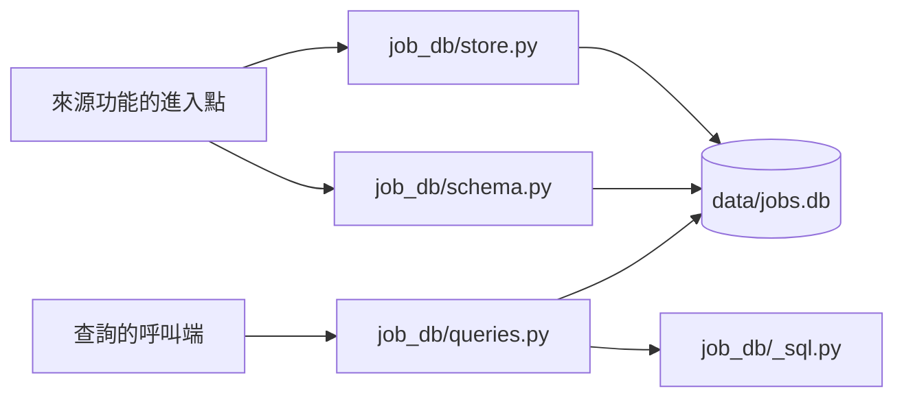

# 職缺資料庫：技術設計

- 功能文件：[job-database.md](../../product/features/job-database.md)
- 程式碼：[src/job_db/](../../../src/job_db/)

## 1. 總覽



模組職責：

- `job_db/schema.py`：所有資料表的建表語法，以及開啟資料庫並建立缺少的表。其他功能的表也在這裡建立，見各功能的技術設計。
- `job_db/store.py`：寫入一批職缺與該次的執行紀錄。
- `job_db/queries.py`：查出職缺與執行紀錄。
- `job_db/_sql.py`：查詢共用的 SQL 組裝（欄名轉 dict、`LIMIT`／`OFFSET`），與哪一張表無關，其他功能放在 `job_db` 的查詢模組也可以共用。
- 呼叫者是各來源功能的進入點，見 [architecture.md 的模組依賴](../architecture.md#模組依賴)。

依賴限制：

- `job_db` 在最底層，不 import 專案內的其他模組。
  - 原因：來源功能會 import `job_db`，反向 import 會形成循環。
  - `schema.py` 的 `JOB_COLUMNS` 是[職缺欄位契約](../../product/features/job-database.md#821-職缺欄位契約)的實作，來源功能自己的欄名（例如爬蟲的 `CSV_FIELDNAMES`）對齊它，是否一致由來源功能的測試檢查（見 [104-job-scraper 技術設計](104-job-scraper.md#7-驗收對照)）。
  - 其他模組呼叫 `job_db` 時，參數都用基本型別。
- 使用標準函式庫 `sqlite3`，不新增依賴（選用 SQLite 的理由見 [決策紀錄：資料庫選型](../decisions/database-selection.md)）。
- 以 `uv run src/<腳本>.py` 執行時，`src/` 在 import 路徑上，來源功能不需要額外設定就能 import `job_db`。

## 2. 流程

### 2.1 寫入一批職缺

實現 FR-save-*。業務規則見[功能文件的寫入規則](../../product/features/job-database.md#421-寫入規則)。

`store.save_run` 是所有來源共用的寫入進入點，整批在同一個 transaction 中：

1. 在 `scrape_runs` 新增一列，`職缺數` 先填 0。
2. 逐筆寫入 `jobs`：
   - 先查出既有列的首次與最後出現時間，依規則新增或更新。
   - 更新時，`工作內容`、`薪資待遇` 以 `COALESCE(新值, 舊值)` 寫入，其他欄位直接覆蓋。
3. 逐筆以 `INSERT OR IGNORE` 寫入 `run_jobs`，同一次寫入中重複的職缺代碼只留一列。
4. 以不重複的職缺代碼數回填 `scrape_runs.職缺數`。
5. commit 後在 stderr 印出新增、更新筆數與資料庫路徑。

任何一步拋出例外，整個 transaction rollback，三張表都不變。呼叫端怎麼回報錯誤由來源功能決定（例如 [104-job-scraper 技術設計](104-job-scraper.md#6-錯誤處理與結束碼)）。

## 3. 資料與儲存

實現 FR-db、FR-save-run。每個欄位的業務意義見[功能文件的保存的資訊](../../product/features/job-database.md#822-保存的資訊)。

### 3.1 開啟資料庫

- 預設路徑 `DEFAULT_DB_PATH` 以模組位置推算專案根目錄的 `data/jobs.db`，`data/` 已列入 `.gitignore`。
- `open_db` 自動建立上層目錄，並以 `CREATE TABLE IF NOT EXISTS` 建立所有表。
  - 在既有的資料庫上執行時，只補上缺少的表，不影響原有資料。
- `PRAGMA foreign_keys = ON` 在 transaction 中設定不會生效，所以先以 autocommit 模式開啟連線、設定好之後，才切換成手動 transaction。

### 3.2 資料表

`jobs`：每筆職缺一列。

- [職缺欄位契約](../../product/features/job-database.md#821-職缺欄位契約)的全部欄位：
  - 欄名、順序與契約相同
  - `職缺代碼` 是主鍵
  - 型態依契約轉換：str → `TEXT`，int → `INTEGER`
- `首次出現時間`（TEXT NOT NULL）
- `最後出現時間`（TEXT NOT NULL）

`scrape_runs`：每次寫入一列。

- `執行編號`（INTEGER）：主鍵，`AUTOINCREMENT`
- `執行時間`（TEXT NOT NULL）
- `來源`（TEXT NOT NULL）
- `關鍵字`（TEXT）
- `地區`（TEXT）
- `職缺性質`（INTEGER）
- `頁數`（INTEGER）
- `來源檔`（TEXT UNIQUE）：匯入時用來判斷是否已匯入過
  - 不是匯入時為 `NULL`，SQLite 的 UNIQUE 允許多個 `NULL`
- `職缺數`（INTEGER NOT NULL）

`關鍵字`、`地區`、`職缺性質`、`頁數`、`來源檔` 是來源功能提供的寫入條件（見 [job-database §8.2.2](../../product/features/job-database.md#822-保存的資訊)），目前的欄位是唯一的來源 104-job-scraper 留下的形狀。接第二個求職平台時要重新設計（見 [TODO.md](../../../TODO.md#把職缺欄位契約改成平台中立)）。

`run_jobs`：一次寫入與其中出現的職缺。

- 主鍵是（`執行編號`, `職缺代碼`）。
- 兩欄分別以外鍵指向 `scrape_runs` 與 `jobs`。

設計理由：

- 欄名沿用中文，讓 `pandas.read_sql` 讀出來的欄位與職缺欄位契約一致，下游不需要做欄名對照。
- 時間存成 ISO 8601 字串，字串比較的結果與時間先後相同，寫入規則可以直接比較。

### 3.3 查詢

實現 FR-query-*。`queries.py` 提供職缺與執行紀錄的查詢，回傳以中文欄名為鍵的 `dict`，鍵就是[職缺欄位契約](../../product/features/job-database.md#821-職缺欄位契約)的欄名，呼叫端不必做欄名對照：

- `list_jobs`：依條件列出職缺，`run_id` 經由 `run_jobs` 篩出某一次寫入出現的職缺。
- `get_job`：以職缺代碼取單筆，查不到時回傳 `None`，不回傳空 `dict`。
- `list_runs`：列出執行紀錄。

排序都加上主鍵當最後一個排序鍵（職缺是 `最後出現時間` 後接 `職缺代碼`），同樣的資料每次查出來的順序才一致，分頁才不會漏或重複。

查詢介面沒有涵蓋的臨時查詢，仍然直接下 SQL：

- 終端機：`sqlite3 data/jobs.db`（開發容器已安裝，見 [devcontainer.md](../ai-coding-setup/devcontainer.md#容器內的工具)）
- 程式或 notebook：`pandas.read_sql`，中文欄名讀出來就與職缺欄位契約一致

## 4. 驗收對照

測試資料：

- `job_db` 的測試在 `tests/test_job_db.py`。
- 資料庫建在 `tmp_path`，職缺資料寫在測試碼裡。

一次跑完所有離線驗收：

```bash
uv run pytest tests/test_job_db.py
```

型別檢查：`uv run mypy src/`，通過條件為沒有錯誤。

### save

- [AC-save-dedup](../../product/features/job-database.md#ac-save-dedup跨次去重與出現時間)：`uv run pytest tests/test_job_db.py -k save_run`
- [AC-save-keep-detail](../../product/features/job-database.md#ac-save-keep-detailnull-不覆蓋既有內容)：`uv run pytest tests/test_job_db.py -k keeps_detail`
- [AC-save-run](../../product/features/job-database.md#ac-save-run執行紀錄與整批寫入)：`uv run pytest tests/test_job_db.py -k "save_run and (records or rollback)"`

### query

- [AC-query-list](../../product/features/job-database.md#ac-query-list依條件列出職缺)：`uv run pytest tests/test_job_db.py -k list_jobs`
- [AC-query-get](../../product/features/job-database.md#ac-query-get取出單筆職缺)：`uv run pytest tests/test_job_db.py -k get_job`
- [AC-query-runs](../../product/features/job-database.md#ac-query-runs列出執行紀錄)：`uv run pytest tests/test_job_db.py -k list_runs`

### 共用規則

- [AC-db](../../product/features/job-database.md#ac-db自動建立資料庫)：`uv run pytest tests/test_job_db.py -k open_db`，以及 `git check-ignore data/jobs.db`
  - 通過條件：pytest 全部 passed，`git check-ignore` 印出路徑
