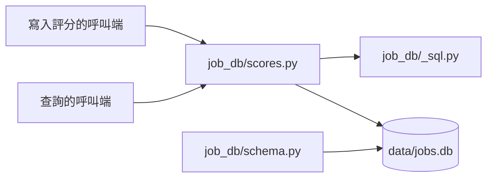

# 評分資料庫：技術設計

- 功能文件：[job-score-database.md](../../product/features/job-score-database.md)
- 程式碼：[src/job_db/scores.py](../../../src/job_db/scores.py)、[src/job_db/schema.py](../../../src/job_db/schema.py)（建表語法）

## 1. 總覽



模組職責：

- `job_db/scores.py`：讀寫 `job_scores`，包括寫入一列與評分紀錄的查詢。自動評分的快取查詢與取出評分結果也在這裡，見 [job-auto-scoring 技術設計](job-auto-scoring.md#32-job_scores-的自動評分欄位)。
- `job_db/schema.py`：`job_scores` 的建表語法，與 job-database 的表一起建立（見 [job-database 技術設計的開啟資料庫](job-database.md#31-開啟資料庫)）。
- `job_db/_sql.py`：與 `queries.py` 共用的 SQL 組裝（見 [job-database 技術設計的總覽](job-database.md#1-總覽)）。
- 呼叫者目前只有評分 CLI，見 [job-auto-scoring 技術設計](job-auto-scoring.md#1-總覽)。

依賴限制：

- `scores.py` 屬於 `job_db` 套件，同樣不 import 專案內的其他模組（原因見 [job-database 技術設計的總覽](job-database.md#1-總覽)），參數都用基本型別。
  - 自動評分的評分結果由呼叫端轉成 dict 再傳入，`scores.py` 只負責序列化，不認得評分結果的格式。
- 帶職缺欄位的評分查詢放在 `scores.py`，不放 `queries.py`：
  - `queries.py` 屬於 job-database，job-database 不依賴任何功能，它的查詢不能 JOIN 屬於 job-score-database 的 `job_scores`。
  - job-score-database 依賴 job-database，由 `scores.py` JOIN `jobs` 不違反依賴方向。

## 2. 資料與儲存

### 2.1 job_scores 資料表

實現 FR-record、FR-query。欄位的業務意義見[功能文件的評分紀錄契約](../../product/features/job-score-database.md#821-評分紀錄契約)。

`job_scores`：每筆職缺最多一列。

- `職缺代碼`（TEXT）：主鍵
- `評分時間`（TEXT）：這列最後一次寫入的時間
  - 本地時間，ISO 8601，精確到秒
- `淘汰`（INTEGER）：`0`／`1`
- `總分`（INTEGER | null）
- `評語`（TEXT | null）
- 自動評分疊加的欄位 `評分結果`、`快取鍵`、`供應商`、`模型`，見 [job-auto-scoring 技術設計](job-auto-scoring.md#32-job_scores-的自動評分欄位)

設計理由：

- 和 `jobs` 表分開存放，查詢時以 `職缺代碼` JOIN：
  - 職缺被重新寫入時，job-database 會覆寫整列（見 [job-database 的寫入規則](../../product/features/job-database.md#421-寫入規則)），分數放在同一張表就得另外避開。
  - 要整批重評時，清空 `job_scores` 即可，不影響職缺資料。
- `淘汰`、`總分`、`評語` 各自成欄：SQL 可以直接篩選與排序，不解析自動評分疊加的 `評分結果` JSON。
- 不設外鍵指向 `jobs`：評分的職缺不一定寫進過職缺資料庫，不因此擋下寫入。
- 建表語法放在 `job_db/schema.py`，與 job-database 的表一起建立。
  - `CREATE TABLE IF NOT EXISTS` 會在既有的資料庫補上這張表，不影響原有資料。

### 2.2 寫入

- 以 `INSERT ... ON CONFLICT("職缺代碼") DO UPDATE` 覆寫整列。
- 每次寫入各自 commit，一個 transaction 只含一列。呼叫端怎麼處理寫入失敗見 [job-auto-scoring 技術設計](job-auto-scoring.md#32-job_scores-的自動評分欄位)。

### 2.3 查詢

- 列出評過分的職缺時，以 `job_scores` 為主表 LEFT JOIN `jobs`：
  - 評分的職缺不一定寫進過 `jobs`（見上方不設外鍵），INNER JOIN 會漏掉這些職缺。
  - `職缺代碼` 取自 `job_scores`，沒有職缺資料時才不會連代碼都是 `null`。
- 第一個排序鍵明寫 `總分 IS NULL`，把沒有總分的列排到最後，不依賴 SQLite 對 `NULL` 的預設排序。
- 最後一個排序鍵是 `職缺代碼`，同樣的資料每次查出來的順序才一致，分頁才不會漏或重複。
- 列表只帶基本欄位與 `供應商`、`模型`，不帶 `評分結果` 與 `快取鍵`。
- `limit`、`offset` 是負數時拋出 `ValueError`：SQLite 把負的 `LIMIT` 當成不限筆數，不擋下來會靜默回傳全部。

## 3. 驗收對照

- 只列已實作故事的 AC，〔規劃中〕的故事完成後再補上。
- `tests/test_job_db_scores.py` 測評分紀錄的保存與查詢：資料庫建在 `tmp_path`，評分紀錄寫在測試碼裡，不經過評分流程。

一次跑完所有離線驗收：

```bash
uv run pytest tests/test_job_db_scores.py
```

型別檢查：`uv run mypy src/`，通過條件為沒有錯誤。

### query

- [AC-query](../../product/features/job-score-database.md#ac-query列出評過分的職缺)：`uv run pytest tests/test_job_db_scores.py -k list_scored_jobs`

### 共用規則

- [AC-record](../../product/features/job-score-database.md#ac-record評分紀錄原樣保存)：`uv run pytest tests/test_job_db_scores.py -k record_round_trip`
