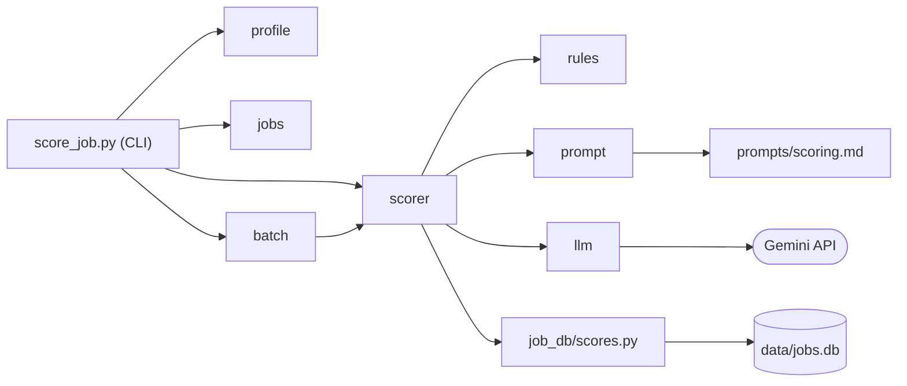

# 職缺評分：技術設計

- 功能文件：[job-scoring.md](../../product/features/job-scoring.md)
- 程式碼：[src/score_job.py](../../../src/score_job.py)（CLI）、[src/job_scoring/](../../../src/job_scoring/)、[src/job_db/scores.py](../../../src/job_db/scores.py)

## 1. 總覽



模組職責，都在 `src/job_scoring/` 下，另有標註的除外：

- `score_job.py`（`src/`）：CLI 進入點，解析參數、載入 `.env`、開啟資料庫，分派到單筆或整批。
- `models.py`：Pydantic 模型，包括偏好檔、AI 輸出、評分結果與整批的單筆結果。
- `profile.py`：讀取並驗證 `preferences.yaml` 與 `experience.md`。
- `jobs.py`：讀取並驗證爬蟲輸出的職缺 JSON。
- `rules.py`：程式端的規則，包括硬性淘汰、薪資換算與計分，以及共用的進位函式。
- `prompt.py`：由模板組出 system 與 user 提示詞，並計算快取鍵。
- `prompts/scoring.md`：提示詞模板，和程式碼分開，調整提示詞時不必改程式。
- `llm.py`：LLM 供應商抽象層與 Gemini 實作。
- `scorer.py`：單筆評分流程、總分計算，以及「評分並寫入資料庫」這一步。
- `batch.py`：整批評分、寫出結果檔。
- `job_db/scores.py`：讀寫 `job_scores`，包括寫入一列、快取查詢，以及評分結果的查詢。

依賴限制：

- 只有 `llm.py` 可以 import 特定供應商的 SDK（`google` 開頭的模組）：換供應商或新增供應商時，評分規則的程式都不必改（見 [§4.1](#41-llm-供應商抽象層)）。由[驗收對照](#6-驗收對照)的「供應商隔離」以 `ast` 掃描 import 檢查。
- `job_db` 不 import 專案內的其他模組（原因見 [job-database 的技術設計](job-database.md#1-總覽)），所以 `job_db/scores.py` 的參數都用基本型別，由 `scorer.py` 把評分結果轉好再傳入。
- 帶職缺欄位的評分查詢放在 `job_db/scores.py`，不放 `job_db/queries.py`：
  - `queries.py` 屬於 job-database，job-database 不依賴任何功能，它的查詢不能 JOIN 屬於 job-scoring 的 `job_scores`。
  - `scores.py` 屬於 job-scoring，job-scoring 本來就依賴 job-database，由它 JOIN `jobs` 不違反依賴方向。

import 路徑：

- 用 `uv run src/score_job.py` 執行時，`src/` 會在 import 路徑上，可以直接 `import job_scoring`。
- pytest 已在 `pyproject.toml` 設定 `pythonpath = ["src"]`，測試中也可以直接 import。

## 2. 流程

### 2.1 單筆評分

實現 FR-score-*、FR-filter、FR-store-write、FR-cache-reuse、FR-dry-run。業務規則見[功能文件的評分流程](../../product/features/job-scoring.md#423-評分流程)。

`scorer.score_and_save` 評分並寫入資料庫，單筆 CLI 與[整批評分](#22-整批評分)共用這一步：

1. `rules.py` 檢查硬性淘汰，被淘汰的職缺直接寫入，不查快取、不建立 client。
2. 沒被淘汰時，`prompt.py` 組出提示詞並計算快取鍵（[§3.3](#33-快取鍵)），再以 `職缺代碼` + `快取鍵` 查 `job_scores`：
   - 查到：從上次的評分結果還原 AI 的三個維度與評語，不呼叫 AI。
   - 查不到：呼叫呼叫端傳入的 `client_factory` 取得 client 再呼叫 AI。只有這時才需要 API key。
3. `rules.py` 重算薪資分數，`scorer.py` 重算總分，連同快取鍵交給 `job_db/scores.py` 覆寫一列。
4. 回傳評分結果與是否沿用，供單筆印出沿用訊息、整批統計摘要。
5. 評分失敗時例外往外拋，不寫入，資料庫中原本的列不變。

試跑時呼叫端傳入的連線是 `None`：跳過查快取與寫入，其餘步驟相同，所以試跑與正式評分走同一套評分邏輯。

總分與年薪換算共用 `rules.round_half_up`：以 `Fraction` 精確計算再 .5 進位，避免浮點誤差，也不用 Python `round()` 的五成雙。

### 2.2 整批評分

實現 FR-batch-*。`batch.score_batch` 是整批評分的共用進入點，不綁定 CLI，其他入口也呼叫同一個函式：

- 資料庫連線、供應商與模型由參數傳入，呼叫端各自開啟連線。連線是 `None` 時為試跑，原樣傳給 `score_and_save`。
- client 以 `client_factory` 傳入，第一次快取沒命中時才建立，之後整批共用；整批都被淘汰或都沿用時就不需要 API key。
- 每筆結果帶有是否沿用的標記，只供摘要統計與其他入口使用，不寫進結果檔。
- 每筆都經過 `scorer.score_and_save`，哪些錯誤算單筆失敗見 [§5](#5-cli-與錯誤處理)。
- `batch.write_results` 依結果寫出 JSON 與 CSV，格式見[功能文件的結果檔](../../product/features/job-scoring.md#622-結果檔)。檔名後綴由呼叫端指定，試跑用 `_dryrun`。

## 3. 資料與儲存

### 3.1 個人資料檔與 API key

實現 FR-score-profile、NFR-privacy。

```
.env.example                 API key 範本（進版控）
.env                         真實 API key（不進版控）
profile/
  preferences.example.yaml   範本（進版控）
  experience.example.md      範本（進版控）
  preferences.yaml           真實資料（不進版控）
  experience.md              真實資料（不進版控）
```

- `profile/`、`output/scores/` 的預設位置都以 `score_job.py` 的位置推算專案根目錄，不受工作目錄影響。
- `.env` 由 `score_job.py` 啟動時以 `load_dotenv(專案根目錄 / ".env")` 載入。
  - `load_dotenv` 預設**不覆寫已經存在的環境變數**（[python-dotenv](https://github.com/theskumar/python-dotenv)），所以 shell 設定的值優先。
  - 測試時把 `GEMINI_API_KEY` 設成空字串，就能模擬沒有 key 的情況，不受 `.env` 影響。

### 3.2 job_scores 資料表

實現 FR-store-write、FR-store-list、FR-store-get。所有欄位的業務意義見[功能文件的儲存的評分資訊](../../product/features/job-scoring.md#721-儲存的評分資訊)。

`job_scores`：每筆職缺最多一列，只保留最新一次成功的評分結果。

- `職缺代碼`（TEXT）：主鍵
- `評分時間`（TEXT）：這列最後一次寫入的時間
  - 本地時間，ISO 8601，精確到秒
- `淘汰`（INTEGER）：`0`／`1`
- `總分`（INTEGER | null）：被淘汰時為 `null`
- `評語`（TEXT | null）
- `評分結果`（TEXT）：整份評分結果的 JSON（`ensure_ascii=False`）
- `快取鍵`（TEXT | null）：見 [§3.3](#33-快取鍵)
  - 被淘汰時為 `null`
- `供應商`、`模型`（TEXT | null）：被淘汰時為 `null`

設計理由：

- 和 `jobs` 表分開存放，查詢時以 `職缺代碼` JOIN：
  - 爬蟲更新 `jobs` 時會覆寫整列（見 [job-database 的寫入規則](../../product/features/job-database.md#421-寫入規則)），分數放在同一張表就得另外避開。
  - 職缺內容更新不代表要重新呼叫 AI，是否重問由快取鍵決定。
  - 要整批重評時，清空 `job_scores` 即可，不影響職缺資料。
- `淘汰`、`總分`、`評語` 與 `評分結果` 中的值重複：另外成欄是為了讓 SQL 可以直接篩選與排序。
- 不設外鍵指向 `jobs`：`--jobs` 讀的 JSON 不一定匯入過資料庫，不因此擋下寫入。
- 建表語法放在 `job_db/schema.py`，與 job-database 的表一起建立。
  - `CREATE TABLE IF NOT EXISTS` 會在既有的資料庫補上這張表，不影響原有資料。

寫入：

- 每筆職缺的寫入各自是一個 transaction，整批中途中止時已經評完的職缺留在資料庫。
- 整批評分中途發生 `sqlite3.Error` 時，CLI 回傳 1、不寫結果檔，已寫入的職缺留在資料庫。

查詢：

- 列出評過分的職缺時，以 `job_scores` 為主表 LEFT JOIN `jobs`：
  - 評分的職缺不一定匯入過 `jobs`（見上方不設外鍵），INNER JOIN 會漏掉這些職缺。
  - `職缺代碼` 取自 `job_scores`，沒有職缺資料時才不會連代碼都是 `null`。
- 第一個排序鍵明寫 `總分 IS NULL`，把被淘汰（總分為 `null`）的列排到最後，不依賴 SQLite 對 `NULL` 的預設排序。
- 淘汰與否的篩選與總分排序都用獨立的欄位，不解析 `評分結果` 的 JSON。
- 列表不帶 `評分結果` 與 `快取鍵`；要看各維度時以職缺代碼另外取出 `評分結果`。

### 3.3 快取鍵

哪些改動會讓快取鍵改變，見[功能文件的快取鍵](../../product/features/job-scoring.md#821-快取鍵)。

- 計算方式：`[供應商, 模型, system 提示詞, user 提示詞]` 以 `json.dumps(ensure_ascii=False)` 序列化後取 SHA-256，存成 64 字元的十六進位字串。
- 每次評分都會計算並寫入 `快取鍵` 欄。查詢條件是 `職缺代碼` 與 `快取鍵` 都相同；被淘汰的列 `快取鍵` 是 NULL，不會命中。
- 命中時從該列的 `評分結果`（中文鍵）取出三個 AI 維度與評語，以 `AIAssessment` 重新驗證後使用。不符合 schema 時算評分失敗，與 AI 回應不通過驗證的處理相同。
- 供應商與模型包含在快取鍵中，所以沿用時寫回的供應商、模型必然與上次相同。

## 4. 外部系統整合

### 4.1 LLM 供應商抽象層

實現 FR-llm、NFR-privacy。

```python
class LLMClient(Protocol):
    def assess(self, system: str, user: str) -> AIAssessment: ...
```

- `get_client(provider, model)`：用供應商名稱查表建立 client。
  - 不認得的名稱就拋出 `ValueError`。
  - 加入其他供應商時，只要新增對應的 client 並註冊到表中，其他模組都不用改。
- `GeminiClient(model)`：使用 `google-genai` 的 Interactions API（參考 [Gemini structured output 文件](https://ai.google.dev/gemini-api/docs/structured-output)）。
  - 以 structured output 要求符合 `AIAssessment` schema 的 JSON，再用 Pydantic 驗證。
  - `response_format` 裡 schema 的鍵名要寫 `schema_`（SDK 的 TypedDict 鍵名），送出時才會序列化成 API 的 `schema`。
  - `store=False`：提示詞含個人經歷，不在伺服器端保存互動紀錄。
  - 不設定溫度等取樣參數：Gemini 3.8 Flash 已不支援 `temperature`、`top_p`、`top_k`（[官方說明](https://ai.google.dev/gemini-api/docs/latest-model)）。
  - SDK 的錯誤類別（HTTP、連線、逾時）沒有公開匯出，因此 `interactions.create` 拋出的任何例外都轉成 `LLMError`。
  - `output_text` 為空時也是 `LLMError`。
  - 建構時檢查 `GEMINI_API_KEY`，沒有設定或是空字串就拋出 `LLMError`。

### 4.2 AI 輸出 schema

實現 FR-score-ai。

AI 必須輸出以下 JSON（Pydantic 模型 `AIAssessment`）：

```json
{
  "career_fit":   {"score": 1-5 | null, "reason": "..."},
  "skill_match":  {"score": 1-5 | null, "reason": "..."},
  "industry_fit": {"score": 1-5 | null, "reason": "..."},
  "comment": "..."
}
```

- 欄位使用英文名稱，讓 schema 對各家模型都比較穩定。
- 由 `scorer.py` 轉成評分結果（`JobScore`）的中文鍵名。
  - `JobScore` 以 alias 定義中文鍵名，`model_dump(by_alias=True)` 的結果就是[功能文件的評分結果格式](../../product/features/job-scoring.md#1121-評分結果格式)。
- 不通過驗證時拋出 `ValidationError`，視為評分失敗，不自行修正分數。

## 5. CLI 與錯誤處理

實現 FR-cli、FR-store-db-path、FR-dry-run。

進入點：

- `main(argv: list[str] | None = None) -> int`，回傳結束碼。
- `if __name__ == "__main__"` 區塊只負責 `sys.exit(main())`。
- 測試直接呼叫 `main([...])`，不必另外啟動子行程。

資料庫：

- CLI 以 `--db` 的路徑開啟連線，再傳給單筆與整批評分。
- `--dry-run` 不開啟資料庫，不會建立資料庫檔。
  - 單筆試跑也交給整批評分處理（只有一筆的整批），單筆與整批的試跑都以 `None` 取代連線，結果都寫成 `_dryrun` 結果檔。

錯誤處理：

- 單筆評分：評分或寫入資料庫失敗都印出 `[-]` 並回傳 1。
- 整批評分：
  - 單筆的 `LLMError` 與 `ValidationError` 算單筆失敗，失敗原因記錄例外訊息，繼續下一筆。
  - client 建立失敗（`ValueError` 不支援的供應商、`LLMError` 缺少 API key）時每一筆都會失敗，所以直接往外拋，由 CLI 回傳 1。
    - client 在單筆評分的途中才建立，所以和單筆失敗在同一個 `try` 裡；client 還沒建立就拋出 `LLMError`，代表是建立失敗，不算單筆失敗。
  - `sqlite3.Error` 讓整批中止，行為見 [§3.2](#32-job_scores-資料表) 的寫入。
- 其他例外代表程式錯誤，直接讓程式中止。

輸出：

- 單筆評分：結果以 JSON 印到 stdout（`ensure_ascii=False`，縮排 2）。
- 整批評分與試跑：結果寫成檔案，stdout 不輸出。
- 進度、摘要與錯誤訊息都印到 stderr，方便把 stdout 導向檔案。

結束碼：

- `0`：成功，包括被淘汰
  - 整批評分時，即使有職缺評分失敗也回傳 0
- `1`：印出 `[-]` 並結束，情況見[功能文件的 CLI](../../product/features/job-scoring.md#1122-cli)

## 6. 驗收對照

- 只列已實作故事的 AC，〔規劃中〕的故事完成後再補上。
- 除了〔需網路〕的條目，都離線執行，也不需要 API key。

`tests/test_job_db_scores.py` 測評分結果的查詢：資料庫建在 `tmp_path`，評分結果寫在測試碼裡，不經過評分流程。

共用的測試資料放在 `tests/conftest.py`：

- 測試用的偏好檔、經歷檔，以及兩筆職缺：`ok`（不會被淘汰）與 `out`（會被淘汰）。
  - 偏好的 `目標方向`、經歷、職缺的工作內容分別放入 `目標標記-AAA`、`經歷標記-BBB`、`工作標記-CCC`，用來檢查提示詞的內容。
- 假的 LLM client：回傳固定內容並記錄呼叫次數；整批用的版本可以對指定職缺拋出 `LLMError` 或回傳超出範圍的分數。
- `forbid_client`：把 `get_client` 換成一呼叫就讓測試失敗的函式，並把 `GEMINI_API_KEY` 設為空字串。
- `isolate_db`（autouse）：把 CLI 的預設資料庫換成 `tmp_path` 下的檔案，所有測試都不會寫入 `data/jobs.db`。
- e2e 的固定輸入在 `tests/e2e/data/`：擬真的偏好檔與經歷檔，以及 5 筆改寫自 104 的職缺（虛構公司、內文重新表述）。
  - 單筆與整批共用 `output/e2e/jobs.db`，開始前刪除上次留下的檔案，跑完保留。

一次跑完所有離線驗收：

```bash
uv run pytest tests/test_job_scoring_*.py tests/test_score_job_cli.py tests/test_job_db_scores.py
```

不屬於任何 AC 的檢查：

- 型別檢查：`uv run mypy src/`，通過條件為 `Success: no issues found`。
- 供應商隔離：`uv run pytest tests/test_score_job_cli.py -k provider_sdk_isolated`，通過條件為只有 `llm.py` import `google` 開頭的模組。

### score

- [AC-score-profile](../../product/features/job-scoring.md#ac-score-profile個人資料檔驗證與版控)：`uv run pytest tests/test_job_scoring_profile.py`
- [AC-score-salary](../../product/features/job-scoring.md#ac-score-salary薪資計分)：`uv run pytest tests/test_job_scoring_rules.py -k score_salary`
- [AC-score-total](../../product/features/job-scoring.md#ac-score-total總分計算)：`uv run pytest tests/test_job_scoring_scorer.py -k compute_total`
- [AC-score-flow](../../product/features/job-scoring.md#ac-score-flow評分流程與-ai-回應處理)：`uv run pytest tests/test_job_scoring_scorer.py -k score_job`
- [AC-score-real](../../product/features/job-scoring.md#ac-score-real真實評分-需網路)〔需網路〕：`uv run pytest -m network -s tests/e2e/test_job_scoring.py -k real_scoring`

### filter

- [AC-filter-rules](../../product/features/job-scoring.md#ac-filter-rules硬性淘汰)：`uv run pytest tests/test_job_scoring_rules.py -k check_hard_filters`
- [AC-filter-no-key](../../product/features/job-scoring.md#ac-filter-no-key被淘汰的職缺不需要-api-key)：`uv run pytest tests/test_score_job_cli.py -k eliminated`

### batch

- [AC-batch-order](../../product/features/job-scoring.md#ac-batch-order整批評分)：`uv run pytest tests/test_job_scoring_batch.py -k batch_scoring`
- [AC-batch-failure](../../product/features/job-scoring.md#ac-batch-failure單筆失敗不中斷整批)：`uv run pytest tests/test_job_scoring_batch.py -k failure`
- [AC-batch-output](../../product/features/job-scoring.md#ac-batch-output結果檔)：`uv run pytest tests/test_job_scoring_batch.py -k output`
- [AC-batch-cli](../../product/features/job-scoring.md#ac-batch-cli整批-cli-與摘要)：`uv run pytest tests/test_score_job_cli.py -k batch`
- [AC-batch-real](../../product/features/job-scoring.md#ac-batch-real真實整批評分-需網路)〔需網路〕：`uv run pytest -m network -s tests/e2e/test_job_scoring.py -k real_batch`

### store

- [AC-store-write](../../product/features/job-scoring.md#ac-store-write評分結果入庫)：`uv run pytest tests/test_job_scoring_batch.py -k store`
- [AC-store-db-path](../../product/features/job-scoring.md#ac-store-db-path資料庫路徑)：`uv run pytest tests/test_score_job_cli.py -k db_path`
- [AC-store-list](../../product/features/job-scoring.md#ac-store-list列出評過分的職缺)：`uv run pytest tests/test_job_db_scores.py -k list_scored_jobs`
- [AC-store-get](../../product/features/job-scoring.md#ac-store-get取出單筆評分結果)：`uv run pytest tests/test_job_db_scores.py -k get_score`
- [AC-store-real](../../product/features/job-scoring.md#ac-store-real真實評分結果入庫-需網路)〔需網路〕：`uv run pytest -m network -s tests/e2e/test_job_scoring.py -k real`

### cache

- [AC-cache](../../product/features/job-scoring.md#ac-cache沿用上次的-ai-評分)：`uv run pytest tests/test_score_job_cli.py -k cache`

### dry-run

- [AC-dry-run](../../product/features/job-scoring.md#ac-dry-rundry-run-試跑)：`uv run pytest tests/test_score_job_cli.py -k dry_run`

### 共用規則

- [AC-cli-error](../../product/features/job-scoring.md#ac-cli-error錯誤處理)：`uv run pytest tests/test_score_job_cli.py -k "error and not provider_sdk"`
